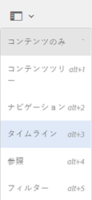
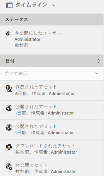

# タイムラインのアクティビティストリーム {#activity-stream-in-timeline}

>[!CAUTION]
>
>AEM 6.4 の拡張サポートは終了し、このドキュメントは更新されなくなりました。 詳細は、 [技術サポート期間](https://helpx.adobe.com/jp/support/programs/eol-matrix.html). サポートされているバージョンを見つける [ここ](https://experienceleague.adobe.com/docs/?lang=ja).

この機能は、タイムラインにアセットのアクティビティログを表示します。[!DNL Adobe Experience Manager Assets] で以下のアセット関連操作を実行すると、アクティビティストリーム機能により、タイムラインが更新され、そのアクティビティが反映されます。

次の操作がアクティビティストリームに記録されます。

* 作成
* 削除
* ダウンロード（レンディションを含む）
* 公開
* 非公開
* 承認
* 非承認
* 移動

タイムラインに表示されるアクティビティログは、ログファイルが格納されている CRX の `/var/audit/com.day.cq.dam/content/dam` から取得されます。

さらに、新しいアセットがアップロードされたり、既存のアセットが変更され、を通じてExperience Managerにチェックインされたりすると、タイムラインアクティビティがログに記録されます。 [Adobeアセットリンク](https://helpx.adobe.com/jp/enterprise/admin-guide.html/enterprise/using/manage-assets-using-adobe-asset-link.ug.html) または [[!DNL Experience Manager] デスクトップアプリ](https://experienceleague.adobe.com/docs/experience-manager-desktop-app/using/introduction.html?lang=ja).

>[!NOTE]
>
>一時的なワークフローは、履歴情報が保存されないので、タイムラインに表示されません。

アクティビティストリームを表示するには、アセットに対して 1 つ以上の操作を実行して、アセットを選択してから、グローバルナビゲーションリストから&#x200B;**[!UICONTROL タイムライン]**&#x200B;を選択します。

タイムラインに、アセットに対して実行した操作のアクティビティストリームが表示されます。

>[!NOTE]
>
>**公開**&#x200B;タスクと&#x200B;**非公開**&#x200B;タスクのデフォルトのログ保管先は `/var/audit/com.day.cq.replication/content` です。**移動**&#x200B;タスクの場合は、デフォルトの保管先は `/var/audit/com.day.cq.wcm.core.page` になります。
