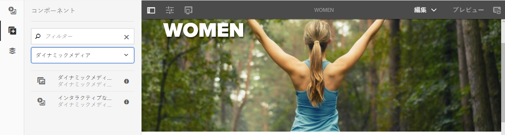
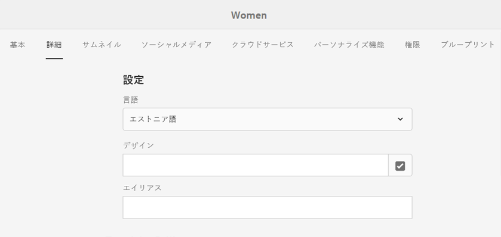
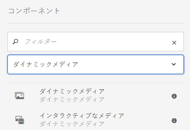
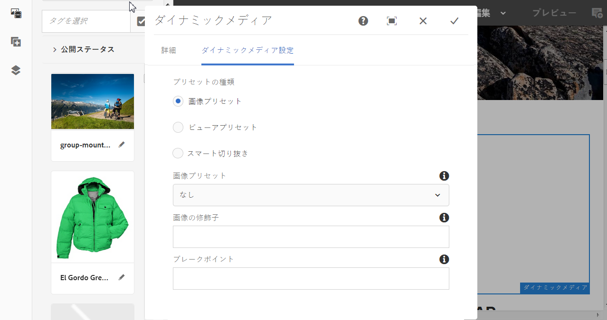
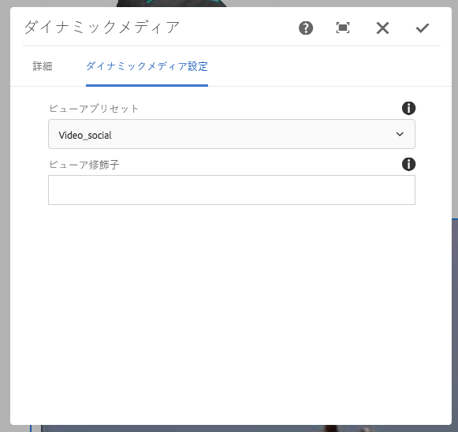
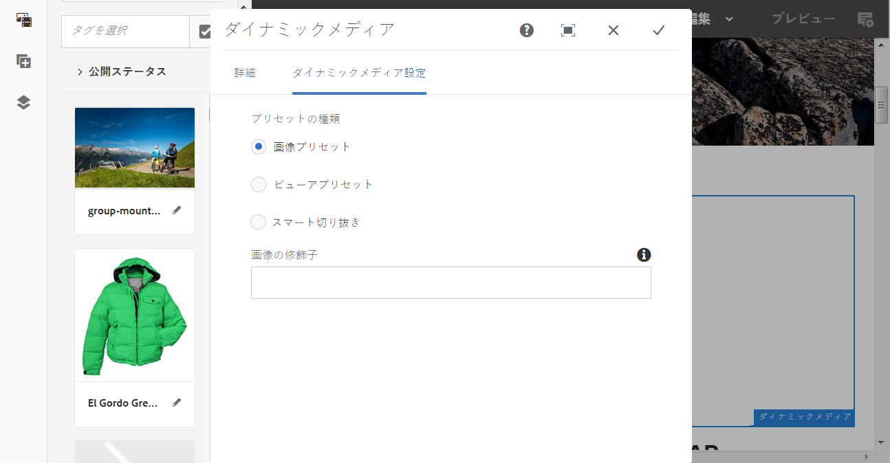
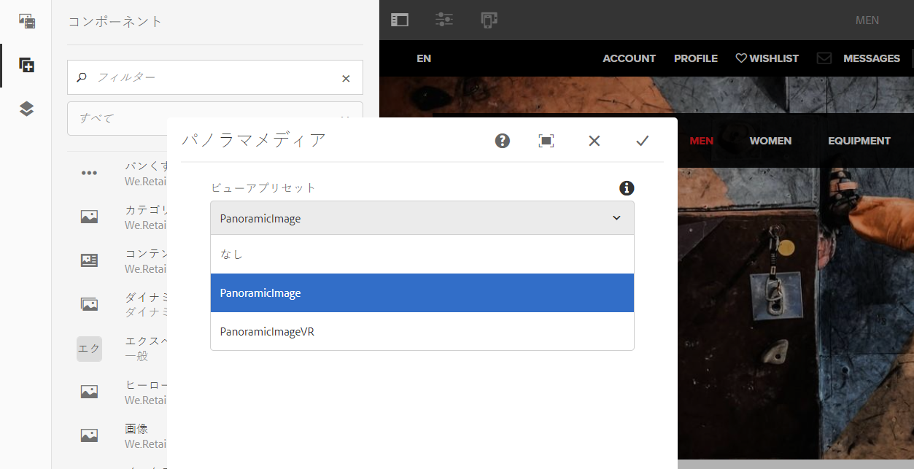

# ページへのDynamic Media Assets の追加 {#adding-dynamic-media-assets-to-pages}

>[!CAUTION]
>
>AEM 6.4 の拡張サポートは終了し、このドキュメントは更新されなくなりました。 詳細は、 [技術サポート期間](https://helpx.adobe.com/jp/support/programs/eol-matrix.html). サポートされているバージョンを見つける [ここ](https://experienceleague.adobe.com/docs/?lang=ja).

Web サイトで使用するアセットに Dynamic Media 機能を追加するには、 **Dynamic Media** または **インタラクティブメディア** コンポーネントを直接ページ上に配置できます。 これをおこなうには、レイアウトモードに入り、Dynamic Media コンポーネントを有効にします。 次に、これらのコンポーネントをページに追加し、そのコンポーネントにアセットを追加できます。ダイナミックメディアおよびインタラクティブメディアコンポーネントはスマートです。追加する画像またはビデオの種類が判別され、それに応じて使用可能なオプションが変わります。

AEMを WCM として使用している場合は、Dynamic Media アセットを直接ページに追加します。WCM にサードパーティのを使用している場合は、次のいずれかを実行します。 [リンク](linking-urls-to-yourwebapplication.md) または [埋め込み](embed-code.md) アセット。サードパーティのレスポンシブ Web サイトの場合は、 [レスポンシブサイトへの最適化された画像の配信](responsive-site.md).

>[!NOTE]
>
>アセットをAEMのページに追加する前に、アセットを公開する必要があります。 [Dynamic Media アセットの公開](publishing-dynamicmedia-assets.md)を参照してください。

## ページへの Dynamic Media コンポーネントの追加 {#adding-a-dynamic-media-component-to-a-page}

Dynamic Mediaコンポーネントをページに追加する操作は、任意のページにコンポーネントを追加する操作と同じです。 Dynamic Mediaコンポーネントについて、以降の節で詳しく説明します。

>[!NOTE]
>
>読み取り専用権限を持つユーザーがアクセスする Web ページ上にDynamic Mediaコンポーネントがある場合、ページが壊れ、コンポーネントが正しくレンダリングされません。 これは、コンポーネントのプロパティが適切で、参照元のアセットと設定にアクセスできるようにページが再構築されるからです。 その後、ページが再度レンダリングされ、コンポーネントが壊れます。ユーザーの読み取り専用アクセス権により、ページ上の各コンポーネントコードを再レンダリングできません。
>  
>この問題を回避するには、AEM Sitesのユーザーがアセットへのアクセスに必要な権限を持っていることを確認します。

1. AEM で、Dynamic Media コンポーネントを追加するページを開きます。
1. ページの左側にあるパネル（サイドパネルの表示を切り替える必要が生じる場合があります）で、 **[!UICONTROL コンポーネント]** アイコン
1. **[!UICONTROL コンポーネント]**&#x200B;見出しの下のドロップダウンリストで「**[!UICONTROL Dynamic Media]** 」を選択します。Dynamic Media コンポーネントのリストがない場合は、使用する Dynamic Media コンポーネントを有効にしなければならない可能性があります。詳しくは、[Dynamic Media コンポーネントの有効化](#enabling-dynamic-media-components)を参照してください。

   

1. 使用するDynamic Mediaコンポーネントをページの目的の場所にドラッグします。
1. コンポーネントの上に直接マウスポインターを置きます。コンポーネントが青色のボックスで囲まれた時点で 1 回タップすると、コンポーネントのツールバーが表示されます。****&#x200B;設定（レンチ）アイコンをタップします。
1. [コンポーネントの編集](#dynamic-media-components) 必要に応じて、チェックマークをクリックして変更を保存します。

### Dynamic Media コンポーネントの有効化 {#enabling-dynamic-media-components}

ページに追加できる Dynamic Media コンポーネントがない場合は、使用するコンポーネントをまず有効にしなければならない可能性があります。

1. AEM で、Dynamic Media コンポーネントを追加するページを開きます。
1. ページ上部付近のツールバーの左側にあるページ情報アイコンをタップした後、ドロップダウンリストから「**[!UICONTROL テンプレートを編集]**」をタップします。

   

1. ページ上部付近のツールバーの右側で、ドロップダウンリストから「**[!UICONTROL 構造]**」をタップします。

   

1. ページ下部付近の「**[!UICONTROL レイアウトコンテナ]**」をタップしてツールバーを開き、ポリシーアイコンをタップします。
1. **[!UICONTROL レイアウトコンテナ]**&#x200B;ページの「**[!UICONTROL プロパティ]**」見出しの下で、「**[!UICONTROL 許可されたコンポーネント]**」タブが選択されていることを確認します。

   

1. **[!UICONTROL ダイナミックメディア]**&#x200B;が表示されるまでスクロールします。
1. **[!UICONTROL ダイナミックメディア]**&#x200B;の左側にある「>」アイコンをタップしてリストを展開し、有効にする Dynamic Media コンポーネントを選択します。

   

1. **[!UICONTROL レイアウトコンテナ]**&#x200B;ページの右上隅付近にある「完了」（チェックマーク）アイコンをタップします。

1. ページ上部付近のツールバーの右側で、ドロップダウンリストから「**[!UICONTROL 初期コンテンツ]**」をタップした後、通常どおりに[ページに Dynamic Media コンポーネントを追加](#adding-a-dynamic-media-component-to-a-page)します。

## Dynamic Mediaコンポーネントのローカライズ {#localizing-dynamic-media-components}

Dynamic Media コンポーネントのローカライズの方法は 2 つあります。

* Sites の Web ページ内で、**[!UICONTROL プロパティ]**&#x200B;を開き、「**[!UICONTROL 詳細]**」タブを選択します。ローカライズに使用したい言語を選択します。

   

* サイトセレクターからページあるいはページグループを選択します。「**[!UICONTROL プロパティ]**」をタップし、「**[!UICONTROL 詳細]**」タブを選択します。ローカライズに使用したい言語を選択します。

   >[!NOTE]
   >
   >現在&#x200B;**[!UICONTROL 言語]**&#x200B;メニューに表示される言語すべてにトークンが割り当てられているわけではないことに注意してください。

## Dynamic Mediaコンポーネント {#dynamic-media-components}

Dynamic Mediaとインタラクティブメディアは、 [!UICONTROL Dynamic Media] タブ [!UICONTROL コンポーネント]. [!UICONTROL インタラクティブメディア]コンポーネントは、すべてのインタラクティブアセット（インタラクティブビデオ、インタラクティブ画像、カルーセルセットなど）に使用します。その他すべての Dynamic Media コンポーネントの場合は、 Dynamic Mediaコンポーネントを使用します。

>[!NOTE]
>
>これらのコンポーネントはデフォルトでは使用できないので、使用する前にテンプレートエディターで使用可能にする必要があります。 [テンプレートエディターでコンポートを使用可能にした後は、他の AEM コンポーネントと同様にページに追加することができます。](/help/sites-authoring/templates.md#editing-templates-template-authors)

### ダイナミックメディアコンポーネント {#dynamic-media-component}

ダイナミックメディアコンポーネントはスマートであり、追加しているアセットが画像であるかビデオであるかに応じて、様々なオプションを使用できます。このコンポーネントは、画像プリセット、画像ベースのビューア（画像セット、スピンセット、混在メディアセットなど）およびビデオをサポートしています。また、ビューアはレスポンシブです。つまり、画面のサイズは画面のサイズに基づいて自動的に変更されます。 すべてのビューアは HTML5 ビューアです。

>[!NOTE]
>
>読み取り専用権限を持つユーザーがアクセスする Web ページ上にDynamic Mediaコンポーネント、インタラクティブメディアコンポーネント、またはその両方が存在する場合、ページは壊れ、コンポーネントは正しくレンダリングされません。 これは、コンポーネントのプロパティが適切で、参照元のアセットと設定にアクセスできるようにページが再構築されるからです。 その後、ページが再度レンダリングされ、コンポーネントが壊れます。ユーザーの読み取り専用アクセス権により、ページ上の各コンポーネントコードを再レンダリングできません。
>  
>この問題を回避するには、AEM Sitesのユーザーがアセットへのアクセスに必要な権限を持っていることを確認します。

>[!NOTE]
>
>Dynamic Media コンポーネントを追加したときに、「**[!UICONTROL ダイナミックメディア設定]**」が空であるかアセットを適切に追加できない場合は、次の点を確認してください。
>
>* お持ちの [有効なDynamic Media](config-dynamic.md). Dynamic Media はデフォルトでは無効になっています。
>* 画像が PTIFF（Pyramid TIFF）ファイルであること。Dynamic Media を有効にする前に読み込まれた画像には、PTIFF（Pyramid TIFF）ファイルはありません。
>

#### 画像を操作する場合 {#when-working-with-images}

ダイナミックメディアコンポーネントを使用すると、画像セット、スピンセット、混在メディアセットなどの動的イメージを追加できます。ズームイン、ズームアウト、スピンセット内での画像の回転（該当する場合）または別のタイプのセットからの画像の選択を行うことができます。

また、ビューアプリセット、画像プリセット、画像形式をコンポーネント内で直接設定することもできます。画像をレスポンシブにするには、ブレークポイントを設定するか、レスポンシブな画像プリセットを適用します。

次のDynamic Media設定を編集するには、 **[!UICONTROL 編集]** コンポーネント内のアイコンをクリックし、 **[!UICONTROL Dynamic Media Settings]**.

>[!NOTE]
>
>デフォルトでは、ダイナミックメディアの画像コンポーネントはアダプティブです。画像コンポーネントを固定サイズにする場合は、 **[!UICONTROL 詳細]** タブの **[!UICONTROL 幅]** および **[!UICONTROL 高さ]** 設定。

* **[!UICONTROL ビューアプリセット]**
ドロップダウンメニューから既存のビューアプリセットを選択します。 探しているビューアプリセットが表示されない場合は、表示できるように設定する必要があります。詳しくは、ビューアプリセットの管理を参照してください。画像プリセットを使用している場合はビューアプリセットを選択できません。また、その逆の場合も選択できません。
これは、画像セット、スピンセットまたは混在メディアセットを表示している場合に使用できる唯一のオプションです。 表示されるビューアプリセットもスマートで、関連するビューアプリセットのみが表示されます。

* **[!UICONTROL ビューア修飾子]**
ビューア修飾子は、name=value の組み合わせで&amp;を区切り文字とした形式で使用し、ビューアリファレンスガイドで概要を説明しているようにビューアを変更できます。 ビューア修飾子の例としては、Posterimage=img.jpg&amp;caption=text.vtt,1 があります。この修飾子は、ビデオのサムネールに異なる画像を設定し、ビデオにクローズドキャプション/サブタイトルファイルを関連付けます。

* **[!UICONTROL 画像プリセット]**
ドロップダウンメニューから既存の画像プリセットを選択します。 探している画像プリセットが表示されない場合は、表示できるように設定する必要があります。「画像プリセットの管理」を参照してください。画像プリセットを使用している場合はビューアプリセットを選択できません。また、その逆の場合も選択できません。
このオプションは、画像セット、スピンセットまたは混在メディアセットを表示している場合には使用できません。

* **[!UICONTROL 画像の修飾子]**
追加の画像コマンドを指定して、画像エフェクトを適用できます。 これらは画像プリセットと画像をサーブするコマンドリファレンスに記述されています。このオプションは、画像セット、スピンセットまたは混在メディアセットを表示している場合には使用できません。

* **[!UICONTROL ブレークポイント]**
レスポンシブサイトでこのアセットを使用する場合は、画像のブレークポイントを追加する必要があります。 画像のブレークポイントは、コンマ (,) で区切る必要があります。 このオプションを使用できるのは、画像プリセットで高さまたは幅が定義されていないときです。このオプションは、画像セット、スピンセットまたは混在メディアセットを表示している場合には使用できません。コンポーネントの「**[!UICONTROL 編集]**」をクリックして、次の詳細設定を編集できます。

* **[!UICONTROL タイトル]**
画像のタイトルを変更します。

* **[!UICONTROL 代替テキスト]**
グラフィックの表示をオフにしているユーザー向けのタイトルを画像に追加します。
このオプションは、画像セット、スピンセットまたは混在メディアセットを表示している場合には使用できません。

* **[!UICONTROL URL、で開く]**
リンクを開くようにアセットを設定できます。 「URL」と「次のウィンドウで開く」で、同じウィンドウで開くか新しいウィンドウで開くかを指定します。このオプションは、画像セット、スピンセットまたは混在メディアセットを表示している場合には使用できません。

* **[!UICONTROL 幅]** および **[!UICONTROL 高さ]**
画像を固定サイズで表示する場合は、値をピクセル単位で入力します。 これらの値を空にすると、アダプティブなアセットになります。

#### ビデオを操作する場合 {#when-working-with-video}

Dynamic Media コンポーネントを使用して、ダイナミックビデオを Web ページに追加します。コンポーネントの編集時に、ページ上でビデオを再生するための事前定義済みのビデオビューアプリセットを使用するように選択できます。

次のDynamic Media設定を編集するには、 **[!UICONTROL 編集]** コンポーネント内にある

>[!NOTE]
>
>デフォルトでは、Dynamic Media ビデオコンポーネントはアダプティブです。ビデオコンポーネントを固定サイズにする場合は、そのコンポーネントで、**[!UICONTROL 詳細]**&#x200B;タブの&#x200B;**[!UICONTROL 幅]**&#x200B;と[!UICONTROL 高さ]を使用してサイズを設定してください。

* **[!UICONTROL ビューアプリセット]**
ドロップダウンメニューから既存のビデオビューアプリセットを選択します。 探しているビューアプリセットが表示されない場合は、表示できるように設定する必要があります。詳しくは、ビューアプリセットの管理を参照してください。

* **[!UICONTROL ビューア修飾子]**
ビューア修飾子は、name=value の組み合わせで&amp;を区切り文字とした形式で使用し、『Adobeビューアリファレンスガイド』で概要を説明しているようにビューアを変更できます。 Posterimage=img.jpg&amp;caption=text.vtt,1 はビューア修飾子の一例です。

   ビューア修飾子を使用すると、例えば次のことが可能です。

   * ビデオにキャプションファイルを関連付ける [キャプション。](https://experienceleague.adobe.com/docs/dynamic-media-developer-resources/library/viewers-aem-assets-dmc/video/command-reference-url-video/r-html5-video-viewer-url-caption.html?lang=ja)
   * ナビゲーションファイルとビデオの関連付け [ナビゲーション。](https://experienceleague.adobe.com/docs/dynamic-media-developer-resources/library/viewers-aem-assets-dmc/video/command-reference-url-video/r-html5-video-viewer-url-navigation.html?lang=ja)

コンポーネントで「**[!UICONTROL 編集]**」をクリックして、次の[!UICONTROL 詳細設定]を編集できます。

* **[!UICONTROL タイトル]**
ビデオのタイトルを変更します。

* **[!UICONTROL 幅]** および **[!UICONTROL 高さ]**
ビデオを固定サイズで表示する場合は、値をピクセル単位で入力します。 これらの値を空にすると、アダプティブなビデオになります。

#### スマート切り抜きを操作する場合 {#when-working-with-smart-crop}

Dynamic Media コンポーネントを使用して、スマート切り抜き画像アセットを Web ページに追加します。コンポーネントの編集時に、ページ上でビデオを再生するための事前定義済みのビデオビューアプリセットを使用するように選択できます。

[イメージプロファイル](image-profiles.md)も参照してください。

コンポーネントで「**[!UICONTROL 編集]**」をクリックして、次の [!UICONTROL Dynamic Media 設定]を編集できます。

>[!NOTE]
>
>デフォルトでは、ダイナミックメディアの画像コンポーネントはアダプティブです。画像コンポーネントを固定サイズにする場合は、そのコンポーネントで、「[!UICONTROL 詳細]」タブの「**[!UICONTROL 幅]**」と「**[!UICONTROL 高さ]**」を使用してサイズを設定します。

* **[!UICONTROL 画像の修飾子]**
追加の画像コマンドを指定して、画像エフェクトを適用できます。 これらは画像プリセットと画像をサーブするコマンドリファレンスに記述されています。このオプションは、画像セット、スピンセットまたは混在メディアセットを表示している場合には使用できません。

コンポーネントで「**[!UICONTROL 編集]**」をクリックして、次の&#x200B;**[!UICONTROL 詳細]**&#x200B;設定を編集できます。

* **[!UICONTROL タイトル]**
スマート切り抜き画像のタイトルを変更します。

* **[!UICONTROL 代替テキスト]**
グラフィックの表示をオフにしているユーザー向けのタイトルをスマート切り抜き画像に追加します。
このオプションは、画像セット、スピンセットまたは混在メディアセットを表示している場合には使用できません。

* **[!UICONTROL URL、で開く]**
リンクを開くようにアセットを設定できます。 「URL」と「次のウィンドウで開く」で、同じウィンドウで開くか新しいウィンドウで開くかを指定します。このオプションは、画像セット、スピンセットまたは混在メディアセットを表示している場合には使用できません。

* **[!UICONTROL 高さ]** および **[!UICONTROL 幅]**
スマート切り抜き画像を固定サイズで表示する場合は、値をピクセル単位で入力します。 これらの値を空にすると、アダプティブなビデオになります。

### インタラクティブメディアコンポーネント {#interactive-media-component}

インタラクティブメディアコンポーネントは、そのようなホットスポットや画像マップに対してインタラクティブ機能を持つアセット用です。 インタラクティブ画像、インタラクティブビデオ、カルーセルバナーがある場合は、インタラクティブメディアコンポーネントを使用します。

インタラクティブメディアコンポーネントはスマートです。追加している画像が画像であるかビデオであるかに応じて、様々なオプションを使用できます。 また、レスポンシブビューアなので、画面のサイズは画面サイズに応じて自動的に変更されます。 すべてのビューアは HTML5 ビューアです。

>[!NOTE]
>
>読み取り専用権限を持つユーザーがアクセスする Web ページ上にDynamic Mediaコンポーネント、インタラクティブメディアコンポーネント、またはその両方が存在する場合、ページは壊れ、コンポーネントは正しくレンダリングされません。 これは、コンポーネントのプロパティが適切で、参照元のアセットと設定にアクセスできるようにページが再構築されるからです。 その後、ページが再度レンダリングされ、コンポーネントが壊れます。ユーザーの読み取り専用アクセス権により、ページ上の各コンポーネントコードを再レンダリングできません。
> 
>この問題を回避するには、AEM Sitesのユーザーがアセットへのアクセスに必要な権限を持っていることを確認します。

コンポーネントの「**[!UICONTROL 編集]**」をクリックして、次の&#x200B;**[!UICONTROL 一般]**&#x200B;設定を編集できます。

* **[!UICONTROL ビューアプリセット]**
ドロップダウンメニューから既存のビューアプリセットを選択します。 探しているビューアプリセットが表示されない場合は、表示できるように設定する必要があります。ビューアプリセットを使用するには、あらかじめ公開する必要があります。詳しくは、ビューアプリセットの管理を参照してください。

* **[!UICONTROL タイトル]**
ビデオのタイトルを変更します。

* **[!UICONTROL 幅]** および **[!UICONTROL 高さ]**
ビデオを固定サイズで表示する場合は、値をピクセル単位で入力します。 これらの値を空にすると、アダプティブな画像になります。

コンポーネントの「**[!UICONTROL 編集]**」をクリックして、次の&#x200B;**[!UICONTROL 買い物かごに追加]**&#x200B;設定を編集できます。

* **[!UICONTROL 製品アセットを表示]**
デフォルトでは、この値が選択されています。 製品アセットには、コマースモジュールで定義された製品の画像が表示されます。 製品アセットを表示しない場合は、チェックマークをオフにします。

* **[!UICONTROL 製品価格を表示]**
デフォルトでは、この値が選択されています。 製品価格は、コマースモジュールで定義された品目の価格を示します。 製品価格を表示しない場合は、チェックマークをオフにします。

* **[!UICONTROL 製品フォームを表示]**
デフォルトでは、この値は選択されていません。 製品フォームには、サイズや色など、製品のバリエーションが含まれます。 製品バリアントを表示しない場合は、チェックマークをオフにします。

### パノラマメディアコンポーネント {#panoramic-media-component}

パノラマメディアコンポーネントは、球状のパノラマ画像であるアセット用です。 このような画像を使用すると、360°の部屋、プロパティ、場所、または風景を表示できます。 画像を球パノラマとして認定するには、次のいずれかまたは両方が必要です。

* アスペクト比が 2:1 です。
* キーワード「equirectangular」、(「spherical」+「panorama」) または (「spherical」+「panoramic」) でタグ付けされている必要があります。 [タグの使用](/help/sites-authoring/tags.md)を参照してください。

アスペクト比とキーワードの両方の条件が、アセットの詳細ページと「パノラマメディア」WCM コンポーネントのパノラマアセットに適用されます。

コンポーネントの「**[!UICONTROL 設定]**」をタップして、次の設定を編集できます。

* **[!UICONTROL ビューアプリセット]**
「ビューアプリセット」ドロップダウンメニューから既存のビューアを選択します。

探しているビューアプリセットが表示されない場合は、そのビューアプリセットが公開されていることを確認してください。ビューアプリセットを使用するには、事前に公開する必要があります。 詳しくは、[ビューアプリセットの管理](managing-viewer-presets.md)を参照してください。

### HTTP/2 を使用した Dynamic Media アセットの配信 {#using-http-to-delivery-dynamic-media-assets}

HTTP/2 は、ブラウザーとサーバーの通信方法を改善する、新しく更新された web プロトコルです。情報の転送を高速化し、必要な処理能力を削減します。Dynamic Media アセットの配信は HTTP/2 を使用して行うことができ、応答時間と読み込み時間を短縮できます。

Dynamic Media アカウントでの HTTP/2 の使用方法について詳しくは、[コンテンツの HTTP/2 配信](http2.md)を参照してください。

>[!MORELIKETHIS]
>
>* [AEM Dynamic Media でのカラーマネジメントについて](https://helpx.adobe.com/experience-manager/kt/assets/using/dynamic-media-color-management-technical-video-setup.html)
>* [AEM Dynamic Media でのカスタムビデオサムネールの使用](https://helpx.adobe.com/experience-manager/kt/assets/using/dynamic-media-video-thumbnails-feature-video-use.html)
>* [AEM Dynamic Media でのアセットビューアについて](https://helpx.adobe.com/experience-manager/kt/assets/using/dynamic-media-viewer-feature-video-understand.html)
>* [AEM Dynamic Media でのインタラクティブビデオの使用](https://helpx.adobe.com/experience-manager/kt/assets/using/dynamic-media-interactive-video-feature-video-use.html)
>* [AEM Dynamic Media でのビデオプレーヤーの使用](https://helpx.adobe.com/experience-manager/kt/assets/using/dynamic-media-video-player-feature-video-use.html)
>* [AEM Dynamic Media での画像シャープニングの使用](https://helpx.adobe.com/experience-manager/6-4/assets/using/best-practices-for-optimizing-the-quality-of-your-images.html)

