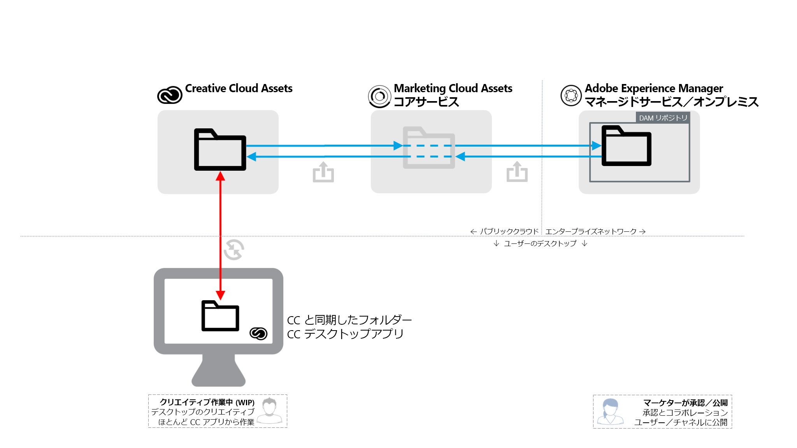
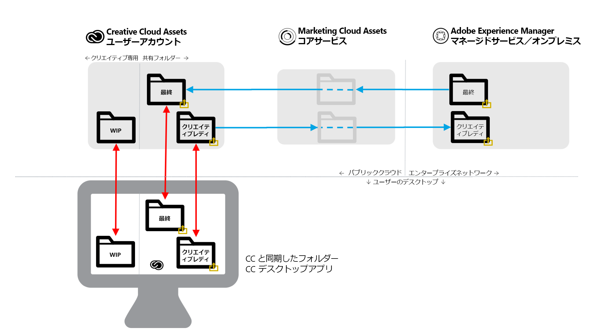

# AEM／CC フォルダー共有のベストプラクティス {#aem-to-creative-cloud-folder-sharing-best-practices}

>[!CAUTION]
>
>AEM／Creative Cloud フォルダー共有機能は廃止されました。Adobeでは、[Adobeアセットリンク](https://helpx.adobe.com/jp/enterprise/admin-guide.html/enterprise/using/adobe-asset-link.ug.html)や[AEMデスクトップアプリ](https://experienceleague.adobe.com/docs/experience-manager-desktop-app/using/using.html?lang=ja)など、新しい機能を使用することを強くお勧めします。 詳しくは、[AEMとCreative Cloud統合のベストプラクティス](/help/assets/aem-cc-integration-best-practices.md)を参照してください。

Adobe Experience Manager(AEM)は、AEM AssetsのユーザーがCreative Cloudーを共有できるように設定でき、Creative CloudーをAssetsサービスの共有フォルダーとして使用できます。 この機能を使用すると、クリエイティブチームと AEM Assets ユーザーの間でファイルをやり取りすることができます。特に、クリエイティブユーザーが AEM Assets インスタンスへのアクセス権を持っていない（エンタープライズネットワーク上にいない）場合に便利です。

このタイプの統合は、以下のどちらの例でも使用できます。特に、AEM Assets への直接アクセス権を持っていないユーザーと作業する場合に有用です。

* AEM Assets の特定のアセットのセットを CC Files のユーザーと共有する（例えば、新しいマーケティングアクティビティのデザインワークのためのクリエイティブブリーフおよび承認されたアセットのセット）。
*  Creative Cloud ユーザーから新しいファイルを受け取る。

>[!NOTE]
>
>このドキュメントを読む前に、[AEM と Creative Cloud の統合のベストプラクティス](aem-cc-integration-best-practices.md)全体をよく読むと、このトピックについて概要を把握することができます。

## 概要 {#overview}

AEMとCreative Cloudーのフォルダー共有は、AEM AssetsとCreative Cloudアカウントの間でフォルダーとファイルをサーバー側で共有することに依存します。 また、デスクトップでCreative Cloudデスクトップアプリケーションを使用するクリエイティブプロフェッショナルは、Adobe CreativeSyncテクノロジーを使用して、共有フォルダーを直接ディスク上で使用できるようにします。

以下の図は統合の概要を示しています。

この統合の主要な要素は以下のとおりです。

* **エンタープラ** イズネットワーク（マネージドサービスまたはオンプレミス）にデプロイされたAEM Assetsサーバー：フォルダーの共有はここで開始されます。
* **Adobe Marketing Cloud Assets コアサービス**：AEM と CC ストレージサービスの中間のサービスです。この統合を使用する企業の管理者は、Marketing Cloud 組織と AEM Assets インスタンスの間に信頼関係を確立する必要があります。また、管理者は、AEM Assets ユーザーがフォルダーも共有してセキュリティを強化できるように、[承認済みの Creative Cloud 共同作業者のリストを定義](https://experienceleague.adobe.com/docs/core-services/interface/assets/t-admin-add-cc-user.html?lang=en#assets)します。
* **Creative CloudアセットWebサービス** (ストレージおよびCreative CloudファイルWeb UI):ここでは、AEM Assetsフォルダーを共有している特定のCreative Cloudユーザーが、招待を受け入れ、自分のCreative Cloudアカウントストレージのフォルダーを確認できます。
* **Creative Cloudデスクトップアプリケーション**:（オプション）クリエイティブユーザーのデスクトップから、Creative Cloudアセットストレージと同期を使用して共有フォルダー/ファイルに直接アクセスできます。

## 特徴と制限事項 {#characteristics-and-limitations}

* **変更の一方向伝播：** ファイルの変更は、元々アセットが作成（アップロード）された(AEMまたはCreative Cloudアセットからの)一方向にのみ伝播されます。この統合では、2 つのシステム間で完全に自動化された双方向の同期はおこなわれません。

* **バージョン管理:**

   * AEM では、AEM で作成および更新されたファイルについて、更新があった場合のみ、アセットのバージョンを作成します。
   * Creative Cloud Assets には、作業中（WIP）のファイルが更新された場合に実行される独自の[バージョン管理機能](https://helpx.adobe.com/jp/creative-cloud/help/versioning-faq.html)が用意されています（原則として最大 10 日間更新が保存されます）。

* **容量の制限：** 交換するファイルのサイズとボリュームは、クリエイティブユーザー向けの特定の [Creative Cloudアセットの割合(購読レベルに応じ](https://helpx.adobe.com/jp/creative-cloud/kb/file-storage-quota.html) る)と、最大5 GBのファイルサイズの制限によって制限されます。また、容量は、Adobe Marketing Cloud Assets コアサービスで組織が保有しているアセット割り当てによっても制限されます。

* **容量の要件：** 共有Marketing Cloudー内のファイルは、AEMとCreative Cloudアカウントに物理的に保存し、キャッシュされたコピーをAssetsコアサービスに格納する必要もあります。
* **ネットワークと帯域幅：** 共有フォルダー内のファイルとすべての更新は、システム間のネットワークを介して転送する必要があります。共有する対象は、関連するファイルおよび更新のみに限るようにしてください。
* **フォルダーの種類**：`sling:OrderedFolder` タイプの Assets フォルダーの共有はサポートされていません。フォルダーを共有したい場合は、AEM Assets でフォルダーを作成するときに「並べ替え」オプションを選択しないでください。

## ベストプラクティス {#best-practices}

AEM／CC フォルダー共有を活用するベストプラクティスには、以下のものが含まれます。

* **ボリュームに関する考慮事項：** AEM/Creative Cloudフォルダー共有は、特定のキャンペーンやアクティビティなど、より少数のファイルを共有する場合に使用します。組織で承認されたアセットすべてなど、多数のアセットのセットを共有するには、他の配信方法（例えば AEM Assets Brand Portal）や AEM デスクトップアプリを使用してください。
* **深い階層の共有を避ける：** 共有は再帰的に機能し、選択的な共有解除はできません。通常、共有するフォルダーは、サブフォルダーを持たないか、1 つ下のレベルのサブフォルダーなど非常に浅い階層しか持たないものに限るようにしてください。
* **一方向共有用にCreative Cloudーを分離する：** 最終アセットをAEM AssetsからCreative Cloudファイルに共有したり、クリエイティブレディアセットをファイルからAEM Assetsに共有したりする場合は、個別のフォルダーを使用する必要があります。これらのフォルダーに適切な命名規則を適用すると、AEM AssetsとCreative Cloudのユーザーを同じように理解しやすい作業環境を作成できます。
* **共有Creative Cloudー内でWIPを避ける：** 共有フォルダーは作業中には使用しないでください。ファイルに頻繁に変更を加える必要のある作業を実行するには、共有フォルダーを作業中に別のフォルダーを使用します。
* **共有Creative Cloudー以外で新しい作業を開始：** 新しいデザイン（クリエイティブファイル）は、フォルダーファイル内の別のWIPフォルダーで開始する必要があり、AEM Assetsユーザーと共有する準備が整ったら、共有フォルダーに移動または保存する必要があります。
* **共有構造の簡素化：** より管理しやすいオペレーティングセットアップをおこなうには、共有構造を簡素化することを検討してください。AEM Assetsフォルダーは、クリエイティブユーザー全員と共有する代わりに、クリエイティブディレクターやチームマネージャーと同様に、チーム担当者とのみ共有する必要があります。 クリエイティブサイドのマネージャーが最終アセットを受け取って作業割り当てを決定し、デザイナーは自身の Creative Cloud アカウントで WIP アセットの作業をするようにします。Creative Cloudのコラボレーション機能を使用して作業を調整し、最後に、AEM Assetsで共有する準備が整ったアセットを選択して、クリエイティブレディの共有フォルダーに戻すことができます。

以下の図に、AEM Assets の既存の最終アセットに基づいて新しいデザインを作成するための設定例を示します。

