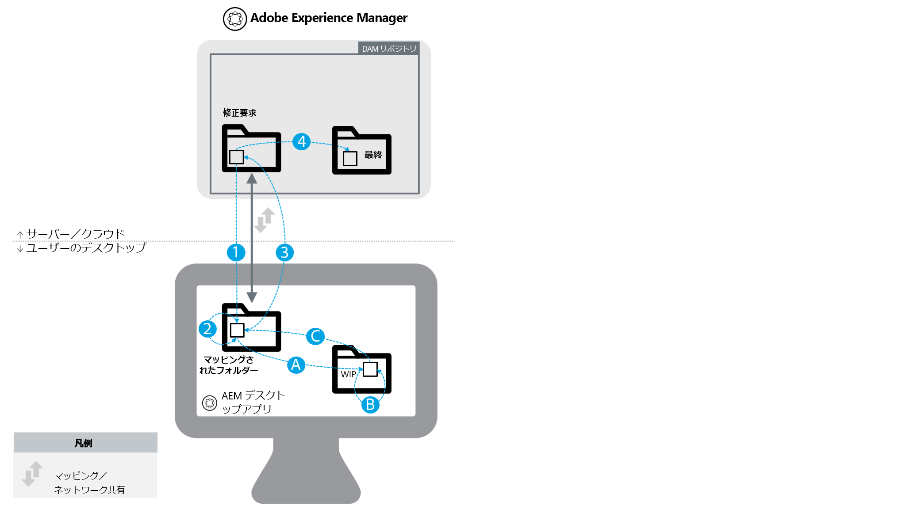

# [!DNL Experience Manager] と [!DNL Creative Cloud] の統合のベストプラクティス {#aem-and-creative-cloud-integration-best-practices}

>[!CAUTION]
>
>AEM 6.4 の拡張サポートは終了し、このドキュメントは更新されなくなりました。 詳細は、 [技術サポート期間](https://helpx.adobe.com/jp/support/programs/eol-matrix.html). サポートされているバージョンを見つける [ここ](https://experienceleague.adobe.com/docs/?lang=ja).

<!-- TBD: Reconcile with 6.5 article that's ahead of this article now in terms of content streamlining and structuring.
-->

Adobe Experience Manager Assets は、Adobe Creative Cloud と統合できるデジタルアセット管理（DAM）ソリューションです。DAM ユーザーがクリエイティブチームと協力してコンテンツ作成プロセスでのコラボレーションを効率化できるようにサポートします。

Adobe Creative Cloudは、クリエイティブチームがデジタルアセットを作成するのに役立つソリューションやサービスのエコシステムを提供しています。 デスクトップおよびモバイルアプリケーション、デスクトップ同期や Web エクスペリエンスを備えたストレージなどのクラウドサービス、Adobe Stockなどのマーケットプレイスが含まれます。

使用例に基づいてデスクトップとエンタープライズクラスの DAM の間で選択すべき統合や、つながるワークフローに関連するベストプラクティスについては、このドキュメントで説明します。

>[!NOTE]
>
>フォルダーの共有元 [!DNL Experience Manager] のCreative Cloudは廃止され、このガイドでは扱われなくなりました。 アドビでは、[Adobe Asset Link](https://helpx.adobe.com/jp/enterprise/using/adobe-asset-link.html) または [[!DNL Experience Manager] デスクトップアプリケーション](https://experienceleague.adobe.com/docs/experience-manager-desktop-app/using/introduction.html?lang=ja)などの新しい機能を使用して、[!DNL Experience Manager]で管理されているアセットにクリエイティブユーザーがアクセスできるようにすることを推奨しています。

## クリエイター、マーケター、DAM ユーザーのコラボレーションニーズ {#collaboration-needs-of-creatives-marketers-and-dam-users}

| 要件 | 使用例 | 関係するサーフェス |
|---|---|---|
| デスクトップ上でクリエイティブプロフェッショナル向けのエクスペリエンスを簡素化する | クリエイティブプロフェッショナル（より広い意味では、ネイティブアセット作成アプリケーションで作業しているデスクトップユーザー）向けに、DAM（[!DNL Assets]）で管理されるアセットへのアクセスを効率化します。これらのユーザーには、新しいファイルをアップロードするだけでなく、変更を検出し、使用し（開き）、編集し、[!DNL Experience Manager] に保存するための簡単でわかりやすい方法が必要です。 | Windows または Mac デスクトップ、Creative Cloud アプリ |
| Adobe Stockからの高品質で使いやすいアセットの提供 | マーケターは、アセットの調達と検出を支援することでコンテンツ作成プロセスの促進に貢献します。クリエイティブプロフェッショナルは、承認されたアセットをクリエイティブツール内から直接使用します。 | [!DNL Assets];Adobe Stock marketplace;メタデータフィールド |
| 組織別のアセットの配布および共有 | 内部の部門やローカルの支店、外部のパートナー、ディストリビューター、代理店は、親組織が共有する承認済みアセットを使用します。 組織では、作成したアセットを安全かつシームレスに共有して幅広く再利用したいと考えています。 | Brand Portal、Asset Share Commons |

## コラボレーションニーズをサポートするアドビ製品／サービス {#adobe-offerings-to-support-the-collaboration-need}

| 関係するペルソナの価値提案 | Adobe | 関係するサーフェス |
|---|---|---|
| クリエイティブユーザーがからアセットを検出する [!DNL Experience Manager]、開いて使用する、変更を編集し、次の場所にアップロードする、 [!DNL Experience Manager]、新しいファイルをにアップロードする [!DNL Experience Manager](Creative Cloudアプリを終了せず ) | [Adobe Asset Link](https://helpx.adobe.com/jp/enterprise/using/adobe-asset-link.html) | Photoshop、Illustrator、InDesign |
| ビジネスユーザーは、アセットのオープンと使用、編集と [!DNL Experience Manager] への変更内容のアップロード、[!DNL Experience Manager] への新しいファイルのアップロードをデスクトップ環境から簡単に行えます。汎用の統合を使用して、アドビ以外のアセットも含め、あらゆるアセットタイプをネイティブデスクトップアプリケーションで開きます。 | [[!DNL Experience Manager] デスクトップアプリケーション](https://experienceleague.adobe.com/docs/experience-manager-desktop-app/using/using.html?lang=ja) | Windows および Mac デスクトップ上の [!DNL Experience Manager] デスクトップアプリケーション |
| マーケターとビジネスユーザーは、内からAdobe Stockアセットを検出、プレビュー、ライセンス、保存および管理します。 [!DNL Experience Manager]. ライセンスを取得し保存したアセットは、限定された Adobe Stock メタデータを提供してガバナンスの強化に役立ちます。 | [Experience Manager と Adobe Stock の統合](aem-assets-adobe-stock.md) | [!DNL Experience Manager] Web インターフェイス |

ここでは、主に、コラボレーションニーズの最初の 2 つの側面に焦点を当てます。アセットの大規模な配布と調達については、使用例として簡単に説明します。そのようなニーズに対するソリューションとしては、Adobe Brand Portal または Asset Share Commons を検討してください。[Brand Portal](https://helpx.adobe.com/jp/experience-manager/brand-portal/user-guide.html)、[Asset Share Commons](https://adobe-marketing-cloud.github.io/asset-share-commons/) コンポーネントを基に構築できるソリューション、[リンク共有](/help/assets/link-sharing.md)、[Experience Manager Assets](/help/assets/managing-assets-touch-ui.md) の使用などの代替ソリューションについては、それぞれ固有の要件に基づいた検討が必要です。

![Creative Cloud接続 [!DNL Experience Manager]:使用する機能の決定](assets/creative-connections-aem.png)

<!-- 
## Terms and definitions {#terms-and-definitions}

The terms used in this document may have a different meaning in other contexts. In particular, the following terms pertaining to the digital asset lifecycle are used when referring to workflows between a creative professional's desktop and DAM:

* **Work-in-progress or creative work-in-progress (WIP):** A phase in asset lifecycle where an asset undergoes multiple changes and is typically not yet ready to be shared with broader teams.
* **Creative-ready assets:** Assets that are ready to be shared with a broader team, or have been  selected / approved  by the creative team for sharing with marketing or LOB teams.
* **Asset approvals:** The approval process that runs for assets already uploaded to DAM, which typically includes brand approvals, legal approvals, and so on.
* **Final asset:** An asset that has gone through all  approvals/metadata  tagging and is ready to be used by the broader team. Such an asset is stored in DAM and made available to all (or all interested) users. It can be used in marketing channels or by creative teams to create designs.
* **Minor asset  update/change:** A quick and small change to a digital asset. It is often made in response to a retouching or minor editing request, asset review, or approval (for example, reposition, change text size, adjust saturation/brightness, color, and so on).
* **Major asset  update/change:** A change to a digital asset that requires considerable work, and sometimes must be done over a longer period of time. It typically includes multiple changes. The asset must be saved multiple times while being updated. Major asset updates typically cause the asset to enter a WIP stage.
* **DAM:** Digital asset management. In this document, it is synonymous with Experience Manager Assets, unless specifically mentioned otherwise.
* **Creative user:** A creative professional, who creates digital assets using Creative Cloud apps and services. In some cases, a creative user may be a member of a creative team who may use Creative Cloud, but does not create digital assets (like a creative director or creative team manager).
* **DAM user:** A typical user of a DAM system. Depending on the organization, a DAM user can be a marketing or a non-marketing user, for example a Line-of-Business (LOB) user, librarian, sales person, and so on.
-->

### ユースケースのマッピング

| 使用例 | [!DNL Experience Manager] デスクトップアプリケーション | フォルダーの共有 | その他のソリューション |
|---|---|---|---|
| 少数の DAM アセットをクリエイティブユーザーと共有する | ✔✔ | ✔ |  |
| 多数の DAM アセットをクリエイティブユーザーと共有する | ✔✔ | ✘ | [Brand Portal](https://experienceleague.adobe.com/docs/experience-manager-brand-portal/using/home.html?lang=ja)   [アセット共有](assets-finder-editor.md) |
| DAM へのアクセス権を持つユーザーと DAM アセットを共有 | ✔✔ | ✔ | [リンク共有](link-sharing.md) |
| DAM へのアクセス権を持たないユーザーと DAM アセットを共有する | ✘ | ✔✔ | [Brand Portal](https://experienceleague.adobe.com/docs/experience-manager-brand-portal/using/home.html?lang=ja)   [アセット共有](assets-finder-editor.md) |
| DAM へのアセット数/ボリュームの削減 | ✔✔ | ✔ | [Web UI のアップロード](managing-assets-touch-ui.md) |
| 多数のアセットを DAM に保存する (3) | ✔✔ | ✘ | [Web UI のアップロード](managing-assets-touch-ui.md)   カスタムスクリプト/ツール |
| 大量のアセットを DAM に移行 | ✘ | ✘ | [移行ガイド](assets-migration-guide.md) |
| デスクトップでアセットをすばやく開く | ✔✔ | ✘ |  |
| デスクトップでアセットをすばやく開いて変更する | ✔✔ | ✘ |  |

シンボルの凡例：

* ✔✔:好ましい解
* ✔:許容できる解決策
* ✘:使用事例には使用しないでください

追加の備考：

* (1) 少ない資産数例えば、プロジェクトやキャンペーンに関連するアセットの小さなセットなどです
* (2) 多数の資産例えば、組織内の承認済みアセットのすべてについて
* (3) 用途 [!DNL Experience Manager] デスクトップアプリケーションのアップロードフォルダー機能

アセット配布使用例をサポートするには、他のソリューションを考慮に入れる必要があります。

* [Brand Portal](https://helpx.adobe.com/jp/experience-manager/brand-portal/user-guide.html) 設定可能な SaaS アドオンの場合は [!DNL Experience Manager] アセットを公開するためのアセット。
* カスタムソリューションは [Asset Share Commons](https://adobe-marketing-cloud.github.io/asset-share-commons/) のコードベースに基づいて作成されます。
* [!DNL Experience Manager][ リンク共有](/help/assets/link-sharing.md)はリンクを使用してアドホックでアセットを共有します。
* [[!DNL Experience Manager] Assets Web インターフェイス](/help/assets/managing-assets-touch-ui.md) 外部の当事者が保護する領域を持つ [!DNL Experience Manager] アクセス制御の設定と必要な IT/ネットワーク構成の調整を行い、外部ユーザーが [!DNL Experience Manager].

## 主な概念と使用例 {#key-concepts-and-use-cases}

### よく使用される用語 {#glossary-of-common-terms}

* **作業中（WIP）またはクリエイティブ WIP：**&#x200B;アセットライフサイクルのフェーズ。アセットに対してまだ複数の変更が行われている最中であり、通常は、より広範なチームと共有するための準備がまだできていない状態。
* **クリエイティブレディアセット：**&#x200B;より広範なチームと共有するための準備ができているアセット。または、マーケティングチームもしくは LOB チームと共有するためにクリエイティブチームによって選択／承認されているアセット。
* **アセット承認**： 既に DAM にアップロードされているアセットに対して実行される承認プロセス。通常、ブランド承認および法的承認などが含まれます。
* **最終アセット：**&#x200B;すべての承認／メタデータタグ付けが完了し、より広範なチームに使用される準備ができているアセット。このようなアセットは DAM に保存され、すべてのユーザー（またはすべての関係者）が使用できるようになっています。マーケティングチャネルで使用したり、クリエイティブチームがデザインの作成に使用したりできます。
* **アセットの小規模な更新／変更：**&#x200B;デジタルアセットに対する迅速で小規模な変更。多くの場合、リタッチ作業や小規模な編集の要求、アセットレビューまたは承認に対応するために行われます（例えば、再配置、テキストサイズの変更、彩度／明るさや色の調整など）。
* **アセットの大規模な更新／変更：**&#x200B;デジタルアセットに加えられる、大規模な作業が必要な変更。その変更作業は比較的長期にわたる場合もあります。通常は複数の変更が含まれます。アセットは、更新中、複数回保存する必要があります。アセットの大規模な更新により、ほとんどの場合、アセットのステージは WIP になります。
* **DAM：**&#x200B;デジタルアセット管理。このドキュメントでは、特に断りのない限り [!DNL Experience Manager Assets] と同義です。
* **クリエイティブユーザー：** Creative Cloud のアプリケーションとサービスを使用してデジタルアセットを作成するクリエイティブプロフェッショナル。クリエイティブチームに所属し、Creative Cloud を使用するが、デジタルアセットの作成は行わないメンバー（クリエイティブディレクターやクリエイティブチームマネージャーなど）を含む場合もあります。
* **DAM ユーザー：** DAM システムの一般的な利用者。組織によっては、マーケティング分野のユーザーもマーケティング以外の分野のユーザーも含まれます（例えば、事業部門（LOB）ユーザー、ライブラリアン、販売担当者など）。

### 使用時の考慮事項 [!DNL Experience Manager] とCreative Cloudの統合 {#considerations-when-using-aem-and-creative-cloud-integration}

* [デスクトップアプリケーションのベストプラクティス](https://experienceleague.adobe.com/docs/experience-manager-desktop-app/using/troubleshoot.html?lang=ja#best-practices-to-prevent-troubles)を参照
* 詳しくは、[Adobe Stock 統合](aem-assets-adobe-stock.md)を参照
* 詳しくは、[Adobe Asset Link](https://helpx.adobe.com/jp/enterprise/using/adobe-asset-link.html) を参照

これは、Experience ManagerとCreative Cloudの統合に関するベストプラクティスの概要です。 以下のそれぞれの項目の詳細は、このドキュメントで後述されています。

* **Photoshop、InDesign、Illustrator のいずれかで作業しているクリエイティブユーザーの場合：** Adobe Asset Link は、 からチェックアウトされたアセットの更新の適切な処理など、最適なユーザーエクスペリエンスを提供します。[!DNL Experience Manager]
* **任意の汎用ファイル形式またはアプリケーションについてデスクトップからアセットへのアクセスを簡素化する場合：**[!DNL Experience Manager] デスクトップアプリケーションを使用します。
* **アセットを DAM に保存する理由とタイミングを理解する：**&#x200B;更新を組織内の広範なチームで利用できるようにする必要があります。
* **共有するアセットの量に注意を払う：**&#x200B;アセットを配布する場合、ガバナンスとセキュリティが最も重要な要素になる可能性があります。Brand Portal のように、大規模なアセット配布を想定したツールの使用を検討してください。
* **アセットのライフサイクルを理解する：**&#x200B;組織内のそれぞれのチームでアセットがどのように処理されるかを理解します。
* **アセットへの頻繁な保存を慎重に処理する：** Adobe Asset Link では、PS、AI、ID を使用して自動的に処理します。他のアプリケーションの場合は、すべての変更が DAM で必要な場合を除き、マップされたフォルダーや共有フォルダーでは WIP 状態のタスクを実行しないでください。

### からAdobe Stock Assets にアクセス [!DNL Assets] {#access-to-adobe-stock-assets-from-aem-assets}

[[!DNL Experience Manager] とAdobe Stockの統合](/help/assets/aem-assets-adobe-stock.md) 提供 [!DNL Experience Manager] アセットをAdobe Stockからに検索、プレビュー、ライセンス、保存できるユーザー [!DNL Experience Manager]. ライセンス取得され保存された Adobe Stock アセットには、限定された Stock メタデータが付いており、このメタデータを使用してアセットをさらに絞り込むことができます。

この統合に関するいくつかの重要な点を以下に示します。

* Adobe在庫のアセットをに保存するとき [!DNL Experience Manager]、通常の [!DNL Experience Manager] アセット（にバイナリを保存） [!DNL Experience Manager] リポジトリ。 Adobe Stockに関連する一部のメタデータは、 [!DNL Experience Manager]を使用しない場合、取り込みプロセスは他のファイルの場合と同じように表示されます。 例えば、スマートタグがアクティブな場合、保存時にこれらのアセットにタグが追加されます。
* 保存先のアセット [!DNL Experience Manager] はコピーであり、Adobe Stockへのリンクではありません。

**[!DNL Experience Manager]Adobe Stock から Creative Cloud 内の に保存されたアセットの操作**。この統合は Adobe Asset Link とは無関係ですが、Adobe Asset Link では Stock から保存されたこれらのアセットをそのように認識し、Photoshop、Illustrator、InDesign の Adobe Asset Link 拡張 UI でこれらのアセットに追加のメタデータと Stock アイコンを表示します。ファイルは通常のものなので、閲覧や開きなどに使用できます [!DNL Experience Manager] に保存したアセット [!DNL Experience Manager].
Adobeの Asset Link 拡張機能が存在するCreative Cloudアプリで作業するクリエイティブユーザー。また、Adobe Stockからにライセンス済みのアセットにアクセスできる [!DNL Experience Manager]を使用すると、Creative Cloudライブラリパネルを使用して、Adobe Stockアセットの検索、プレビュー、ライセンス取得をおこなうこともできます。
ライセンスを取得してに保存されたAdobe Stockのアセット [!DNL Experience Manager] ～へのアクセスを広範なチームが利用できるようになる [!DNL Experience Manager] Assets のデプロイメントに加えて、Creative Cloudライブラリパネルを使用してAdobe Stockのクリエイティブライセンスアセットを自分で使用する場合は、デフォルトでCreative Cloudアカウントでのみ使用できます。

<!-- 
TBD: A condensed version of the below content is better placed in the Adobe DAM article.
-->

## DAM へのアセットの保存について {#about-storing-assets-in-a-dam}

クリエイティブチームとマーケティング/事業部門 (LOB) チームの間で効率的なワークフローを設計し、最適なサポート機能を選択するには、アセットが DAM に保存されるタイミングと理由を理解することが重要です。

### アセットが DAM に保存される理由 {#why-assets-are-stored-in-dam}

DAM にアセットを保存すると、アクセスしやすくなり、見つけやすくなります。 これにより、組織やエコシステム全体の多数のユーザー（パートナー、顧客などを含む）がアセットを活用できるようになります。

ほとんどの組織は、（を介して Web チャネルなどのチャネルに公開する）ダウンストリームマーケティング/LOB プロセスに関連するアセットのみを保存するように選択しています [!DNL Experience Manager] Adobe Experience Cloud、Advertising Cloudが提供し、Analytics Cloudが測定し、ユーザーやパートナーに提供するサイトやその他のチャネル。 さらに、DAM でのレビュー/承認プロセスの対象となる可能性のあるアセットを保存します。 このようにして、DAM には、利用可能な可能性の高いアセットが大部分保存され、アイドル状態のアセットを保存するのを防ぎます。

アセットの保存は、技術的およびリソース的な使用に関する考慮事項の影響も受けます。 DAM では、保存されたアセットに関する追加のサービス（メタデータの抽出、バージョン管理、プレビュー/トランスコードの生成、参照の管理、アクセス制御情報の追加など）を提供します。 これらのサービスは、時間とインフラストラクチャのリソースをさらに消費します。

多くの場合、すべてのアセットと更新を保存することは望ましくありません。 例えば、特定のアセットの更新の品質が低く、過度のリソースを消費する場合、そのアセットは DAM に保存されない可能性があります。

### アセットが DAM に保存されるタイミング {#when-assets-are-stored-in-dam}

クリエイティブチーム（および組織）は、通常、アセットライフサイクルの各段階でアセットを保存することに関心がありません。 例えば、次の場合にはアセットを保存しないようにします。

* まだ確定されていないアセット、または実験の対象となっているアセット
* クリエイティブ/内部チームのレビューサイクルに合格しなかったアセット
* 問題のアセットと比べて、チームは、外部チームに対して作業を表すより良い候補を持っています

通常、次のクラスのアセットが DAM に保存されます。

* 特定の成熟度に達し、共有の準備ができていると見なされるアセット
* クリエイティブチームによって事前に選択されたアセット
* 特定の契約または契約に応じて、マーケティングによって使用または要求される特定のJPG形式 ( 例えば、RAW ファイルから変換されたアセットファイル、PSDのオリジナルのTIFF/画像 )

### アセットの更新が DAM に保存される場合 {#when-updates-to-assets-are-stored-in-dam}

原則として、DAM ユーザーの広範なセットに関連するアセットの更新のみを DAM に保存する必要があります。 これにより、ユーザー（マーケティングおよび類似の機能）は、DAM アセットタイムラインに関連するバージョンのみを表示するようになります。

通常、アセットのライフサイクルの主要なマイルストーンに関連する変更です。 例えば、最初のクリエイティブレディアセットや、クリエイティブチームから提供されたリクエスト/レビューに基づく正式な更新を DAM に保存し、バージョン管理する必要があります。

DAM の既存アセットに対する変更要求が出された後、マーケティングチームのレビューのためにクリエイティブチームが行った更新も、関連する更新の一例です。詳細な参照用または以前のバージョンに戻すために、DAM 内に保存してバージョン管理する必要があります。

次に、一般的に関連しない更新の例を示します。

* マーケティングレビューの準備が整う前にアップロードされたアセットの古いバージョン
* クリエイティブチームがアセットの準備が完了したと判断する前に、作業中のフェーズでアセットにクリエイティブが頻繁に変更を加える

### DAM へのユーザーアクセス権 {#user-access-to-dam}

[!DNL Experience Manager] Assets では、 Assets デプロイメントに対するアクセス権に基づいて、2 つのタイプのユーザーがサポートされています。[!DNL Experience Manager]通常、エンタープライズネットワーク（ファイアウォール）内のユーザーは、DAM に直接アクセスできます。 企業ネットワーク外の他のユーザーは直接アクセスできません。 ユーザータイプによって、技術的な観点から使用できる統合が決まります。

#### DAM への直接アクセス権を持つクリエイティブユーザー {#creative-users-with-direct-access-to-dam}

通常、社内のクリエイティブチームや、内部ネットワークにオンボーディングされたエージェンシー/クリエイティブプロフェッショナルは、DAM インスタンスにアクセスできます。 [!DNL Experience Manager] ログインします。

この場合、 [!DNL Experience Manager] デスクトップアプリケーションを使用すると、最終/承認済みアセットに簡単にアクセスし、クリエイティブレディアセットを DAM に保存することができます。

#### DAM へのアクセス権を持たないクリエイティブユーザー {#creative-users-without-access-to-dam}

DAM インスタンスに直接アクセスできない外部の代理店やフリーランサーは、承認済みアセットへのアクセスを必要としたり、新しいデザインを DAM に追加したりする場合があります。

その場合、 [!DNL Experience Manager]/Creative Cloudの統合により、ワークフローが改善されました。 前提条件は、クリエイティブユーザーがAdobe IDを持ち、ストレージサービスを持つCreative Cloudアカウントを持つことです。

次の方法を使用すると、最終アセットや承認済みアセットへのアクセス権を提供できます。

* 多数のアセットへのアクセスを提供するには：用途 [[!DNL Experience Manager] Assets Brand Portal](https://experienceleague.adobe.com/docs/experience-manager-brand-portal/using/home.html?lang=ja)またはのお客様の実装 [アセット共有](assets-finder-editor.md) オン [!DNL Experience Manager] パブリッシュインフラストラクチャ

* 一部のアセットへのアクセスを提供するには： [!DNL Experience Manager] Adobe Creative Cloudとのフォルダー共有は、 [!DNL Experience Manager] Assets Brand Portalまたはアセット共有。 この統合にはいくつかの制限があり、この記事で詳しく説明します。

### ユースケース {#use-cases}

次の使用例では、DAM とデザイナーのデスクトップとの間の様々なタイプのワークフローについて説明します。

#### DAM のアセットを使用した新しいデザインの作成 {#creating-new-designs-using-assets-from-dam}

次の図は、デジタルアセットのライフサイクルを示しています。 クリエイティブユーザーと DAM ユーザー（マーケター、LOB ユーザー）が既存のアセットを活用し、それらを使用してさらに多くのアセットを作成し、承認用に送信する方法を示します。

アセットのライフサイクルには、次のステージが含まれます。

1. 承認済みアセットをクリエイティブデスクトップで共有：DAM の最終アセットは、（デスクトップ上の）クリエイティブユーザーが使用できるようになります
1. 新しいデザイン（クリエイティブデジタルアセット）の作成：新しいファイルが WIP 領域に保存されます。
1. 承認されたアセットを新しいデザインで使用（配置）:クリエイティブユーザーが、アセットアプリ内の既存の承認済みアセットを使用して新しいCreative Cloudを生成する
1. WIP 更新を頻繁に保存する：クリエイティブユーザーはすばやく反復処理を行い、頻繁にファイルを保存します。 この段階では、クリエイティブユーザーは他のユーザーと共同作業することができますが、頻繁に保存される更新は通常、DAM ユーザーには関心がありません。
1. アセットがクリエイティブ準備完了ステータスに達し、クリエイティブ準備完了フォルダーに保存されます
1. アセットの更新：DAM のユーザーは、アセットの更新または新しいファイルを使用できます
1. アセットは実稼動環境に配置されます：これは DAM プロセスで、組織に応じて、タグ付け、承認、アクセス制御の変更で構成される場合があります。 この段階では、アセットは最終版と見なされ、DAM を活用する幅広いチームが使用できます。 また、クリエイティブユーザーが他のアセットを作成する際に使用することもできます。

このプロセスを通じたアセットの管理方法に関する一般的な推奨事項を以下に示します。

* WIP ファイル用の専用ストレージ領域/システム ( Adobe Creative Cloud Assets 同期フォルダーなど ) を使用します。DAM ユーザーに関連しない頻繁な更新は、内からではなく、専用のシステムで処理するのが最適です [!DNL Experience Manager] アセット。 WIP アセットは、Adobe Creative Cloudデスクトップアプリケーションを使用してローカルディスクに同期したり、ローカルストレージに保存したりできます。
* DAM にアップロードされる最終アセットとアセットに対して、別々のフォルダー/共有を使用します。明確にするには、最終アセットに独自のマッピング済み/共有フォルダー（上記の「最終」の例）が必要で、DAM に再度アップロードするアセットには独自のアセット（「クリエイティブレディ」）が必要です

#### DAM で管理されている既存のアセットの変更 {#changing-existing-assets-managed-in-dam}

場合によっては、DAM 内のアセットに変更を加える必要があります。 以下に例を示します。

* でおこなわれたレビューおよび承認からのアセットの変更リクエスト [!DNL Experience Manager] Assets
* 既存の最終アセットの大幅な更新
* 既存のファイルに対するクイック編集（特に最終的に承認される前に）

この場合、 [!DNL Experience Manager] デスクトップアプリケーションを使用すると、これらの操作を最も簡単に実行できます。

次の図に示すイベントのフローを示します。

<!-- TBD for formatting. 
This article will get fixed automatically when 6.5 content is ported to it.
And 6.5 content will be ported after updating it for [!DNL Experience Manager] desktop app 2.0 best practices.
And it will be updated for DA2.0 best practices after 6.5 repo is available for writers to edit content in.
-->

* **1:** DAM からデスクトップにアセットを共有するか、選択したデスクトップ (Adobe Photoshopなど ) で直接開きます。 ファイルをロックする場合は、チェックアウトをお勧めします。
* **2:** マイナーアップデート：ファイルを編集し、変更を保存します。
* 手順 2 の代替フロー

   * **回答：** 大幅な更新：ファイルに入念な一連の変更が必要な場合は、ファイルを断続的に保存し、WIP フォルダーまたは領域にコピーする必要があります。
   * **B:** WIP フォルダー内のファイルで作業が続行されます。 保存した変更は、DAM のバージョンと同期されません
   * **C:** 更新が完了すると、ファイルは再びコピーされるか、マッピングされたフォルダに保存されます

* **3:** アセットの更新は DAM に反映されます。 ロックを解除するには、アセットをチェックインします。
* **4:** アセットは実稼動環境に配置されます。

このプロセス全体でアセットを管理する方法に関する一般的な推奨事項を以下に示します。

* 開いたファイルを、 [!DNL Experience Manager] デスクトップアプリケーションに適用されます（ファイルに加えた変更が小さい場合を除く）。
* ファイルを別の WIP フォルダーにコピーします。ファイルに追加の変更を加えたり、断続的に保存したり、クリエイティブチームと共同作業したりする場合に使用します。

#### DAM への一括アップロード {#bulk-upload-to-dam}

場合によっては、次のように、多数のファイルを同時に DAM にアップロードする必要が生じることがあります。

* 撮影した写真や大きなプロジェクトの結果をアップロードする
* クリエイティブエージェンシーから提供されたアセットのアップロード
* DAM 以外で選択した場合の、大きなセットから選択したアセットのアップロード

この説明は、デスクトップユーザーのワークフローの通常の部分として、運用上の問題（例：毎週、撮影した写真を含む）でファイルをアップロードすることを指します。 大規模なアセット移行については、ここでは説明しません。

アセットを一括でアップロードする場合は、次の機能を利用できます。

* 大きなフォルダーや階層フォルダーをアップロードするには、 [!DNL Experience Manager] デスクトップアプリケーション。 [フォルダーのアップロード](https://helpx.adobe.com/jp/experience-manager/desktop-app/aem-desktop-app.html#bulkupload) 機能。 フォルダーの階層構造もアップロードできます。アセットはバックグラウンドでアップロードされるので、Web ブラウザーセッションに結び付けられることはありません
* 1 つのフォルダーからいくつかのファイルをアップロードする場合は、ファイルをデスクトップから直接 Web UI にドラッグするか、 [!DNL Experience Manager] アセット Web UI

>[!NOTE]
>
>ビジネス要件に応じて、カスタムアップローダーを使用することもできます。

#### デスクトップから直接実行するデジタルアセット管理 {#managing-digital-assets-directly-from-desktop}

ネットワークファイル共有を使用してデジタルアセットを管理している場合、[!DNL Experience Manager] デスクトップアプリケーションでマップされたネットワーク共有を使用するだけで、より便利になる可能性があります。ネットワークファイル共有から移行する場合は、 [!DNL Experience Manager] Web UI には、ネットワーク共有（検索、コレクション、メタデータ、コラボレーション、プレビューなど）で可能な限り多くのデジタルアセット管理機能の豊富なセットが用意されています。 [!DNL Experience Manager] デスクトップアプリケーションは、デスクトップ上の作業とサーバー側の DAM リポジトリーを接続するための便利なリンクを提供します。

を使用しない [!DNL Experience Manager] のネットワーク共有でアセットを直接管理するデスクトップアプリケーション [!DNL Experience Manager] アセット。 例えば、[!DNL Experience Manager] デスクトップアプリケーションを使用して複数のファイルを移動またはコピーしないでください。代わりに、 [!DNL Experience Manager] フォルダーを Finder/エクスプローラーからネットワーク共有にドラッグするアセット Web UI、または [!DNL Experience Manager] アセットフォルダーのアップロード機能。

#### アセットの移行 {#asset-migration}

既存のシステムから新しいシステムへのアセット移行、またはサーバーに格納された大量のアセットの移行を計画して実行するには、 [移行ガイド](/help/assets/assets-migration-guide.md). [!DNL Experience Manager] デスクトップアプリケーションと [!DNL Experience Manager] Creative Cloud統合への移行は、このような移行をサポートしていません。 大量のアセットを取り込む必要があり、メタデータのマッピング、変換および取り込みに関する様々な要件が多数あることから、移行には別のツールとアプローチを採用することをお勧めします。

>[!MORELIKETHIS]
>
>* [Adobe Asset Link](https://helpx.adobe.com/in/enterprise/admin-guide.html/in/enterprise/using/adobe-asset-link.ug.html)
>* [[!DNL Experience Manager] デスクトップアプリケーションのベストプラクティス](https://experienceleague.adobe.com/docs/experience-manager-desktop-app/using/archive/best-practices-for-v1.html?lang=ja)
>* [[!DNL Experience Manager] Brand Portal](https://experienceleague.adobe.com/docs/experience-manager-brand-portal/using/introduction/brand-portal.html?lang=ja)
>* [[!DNL Experience Manager] とAdobe Stockの統合](aem-assets-adobe-stock.md)

