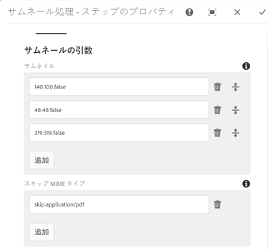
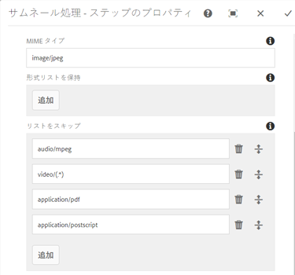
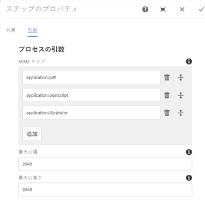
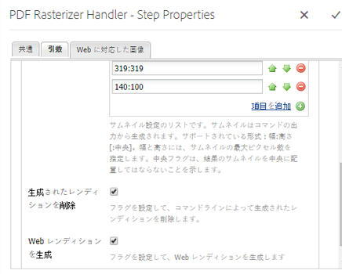
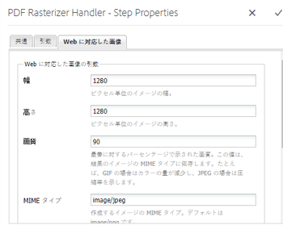
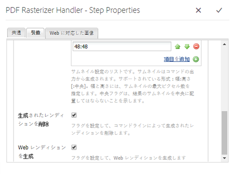
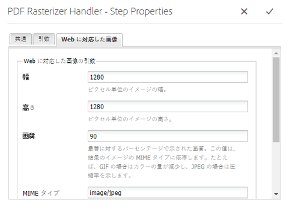

# PDFラスタライザを使用 {#using-pdf-rasterizer}

大きなコンテンツを大量に消費するPDFや AI ファイルを [!DNL Adobe Experience Manager Assets]の場合、デフォルトのライブラリでは正確な出力が生成されない場合があります。 AdobeのPDFRasterizer ライブラリは、デフォルトのライブラリの出力と比べて、より信頼性が高く正確な出力を生成できます。 Adobeでは、次のシナリオでPDFRasterizer ライブラリを使用することをお勧めします。

次のようなファイルで PDF Rasterizer ライブラリを使用することをお勧めします。

* 大量のコンテンツを集中的に消費する AI ファイルまたはPDFファイル。
* AI ファイルおよびPDFファイル（デフォルトでは生成されないサムネールを含む）。
* Pantone Matching System（PMS）カラーを使用した AI ファイル.

PDF Rasterizer を使用して生成されたサムネールおよびプレビューは、何もしなくてもすぐに使用できる出力に比べて高品質です。そのため、デバイス全体で一貫した表示エクスペリエンスを得ることができます。Adobe PDF Rasterizer ライブラリはカラースペース変換をサポートしません。ソースファイルのカラースペースに関わらず、RGB として出力されます。

1. RasterizerPDFを [!DNL Adobe Experience Manager] 次からデプロイ [ソフトウェア配布](https://experience.adobe.com/#/downloads/content/software-distribution/en/aem.html?package=/content/software-distribution/en/details.html/content/dam/aem/public/adobe/packages/cq650/product/assets/aem-assets-pdf-rasterizer-pkg-4.4.zip).

   >[!NOTE]
   >
   >PDF Rasterizer ライブラリは、Windows と Linux のみで使用できます。

1. 次にアクセス： [!DNL Assets] ワークフローコンソール： `https://[aem_server]:[port]/workflow`. 開く [!UICONTROL DAM アセットの更新] ワークフロー。

1. デフォルトの方法を使用してPDFファイルおよび AI ファイルのサムネールおよび Web レンディションの生成を防ぐには、次の手順に従います。

   * を開きます。 **[!UICONTROL サムネール処理]** 手順と追加 `application/pdf` または `application/postscript` 内 **[!UICONTROL スキップ MIME タイプ]** 下のフィールド **[!UICONTROL サムネール]** タブに移動します。

   

   * 内 **[!UICONTROL Web に対応した画像]** タブ、追加 `application/pdf` または `application/postscript` under **[!UICONTROL リストをスキップ]** 必要に応じて

   

1. を開きます。 **[!UICONTROL PDF/AI 画像プレビューレンディションをラスタライズ]** 手順を追加し、プレビュー画像レンディションのデフォルト生成をスキップする MIME タイプを削除します。 例えば、MIME タイプを削除します。 `application/pdf`, `application/postscript`または `application/illustrator` から **[!UICONTROL MIME タイプ]** リスト。

   

1. 「**[!UICONTROL PDF Rasterizer Handler]**」ステップをサイドパネルから「**[!UICONTROL サムネールを処理]**」ステップの下にドラッグします。
1. 次の引数を **[!UICONTROL PDFラスタライザハンドラ]** 手順：

   * MIME タイプ： `application/pdf` または `application/postscript`
   * コマンド: `PDFRasterizer -d -s 1280 -t PNG -i ${file}`
   * 追加するサムネールのサイズ：319:319、140:100、48:48。必要に応じて、サムネールのカスタム設定を追加します。

   `PDFRasterizer` コマンドのコマンドライン引数には、以下のものがあります。

   * `-d`:テキスト、ベクトルアートワークおよび画像のスムーズなレンダリングを有効にするフラグ。 高い画質の画像が作成されます。ただし、このパラメーターを指定すると、コマンドの実行速度が遅くなり、画像サイズも増大します。

   * `-s`:最大の画像サイズ（高さまたは幅）。 これは各ページで DPI に変換されます。異なるサイズのページが混在している場合、ページごとに異なる比率で拡大縮小される場合があります。デフォルトは実際のページサイズです。

   * `-t`:出力画像タイプ。 有効なタイプは JPEG、PNG、GIF および BMP です。デフォルト値は JPEG です。

   * `-i`:入力PDFのパス。 必須パラメーターです。

   * `-h`: ヘルプ

1. 中間レンディションを削除するには、「**[!UICONTROL 生成されたレンディションを削除]**」を選択します。
1. Rasterizer で Web レンディションをPDFに生成させるには、 **[!UICONTROL Web レンディションを生成]**.

   

1. 設定を **[!UICONTROL Web に対応した画像]** タブをクリックします。

   

1. ワークフローを保存します。
1. PDFRasterizer がPDFライブラリを使用してPDFページを処理できるようにするには、 **[!UICONTROL DAM プロセスのサブアセット]** モデル [!UICONTROL ワークフロー] コンソール。
1. サイドパネルから、PDFラスタライザハンドラのステップを **[!UICONTROL Web 対応の画像レンディションを作成]** 手順
1. 次の引数を **[!UICONTROL PDFラスタライザハンドラ]** 手順：

   * MIME タイプ： `application/pdf` または `application/postscript`
   * コマンド: `PDFRasterizer -d -s 1280 -t PNG -i ${file}`
   * サムネールサイズを追加： `319:319`, `140:100`, `48:48`. 必要に応じて、カスタムのサムネール設定を追加します。

   `PDFRasterizer` コマンドのコマンドライン引数には、以下のものがあります。

   * `-d`:テキスト、ベクトルアートワークおよび画像のスムーズなレンダリングを有効にするフラグ。 高い画質の画像が作成されます。ただし、このパラメーターを指定すると、コマンドの実行速度が遅くなり、画像サイズも増大します。

   * `-s`:最大の画像サイズ（高さまたは幅）。 これは各ページで DPI に変換されます。異なるサイズのページが混在している場合、ページごとに異なる比率で拡大縮小される場合があります。デフォルトは実際のページサイズです。

   * `-t`:出力画像タイプ。 有効なタイプは JPEG、PNG、GIF および BMP です。デフォルト値は JPEG です。

   * `-i`:入力PDFのパス。 必須パラメーターです。

   * `-h`: ヘルプ

1. 中間レンディションを削除するには、「**[!UICONTROL 生成されたレンディションを削除]**」を選択します。
1. Rasterizer で Web レンディションをPDFに生成させるには、 **[!UICONTROL Web レンディションを生成]**.

   

1. 設定を **[!UICONTROL Web に対応した画像]** タブをクリックします。

   

1. ワークフローを保存します。
1. にPDFファイルまたは AI ファイルをアップロード [!DNL Experience Manager Assets]. PDF Rasterizer により、ファイルのサムネールと Web レンディションが生成されます。
