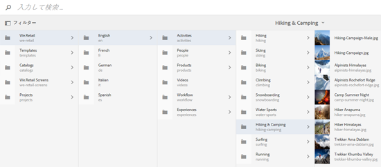
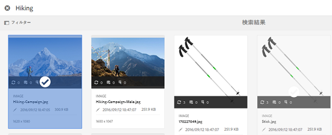
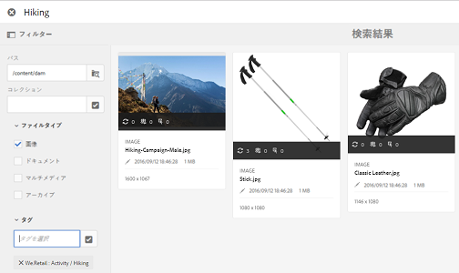

# アセットセレクター {#asset-selector}

>[!NOTE]
>
>以前のバージョンのAEMでは、アセットセレクターは、[アセットピッカー](https://helpx.adobe.com/experience-manager/6-2/assets/using/asset-picker.html)と呼ばれていました。

アセットセレクターを使用すると、[!DNL Adobe Experience Manager]アセット内のアセットを参照、検索およびフィルターできます。 また、アセットセレクターを使用して選択したアセットのメタデータを取得できます。アセットセレクターインターフェイスをカスタマイズするには、サポートされたリクエストパラメーターを使用して起動します。これらのパラメーターは、特定のシナリオ向けにアセットセレクターのコンテキストを設定します。

現在、リクエストパラメーター`assettype`(*Image/Video/Text*)および選択範囲`mode`(*Single/Multiple*)をアセットセレクターのコンテキスト情報として渡すことができ、選択範囲全体にそのまま残ります。

アセットセレクターは、HTML5 **Window.postMessage**&#x200B;メッセージを使用して、選択したアセットのデータを受信者に送信します。

アセットセレクターは、Granite の基盤ピッカーのボキャブラリに基づいています。初期設定では、アセットセレクターは参照モードで動作します。 ただし、Omnisearchエクスペリエンスを使用してフィルターを適用し、特定のアセットを絞り込むことができます。

任意のWebページ(CQコンテナの一部であるかどうかに関係なく)を、アセットセレクター(`https://[AEM_server]:[port]/aem/assetpicker.html`)と統合できます。

## コンテキストパラメーター {#contextual-parameters}

次のリクエストパラメーターを URL で渡して、特定のコンテキストでアセットセレクターを起動できます。

| 名前 | 値 | 例 | 目的 |
|---|---|---|---|
| resource suffix (B) | URL のリソースサフィックスとしてのフォルダーパス：`http://localhost:4502/aem/` `assetpicker.html/<folder_path>` | 特定のフォルダーを選択してアセットセレクターを起動するには、例えばフォルダー`/content/dam/we-retail/en/activities`を選択して、URLを次の形式にする必要があります。`http://localhost:4502/aem/assetpicker.html` `/content/dam/we-retail/en/activities?assettype=images` | アセットセレクターの起動時に特定のフォルダーを選択する必要がある場合、そのフォルダーをリソースサフィックスとして渡します。 |
| mode | single、multiple | `http://localhost:4502/aem/assetpicker.html` `?mode=multiple`   `http://localhost:4502/aem/assetpicker.html` `?mode=single` | 複数モードでは、アセットセレクターを使用して、いくつかのアセットを同時に選択できます。 |
| dialog | true、false | `http://localhost:4502/aem/assetpicker.html` `?dialog=true` | アセットセレクターを Granite ダイアログとして開くには、これらのパラメーターを使用します。このオプションは、Granite パスフィールドを使用してアセットセレクターを起動し、pickerSrc URL として設定する場合にのみ適用できます。 |
| root | `<folder_path>` | `http://localhost:4502/aem/` `assetpicker.html?assettype=images` `&root=/content/dam/we-retail/en/activities` | アセットセレクターのルートフォルダーを指定するには、このオプションを使用します。この場合、アセットセレクターを使用すると、ルートフォルダーの下の子アセット（直接／間接）のみを選択できます。 |
| viewmode | 検索を |  | assettypeパラメータとmimetypeパラメータを使用して、検索モードでアセットセレクターを起動するには |
| assettype (S) | images、documents、multimedia、archives | <ul><li>`http://localhost:4502/aem/assetpicker.html?viewmode=search&assettype=images`</li> <li>`http://localhost:4502/aem/assetpicker.html?viewmode=search&assettype=documents`</li> <li>`http://localhost:4502/aem/assetpicker.html?viewmode=search&assettype=multimedia`</li> <li>`http://localhost:4502/aem/assetpicker.html?viewmode=search&assettype=archives`</li> | 渡された値に基づいてアセットタイプをフィルタリングするには、このオプションを使用します。 |
| mimetype | アセットの MIME タイプ（`/jcr:content/metadata/dc:format`）（ワイルドカードもサポートされています） | <ul><li>`http://localhost:4502/aem/assetpicker.html?viewmode=search&mimetype=image/png`</li>  <li>`http://localhost:4502/aem/assetpicker.html?viewmode=search&?mimetype=*png`</li>  <li>`http://localhost:4502/aem/assetpicker.html?viewmode=search&mimetype=*presentation`</li>  <li>`http://localhost:4502/aem/assetpicker?viewmode=search&mimetype=*presentation&mimetype=*png`</li></ul> | MIME タイプに基づいてアセットをフィルタリングするために使用します |

## アセットセレクタ{#using-the-asset-selector}を使用

1. アセットセレクターインターフェイスにアクセスするには、`https://[AEM_server]:[port]/aem/assetpicker` に移動します。
1. 目的のフォルダーに移動して、1 つまたは複数のアセットを選択します。

   

   または、オムニサーチボックスから目的のアセットを検索して選択することもできます。

   

   オムニサーチボックスを使用してアセットを検索する場合、**[!UICONTROL フィルター]**&#x200B;ウィンドウから様々なフィルターを選択して検索を絞り込むことができます。

   

1. ツールバーの「****」をタップまたはクリックします。
