# アセットテンプレート {#asset-templates}

アセットテンプレートは、デジタルメディアや印刷メディア向けに、視覚的に豊富なコンテンツをすばやく再利用できる、特別なアセットクラスです。 アセットテンプレートには、固定メッセージセクションと編集可能セクションの 2 つの部分があります。

固定メッセージセクションには、編集できないブランドロゴおよび著作権情報など、独自のコンテンツを含めることができます。編集可能なセクションには、編集可能なフィールド内にビジュアルおよびテキストコンテンツを含め、メッセージをカスタマイズできます。

全体的な表記を保護しながら制限付きの編集をおこなう柔軟性のあるアセットテンプレートは、様々な機能に対してすばやくコンテンツを適応させ、コンテンツの成果物として配信するための理想的な構築ブロックです。コンテンツの再利用は、プリントおよびデジタルチャネルの管理コストを削減し、それらのチャネルをまたいで総合的で一貫したエクスペリエンスを実現するのに役立ちます。

マーケターは、AEM Assets内にテンプレートを保存および管理し、1つのベーステンプレートを使用して、パーソナライズされた複数のプリントエクスペリエンスを簡単に作成できます。 パンフレット、チラシ、はがき、名刺など、様々な種類のマーケティング資料を作成して、顧客にマーケティングメッセージを明確に伝えることができます。 また、既存の、または新しいプリント出力から複数ページのプリント出力をアセンブルできます。特に、デジタルおよびプリントエクスペリエンスを簡単に同時配信して、一貫性のある統合されたエクスペリエンスをユーザーに提供できます。

アセットテンプレートはほとんど InDesign ファイルですが、InDesign の習熟は素晴らしい成果物の作成の障害にはなりません。InDesign テンプレートのフィールドを、カタログを作成する際には必要となる商品フィールドとマッピングさせる必要はありません。テンプレートは、Webインターフェイス上でWYSIWYGモードで直接編集できます。 ただし、InDesignが編集の変更を処理するには、最初にAEM AssetsをInDesignサーバーと統合するように設定する必要があります。

Web インターフェイスから InDesign テンプレートを編集する機能は、ローカルプロモーション戦略に関する商品化までの時間を短縮しながら、クリエイティブとマーケティングの担当者間の優れたコラボレーションを促進するのに役立ちます。

アセットテンプレートを使用すると、次のことができます。

* Web インターフェイスから編集可能テンプレートフィールドを変更する
* フォントサイズ、スタイル、タイプなど、タグレベルでテキストの基本スタイルを制御する
* コンテンツピッカーを使用してテンプレート内の画像を変更する
* テンプレートの編集をプレビューする
* 複数のテンプレートファイルを統合して複数ページの成果物を作成する

販促物のテンプレートを選択すると、AEM Assets は、編集可能なテンプレートのコピーを作成します。元のテンプレートは保持されるので、全体的な表記の元の状態を保つことができ、再利用してブランドの一貫性を強制できます。

親フォルダー内の更新されたファイルを次の形式で書き出すことができます。

* INDD
* PDF
* JPG

また、これらの形式でローカルシステムに出力をダウンロードできます。

## 販促物の作成 {#creating-a-collateral}

今後のキャンペーンのために、パンフレット、チラシおよび広告など、デジタルの印刷可能な販促物を作成し、世界中のアウトレットストアで共有するシナリオについて考えてみます。テンプレートに基づいた販促物の作成は、チャネルをまたいで統合されたカスタマーエクスペリエンスを実現するのに役立ちます。デザイナーは、InDesign などのクリエイティブソリューションを使用してキャンペーンテンプレート（単一ページまたは複数ページ）を作成し、テンプレートを AEM Assets にアップロードできます。販促物を作成する前に、1つ以上のINDDテンプレートをにアップロードし、事前にExperience Managerで利用できるようにします。

1. AEM のロゴをクリックまたはタップして、ナビゲーションページの「**[!UICONTROL アセット]**」をクリックまたはタップします。
1. オプションから、「**[!UICONTROL テンプレート]**」を選択します。

   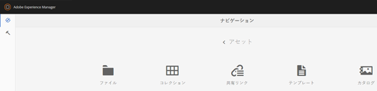

1. 「**[!UICONTROL 作成]**」をクリックまたはタップし、メニューから作成する販促物を選択します。例えば、「**[!UICONTROL パンフレット]**」を選択します。

   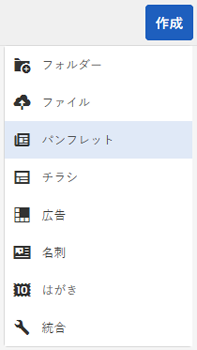

1. 1つ以上のINDDテンプレートをにアップロードし、事前にExperience Managerで利用できるようにします。 パンフレット用のテンプレートを選択して、「**[!UICONTROL 次へ]**」をクリックまたはタップします。

   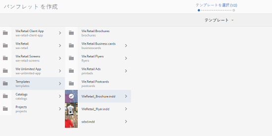

1. パンフレットの名前と、オプションで説明を指定します。

   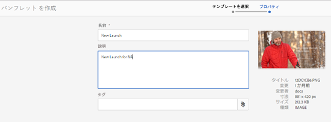

1. （オプション）「**[!UICONTROL タグ]**」フィールドの横にある&#x200B;**[!UICONTROL タグ]**&#x200B;アイコンをクリックまたはタップして、パンフレット用の 1 つ以上のタグを選択します。「**[!UICONTROL 確認]**」をクリックまたはタップして、選択を確定します。

   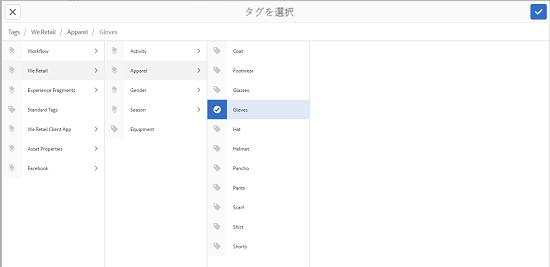

1. 「**[!UICONTROL 作成]**」をクリックします。新しいパンフレットが作成されたことを確認するダイアログが表示されます。「**[!UICONTROL 開く]**」をクリックまたはタップして、パンフレットを編集モードで開きます。

   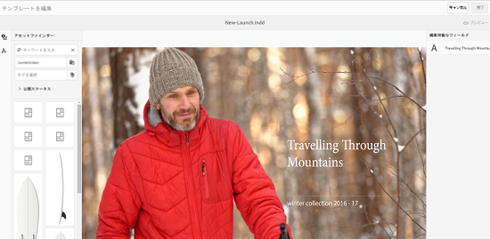

   または、ダイアログを閉じて、開始したテンプレートページのフォルダーに移動し、作成したパンフレットを表示します。販促物のタイプがカード表示のサムネールに表示されます。例えば、この場合、サムネールにパンフレットと表示されます。

   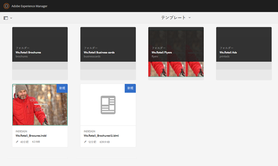

## 販促物の編集 {#editing-a-collateral}

販促物を作成したら、すぐに編集できます。または、テンプレートページやアセットページから開きます。

1. 販促物を編集するために開くには、次のいずれかの操作をおこないます。

   * [販促物の作成](asset-templates.md#creating-a-collateral)の手順 7 で作成した販促物（この場合はパンフレット）を開きます。
   * テンプレートページで、販促物を作成したフォルダーに移動して、販促物のサムネール上にある編集クイックアクションをクリックまたはタップします。
   * 販促物のアセットページで、ツールバーから編集アイコンをクリックまたはタップします。
   * 販促物を選択し、ツールバーの「編集」アイコンをクリックまたはタップします。

   

   アセットファインダーおよびテキストエディターがページの左側に表示されます。デフォルトで、テキストエディターが開きます。

   テキストエディターを使用して、テキストフィールドに表示させるテキストを変更します。タグレベルで、フォントサイズ、スタイル、カラーおよびタイプを変更できます。

   アセットファインダーを使用して、AEM Assets 内の画像を参照または検索し、テンプレート内の編集可能な画像を選択した画像と置き換えることができます。

   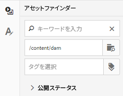

   編集可能であることは右側に表示されます。AEM Assets で編集可能なフィールドの場合、テンプレートの対応するフィールドが InDesign でタグ付けされている必要があります。つまり、InDesign で編集可能としてマークされる必要があります。

   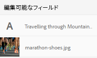

   >[!NOTE]
   >
   >AEM Assets で InDesign テンプレートからデータを抽出して編集できるようにするために、AEM インスタンスが InDesign サーバーと統合されていることを確認します。詳しくは、[AEM AssetsとInDesign Server](indesign.md)の統合を参照してください。

1. 編集可能なフィールドのテキストを変更するには、編集可能なフィールドのリストからテキストフィールドをクリックまたはタップして、フィールドのテキストを編集します。

   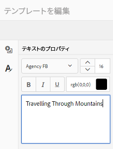

   提供されるオプションを使用して、テキストプロパティ（例えば、フォントスタイル、カラー、サイズなど）を編集できます。

1. 「**[!UICONTROL プレビュー]**」アイコンをクリックまたはタップして、テキストの変更をプレビューします。

   

1. 画像を入れ替えるには、**[!UICONTROL アセットファインダー]**&#x200B;アイコンをクリックまたはタップします。

   

1. 編集可能なフィールドのリストから画像フィールドを選択して、アセットピッカーから編集可能なフィールドに目的の画像をドラッグします。

   

   また、キーワード、タグおよび公開ステータスに基づいて画像を検索できます。AEM Assets リポジトリを参照して、目的の画像の場所に移動できます。

   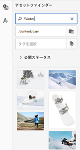

1. **[!UICONTROL プレビュー]**&#x200B;アイコンをクリックまたはタップして、画像をプレビューします。

   

1. 複数ページの販促物の特定のページを編集するには、下部にあるページナビゲーターを使用します。

   

1. ツールバーの「**[!UICONTROL プレビュー]**」アイコンをクリックまたはタップして、すべての変更をプレビューします。「**[!UICONTROL 完了]**」をクリックまたはタップして、販促物に対する編集の変更を保存します。

   >[!NOTE]
   >
   >「プレビュー」および「完了」アイコンは、販促物内の編集可能な画像フィールドに見つからないアイコンがない場合にのみ有効になります。販促物に見つからないアイコンがある場合、これは AEM が InDesign テンプレート内の画像を解決できないことが原因です。通常、AEM は次の場合に画像を解決できません。
   >
   >* 基になる InDesign テンプレートに画像が埋め込まれていない
   >* 画像がローカルファイルシステムからリンクされている

   >
   >AEM が画像を解決できるようにするには、次の操作をおこないます。
   >
   >* InDesign テンプレートを作成する際に画像を埋め込む（[リンクと埋め込みグラフィックについて](https://helpx.adobe.com/jp/indesign/using/graphics-links.html)を参照）。
   >* ローカルファイルシステムに AEM をマウントして、見つからないアイコンを既存の AEM アセットにマッピングする。

   >
   >InDesignドキュメントの使用に関する詳細は、「[AEM](https://helpx.adobe.com/jp/experience-manager/kb/best-practices-idd-docs-aem.html)でのInDesignドキュメントの使用に関するベストプラクティス」を参照してください。

1. パンフレットの PDF レンディションを生成するには、ダイアログで Acrobat オプションを選択し、「**[!UICONTROL 続行]**」をクリックします。
1. 開始したフォルダーに販促物が作成されます。レンディションを表示するには、販促物を開いて、グローバルナビゲーションリストから「**[!UICONTROL レンディション]**」を選択します。

   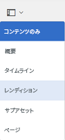

1. レンディションのリストからPDFレンディションをクリックまたはタップして、PDFファイルをダウンロードします。 PDF ファイルを開いて、販促物を確認します。

   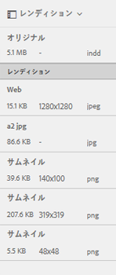

## 販促物の統合 {#merge-collateral}

1. **[!UICONTROL ツール/アセット]**&#x200B;をクリックまたはタップします。
1. オプションから、「**[!UICONTROL テンプレート]**」を選択します。
1. 「**[!UICONTROL 作成]**」をクリックまたはタップし、メニューから「**[!UICONTROL 結合]**」を選択します。

   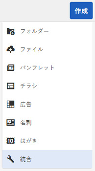

1. テンプレートの結合ページで、統合アイコンをクリックまたはタップします。

   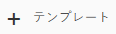

1. 統合する販促物の場所に移動して、統合する販促物のサムネールをクリックまたはタップして選択します。

   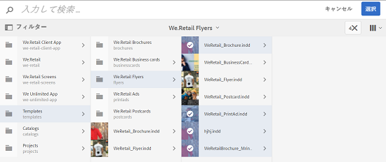

   オムニサーチボックスからテンプレートを検索することもできます。

   

   AEM Assets リポジトリまたはコレクションを参照して、目的のテンプレートの場所に移動し、統合するテンプレートを選択できます。

   

   様々なフィルターを適用して、目的のテンプレートを検索できます。例えば、ファイルタイプやタグに基づいてテンプレートを検索できます。

   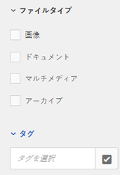

1. ツールバーから「**[!UICONTROL 次へ]**」をクリックまたはタップします。
1. **[!UICONTROL プレビューと並べ替え]**&#x200B;画面で、必要に応じてテンプレートを並べ替え、結合するテンプレートの選択範囲をプレビューします。 次に、ツールバーから「]**次へ**[!UICONTROL 」をクリックまたはタップします。

   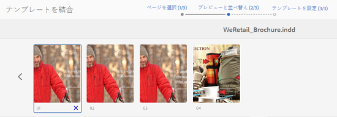

1. テンプレートを設定画面で、販促物の名前を指定します。 オプションで、適切なタグを指定します。PDF 形式で出力を書き出す場合、「**[!UICONTROL Acrobat（.PDF）]**」オプションを選択します。デフォルトでは、販促物は JPG および InDesign 形式で書き出されます。複数ページの販促物の表示サムネールを変更するには、「**[!UICONTROL サムネールを変更]**」をクリックまたはタップします。

   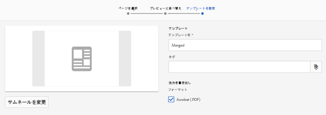

1. ダイアログで「**[!UICONTROL 保存]**」をクリックまたはタップし、「**[!UICONTROL OK]**」をクリックまたはタップしてダイアログを閉じます。開始したフォルダーに複数ページの販促物が作成されます。

   >[!NOTE]
   >
   >統合された販促物を後で編集したり、他の販促物を作成するために使用したりすることはできません。
