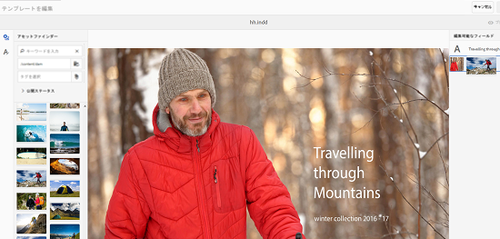
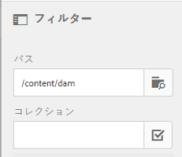

# アセットテンプレート {#asset-templates}

アセットテンプレートは、デジタルメディアとプリントメディアの視覚的にリッチなコンテンツをすばやく再利用するための、アセットの特別なクラスです。アセットテンプレートには、固定メッセージセクションと編集可能セクションの 2 つの部分があります。

固定メッセージセクションには、編集できないブランドロゴや著作権情報など、独自のコンテンツを含めることができます。編集可能セクションには、編集可能なフィールドに視覚的コンテンツやテキストコンテンツを含めて、メッセージをカスタマイズできます。

全体的な表記を保護しながら制限付きの編集をおこなう柔軟性のあるアセットテンプレートは、様々な機能に対してすばやくコンテンツを適応させ、コンテンツの成果物として配信するための理想的な構築ブロックです。コンテンツの再利用は、プリントおよびデジタルチャネルの管理コストを削減し、それらのチャネルをまたいで総合的で一貫したエクスペリエンスを実現するのに役立ちます。

マーケターは、 [!DNL Experience Manager] アセットを作成し、単一の基本テンプレートを使用して、パーソナライズされた複数の印刷エクスペリエンスを簡単に作成できます。 パンフレット、チラシ、はがき、名刺など、様々なタイプのマーケティング素材を作成して、マーケティングメッセージを顧客にわかりやすく伝えることができます。また、既存の、または新しいプリント出力から複数ページのプリント出力をアセンブルできます。特に、デジタルおよびプリントエクスペリエンスを簡単に同時配信して、一貫性のある統合されたエクスペリエンスをユーザーに提供できます。

アセットテンプレートはほとんど InDesign ファイルですが、InDesign の習熟は素晴らしい成果物の作成の障害にはなりません。InDesign テンプレートのフィールドを、カタログを作成する際には必要となる商品フィールドとマッピングさせる必要はありません。Web インターフェイス上で直接、WYSIWYG モードでテンプレートを編集できます。ただし、InDesignが編集上の変更を処理するには、最初に [!DNL Experience Manager] アセットサーバーと統合するInDesign。

Web インターフェイスから InDesign テンプレートを編集する機能は、ローカルプロモーション戦略に関する商品化までの時間を短縮しながら、クリエイティブとマーケティングの担当者間の優れたコラボレーションを促進するのに役立ちます。

アセットテンプレートを使用すると、次のことができます。

* Web インターフェイスから編集可能テンプレートフィールドを変更する
* フォントサイズ、スタイル、タイプなど、タグレベルでテキストの基本スタイルを制御する
* コンテンツピッカーを使用してテンプレート内の画像を変更する
* テンプレートの編集をプレビューする
* 複数のテンプレートファイルを統合して複数ページの成果物を作成する

販促物のテンプレートを選択すると、[!DNL Assets] は編集可能なテンプレートのコピーを作成します。元のテンプレートは保持されるので、全体的な表記はそのままの状態で残り、再利用してブランドの一貫性を確保できます。

親フォルダー内の更新されたファイルを次の形式で書き出すことができます。

* INDD
* PDF
* JPG

また、これらの形式でローカルシステムに出力をダウンロードできます。

## 販促物の作成 {#creating-a-collateral}

今後のキャンペーンのために、パンフレット、チラシおよび広告など、デジタルの印刷可能な販促物を作成し、世界中のアウトレットストアで共有するシナリオについて考えてみます。テンプレートに基づいた販促物の作成は、チャネルをまたいで統合されたカスタマーエクスペリエンスを実現するのに役立ちます。デザイナーは、InDesignなどのクリエイティブソリューションを使用してキャンペーンテンプレート（単一ページまたは複数ページ）を作成し、次の場所にテンプレートをアップロードできます。 [!DNL Assets] あなたのために。 販促物を作成する前に、1 つ以上の INDD テンプレートをにアップロードし、事前にExperience Managerで使用できます。

1. 次をクリック： [!DNL Experience Manager] ロゴをクリックし、 **[!UICONTROL Assets]** をクリックします。
1. オプションから、「**[!UICONTROL テンプレート]**」を選択します。

   

1. 「**[!UICONTROL 作成]**」をクリックまたはタップし、メニューから作成する販促物を選択します。例えば、「**[!UICONTROL パンフレット]**」を選択します。

   

1. 1 つ以上の INDD テンプレートをにアップロードし、事前にExperience Managerで使用できます。 パンフレット用のテンプレートを選択して、「**[!UICONTROL 次へ]**」をクリックまたはタップします。

   

1. パンフレットの名前と、オプションで説明を指定します。

   

1. （オプション）「**[!UICONTROL タグ]**」フィールドの横にある&#x200B;**[!UICONTROL タグ]**&#x200B;アイコンをクリックまたはタップして、パンフレット用の 1 つ以上のタグを選択します。「**[!UICONTROL 確認]**」をクリックまたはタップして、選択を確定します。

   

1. 「**[!UICONTROL 作成]**」をクリックします。新しいパンフレットが作成されたことを確認するダイアログが表示されます。「**[!UICONTROL 開く]**」をクリックまたはタップして、パンフレットを編集モードで開きます。

   

   または、ダイアログを閉じて、開始したテンプレートページのフォルダーに移動し、作成したパンフレットを表示します。販促物のタイプがカード表示のサムネールに表示されます。例えば、この場合、サムネールにパンフレットと表示されます。

   

## 販促物の編集 {#editing-a-collateral}

販促物を作成したら、すぐに編集できます。または、テンプレートページやアセットページから開きます。

1. 販促物を編集するために開くには、次のいずれかの操作をおこないます。

   * [販促物の作成](asset-templates.md#creating-a-collateral)の手順 7 で作成した販促物（この場合はパンフレット）を開きます。
   * テンプレートページで、販促物を作成したフォルダーに移動して、販促物のサムネール上にある編集クイックアクションをクリックまたはタップします。
   * 販促物のアセットページで、ツールバーから編集アイコンをクリックまたはタップします。
   * 販促物を選択し、ツールバーの「編集」アイコンをクリックまたはタップします。

   

   アセットファインダーとテキストエディターがページの左側に表示されます。デフォルトで、テキストエディターが開きます。

   テキストエディターを使用して、テキストフィールドに表示させるテキストを変更します。タグレベルで、フォントサイズ、スタイル、カラーおよびタイプを変更できます。

   アセットファインダーを使用して、[!DNL Assets]内の画像を参照するか検索し、テンプレート内の編集可能な画像を、選択した画像に置き換えることができます。

   

   編集可能な画像は右側に表示されます。フィールドを編集可能にする [!DNL Assets]、テンプレート内の対応するフィールドは、InDesignでタグ付けする必要があります。 つまり、InDesign で編集可能としてマークされる必要があります。

   

   >[!NOTE]
   >
   >次を確認します。 [!DNL Experience Manager] インスタンスがInDesignサーバーと統合され、 [!DNL Assets] を使用して、InDesignテンプレートからデータを抽出し、編集可能にします。 詳しくは、 [統合 [!DNL Assets] InDesign Server](indesign.md).

1. 編集可能なフィールドのテキストを変更するには、編集可能なフィールドのリストからテキストフィールドをクリックまたはタップして、フィールドのテキストを編集します。

   

   提供されるオプションを使用して、テキストプロパティ（例えば、フォントスタイル、カラー、サイズなど）を編集できます。

1. 「**[!UICONTROL プレビュー]**」アイコンをクリックまたはタップして、テキストの変更をプレビューします。

   

1. 画像をスワップするには、 **[!UICONTROL アセットファインダー]** アイコン

   

1. 編集可能なフィールドのリストから画像フィールドを選択して、アセットピッカーから編集可能なフィールドに目的の画像をドラッグします。

   

   また、キーワード、タグ、公開ステータスに基づいて画像を検索できます。[!DNL Assets]リポジトリを参照して、目的の画像の場所に移動できます。

   

1. 次をクリックまたはタップします。 **[!UICONTROL プレビュー]** アイコンをクリックして、画像をプレビューします。

   

1. 複数ページの販促物の特定のページを編集するには、下部にあるページナビゲーターを使用します。

   

1. ツールバーの「**[!UICONTROL プレビュー]**」アイコンをクリックまたはタップして、すべての変更をプレビューします。クリックまたはタップ **[!UICONTROL 完了]** 販促物に対する編集の変更を保存します。

   >[!NOTE]
   >
   >「プレビュー」および「完了」アイコンは、販促物内の編集可能な画像フィールドに見つからないアイコンがない場合にのみ有効になります。販促物に見つからないアイコンがある場合は、 [!DNL Experience Manager] は、画像テンプレート内の画像を解決できませんInDesign。 通常、 [!DNL Experience Manager] は次の場合に画像を解決できません。
   >
   >* 画像は、基になるテンプレートテンプレートに埋め込まれませんInDesign
   >* 画像がローカルファイルシステムからリンクされている

   >
   >[!DNL Experience Manager] で画像分解できるようにするには、次のようにします。
   >
   >* InDesign テンプレートを作成する際に画像を埋め込む（[リンクと埋め込みグラフィックについて](https://helpx.adobe.com/jp/indesign/using/graphics-links.html)を参照）。
   >* マウント [!DNL Experience Manager] をローカルファイルシステムに追加し、見つからないアイコンを既存の [!DNL Experience Manager] アセット。

   >
   >InDesignドキュメントの操作について詳しくは、 [でInDesignドキュメントを操作する際のベストプラクティス [!DNL Experience Manager]](https://helpx.adobe.com/jp/experience-manager/kb/best-practices-idd-docs-aem.html).

1. パンフレットの PDF レンディションを生成するには、ダイアログで Acrobat オプションを選択し、「**[!UICONTROL 続行]**」をクリックします。
1. 開始したフォルダーに販促物が作成されます。レンディションを表示するには、販促物を開いて、グローバルナビゲーションリストから「**[!UICONTROL レンディション]**」を選択します。

   

1. レンディションのリストでPDFレンディションをクリックまたはタップして、PDFファイルをダウンロードします。 PDF ファイルを開いて、販促物を確認します。

   

## 販促物の統合 {#merge-collateral}

1. クリックまたはタップ **[!UICONTROL ツール/アセット]**.
1. オプションから、「**[!UICONTROL テンプレート]**」を選択します。
1. クリックまたはタップ **[!UICONTROL 作成]** そして選択者 **[!UICONTROL 結合]** を選択します。

   

1. テンプレートの結合ページで、統合アイコンをクリックまたはタップします。

   

1. 統合する販促物の場所に移動して、統合する販促物のサムネールをクリックまたはタップして選択します。

   

   オムニサーチボックスからテンプレートを検索することもできます。

   

   [!DNL Assets] リポジトリーまたはコレクションを参照して、目的のテンプレートの場所に移動してから、統合するテンプレートを選択できます。

   

   様々なフィルターを適用して、目的のテンプレートを検索できます。例えば、ファイルタイプやタグに基づいてテンプレートを検索できます。

   

1. ツールバーから「**[!UICONTROL 次へ]**」をクリックまたはタップします。
1. **[!UICONTROL プレビューと並べ替え]**&#x200B;画面で、必要に応じてテンプレートを再配置し、統合するために選択したテンプレートをプレビューします。次に、ツールバーから「]**次へ**[!UICONTROL 」をクリックまたはタップします。

   

1. テンプレートの設定画面で、販促物の名前を指定します。オプションで、適切なタグを指定します。PDF 形式で出力を書き出す場合、「**[!UICONTROL Acrobat（.PDF）]**」オプションを選択します。デフォルトでは、販促物は JPG および InDesign 形式で書き出されます。複数ページの販促物の表示サムネールを変更するには、「**[!UICONTROL サムネールを変更]**」をクリックまたはタップします。

   

1. ダイアログで「**[!UICONTROL 保存]**」をクリックまたはタップし、「**[!UICONTROL OK]**」をクリックまたはタップしてダイアログを閉じます。開始したフォルダーに複数ページの販促物が作成されます。

   >[!NOTE]
   >
   >統合された販促物を後で編集したり、他の販促物を作成するために使用したりすることはできません。
