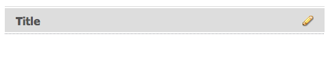

# アセットエディターページの作成と設定 {#creating-and-configuring-asset-editor-pages}

>[!CAUTION]
>
>AEM 6.4 の拡張サポートは終了し、このドキュメントは更新されなくなりました。 詳細は、 [技術サポート期間](https://helpx.adobe.com/jp/support/programs/eol-matrix.html). サポートされているバージョンを見つける [ここ](https://experienceleague.adobe.com/docs/?lang=ja).

このドキュメントでは、次の点について説明します。

* カスタマイズしたアセットエディターページを作成する理由
* アセットエディターページ（メタデータの表示と編集、およびアセットに対するアクションの実行を可能にする WCM ページ）の作成とカスタマイズの方法です。
* 複数のアセットを同時に編集する方法。

>[!NOTE]
>
>アセット共有は、オープンソースの参照実装として使用できます。 詳しくは、 [Asset Share Commons](https://adobe-marketing-cloud.github.io/asset-share-commons/) . 正式にはサポートされていません。

## アセットエディターページを作成して設定する理由 {#why-create-and-configure-asset-editor-pages}

デジタルアセット管理は、ますます広く使用されるようになっています。専門的な教育を受けた小規模なユーザーグループ、例えば写真家や分類学者など向けの小規模なソリューションから、大規模で多様なユーザーグループ、例えばビジネスユーザー、WCM 作成者、ジャーナリストなどに移行する場合、専門的なユーザー向けの [!DNL Adobe Experience Manager Assets] の強力なユーザーインターフェイスでは、利用できる情報が多すぎて不便が生じることがあり、関係者は自分に関係のあるデジタルアセットにアクセスできる、目的に特化したユーザーインターフェイスやアプリケーションを求めるようになります。

これらのアセット中心のアプリケーションは、イントラネット内の簡単なフォトギャラリーにすることができます。従業員は、Geometrixx付きの例のように、展示会の訪問や公開 Web サイトのプレスセンターから写真をアップロードできます。 また、アセット中心のアプリケーションは、買い物かご、チェックアウト、検証プロセスを含む完全なソリューションに拡張できます。

アセット中心型アプリケーションの作成の大部分は、コーディングを必要としない設定プロセスとなります。ここでは、ユーザーグループとそのニーズ、使用されるメタデータに関する知識のみが必要となります。[!DNL Assets] で作成されたアセット中心型アプリケーションは拡張可能です。適度なコーディング作業によって、アセットの検索、表示、変更のための再利用可能なコンポーネントを作成できます。

[!DNL Experience Manager] のアセット中心型アプリケーションはアセットエディターページで構成されており、特定アセットの詳細を表示するために使用できます。アセットエディターページでは、アセットにアクセスするユーザーが必要な権限を持っていれば、メタデータの編集も可能です。

## アセット共有ページの作成と設定 {#creating-and-configuring-an-asset-share-page}

DAM Finder 機能をカスタマイズし、必要なすべての機能を持つページ（アセット共有ページと呼ばれる）を作成します。 新しいアセット共有ページを作成するには、Geometrixxアセット共有テンプレートを使用してページを追加し、そのページでユーザーが実行できるアクションをカスタマイズし、アセットの閲覧者による表示方法を決定し、ユーザーによるクエリの作成方法を決定します。

カスタマイズしたアセット共有ページを作成する使用例を次に示します。

* ジャーナリスト向けプレスセンター
* 内部のビジネスユーザー向けの画像検索エンジン
* Web サイトユーザー向けの画像データベース
* メタデータエディター用のメディアタグ付けインターフェイス

### アセット共有ページの作成 {#creating-an-asset-share-page}

新しいアセット共有ページを作成するには、Web サイトでの作業時または Digital Asset Manager から作成します。

>[!NOTE]
>
>デフォルトでは、 **新規** digital asset manager では、アセットビューアとアセットエディターが自動的に作成されます。

で新しいアセット共有ページを作成するには、以下を実行します。 **Web サイト** コンソール：

1. 内 **[!UICONTROL Web サイト]** 」タブで、アセット共有ページを作成する場所に移動し、 **[!UICONTROL 新規]**.

1. を選択します。 **[!UICONTROL アセット共有]** ページを開き、「 **[!UICONTROL 作成]**. 新しいページが作成され、アセット共有ページが **[!UICONTROL Web サイト]** タブをクリックします。

「GeometrixxDAM アセット共有」テンプレートを使用して作成した基本ページは、次のようになります。

アセット共有ページをカスタマイズするには、サイドキックの要素を使用し、Query Builder のプロパティも編集します。 ページ **[!UICONTROL Geometrixxプレスセンター]** は、このテンプレートに基づくページのカスタマイズバージョンです。

Digital Asset Manager を使用して新しいアセット共有ページを作成するには：

1. Digital Asset Manager で、 **[!UICONTROL 新規]**&#x200B;を選択します。 **[!UICONTROL 新しいアセット共有]**.
1. 内 **[!UICONTROL タイトル]**」に、アセット共有ページの名前を入力します。 必要に応じて、URL の名前を入力します。

   

1. アセット共有ページをダブルクリックして開き、ページを設定します。

   

   デフォルトでは、 **[!UICONTROL 新規]**&#x200B;に設定すると、アセットビューアとアセットエディターが自動的に作成されます。

#### アクションのカスタマイズ {#customizing-actions}

選択したデジタルアセットに対してユーザーが実行できるアクションを、事前定義済みアクションの選択範囲で指定できます。

アセット共有ページにアクションを追加するには：

1. カスタマイズするアセット共有ページで、 **[!UICONTROL アクション]** サイドキックに

   次のアクションが使用可能です。
   

| アクション | 説明 |
|---|---|
| [!UICONTROL アクションを削除] | ユーザーは、選択したアセットを削除できます。 |
| [!UICONTROL アクションをダウンロード] | ユーザーが選択したアセットをコンピューターにダウンロードできるようにします。 |
| [!UICONTROL Lightbox アクション] | アセットを「Lightbox」に保存します。Lightbox では、保存されたアセットに対して他のアクションを実行できます。これは、複数のページにまたがるアセットを操作する場合に便利です。Lightbox は、アセットの買い物かごとしても使用できます。 |
| [!UICONTROL アクションを移動] | ユーザーはアセットを別の場所に移動できます |
| [!UICONTROL タグアクション] | 選択したアセットにタグを追加できます |
| [!UICONTROL アセットアクションを表示] | アセットをアセットエディターで開き、ユーザーが操作できるようにします。 |

1. ページの&#x200B;**アクション**&#x200B;領域に適切なアクションをドラッグします。これにより、そのアクションを実行するためのボタンが作成されます。

   

#### 検索結果の表示方法の決定 {#determining-how-search-results-are-presented}

レンズの定義済みリストから、結果の表示方法を決定します。

検索結果の表示方法を変更するには：

1. カスタマイズするアセット共有ページで、 **[!UICONTROL 検索]**.

   

1. 適切なレンズをページの中央上にドラッグします。 プレスセンターでは、レンズは既に使用可能です。 ユーザーが適切なレンズアイコンを押すと、必要に応じて検索結果が表示されます。

次のレンズを使用できます。

| レンズ | 説明 |
|---|---|
| **[!UICONTROL リストレンズ]** | アセットを詳細と共にリスト形式で表示します。 |
| **[!UICONTROL モザイクレンズ]** | アセットをモザイク形式で表示します。 |

#### モザイクレンズ {#mosaic-lens}

#### リストレンズ {#list-lens}

#### Query Builder のカスタマイズ {#customizing-the-query-builder}

Query Builder を使用すると、検索語句を入力し、アセット共有ページのコンテンツを作成できます。 Query Builder を編集すると、1 ページに表示される検索結果の数を決定できます。アセットをダブルクリックすると、どのアセットエディターが開くか、クエリが検索するパスを選択し、ノードタイプをカスタマイズします。

Query Builder をカスタマイズするには：

1. カスタマイズするアセット共有ページで、 **[!UICONTROL 編集]** 」をクリックします。 デフォルトでは、 **[!UICONTROL 一般]** タブが開きます。

1. 1 ページあたりの結果の数、アセットエディターのパス（カスタマイズされたアセットエディターがある場合）およびアクションタイトルを選択します。

   

1. 次をクリック： **[!UICONTROL パス]** タブをクリックします。 検索を実行する 1 つ以上のパスを入力します。 これらのパスは、ユーザーがパスの述語を使用すると上書きされます。

   

1. 必要に応じて、別のノードタイプを入力します。

1. 内 **[!UICONTROL Query Builder URL]** 「 」フィールドに値を入力すると、query builder を上書きするかラップして、既存の query builder コンポーネントを使用して新しいサーブレット URL を入力できます。 内 **[!UICONTROL フィード URL]** 」フィールドに値を入力すると、フィード URL を上書きすることもできます。

   

1. 内 **[!UICONTROL テキスト]** 「 」フィールドで、結果と結果のページ番号に表示するテキストを入力します。 クリック **[!UICONTROL OK]** 変更を完了したとき。

   

#### 述語の追加 {#adding-predicates}

[!DNL Experience Manager Assets] には、アセット共有ページに追加できる多数の述語が含まれています。 これらを使用して、ユーザーは検索をさらに絞り込むことができます。 場合によっては、Query Builder パラメーター（Path パラメーターなど）を上書きすることがあります。

述語を追加するには：

1. カスタマイズするアセット共有ページで、 **[!UICONTROL 検索]**.

   

1. 適切な述語を、アセット共有ページのクエリビルダーの下にドラッグします。 これにより、適切なフィールドが作成されます。

   

   次の述語を使用できます。

| 述語 | 説明 |
|---|---|
| **[!UICONTROL 日付の述語]** | 特定の日付の前後に変更されたアセットを検索できます。 |
| **[!UICONTROL オプションの述語]** | サイトの所有者は、検索するプロパティ（プロパティの述語など）と、オプションを入力するコンテンツツリー（タグツリーなど）を指定できます。 これにより、選択したプロパティ（タグプロパティ）の値（タグ）をユーザーが選択できるオプションのリストが生成されます。 この述語を使用すると、タグのリスト、ファイルタイプ、画像の向きなどのリストコントロールを作成できます。 これは、一定のオプションセットに最適です。 |
| **[!UICONTROL パスの述語]** | ユーザーが必要に応じて、パスとサブフォルダーを定義できます。 |
| **[!UICONTROL プロパティの述語]** | サイトの所有者は、検索するプロパティ（例： tiff:ImageLength）を指定し、ユーザーは値（例： 800）を入力できます。これにより、高さ 800 ピクセルのすべての画像が返されます。 プロパティに任意の値を指定できる場合に役立つ述語。 |

詳しくは、 [述語の javadoc](https://helpx.adobe.com/experience-manager/6-4/sites/developing/using/reference-materials/javadoc/com/day/cq/search/eval/package-summary.html).

1. 述語をさらに設定するには、述語をダブルクリックします。 例えば、パスの述語を開く場合は、ルートパスを割り当てる必要があります。

   

## アセットエディターページの作成と設定 {#creating-and-configuring-an-asset-editor-page}

アセットエディターをカスタマイズして、ユーザーがデジタルアセットを表示および編集する方法を決定します。 これをおこなうには、新しいアセットエディターページを作成し、そのページでユーザーが実行できるビューとアクションをカスタマイズします。

>[!NOTE]
>
>DAM アセットエディターにカスタムフィールドを追加する場合は、新しい cq:Widget ノードを `/apps/dam/content/asseteditors.`

### アセットエディターページの作成 {#creating-the-asset-editor-page}

アセットエディターページを作成する場合は、アセット共有ページのすぐ下にページを作成することをお勧めします。

アセットエディターページを作成するには：

1. 内 **[!UICONTROL Web サイト]** タブで、アセットエディターページを作成する場所に移動し、 **[!UICONTROL 新規]**.

1. 「**[!UICONTROL Geometrixx アセットエディター]**」を選択し、「**[!UICONTROL 作成]**」をクリックします。新しいページが作成され、ページが「**[!UICONTROL Web サイト]**」タブに表示されます。

Geometrixx アセットエディターテンプレートを使用して作成された基本ページは次のイメージのようになります。

アセットエディターページをカスタマイズするには、サイドキックの要素を使用します。**[!UICONTROL Geometrixx プレスセンター]** からアクセスするアセットエディターページは、このテンプレートに基づいたページのカスタマイズバージョンです。

#### アセット共有ページから開くアセットエディターの設定 {#setting-which-asset-editor-opens-from-an-asset-share-page}

カスタマイズされたアセットエディターページを作成したら、作成したカスタマイズされたアセット共有がカスタマイズされたエディターページでアセットを開くように、アセットをダブルクリックする必要があります。

アセットエディターページを設定するには：

1. アセット共有ページで、QueryBuilder の隣にある「**[!UICONTROL 編集]**」をクリックします。

   

1. 「**[!UICONTROL 一般]**」タブが選択されていない場合は、クリックします。

1. **[!UICONTROL アセットエディターのパス]** フィールドで、アセット共有ページでアセットを開くためのアセットエディターへのパスを入力して、「**[!UICONTROL OK]**」をクリックします。

   

#### アセットエディターコンポーネントを追加する {#adding-asset-editor-components}

ページにコンポーネントを追加することで、アセットエディターが持つ機能を決定します。

アセットエディターコンポーネントを追加するには：

1. カスタマイズするアセットエディターページで、サイドキックの「**[!UICONTROL アセットエディター]**」を選択します。使用可能なすべてのアセットエディターコンポーネントが表示されます。

   >[!NOTE]
   >
   >カスタマイズできる内容は、使用可能なコンポーネントによって異なります。 コンポーネントを有効にするには、デザインモードに移動し、有効にする必要のあるコンポーネントを選択します。

1. サイドキックからアセットエディターにコンポーネントをドラッグし、コンポーネントダイアログで変更を加えます。コンポーネントについては、次の表で説明し、以降の詳細な手順で説明します。

   >[!NOTE]
   >
   >アセットエディターページをデザインする際に、読み取り専用または編集可能なコンポーネントを作成します。 鉛筆の画像がそのコンポーネントに表示されている場合、フィールドを編集できることをユーザーは把握しています。 デフォルトでは、ほとんどのコンポーネントは読み取り専用として設定されています。

   | コンポーネント | 説明 |
   |---|---|
   | **[!UICONTROL メタデータフォーム]と[!UICONTROL メタデータテキストフィールド]** | アセットにメタデータを追加し、そのアセットに対して送信などのアクションを実行できます。 |
   | **[!UICONTROL サブアセット]** | サブアセットをカスタマイズできます。 |
   | **タグ** | ユーザーがタグを選択してアセットに追加できます。 |
   | **[!UICONTROL サムネール]** | アセットのサムネールとファイル名が表示され、代替テキストを追加できます。 ここでもアセットエディターのアクションを追加できます。 |
   | **[!UICONTROL タイトル]** | アセットのタイトルを表示します。このタイトルはカスタマイズ可能です。 |

   

#### メタデータフォームとテキストフィールド — メタデータコンポーネントの表示の設定 {#metadata-form-and-text-field-configuring-the-view-metadata-component}

メタデータフォームは、開始アクションと終了アクションを含むフォームです。 その間に、 **[!UICONTROL テキスト]** フィールド。 詳しくは、 [Forms](../sites-authoring/default-components.md) フォームの操作に関する詳細

1. フォームの開始領域の「**[!UICONTROL 編集]**」をクリックして、開始アクションを作成します。必要に応じて、ボックスのタイトルを入力できます。 デフォルトでは、ボックスのタイトルは **[!UICONTROL メタデータ]**. 検証用の Java-script クライアントコードを生成する場合は、「クライアントの検証」チェックボックスを選択します。

   

1. フォームの終了領域の「**[!UICONTROL 編集]**」をクリックして、終了アクションを作成します。例えば、 **[!UICONTROL 送信]** ボタンをクリックして、ユーザーがメタデータの変更を送信できるようにします。 オプションで、 **[!UICONTROL リセット]** ボタンを使用して、メタデータを元の状態にリセットします。

   

1. フォームの「**[!UICONTROL フォーム開始]**」と「**フォーム終了**」の間に、メタデータテキストフィールドをドラッグします。ユーザーはこれらのテキストフィールドにメタデータを入力し、このメタデータを送信するか、他のアクションを実行することができます。

1. 「**タイトル**」などのフィールド名をダブルクリックし、メタデータフィールドを開いて変更を行います。**[!UICONTROL コンポーネントを編集]**&#x200B;ウィンドウの「[!UICONTROL 一般]」タブで、名前空間、フィールドラベル、型（`dc:title` など）を定義します。

   

   メタデータフォームで使用可能な名前空間の変更について詳しくは、[ のカスタマイズと拡張 [!DNL Assets]](extending-assets.md)を参照してください。

1. 「**[!UICONTROL 制約]**」タブをクリックします。ここで、フィールドを必須にするかどうかを選択し、必要に応じて制約を追加できます。

   

1. 「**[!UICONTROL 表示]**」タブをクリックします。ここで、メタデータフィールドの新しい幅と行数を入力できます。 を選択します。 **フィールドは読み取り専用です** チェックボックスをオンにして、ユーザーがメタデータを編集できるようにします。

   

   次に、様々なフィールドを持つメタデータフォームの例を示します。

   

アセットエディターページでは、ユーザーはこの後メタデータフィールドに値を入力し（フィールドが編集可能な場合）、終了アクション（変更内容の送信など）を実行することができます。

#### サブアセット {#sub-assets}

サブアセットコンポーネントでは、サブアセットを表示および選択できます。 どの名前が [メインアセット](assets.md#what-are-digital-assets) およびサブアセット

サブアセットコンポーネントをダブルクリックしてサブアセットダイアログを開き、メインアセットと任意のサブアセットのタイトルを変更できます。 デフォルト値は、対応するフィールドの下に表示されます。

次に、設定済みのサブアセットコンポーネントの例を示します。

例えば、あるサブアセットを選択すると、コンポーネントに適切なページが表示され、ボックスタイトルがサブアセットから兄弟アセットに変更されます。

#### タグ {#tags}

タグコンポーネントは、ユーザーが既存のタグをアセットに割り当てることができるコンポーネントで、後での整理や取得に役立ちます。 このコンポーネントは読み取り専用にできるので、ユーザーはタグを追加できず、表示のみ可能です。

タグコンポーネントをダブルクリックしてタグダイアログを開きます。このダイアログで、必要に応じてタグのタイトルを変更し、割り当て済みの名前空間を選択することができます。このフィールドを編集可能にするには、 **編集を非表示** ボタンのチェックボックスをオンにします。 デフォルトでは、タグは編集可能です。

ユーザーがタグを編集できる場合は、鉛筆アイコンをクリックし、「Tags」ドロップダウンメニューからタグを選択して、タグを追加できます。

次に、設定済みのタグコンポーネントを示します。

#### サムネール {#thumbnail}

サムネールコンポーネントでは、選択したサムネールがアセットに表示されます（多くの形式では、サムネールは自動的に抽出されます）。 さらに、コンポーネントではファイル名と、[変更可能なアクション](assets-finder-editor.md#adding-asset-editor-actions)が表示されます。

サムネールコンポーネントをダブルクリックすると、サムネールダイアログが開きます。このダイアログで、代替テキストを変更できます。デフォルトでは、サムネールの代替テキストは、「**[!UICONTROL Click to download asset]**」です。

次に、設定済みのサムネールコンポーネントの例を示します。

#### タイトル {#title}

タイトルコンポーネントには、アセットのタイトルと説明が表示されます。

デフォルトでは、タイトルは読み取り専用であり、ユーザーは編集できません。編集可能にするには、コンポーネントをダブルクリックし、「**編集ボタンを非表示にする**」チェックボックスをオフにします。さらに、複数のアセットのタイトルを入力します。

「タイトル」が編集可能な場合は、鉛筆アイコンをクリックして **アセットのプロパティ** ウィンドウ また、日時を選択して、アセットのオンとオフを切り替えることができます。

ユーザーが鉛筆アイコンをクリックしてタイトルを編集すると、 **タイトル**, **説明**、と入力します。 **オン** および **オフタイム** をクリックして、アセットのオンとオフを切り替えます。

次に、設定済みのタイトルコンポーネントの例を示します。

#### アセットエディターのアクションを追加 {#adding-asset-editor-actions}

選択したデジタルアセットに対してユーザーが実行できるアクションを、事前定義済みアクションの選択範囲で指定できます。

アセットエディターページにアクションを追加するには：

1. カスタマイズするアセットエディターページで、サイドキックの「**[!UICONTROL アセットエディター]**」をクリックします。 

   

   次のアクションが使用可能です。

   | アクション | 説明 |
   |---|---|
   | [!UICONTROL ダウンロード] | ユーザーが選択したアセットをコンピューターにダウンロードできるようにします。 |
   | [!UICONTROL エディター] | ユーザーが画像を編集できるようにします（インタラクティブ編集）。 |
   | [!UICONTROL Lightbox] | アセットを「Lightbox」に保存します。Lightbox では、保存されたアセットに対して他のアクションを実行できます。これは、複数のページにまたがるアセットを操作する場合に便利です。 |
   | [!UICONTROL ロック] | ユーザーがアセットをロックできるようにします。 この機能はデフォルトでは有効ではなく、コンポーネントのリスト内で有効にする必要があります。 |
   | [!UICONTROL 参照] | クリックすると、アセットで現在使用されているページが表示されます。 |
   | [!UICONTROL バージョン管理] | アセットのバージョンの作成と復元が可能です。 |

1. ページの&#x200B;**アクション**&#x200B;領域に適切なアクションをドラッグします。これにより、そのアクションを実行するためのボタンが作成されます。

## アセットエディターページでの複数アセットの編集 {#multi-editing-assets-with-the-asset-editor-page}

[!DNL Assets] では複数のアセットを同時に変更できます。アセットを選択した後、同時に次の項目を変更できます。

* タグ
* メタデータ

アセットエディターページでアセットを複数編集するには：

1. Geometrixxを開く **[!UICONTROL 中央を押す]** ページ `http://localhost:4502/content/geometrixx/en/company/press.html`.
1. アセットを選択します。

   * Windows の場合：各アセットを `Ctrl + click` します。
   * Mac：各アセットを `Cmd + click` します。

   アセットの範囲を選択するには、最初のアセットをクリックしてから、最後のアセットを `Shift + click` します。

1. クリック **[!UICONTROL メタデータを編集]** 内 **アクション** フィールド（ページの左側の部分）

1. Geometrixx **[!UICONTROL アセットエディターを中央揃え]** ページが新しいタブで開きます。 アセットのメタデータが次のように表示されます。

   * すべてのアセットに適用されるのではなく、一部のアセットにのみ適用されるタグが、斜体で表示されます。
   * すべてのアセットに適用されるタグは、通常フォントで表示されます。
   * タグ以外のメタデータ：フィールドの値は、選択されたすべてのアセットで同じ場合にのみ表示されます。

1. 「**[!UICONTROL ダウンロード]**」をクリックして、アセットの元のレンディションを含む zip ファイルをダウンロードします。
1. 横の鉛筆アイコンをクリックします。 **[!UICONTROL タグ]** タグを編集するフィールド：

   * すべてのアセットに適用されるのではなく、一部のアセットにのみ適用されるタグは、グレーの背景になります。
   * すべてのアセットに適用されるタグの背景は白です。

   以下の操作を実行できます。

   * 次をクリック： `x` アイコンをクリックして、すべてのアセットのタグを削除します。
   * 次をクリック： `+` アイコンをクリックして、すべてのアセットにタグを追加します。
   * 次をクリック： `arrow` タグを選択して、すべてのアセットに新しいタグを追加します。

   クリック **[!UICONTROL OK]** フォームに変更を書き込みます。 横の箱 **タグ** フィールドは自動的にチェックされます。

1. 「説明」フィールドを編集します。例えば、次のように設定します。`This is a common description`。フィールドを編集すると、フォームの送信時に、選択したアセットの既存の値がその値によって上書きされます。 フィールドを編集すると、「 」フィールドの横にある「 」チェックボックスが自動的にオンになります。

   `This is a common description`

   フィールドを編集すると、フォームの送信時に、選択したアセットの既存の値がその値によって上書きされます。

   注意：フィールドの編集時に、「 」フィールドの横にある「 」チェックボックスが自動的にオンになります。

1. クリック **[!UICONTROL メタデータを更新]** をクリックしてフォームを送信し、すべてのアセットの変更を保存します。 チェック済みのメタデータのみが変更されます。
