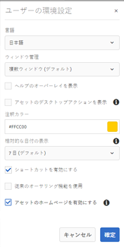
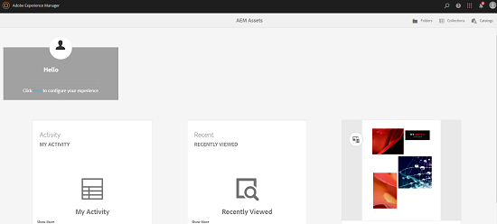

# AEM Assets のホームページの使用 {#aem-assets-home-page-experience}

AEM Assets のホームページをカスタマイズして、アセットに関する最近のアクティビティのスナップショットを始め、有益なスタートアップスクリーンエクスペリエンスを実現できます。

Adobe Experience Manager（AEM）Assets のホームページでは、最近のアクティビティのスナップショット（最近表示またはアップロードされたアセットなど）を始め、カスタマイズした有益なスタートアップスクリーンエクスペリエンスを実現できます。

Assets のホームページは、デフォルトでは無効になっています。ホームページを有効にするには、次の手順を実行します。

1. AEM Configuration Managerにアクセスするには、**[!UICONTROL ツール/操作/Webコンソール]**&#x200B;をクリックします。
1. **Day CQ DAM Event Recorder**&#x200B;サービスを開きます。
1. 「**[!UICONTROL このサービスを有効にする]**」を選択して、アクティビティの記録を有効にします。

   

1. 「**イベントタイプ**」リストから、記録するイベントを選択し、変更を保存します。

   >[!CAUTION]
   >
   >「Asset viewed」、「Projects viewed」、「Collections viewed」の各オプションを有効にすると、記録対象のイベント数が大幅に増加します。

1. Configuration Manager `https://[AEM_server]:[port]/system/console/configMgr`から&#x200B;**[!UICONTROL DAM Asset Home Page Feature Flag]**&#x200B;サービスを開きます。
1. **[!UICONTROL isEnabled.name]**&#x200B;オプションを選択して、アセットのホームページ機能を有効にします。 変更内容を保存します。

   

1. **[!UICONTROL ユーザーの環境設定]**&#x200B;ダイアログを開き、「**[!UICONTROL アセットのホームページを有効にする]**」を選択します。 変更内容を保存します。

   

アセットのホームページを有効にした後、ナビゲーションページからAssetsユーザーインターフェイスに移動します。

「**[!UICONTROL ここをクリックして、エクスペリエンスリンク]**&#x200B;を設定します。」をタップまたはクリックして、ユーザー名、背景画像、プロファイル画像を追加します。

Assets のホームページには次のセクションが含まれます。

* 「ようこそ」セクション
* 「ウィジェット」セクション

**「ようこそ」セクション**

ユーザーのプロファイルが存在する場合、「ようこそ」セクションには、そのユーザー向けのようこそメッセージが表示されます。さらに、プロフィール画像とようこそ画像（既に設定されている場合）が表示されます。

ユーザーのプロファイル設定が完了していない場合、「ようこそ」セクションには、一般的なようこそメッセージとプロファイル写真用のプレースホルダーが表示されます。

**「ウィジェット」セクション**

このセクションは「ようこそ」セクションの下にあり、既製ウィジェットが次のセクションに表示されます。

* アクティビティ
* 最近の表示
* 最新情報

**アクティビティ**:このセクションの下で、 **マイアクティビティウィジェッ** トには、アセットのアップロード、ダウンロード、アセットの作成、編集、コメント、注釈、共有など、アセット（レンディションのないアセットを含む）を持つログインユーザーが実行した最近のアクティビティが表示されます。

**最近の**:このセクシ **ョ** ンの最近表示されたウィジェットには、フォルダー、コレクション、プロジェクトなど、ログインユーザーが最近アクセスしたエンティティが表示されます。

**検出**:このセク **** ションの新しいウィジェットには、AEM Assetsインスタンスに最近アップロードされたアセットとレンディションが表示されます。

ユーザーアクティビティデータのパージを有効にするには、Configuration Managerから&#x200B;**DAM Event Purge Service**&#x200B;を有効にします。 このサービスを有効にすると、ログインユーザーのアクティビティのうち指定した数を超えたものがシステムによって削除されます。

ようこそ画面には、フォルダー、コレクション、カタログにアクセスするためのツールバー上のアイコンなど、簡単に操作するための機能が含まれています。

>[!NOTE]
>
>Day CQ DAM Event RecorderおよびDAM Event Purgeサービスを有効にすると、JCRへの書き込み操作と検索インデックス作成操作が増加し、AEMサーバーの負荷が大幅に増加します。 AEM サーバーの負荷が増えるとパフォーマンスに影響が出ることがあります。

>[!CAUTION]
>
>Assets のホームページで必要なユーザーアクティビティのキャプチャ、フィルタリングおよびパージをおこなうと、パフォーマンスのオーバーヘッドが発生します。そのため、管理者はターゲットユーザーのためにホームページを効果的に設定する必要があります。
>
>一括操作を実行する管理者およびユーザーは、ユーザーアクティビティが増えるのを避けるため、Asset のホームページ機能を使用しないことをお勧めします。また、管理者は、設定マネージャーで「**Day CQ DAM Event Recorder**」を設定することで、特定のユーザーの記録アクティビティを除外することができます。
>
>この機能を使用する場合は、サーバー負荷を考慮してパージの頻度を計画することをお勧めします。
