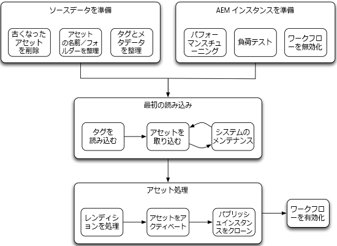

# アセット移行ガイド {#assets-migration-guide}

アセットを AEM に移行する際には、いくつかの手順を考慮する必要があります。現在のホームからアセットやメタデータを抽出する方法は、実装によって大きく異なるので、このドキュメントの範囲外です。 このドキュメントでは、これらのアセットをAEMに取り込み、メタデータを適用し、レンディションを生成し、アセットをアクティブ化または公開する方法について説明します。

## 前提条件 {#prerequisites}

以下に示す手順を実行する前に、[Assetsパフォーマンスチューニングのヒント](performance-tuning-guidelines.md)のガイダンスを確認し、実装してください。 最大同時ジョブ数の設定など、多くの手順で、負荷時のサーバーの安定性とパフォーマンスが向上します。 ファイルデータストアの設定など、その他の手順は、システムにアセットが読み込まれた後は実行するのが困難です。

>[!NOTE]
>
>次のアセット移行ツールは、Adobe Experience Managerには含まれていません。 Adobeカスタマーケアは、これらのツールをサポートしていません。
>
>* ACS [!DNL Experience Manager]ツールタグメーカー
>* ACS [!DNL Experience Manager]ツールのCSVアセットインポーター
>* ACS Commons の Bulk Workflow Manager
>* ACS Commons の Fast Action Manager
>* 合成ワークフロー

>
>このソフトウェアはオープンソースで、[Apache v2 License](https://adobe-consulting-services.github.io/pages/license.html) が適用されます。質問や問題を報告するには、それぞれ [ [!DNL Experience Manager] ACS ツール](https://github.com/Adobe-Consulting-Services/acs-aem-commons/issues)と [ [!DNL Experience Manager] ACS Commons に関する GitHub の問題](https://github.com/Adobe-Consulting-Services/acs-aem-tools/issues)を利用してください。

## [!DNL Experience Manager]に移行 {#migrate-to-aem}

[!DNL Experience Manager]へのアセットの移行にはいくつかの手順が必要で、段階的なプロセスと見なす必要があります。 移行のフェーズは次のとおりです。

1. ワークフローを無効化する。
1. タグを読み込む。
1. アセットを取り込む。
1. レンディションを処理する。
1. アセットをアクティベートする。
1. ワークフローを有効化する。

### ワークフローの無効化 {#disable-workflows}

移行を開始する前に、`DAM Update Asset`ワークフローのランチャーを無効にします。 すべてのアセットをシステムに取り込んでから、ワークフローをバッチで実行することをお勧めします。 移行がおこなわれている間に既に実行済みの場合は、これらのアクティビティを非稼働時間帯に実行するようにスケジュールできます。

### タグの読み込み {#load-tags}

画像に適用するタグ分類は既に用意されていることがあります。CSVアセットインポーターやメタデータプロファイル機能などのツールは、アセットへのタグの適用を自動化するのに役立ちます。 その前に、「Experience Manager」にタグを追加します。 [ [!DNL Experience Manager] ACS ツールの Tag Maker](https://adobe-consulting-services.github.io/acs-aem-tools/features/tag-maker/index.html) 機能を使用すると、システムに読み込まれた Microsoft Excel のスプレッドシートを使用してタグを入力できます。

### アセットの取り込み {#ingest-assets}

アセットをシステムに取り込む際に重要なのは、パフォーマンスと安定性です。多数のデータをExperience Managerに読み込む場合は、システムのパフォーマンスが良好であることを確認します。 これにより、データの追加に要する時間が最小限に抑えられ、システムの過負荷を防ぐのに役立ちます。 これは、特に実稼動中のシステムでのシステムクラッシュを防ぐのに役立ちます。

システムにアセットを読み込むには、HTTP を使用したプッシュベースのアプローチと JCR の API を使用したプルベースのアプローチがあります。

#### HTTP 経由によるプッシュ {#push-through-http}

アドビの Managed Services チームは Glutton というツールを使用してお客様の環境にデータを読み込みます。Gluttonは、[!DNL Experience Manager]インスタンス上のあるディレクトリから別のディレクトリにすべてのアセットを読み込む小さなJavaアプリケーションです。 Glutton の代わりに、Perl スクリプトなどのツールを使用してアセットをリポジトリに投稿することもできます。

HTTPS を通じたプッシュのアプローチには、主に次の 2 つの欠点があります。

1. アセットをHTTP経由でサーバーに送信します。 これには大量のオーバーヘッドが発生し、時間もかかるので、移行に要する時間が長くなります。
1. アセットに適用する必要があるタグやカスタムメタデータがある場合、このアプローチでは、アセットを取り込んだ後にこのメタデータを適用するという、2 段階のカスタムプロセスを実行する必要がある。

アセットを取り込むもう一方のアプローチでは、ローカルファイルシステムからアセットを引っ張ってきます。ただし、プルベースのアプローチを実行する外部ドライブやネットワーク共有がサーバーにマウントされていない場合は、HTTP を通じたアセットの投稿が最適なオプションです。

#### ローカルファイルシステムからのプル {#pull-from-the-local-file-system}

[ACS [!DNL Experience Manager] ツールのCSV Asset Importer](https://adobe-consulting-services.github.io/acs-aem-tools/features/csv-asset-importer/index.html)は、アセットをファイルシステムから、アセットメタデータをアセット読み込みのCSVファイルから、それぞれ取り込みます。 [!DNL Experience Manager] Asset Manager APIは、アセットをシステムに読み込み、設定済みのメタデータプロパティを適用するために使用されます。 アセットはネットワークファイルマウントまたは外部ドライブを介してサーバーにマウントされているのが理想です。

アセットがネットワークを介して送信されない場合、全体的なパフォーマンスが大幅に向上します。 この方法は、通常、リポジトリにアセットを読み込む最も効率的な方法です。 さらに、ツールがメタデータの取り込みをサポートしているので、すべてのアセットとメタデータを1つの手順で読み込むことができます。 別のツールを使用するなど、メタデータを適用するための他の手順は必要ありません。

### レンディションの処理 {#process-renditions}

アセットをシステムに読み込んだ後、メタデータを抽出してレンディションを生成するには、DAM アセットの更新ワークフローを通じてアセットを処理する必要があります。この手順を実行する前に、DAM アセットの更新ワークフローをニーズに合わせて複製および変更する必要があります。Dynamic Media Classic PTIFFの生成やInDesignサーバーの統合など、デフォルトワークフローの一部の手順が必要でない場合があります。

必要に応じてワークフローを設定したら、次の2つの方法でワークフローを実行できます。

1. 最も簡単なアプローチは、[ACS Commons の Bulk Workflow Manager](https://adobe-consulting-services.github.io/acs-aem-commons/features/bulk-workflow-manager.html) です。このツールを使用すると、クエリを実行し、クエリの結果をワークフローを通じて処理します。バッチサイズを設定するオプションも用意されています。
1. [ACS Commons の Fast Action Manager](https://adobe-consulting-services.github.io/acs-aem-commons/features/fast-action-manager.html) は[合成ワークフロー](https://adobe-consulting-services.github.io/acs-aem-commons/features/synthetic-workflow.html)と組み合わせて使用できます。このアプローチはより複雑ですが、サーバーリソースの使用を最適化しながら、[!DNL Experience Manager]ワークフローエンジンのオーバーヘッドを削除できます。 さらに、Fast Action Manager はサーバーリソースを動的に監視し、システムに配置された読み込みをスロットリングすることでパフォーマンスを大幅に向上します。サンプルスクリプトは ACS Commons の機能ページに記載されています。

### アセットのアクティベート {#activate-assets}

パブリッシュ層のあるデプロイメントでは、アセットをパブリッシュファームにアクティベートする必要があります。アドビは 1 つ以上のパブリッシュインスタンスを実行することを推奨していますが、すべてのアセットを 1 つのパブリッシュインスタンスにレプリケートして、そのインスタンスをクローンする方法が最も効率的です。多数のアセットをアクティベートするときは、ツリーのアクティベートを実行した後に、干渉する必要が生じる場合があります。理由は次のとおりです。アクティベーションを実行すると、項目がSlingジョブ/イベントキューに追加されます。 このキューのサイズがだいたい 40,000 項目を超えると、処理速度が劇的に低下します。このキューのサイズが 100,000 項目を超えると、システムの安定性に影響を及ぼします。

この問題を回避するには、[Fast Action Manager](https://adobe-consulting-services.github.io/acs-aem-commons/features/fast-action-manager.html) を使用してアセットのレプリケートを管理します。これは Sling キューを使用することなく動作し、オーバーヘッドを減らすほか、ワークロードをスロットルしてサーバーのオーバーロードを防ぎます。レプリケーションの管理に FAM を使用する例は、この機能のドキュメントページに記載しています。

アセットをパブリッシュファームに移行するその他のオプションは、[vlt-rcp](https://jackrabbit.apache.org/filevault/rcp.html) または [oak-run](https://github.com/apache/jackrabbit-oak/tree/trunk/oak-run) を使用する方法です。これらは Jackrabbit の一部のツールとして提供されます。[Grabbit](https://github.com/TWCable/grabbit)と呼ばれる、[!DNL Experience Manager]インフラストラクチャのオープンソースツールを使用する方法もあります。vitよりも高いパフォーマンスを発揮すると言われています。

これらのアプローチで注意すべき点は、オーサーインスタンス上でアセットがアクティベートされていると表示されないことです。アセットのアクティベート状態を正しくフラグ設定するには、アセットをアクティベート済みとマークする別のスクリプトも実行する必要があります。

>[!NOTE]
>
>アドビは Grabbit を管理およびサポートしません。

### 公開のクローン {#clone-publish}

アセットがアクティベートされたら、パブリッシュインスタンスをクローンしてデプロイメントに必要なコピーを必要な分だけ作成できます。サーバーのクローンは比較的簡単ですが、いくつか重要な手順があります。パブリッシュをクローンするには：

1. ソースインスタンスとデータストアをバックアップします。
1. インスタンスとデータストアのバックアップを対象の場所に復元します。続く手順はすべてこの新しいインスタンスを参照します。
1. `crx-quickstart/launchpad/felix`で`sling.id`のファイルシステム検索を実行します。 このファイルを削除します。
1. データストアのルートパスで、`repository-XXX` ファイルを探してすべて削除します。
1. `crx-quickstart/install/org.apache.jackrabbit.oak.plugins.blob.datastore.FileDataStore.config` と `crx-quickstart/launchpad/config/org/apache/jackrabbit/oak/plugins/blob/datastore/FileDataStore.config` を編集し、新しい環境のデータストアの場所を指すようにします。
1. 環境を開始します。
1. オーサー環境にあるすべてのレプリケーションエージェントが正しいパブリッシュインスタンスを指す、または新しいインスタンスの Dispatcher のフラッシュエージェントが新しい環境の正しい Dispatcher を参照するように設定を更新します。

### ワークフローの有効化 {#enable-workflows}

移行が完了したら、レンディションの生成とメタデータの抽出をサポートするように DAM の更新アセットワークフローのランチャーを再度有効化し、稼動中のシステムが日常的に使用できるようにします。

## [!DNL Experience Manager]デプロイメント間でのアセットの移行 {#migrate-between-aem-instances}

ごく一般的ではありませんが、1つの[!DNL Experience Manager]インスタンスから別のインスタンスに大量のデータを移行する必要が生じる場合があります。例えば、[!DNL Experience Manager]アップグレードを実行する場合、ハードウェアをアップグレードする場合、またはAMS移行を使用する場合など、新しいデータセンターに移行する場合などです。

このケースでは、移行するアセットには既にメタデータが入力されており、レンディションは既に生成されています。インスタンス間の移動に集中することができます。[!DNL Experience Manager]インスタンス間で移行する場合は、次の手順を実行します。

1. ワークフローを無効にする：アセットと共にレンディションを移行するので、DAMアセットの更新のワークフローランチャーを無効にする必要があります。

1. タグの移行：ソース[!DNL Experience Manager]インスタンスに既にタグが読み込まれているので、それらをコンテンツパッケージにビルドして、ターゲットインスタンスにパッケージをインストールできます。

1. アセットの移行：1つの[!DNL Experience Manager]インスタンスから別のインスタンスにアセットを移動する場合に推奨されるツールは2つあります。

   * **Vaultリモートコピー**( `vlt rcp`)を使用すると、ネットワーク全体でvltを使用できます。移動元と移動先のディレクトリを指定すると、vit がすべてのリポジトリデータを一方のインスタンスからダウンロードし、もう一方に読み込みます。vt rcp については、[https://jackrabbit.apache.org/filevault/rcp.html](https://jackrabbit.apache.org/filevault/rcp.html) に記載されています。
   * **Grabbit**[!DNL Experience Manager]。Time Warner Cable が の実装のために開発した、オープンソースのコンテンツ同期ツールです。継続的なデータストリームを使用するので、vlt rcp と比較して待ち時間が少なく、vlt rcp の 2 倍から 10 倍高速であると言われています。また、Grabbit はデルタコンテンツのみの同期をサポートし、最初の移行パスが完了した後に加えられた変更を同期できます。

1. アセットのアクティベート：AEMへの最初の移行については、[アセット](#activate-assets)のアクティベートの手順に従って進めてください。

1. 公開のクローン：新しい移行と同様に、1つのパブリッシュインスタンスを読み込み、クローンを作成する方が、両方のノードでコンテンツをアクティブ化するよりも効率的です。 [パブリッシュインスタンスのクローン](#clone-publish)を参照してください。

1. ワークフローの有効化：移行が完了したら、レンディションの生成とメタデータの抽出をサポートするようにDAMアセットの更新ワークフローのランチャーを再度有効にして、稼動中のシステムが日常的に使用できるようにします。
