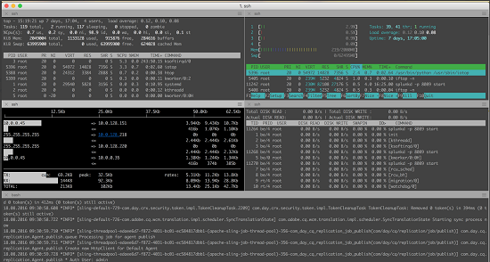

#  Assets の監視に関するベストプラクティスについて説明しています。 {#assets-monitoring-best-practices}

Adobe Experience Manager Assets の観点から見ると、監視には、次のプロセスおよびテクノロジーの観察とレポートを含める必要があります。

* システム CPU
* システムメモリ使用量
* システムディスク IO と IO の待機時間
* システムネットワーク IO
* JMX MBeans の対象：

   * ヒープ使用率
   * ワークフローなどの非同期プロセス

* OSGi コンソールヘルスチェック

通常、[!DNL Assets] の監視には、ライブ監視と長期的監視の 2 種類があります。

## ライブ監視 {#live-monitoring}

開発環境のパフォーマンステストフェーズ中または高負荷の状況でライブ監視を実行して、環境のパフォーマンス特性を把握する必要があります。 通常、ライブ監視は、一連のツールを使用して実行する必要があります。 次に推奨事項を示します。

* [Visual VM](https://visualvm.github.io/)：Visual VM を使用すると、CPU 使用率や、Java によるメモリ使用量などの詳細な Java VM 情報を表示できます。また、インスタンス上で実行されるコードのサンプリングや評価も可能です。
* [上](https://man7.org/linux/man-pages/man1/top.1.html):Top は、CPU、メモリ、I/O 使用量などの使用状況の統計を表示するダッシュボードを開く Linux コマンドです。 インスタンスで発生している処理の概要を示します。
* [Htop](https://hisham.hm/htop/):Htop は、インタラクティブなプロセスビューアです。 Top が提供する機能に加えて、CPU とメモリの使用量が詳細に表示されます。 Htop は、`yum install htop` または `apt-get install htop` を使用してほとんどの Linux システムにインストールできます。

* [Iotop](https://guichaz.free.fr/iotop/):Iotop は、ディスク I/O 使用量の詳細なダッシュボードです。 ディスク IO を使用するプロセス、およびそのプロセスによる使用量を示すバーやメーターが表示されます。Iotop は、`yum install iotop` または `apt-get install iotop` を使用してほとんどの Linux システムにインストールできます。

* [Iftop](https://www.ex-parrot.com/pdw/iftop/):Iftop は、イーサネット/ネットワーク使用状況に関する詳細情報を表示します。 Iftop は、イーサネットを使用するエンティティと、使用する帯域幅の量に関する通信チャネルごとの統計を表示します。 Iftop は、`yum install iftop` または `apt-get install iftop` を使用してほとんどの Linux システムにインストールできます。

* Java Flight Recorder（JFR）：非実稼動環境で自由に使用できる、Oracle の市販ツールです。詳しくは、[Java Flight Recorder を使用した CQ ランタイムの問題の診断方法](https://cq-ops.tumblr.com/post/73865704329/how-to-use-java-flight-recorder-to-diagnose-cq)を参照してください。
* [!DNL Experience Manager] error.log ファイル：以下を調べることができます。 [!DNL Experience Manager] error.log ファイルを参照してください。 コマンドを使用する `tail -F quickstart/logs/error.log` 調査する必要があるエラーを特定する。
* [ワークフローコンソール](../sites-administering/workflows.md)：ワークフローコンソールを使用して、遅れているワークフローや、停止しているワークフローを監視できます。

通常は、これらのツールを一緒に使用して、 [!DNL Experience Manager] インスタンス。

>[!NOTE]
>
>これらのツールは標準のツールで、Adobeで直接サポートされていません。 追加のライセンスは必要ありません。

 

## 長期的な監視 {#long-term-monitoring}

の長期監視 [!DNL Experience Manager] インスタンスは、ライブで監視されるのと同じ部分を、より長い期間監視する必要があります。 また、環境に固有のアラートの定義も含まれます。

### ログの集計とレポート {#log-aggregation-and-reporting}

ログを集計するツールはいくつかあります。例えば、Splunk(TM) や Elastic Search/Logstash/Kabana(ELK) などです。 の稼動時間を評価するには [!DNL Experience Manager] 例えば、システムに固有のログイベントを理解し、それに基づいてアラートを作成することが重要です。 開発および運用手法をよく理解しておくと、ログ集約プロセスを適切に調整して、重要なアラートを生成するのに役立ちます。

### 環境の監視 {#environment-monitoring}

環境の監視には、次の監視が含まれます。

* ネットワークスループット
* ディスク IO
* メモリ
* CPU 使用率
* JMX MBeans
* 外部 Web サイト

各項目を監視するには、NewRelic(TM) や AppDynamics(TM) などの外部ツールが必要です。 これらのツールを使用して、システムの使用率が高い、ワークフローのバックアップ、ヘルスチェックの失敗、Web サイトへの未認証アクセスなど、システムに固有のアラートを定義できます。 Adobeは、他のユーザーよりも特定のツールを推奨しません。 ユーザーに適したツールを見つけ、それを活用して、説明した項目を監視します。

#### 内部アプリケーションの監視 {#internal-application-monitoring}

内部アプリケーション監視には、JVM などの [!DNL Experience Manager] スタックを構成するアプリケーションコンポーネントの監視、コンテンツリポジトリの監視、およびプラットフォーム上に構築されたカスタムアプリケーションコードによる監視が含まれます。一般に、SolarWinds(TM)、HP OpenView(TM)、Hyperic(TM)、Zabbix(TM) など、多くの一般的な監視ソリューションで直接監視できる JMX Mbeans を通じて実行されます。 JMX への直接接続をサポートしていないシステムの場合は、シェルスクリプトを記述して JMX データを抽出し、ネイティブに理解できる形式でこれらのシステムに公開できます。

JMX MBean へのリモートアクセスは、デフォルトで無効になっています。JMX を通した監視について詳しくは、[JMX テクノロジを使用した監視と管理](https://docs.oracle.com/javase/7/docs/technotes/guides/management/agent.html)を参照してください。

多くの場合、統計を効果的に監視するには、ベースラインが必要です。 ベースラインを作成するには、システムを所定の期間通常の稼働状態で観察し、その後、標準指標を特定します。

**JVM 監視**

他の Java ベースのアプリケーションスタックと同様に、[!DNL Experience Manager] は基盤となる Java Virtual Machine から提供されたリソースを利用します。JVM によって公開される Platform MXBean を使用して、これらのリソースの多くの状態を監視できます。 MXBean について詳しくは、 [Platform MBean サーバーと Platform MXBean の使用](https://docs.oracle.com/javase/7/docs/technotes/guides/management/mxbeans.html).

JVM で監視できるベースラインパラメーターをいくつか示します。

メモリ

* `MBean: lava.lang:type=Memory`
* URL：*/system/console/jmx/java.lang:type=Memory*
* インスタンス：すべてのサーバ
* アラームしきい値：ヒープまたは非ヒープメモリの使用率が、対応する最大メモリの 75%を超えた場合。
* アラーム定義：システムメモリが不足しているか、コードにメモリリークがあります。 スレッドダンプを分析して定義に到達します。

**注意**:この Bean が提供する情報は、バイト単位で表されます。

スレッド

* MBean：`java.lang:type=Threading`
* URL：*/system/console/jmx/java.lang:type=Threading*
* インスタンス：すべてのサーバ
* アラームしきい値：スレッド数がベースラインの 150%を超える場合。
* アラーム定義：アクティブな暴走プロセスがあるか、非効率な操作が大量のリソースを消費しています。 スレッドダンプを分析して定義に到達します。

**[!DNL Experience Manager]監視**

また、[!DNL Experience Manager] は、JMX を通して一連の統計情報および操作を公開しています。これにより、システムヘルスを評価し、ユーザーに影響を与える前に問題を特定できます。詳しくは、[!DNL Experience Manager] JMX MBean の[ドキュメント](/help/sites-administering/jmx-console.md)を参照してください。

[!DNL Experience Manager] で監視できるベースラインパラメーターをいくつか示します。

レプリケーションエージェント

* MBean：`com.adobe.granite.replication:type=agent,id=”<AGENT_NAME>”`
* URL：*/system/console/jmx/com.adobe.granite.replication:type=agent,id=&quot;&lt;agent_name>&quot;*
* インスタンス：1 つのオーサーインスタンスおよびすべてのパブリッシュインスタンス（フラッシュエージェント）
* アラームしきい値：次の値を `QueueBlocked` が true の場合、または `QueueNumEntries` がベースラインの 150%を超える場合にのみ有効です。

* アラーム定義：システム内にブロックされたキューが存在し、レプリケーションターゲットがダウンしているか、到達できないことを示す。 多くの場合、ネットワークまたはインフラストラクチャの問題により、過剰なエントリがキューに入れられ、システムのパフォーマンスに悪影響を与える可能性があります。

**注意**:MBean および URL パラメーターの場合、 `<AGENT_NAME>` を、監視するレプリケーションエージェントの名前で指定します。

セッションカウンター

* MBean：`org.apache.jackrabbit.oak:id=7,name="OakRepository Statistics",type="RepositoryStats"`
* URL: */system/console/jmx/org.apache.jackrabbit.oak:id=7,name=&quot;OakRepository Statistics&quot;,type*=&quot;RepositoryStats&quot;
* インスタンス：すべてのサーバ
* アラームしきい値：開いているセッションがベースラインを 50%以上超えた場合。
* アラーム定義：セッションはコードの一部で開くことができ、閉じることはできません。 この問題は時間の経過と共にゆっくり発生し、最終的にシステムでメモリリークが発生する可能性があります。 システム上でセッション数が変動する場合は、継続的に増加しないでください。

ヘルスチェック

で使用可能なヘルスチェック [操作ダッシュボード](/help/sites-administering/operations-dashboard.md#health-reports) 対応する JMX MBean が監視用に用意されている。 ただし、カスタムヘルスチェックを記述して、追加のシステム統計を公開することができます。

監視に役立つ、あらかじめ用意されているヘルスチェックを次に示します。

* システムチェック

   * MBean：`org.apache.sling.healthcheck:name=systemchecks,type=HealthCheck`
   * URL：*/system/console/jmx/org.apache.sling.healthcheck:name=systemchecks,type=HealthCheck*
   * インスタンス：1 人のオーサー、すべてのパブリッシュサーバー
   * アラームしきい値：ステータスが OK でない場合
   * アラーム定義：いずれかの指標のステータスは、WARN または CRITICAL です。 問題の原因について詳しくは、ログ属性を確認してください。

* レプリケーションキュー

   * MBean：`org.apache.sling.healthcheck:name=replicationQueue,type=HealthCheck`
   * URL：*/system/console/jmx/org.apache.sling.healthcheck:name=replicationQueue,type=HealthCheck*
   * インスタンス：1 人のオーサー、すべてのパブリッシュサーバー
   * アラームしきい値：ステータスが OK でない場合
   * アラーム定義：いずれかの指標のステータスは、WARN または CRITICAL です。 問題の原因となったキューについて詳しくは、ログ属性を確認してください。

* 応答パフォーマンス

   * MBean：`org.apache.sling.healthcheck:name=requestsStatus,type=HealthCheck`
   * URL：*/system/console/jmx/org.apache.sling.healthcheck:name=requestsStatus,type=HealthCheck*
   * インスタンス：すべてのサーバ
   * アラームの時間：ステータスが OK でない場合
   * アラーム定義：いずれかの指標のステータスは、WARN または CRITICAL のいずれかです。 問題の原因となったキューについて詳しくは、ログ属性を確認してください。

* クエリーパフォーマンス

   * MBean：`org.apache.sling.healthcheck:name=queriesStatus,type=HealthCheck`
   * URL：*/system/console/jmx/org.apache.sling.healthcheck:name= queriesStatus,type=HealthCheck*
   * インスタンス：1 人のオーサー、すべてのパブリッシュサーバー
   * アラームしきい値：ステータスが OK でない場合
   * アラーム定義：システム内で 1 つ以上のクエリの実行が遅くなっています。 問題の原因となったクエリについて詳しくは、ログ属性を確認してください。

* アクティブなバンドル

   * MBean:org.apache.sling.healthcheck:name=inactiveBundles,type=HealthCheck
   * URL: */system/console/jmx/org.apache.sling.healthcheck:name=inactiveBundles,type=HealthCheck*
   * インスタンス：すべてのサーバ
   * アラームしきい値：ステータスが OK でない場合
   * アラーム定義：システム上に非アクティブな OSGi バンドルまたは未解決の OSGi バンドルが存在する。 問題の原因となったバンドルについて詳しくは、ログ属性を確認してください。

* ログエラー

   * MBean：`org.apache.sling.healthcheck:name=logErrorHealthCheck,type=HealthCheck`
   * URL：*/system/console/jmx/org.apache.sling.healthcheck:name=logErrorHealthCheck,type=HealthCheck*
   * インスタンス：すべてのサーバ
   * アラームしきい値：ステータスが OK でない場合
   * アラーム定義：ログファイルにエラーがあります。 問題の原因について詳しくは、ログ属性を確認してください。

## 一般的な問題と解決策  {#common-issues-and-resolutions}

監視の過程で問題が発生した場合は、次に、 [!DNL Experience Manager] インスタンス：

* TarMK を使用している場合は、Tar 圧縮を頻繁に実行します。詳しくは、[リポジトリの保守](/help/sites-deploying/storage-elements-in-aem-6.md#maintaining-the-repository)を参照してください。
* `OutOfMemoryError` ログを確認します。詳しくは、[メモリの問題の分析](https://helpx.adobe.com/experience-manager/kb/AnalyzeMemoryProblems.html)を参照してください。
* ログで、インデックスが作成されていないクエリ、ツリートラバーサル、またはインデックストラバーサルへの参照がないかを確認します。 これらは、インデックスが作成されていないクエリや、インデックスが不適切なクエリを示します。 クエリとインデックス作成のパフォーマンスの最適化に関するベストプラクティスについては、 [クエリとインデックスに関するベストプラクティス](/help/sites-deploying/best-practices-for-queries-and-indexing.md).
* ワークフローコンソールを使用して、ワークフローが期待どおりに実行されることを確認します。 可能な場合は、複数のワークフローを 1 つのワークフローにまとめます。
* ライブ監視を再確認し、他にボトルネックがないか、または特定のリソースを大量に使用している箇所がないかを確認します。
* クライアントネットワークからの出力ポイントと、 [!DNL Experience Manager] インスタンスネットワーク（dispatcher を含む）。 多くの場合、これらはボトルネック領域です。 詳しくは、 [Assets のネットワークに関する考慮事項](assets-network-considerations.md).
* のサイズを大きくします [!DNL Experience Manager] サーバー。 サイズが不十分な可能性があります [!DNL Experience Manager] インスタンス。 アドビカスタマーサポートは、サーバーのサイズが適切かどうかを判断するお手伝いをします。
* `access.log` および `error.log` ファイルで、不具合の発生した時刻付近のエントリを調査します。カスタムコードの異常を示す可能性のあるパターンを探します。 監視するイベントのリストに追加します。
