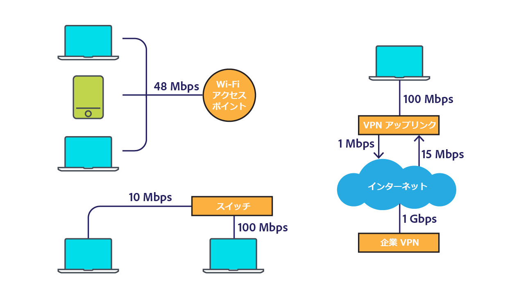
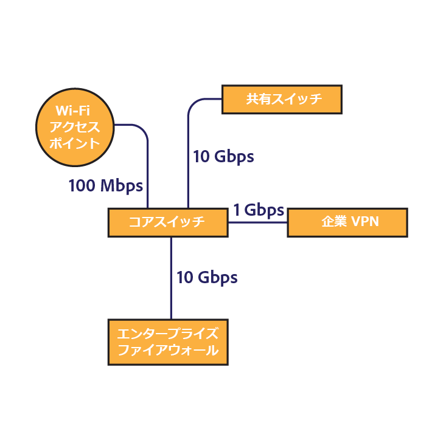
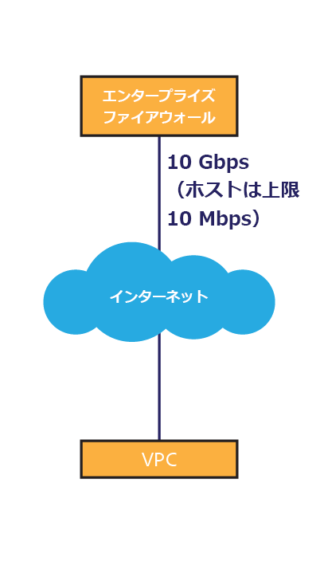
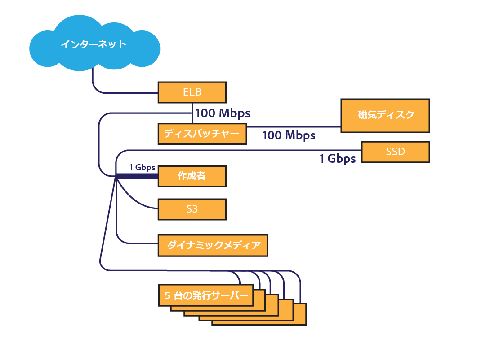
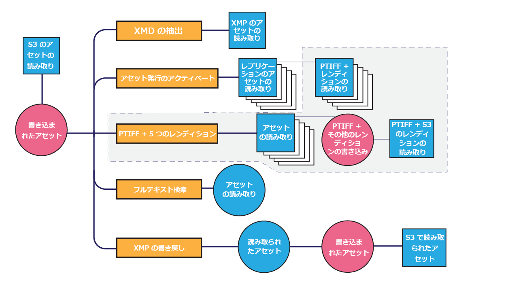

# Assets のネットワークに関する考慮事項 {#assets-network-considerations}

ネットワークを理解することは、Adobe Experience Manager Assetsを理解することと同じくらい重要です。 ネットワークはアップロード、ダウンロードおよびユーザーのエクスペリエンスに影響を与えることがあります。ネットワークトポロジを図解することで、ネットワークのパフォーマンスとユーザーエクスペリエンスの向上のために、ネットワーク上の渋滞地点や改善を要する部分を特定できます。

ネットワークの図には次の情報を含めてください。

* クライアントデバイス（コンピューター、モバイル、タブレットなど）からネットワークへの接続性
* 企業ネットワークのトポロジ
* 企業ネットワークと[!DNL Experience Manager]環境からインターネットへのアップリンク
* [!DNL Experience Manager]環境のトポロジ
* [!DNL Experience Manager]ネットワーク・インターフェイスの同時コンシューマを定義
* [!DNL Experience Manager]インスタンスの定義済みワークフロー

## クライアントデバイスからネットワークへの接続性 {#connectivity-from-the-client-device-to-the-corporate-network}

まず、個々のクライアントデバイスと企業ネットワークの接続性を図解します。この段階では、複数のユーザーが同じポイントにアクセスする、Wi-Fi 接続などの共有リソースや、アセットをアップロードおよびダウンロードするイーサネットスイッチを特定します。

クライアントデバイスは、共有 Wi-Fi、共有スイッチへのイーサネット、VPN など、様々な方法で企業ネットワークに接続します。このネットワークの渋滞地点を特定して理解することは、Assets の計画を立て、ネットワークを変更するうえで重要です。

この図の左上では、3 つのデバイスが 48 Mbps Wi-Fi アクセスポイントを共有しています。すべてのデバイスで同時にアップロードすると、Wi-Fi ネットワークの帯域幅がデバイス間で共有されます。システム全体として比較すると、ユーザーはこの分割されたチャネルを介する 3 つのクライアントにつき、異なる渋滞地点に直面する可能性があります。

低速なデバイスは同じアクセスポイントに接続する別のクライアントに影響を与えるので、Wi-Fi ネットワークの実際の速度を計測するのは困難です。アセットのやり取りに Wi-Fi を使用する場合は、複数のクライアントから同時に速度テストを実施してスループットを評価します。

図の左下には、2 つのデバイスが別個のチャネルを介して企業ネットワークに接続されています。このため、各デバイスは最低 10 Mbps および 100 Mbps の速度を利用できます。

右に表示されているコンピューターは VPN を介して企業ネットワークに接続されており、アップストリームの上限は 1 Mbps です。1 Mbps 接続と 1 Gbps 接続では、ユーザーエクスペリエンスは大幅に異なります。アセットのサイズによっては、そのタスクに対して VPN アップリンクが不十分になる可能性があります。

## 企業ネットワークのトポロジ {#topology-of-the-corporate-network}

図では、企業ネットワーク内で使用されているアップリンクの速度が、通常使用されるものよりも高速になっています。これらのパイプは共有リソースです。共有スイッチが処理するクライアント数が 50 と想定されている場合、ここが渋滞地点となる可能性があります。最初の図では、2 台のコンピューターのみがその特定の接続を共有しています。

## 企業ネットワークおよび[!DNL Experience Manager]環境からインターネットへのアップリンク {#uplink-to-the-internet-from-the-corporate-network-and-aem-environment}

インターネットや VPC 接続については、全体における帯域幅がピーク時の負荷やプロバイダーの大規模な停止により損なわれることがあるので、未知の要素を考慮に入れることが重要です。一般的に、インターネットの接続性は信頼できます。ただし、渋滞地点となることもあります。

企業ネットワークからインターネットへのアップリンクでは、他のサービスが帯域幅を使用している可能性があります。[!DNL Assets]に対して専用または優先付けが可能な帯域幅の量を理解することが重要です。 例えば、既に1Gbpsのリンクの80%が使用されている場合、[!DNL Experience Manager]アセットに割り当てる帯域幅の最大20%のみを割り当てることができます。

企業のファイアウォールやプロキシも様々な方法で帯域幅を形成します。この種類のデバイスは QoS（Quality of Service）、ユーザーごとの帯域幅制限またはホストごとのビットレート制限を使用して帯域幅を優先的に割り当てることができます。これらの渋滞地点は Assets のユーザーエクスペリエンスに多大な影響を及ぼすので、詳しく調査する必要があります。

この例では、企業には 10 Gbps のアップリンクがあります。複数のクライアントが使用するのに十分です。また、ファイアウォールはホストに 10 Mbps のレート制限を課しています。この制限は、インターネットのアップリンクが 10 Gbps であっても、単一のホストへのトラフィックを 10 Mbps にスロットルする可能性があります。

これはクライアント起因の最も混雑の激しい渋滞地点です。ただし、このファイアウォールが管理するネットワークオペレーショングループを使用して、変更または許可リストを評価できます。

このサンプル図より、6 台のデバイスが 10 Mbps の概念的なチャネルを共有していると結論付けることができます。使用しているアセットのサイズによっては、これではユーザーの期待に応えるには不十分である可能性があります。

## [!DNL Experience Manager]環境のトポロジ {#topology-of-the-aem-environment}

[!DNL Experience Manager]環境のトポロジを設計するには、システム構成と、ユーザー環境内でのネットワークの接続方法に関する詳細な知識が必要です。

このサンプルシナリオには、5 台のサーバーと 1 台の S3 バイナリストアで構成され、Dynamic Media が設定されたパブリッシュファームがあります。

Dispatcherは、100 Mbpsの接続を2つのエンティティ（外部と[!DNL Experience Manager]インスタンス）と共有します。 アップロードとダウンロードを同時に実行するには、この数を 2 で割る必要があります。接続された外部ストレージは別の接続を使用します。

[!DNL Experience Manager]インスタンスは、1Gbpsの接続を複数のサービスと共有します。 ネットワークトポロジの観点では、これは単一のチャネルを異なるサービスで共有することと同じです。

クライアントデバイスから[!DNL Experience Manager]インスタンスにネットワークを表示すると、最も小さな渋滞地点は10Mビットエンタープライズファイアウォールスロットルのようです。 [アセットのサイズ設定ガイド](assets-sizing-guide.md)のサイズ計算ツールでこれらの値を使用して、ユーザーエクスペリエンスを決定できます。

## [!DNL Experience Manager]インスタンスの定義済みワークフロー {#defined-workflows-of-the-aem-instance}

ネットワークのパフォーマンスを考慮する際には、システムで発生するワークフローや公開を考慮することが重要であることがあります。さらに、S3 などのネットワークに接続されたストレージや入出力のリクエストはネットワークの帯域幅を消費します。そのため、完全に最適化されたネットワークであっても、パフォーマンスはディスクの入出力によって制限されることがあります。

アセットの取り込み処理を効率化するには（特に大量のアセットをアップロードするとき）、アセットのワークフローを調べてその設定について詳しく理解します。

内部ワークフローのトポロジを評価する際には、次の内容を分析してください。

* アセットを書き込む手順
* アセットやメタデータが変更されたときに実行するワークフローやイベント
* アセットを読み取る手順

考慮すべき項目は次のとおりです。

* XMP メタデータの読み／書き戻し
* 自動アクティベートおよびレプリケート
* 透かし処理
* サブアセットの取り込み／ページの抽出
* ワークフローのオーバーラップ

アセットワークフローの定義に関するお客様の例は次のとおりです。

