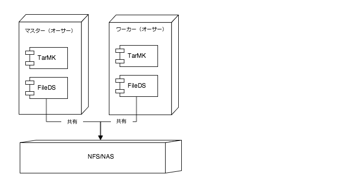

# Assets のオフロードのベストプラクティス {#assets-offloading-best-practices}

>[!WARNING]
>
>この機能はAEM 6.4以降では廃止され、AEM 6.5では削除されます。それに応じて計画を立ててください。

Adobe Experience Manager（AEM）Assets で大きなファイルを扱ったり、ワークフローを実行したりすると、CPU、メモリ、I/O リソースを大量に消費する場合があります。特に、アセットのサイズ、ワークフロー、ユーザー数、アセットの取り込み頻度が、システム全体のパフォーマンスに影響を与える可能性があります。最もリソースを消費する操作には、AEM アセットの取り込みやレプリケーションのワークフローがあります。単一の AEM オーサリングインスタンスでこれらのワークフローを頻繁に使用すると、オーサリングの効率に悪影響を与える可能性があります。

これらのタスクを専用のワーカーインスタンスにオフロードすると、CPU、メモリおよび IO のオーバーヘッドを低減できます。一般的に、オフロードは、大量に CPU／メモリ／IO リソースを消費するタスクを専用のワーカーインスタンスに分配するというアイデアが基礎になっています。以降の節では、Assets のオフロードの推奨される使用例について説明します。

## AEM Assets のオフロード {#aem-assets-offloading}

AEM Assets は、オフロードのためのネイティブなアセット固有のワークフロー拡張を実装しています。オフロードフレームワークが備える汎用的なワークフロー拡張を基礎とし、アセット固有の機能を追加で実装しています。Assets のオフロードの目標は、アップロードされたアセットに対する DAM アセットの更新ワークフローを効率的に実行することです。Assets のオフロードにより、取り込みワークフローをより詳細に制御できるようになります。

## AEM Assets のオフロードのコンポーネント {#aem-assets-offloading-components}

以下の図は、Assets のオフロードプロセスにおける主なコンポーネントを示しています。

### DAM アセットの更新のオフロードワークフロー {#dam-update-asset-offloading-workflow}

DAMのアセットの更新のオフロードワークフローは、ユーザーがアセットをアップロードするプライマリ（作成者）サーバー上で実行されます。 このワークフローは、通常のワークフローランチャーによって実行されます。このオフロードワークフローは、アップロードされたアセットを処理する代わりに、トピック *com/adobe/granite/workflow/offloading* を使用して新しいジョブを作成します。オフロードワークフローは、ジョブのペイロードに、ターゲットワークフローの名前（この場合は DAM アセットの更新ワークフロー）およびアセットのパスを追加します。オフロードジョブを作成した後、プライマリインスタンスのオフロードワークフローは、オフロードジョブの実行が完了するまで待機します。

### ジョブマネージャー {#job-manager}

ジョブマネージャーは、新しいジョブをワーカーインスタンスに分配します。分配のメカニズムを設計する場合、トピックのイネーブルメントについて考慮することが重要です。ジョブは、ジョブのトピックが有効になっているインスタンスにのみ割り当てることができます。プライマリでトピック `com/adobe/granite/workflow/offloading` を無効にし、ワーカーでこのトピックを有効にして、ジョブがワーカーに割り当てられるようにします。

### AEM のオフロード {#aem-offloading}

オフロードフレームワークは、ワーカーインスタンスに割り当てられたワークフローオフロードジョブを特定し、レプリケーションを使用して、それらを物理的にワーカーにトランスポートします（取り込む画像などのペイロードを含む）。

### ワークフローオフロードジョブコンシューマー  {#workflow-offloading-job-consumer}

ジョブがワーカーに書き込まれると、ジョブマネージャーは、*com/adobe/granite/workflow/offloading*&#x200B;トピックを担当するジョブコンシューマーを呼び出します。 その後、ジョブコンシューマーはアセットで DAM アセットの更新ワークフローを実行します。

## Sling トポロジ {#sling-topology}

Sling トポロジは、AEM インスタンスをグループ化し、基礎となる持続性とは独立して相互に認識できるようにします。Sling トポロジのこの特性により、非クラスター、クラスターおよび混合シナリオのトポロジを作成できます。インスタンスは、トポロジ全体にプロパティを公開できます。フレームワークは、トポロジの変更（インスタンスおよびプロパティ）をリスンするコールバックを提供します。Sling トポロジは、Sling 分配ジョブの基礎となります。

### Sling 分配ジョブ  {#sling-distributed-jobs}

Sling 分配ジョブにより、トポロジのメンバーである一連のインスタンス間でのジョブの分配が容易になります。Sling ジョブは、機能のアイデアに基づいています。ジョブは、ジョブトピックにより定義されます。ジョブを実行するには、インスタンスが特定のジョブトピックのジョブコンシューマーを提供している必要があります。ジョブトピックは、分配メカニズムの主な推進要素です。

ジョブは、トピックのジョブコンシューマーを提供しているインスタンスにのみ分配されます。インスタンスのジョブコンシューマーを有効／無効にすることで、インスタンスの機能を定義し、分配メカニズムを制御できます。インスタンスの利用可能なジョブコンシューマーは、トポロジ全体にブロードキャストされます。

この文脈での分配という用語は、ジョブコンシューマーを提供する特定のインスタンスへのジョブの割り当てを意味しています。インスタンスへの割り当ては、リポジトリに保管されます。つまり、Sling 分配ジョブは、デフォルトで、トポロジ内の任意のインスタンスに割り当てることができます。ただし、他のジョブは、同じリポジトリを共有するインスタンスによってのみ実行できます。これは、これらのジョブは、同じクラスターの一部であるインスタンスによってのみ実行できることを意味しています。異なるクラスターのインスタンスに割り当てられたジョブは実行されません。

### Granite オフロードフレームワーク  {#granite-offloading-framework}

Granite オフロードフレームワークは、Sling ジョブ分配を補完するもので、非クラスターインスタンスに割り当てられたジョブを実行します。分配（インスタンスの割り当て）はおこないません。ただし、非クラスターインスタンスに分配された Sling ジョブを特定し、それらを実行のためのターゲットインスタンスにトランスポートします。現在、オフロードでは、レプリケーションを使用してこのジョブのトランスポートを実行します。ジョブを実行するために、オフロードでは入力と出力が定義され、それらがジョブと組み合わされて、ジョブのペイロードが構築されます。

Sling 分配ジョブは、ジョブおよび分配のフレームワークを提供します。Granite オフロードは、ジョブが非クラスターインスタンスに分配される特別なケースのトランスポートのみをおこないます。

トランスポートに加えて、オフロードフレームワークは、ワークフローエンジンの拡張も提供します。これにより、フレームワークで、ワークフローの一環として分配ジョブを作成し、それらの完了を待機してから、ワークフローを先に進めることができます。これは、ワークフローエンジンのワークフロー外部ステップ API を使用して実装されています。拡張には、ワークフローの全体的な分配を支援するものもあります。単一ワークフローステップの分配はサポートされていません。

オフロードフレームワークには、トポロジ全体でのジョブトピックのイネーブルメントを可視化し、制御できるユーザーインターフェイス（UI）も備えられています。UI により、Sling 分配ジョブのトピックのイネーブルメントを効率的に設定できます。UI を使用せずにオフロードを設定することもできます。

## アセットのオフロードの一般的なガイダンスとベストプラクティス  {#general-guidance-and-best-practices-for-asset-offloading}

実装はそれぞれ異なるので、あらゆる場合に使用できるオフロード設定はありません。以降の項では、アセット取り込みのオフロードについてのガイダンスとベストプラクティスを示します。

アセットのオフロードは、操作のオーバーヘッドを含め、システムへのオーバーヘッドを発生させます。アセット取り込みの負荷で問題が発生した場合、まずは、オフロードなしで設定を見直すことをお勧めします。アセットのオフロードに進む前に、以下のオプションを検討してください。

* ハードウェアの拡張
* ワークフローの最適化
* 一時的なワークフローの使用
* ワークフローに使用するコア数の制限

Assets のオフロードが適切だと判断した場合は、以下のガイダンスに従います。

* TarMK ベースの導入を推奨します。
* TarMK ベースの Assets のオフロードは、広範な水平スケーリングには適していません。
* オーサーとワーカーとの間のネットワークのパフォーマンスが十分であることを確認します。

### 推奨される Assets のオフロードの導入  {#recommended-assets-offloading-deployment}

AEM および Oak を使用する場合、複数の導入シナリオが考えられます。Assets のオフロードでは、共有データストアを使用した TarMK ベースの導入を推奨します。以下の図は、推奨される導入の概要を示しています。

データストアの設定について詳しくは、[AEM でのノードストアとデータストアの設定](../sites-deploying/data-store-config.md)を参照してください。

### 自動エージェント管理の無効化 {#turning-off-automatic-agent-management}

自動エージェント管理はバイナリレスレプリケーションをサポートしておらず、新しいオフロードテクノロジを設定するときに混乱を生じさせる可能性があるので、無効にすることをお勧めします。さらに、バイナリレス・レプリケーションで必要とされる転送レプリケーション・フローも自動的にはサポートされません。

1. URL `http://localhost:4502/system/console/configMgr`からConfiguration Managerを開きます。
1. `OffloadingAgentManager` (`http://localhost:4502/system/console/configMgr/com.adobe.granite.offloading.impl.transporter.OffloadingAgentManager`)の設定を開きます。
1. 自動エージェント管理を無効にします。

### フォワードレプリケーションの使用  {#using-forward-replication}

オフロードトランスポートでは、デフォルトで、リバースレプリケーションを使用して、オフロードされたアセットをワーカーからプライマリにプルします。リバースレプリケーションエージェントでは、バイナリレスレプリケーションをサポートしていません。オフロードされたアセットをフォワードレプリケーションを使用してワーカーからプライマリにプッシュするようにオフロードを設定する必要があります。

1. 逆複製を使用してデフォルトの構成から移行する場合は、&amp;ast；を除き、プライマリおよびワーカー上の「 `offloading_outbox` 」および「 `offloading_reverse_*` 」という名前のすべてのエージェントを無効または削除します。は、ターゲットインスタンスのSling idを表します。
1. 各ワーカーで、プライマリを指す新しいフォワードレプリケーションエージェントを作成します。この手順は、プライマリからワーカーへの転送エージェントを作成するのと同じです。 オフロードするレプリケーションエージェントの設定手順については、[オフロード用のレプリケーションエージェントの作成](../sites-deploying/offloading.md#creating-replication-agents-for-offloading)を参照してください。
1. `OffloadingDefaultTransporter` (`http://localhost:4502/system/console/configMgr/com.adobe.granite.offloading.impl.transporter.OffloadingDefaultTransporter`)の構成を開きます。
1. プロパティ`default.transport.agent-to-master.prefix`の値を`offloading_reverse`から`offloading`に変更します。

<!-- TBD: Make updates to the configuration for allow and block list after product updates are done.
TBD: Update the property in the last step when GRANITE-30586 is fixed.
-->

### オーサーとワーカーの間での共有データストアおよびバイナリレスレプリケーションの使用  {#using-shared-datastore-and-binary-less-replication-between-author-and-workers}

アセットのオフロードの転送オーバーヘッドを削減するには、バイナリレスのレプリケーションの使用を推奨します。 共有データストアでバイナリレスレプリケーションを設定する方法については、[AEM でのノードストアとデータストアの設定](/help/sites-deploying/data-store-config.md)を参照してください。アセットのオフロードでは、他のレプリケーションエージェントが関係するという点を除いて手順は同じです。バイナリレス・レプリケーションは、フォワード・レプリケーション・エージェントでのみ機能するので、すべてのオフロード・エージェントに対してフォワード・レプリケーションを使用する必要があります。

### トランスポートパッケージの無効化 {#turning-off-transport-packages}

デフォルトで、オフロードにより、オフロードジョブおよびジョブのペイロード（元のアセット）を含むコンテンツパッケージが作成され、この単一のオフロードパッケージが単一のレプリケーションリクエストを使用してトランスポートされます。バイナリレスレプリケーションを使用する場合、パッケージを作成するときにバイナリが再度パッケージにシリアル化されるので、これらのオフロードパッケージを作成すると効率性が低下します。これらのトランスポートパッケージの使用はオフにできるので、オフロードジョブとペイロードは、各ペイロードエントリに対して1つずつ、複数のレプリケーション要求でトランスポートされます。 これにより、バイナリレスレプリケーションのメリットを活かすことができます。

1. [http://localhost:4502/system/console/configMgr/com.adobe.granite.offloading.impl.transporter.OffloadingDefaultTransporter](http://localhost:4502/system/console/configMgr/com.adobe.granite.offloading.impl.transporter.OffloadingDefaultTransporter)にある&#x200B;*OffloadingDefaultTransporter*&#x200B;コンポーネントのコンポーネント構成を開きます。
1. プロパティ&#x200B;*レプリケーションパッケージ(default.transport.contentpackage)*&#x200B;を無効にします。

### ワークフローモデルのトランスポートの無効化 {#disabling-the-transport-of-workflow-model}

デフォルトでは、*DAM Update Asset Offloading*&#x200B;オフロードワークフローは、ワーカー上で呼び出すワークフローモデルをジョブペイロードに追加します。 このワークフローは、デフォルトで、標準搭載された&#x200B;*DAM Update Asset*&#x200B;モデルに従うので、この追加のペイロードを削除できます。

ジョブのペイロードでワークフローモデルを無効にした場合は、パッケージマネージャーなどの他のツールを使用して、参照されているワークフローモデルにも変更を反映する必要があります。

ワークフローモデルのトランスポートを無効にするには、DAM アセットの更新のオフロードワークフローを変更します。

1. [http://localhost:4502/libs/cq/workflow/content/console.html](http://localhost:4502/libs/cq/workflow/content/console.html)からワークフローコンソールを開きます。
1. 「モデル」タブを開きます。
1. DAM Update Asset Offloadingワークフローモデルを開きます。
1. DAMワークフローのオフロード手順の手順のプロパティを開きます。
1. 「引数」タブを開き、「入力するモデル」追加および「出力するモデル追加」オプションの選択を解除します。
1. 変更内容をモデルに保存します。

### ポーリング間隔の最適化  {#optimizing-the-polling-interval}

ワークフローのオフロードは、プライマリの外部ワークフローを使用して実装されます。このワークフローは、ワーカーのオフロードされたワークフローの完了をポーリングします。 外部ワークフロープロセスのデフォルトのポーリング間隔は 5 秒です。プライマリでのオフロードのオーバーヘッドを軽減するために、Assets のオフロードステップのポーリング間隔は 15 秒以上に設定することをお勧めします。

1. [http://localhost:4502/libs/cq/workflow/content/console.html](http://localhost:4502/libs/cq/workflow/content/console.html)からワークフローコンソールを開きます。

1. 「モデル」タブを開きます。
1. DAM Update Asset Offloadingワークフローモデルを開きます。
1. DAMワークフローのオフロード手順の手順のプロパティを開きます。
1. 「コモンズ」タブを開き、期間プロパティの値を調整します。
1. 変更内容をモデルに保存します。

## 追加のリソース  {#more-resources}

このドキュメントは、Assets のオフロードに重点を置いて説明しています。以下に、オフロードについての追加ドキュメントを示します。

* [ジョブのオフロード](/help/sites-deploying/offloading.md)
* [アセットのワークフローオフローダー](/help/sites-administering/workflow-offloader.md)

