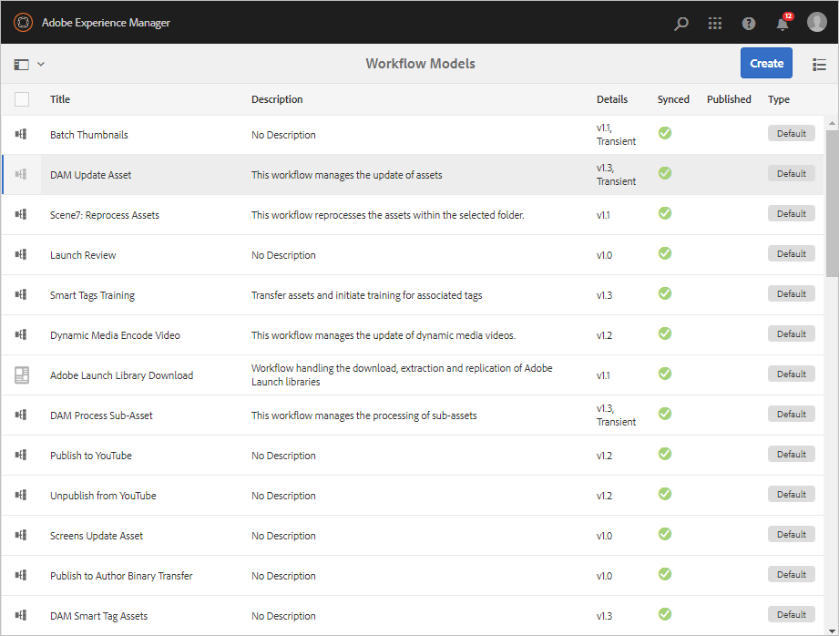

# デジタルアセットの処理 {#process-assets}

[!DNL Adobe Experience Manager Assets] では、様々な方法でデジタルアセットを操作し、堅牢なアセット処理を実現できます。利用可能な処理方法を使用したり、方法を拡張して、デジタルアセットの基本的な健全性、検出と配布を使用して、エンドツーエンドのビジネスプロセスを確実に完了させたりできます。 必要なスケールとカスタマイズを実現しながら、これらをすべて実行できます。

## ワークフローについて {#understand-workflows}

アセット処理では、[!DNL Experience Manager]はワークフローを使用します。 ワークフローは、ビジネスロジックやアクティビティの自動化に役立ちます。 特定のタスクを実行するための詳細な手順は、デフォルトで提供され、開発者は独自のカスタム手順を作成できます。 これらの手順を論理的な順序で組み合わせて、ワークフローを作成できます。 例えば、画像に埋め込まれたメタデータ、アップロード先のフォルダー、画像の解像度など、特定の条件に基づいて、アップロードされた画像に対して自動的に透かしを適用できます。 別の例として、画像にこのような透かしを設定し、メタデータの追加、レンディションの作成、アセット検出用のインテリジェントタグの追加、データストアへの公開、ユーザーアクセス権限の設定など、複数のアセット管理ニーズに同時に対処するワークフローがあります。

## Experience Managerで使用可能なデフォルトのワークフロー {#default-workflows}

デフォルトでは、アップロードされたすべてのアセットは、[!UICONTROL DAMアセットの更新]ワークフローを使用して処理されます。 ワークフローは、アップロードされたアセットごとに実行され、レンディションの生成、メタデータの書き戻し、ページの抽出、メディアの抽出、トランスコーディングなど、基本的なアセット管理タスクを実行します。

デフォルトで使用可能な様々なワークフローモデルを確認するには、[!DNL Experience Manager]の[!UICONTROL ツール/ワークフロー/モデル]を参照してください。

*図：で使用できるデフォルトのワークフローの一部で [!DNL Experience Manager]す。*

## アセットへのワークフローの適用 {#applying-workflows-to-assets}

ワークフローをデジタルアセットに適用する方法は、Web サイトページに適用する場合と同様です。ワークフローの作成および使用方法に関する完全なガイドについては、[ワークフローの開始](/help/sites-authoring/workflows-participating.md)を参照してください。

デジタルアセットでワークフローを使用して、アセットのアクティベートや透かしの作成などをおこないます。アセットのワークフローの多くは自動的にオンになります。例えば、画像の編集後にレンディションを自動的に作成するワークフローは、自動的にオンになります。

>[!NOTE]
>
>[!UICONTROL Request to Activate]や[!UICONTROL Request to Deactivate]など、クラシックUIで使用可能なワークフローがタッチ操作対応UIで使用できない場合は、[ワークフローモデルの作成](/help/sites-developing/workflows-models.md#make-workflow-models-available-in-touchui)を参照してください。

## AEM のアセットへのワークフローの適用 {#apply-a-workflow-to-an-aem-asset}

<!-- 
TBD: Add animated GIF for these steps instead of all these screenshots.
-->

ワークフローをアセットに適用するには、次の手順に従います。

1. ワークフローを開始するアセットの場所に移動し、アセットをクリックしてアセットページを開きます。

1. ワークフローを開始するアセットの場所に移動し、アセットをクリックしてアセットページを開きます。 メニューから「**[!UICONTROL タイムライン]**」を選択して、タイムラインを表示します。

   

1. 下部の「**[!UICONTROL アクション]**」をクリックして、アセットで使用可能なアクションのリストを開きます。

1. リストから「**[!UICONTROL ワークフローを開始]**」をクリックします。

1. **[!UICONTROL ワークフローを開始]**&#x200B;ダイアログボックスで、リストからワークフローモデルを選択します。

   

1. （オプション）ワークフローインスタンスを参照するために使用するワークフローのタイトルを指定します。

   

1. 「**[!UICONTROL 開始]**」をクリックし、ダイアログボックスで「**[!UICONTROL 続行]**」をクリックして確定します。 ワークフローの各ステップは、タイムラインにイベントとして表示されます。

   

## 複数のアセットへのワークフローの適用 {#applying-a-workflow-to-multiple-assets}

1. アセットコンソールから、ワークフローを開始するアセットの場所へ移動して、アセットを選択します。メニューから「**[!UICONTROL タイムライン]**」を選択して、タイムラインを表示します。

   

1. 下部の「**[!UICONTROL アクション]**」をクリックします。

1. 「**[!UICONTROL ワークフローを開始]**」をクリックします。**[!UICONTROL ワークフローを開始]**&#x200B;ダイアログで、リストからワークフローモデルを選択します。

   

1. （オプション）ワークフローインスタンスを参照するために使用するワークフローのタイトルを指定します。

1. ダイアログで「**[!UICONTROL 開始]**」をクリックし、次に「**[!UICONTROL 確認]**」をクリックします。選択したすべてのアセットでワークフローが実行されます。

## 複数のフォルダーへのワークフローの適用 {#applying-a-workflow-to-multiple-folders}

ワークフローを複数のフォルダーに適用する手順は、複数のアセットに適用する手順と似ています。アセットコンソールでフォルダーを選択し、[複数のアセット](assets-workflow.md#applying-a-workflow-to-multiple-assets)にワークフローを適用する手順2～7を実行します。

## コレクションへのワークフローの適用 {#applying-a-workflow-to-a-collection}

コレクションへのワークフローの適用について詳しくは、[コレクションへのワークフローの適用](managing-collections-touch-ui.md#running-a-workflow-on-a-collection)を参照してください。

## アセットを条件付きで処理するワークフローの自動開始 {#auto-execute-workflow-on-some-assets}

管理者は、事前に定義された条件に基づいてアセットを自動的に実行および処理するようにワークフローを設定できます。 この機能は、特定のフォルダーにカスタムワークフローを作成する場合など、事業部門のユーザーやマーケターに役立ちます。 例えば、代理店の撮影したすべてのアセットに透かしを付けたり、フリーランサーがアップロードしたすべてのアセットを処理して特定のレンディションを作成したりできます。

ワークフローモデルの場合、ユーザーはワークフローを実行するワークフローランチャーを作成できます。 ワークフローランチャーは、コンテンツリポジトリ内の変更を監視し、事前定義された条件が満たされた場合にワークフローを実行します。 管理者は、マーケターに対してワークフローの作成とランチャーの設定のアクセス権を付与できます。 ユーザーは、デフォルトの「[!UICONTROL DAMアセットの更新]」ワークフローを変更して、特定のアセットを処理するために必要な追加手順を追加できます。 ワークフローは、新しくアップロードされたすべてのアセットで実行されます。 特定のアセットに対する追加の手順の実行を制限するには、次のいずれかの方法を使用します。

* [!UICONTROL DAMアセットの更新]ワークフローのコピーを作成し、特定のフォルダー階層で実行されるように変更します。 この方法は、少数のフォルダーで役立ちます。
* 追加の処理手順は、必要な数のフォルダーに条件付きで適用できるように、 [OR split](/help/sites-developing/workflows-step-ref.md#or-split)を使用して追加できます。

## ベストプラクティスと制限事項 {#best-practices-limitations-tips}

* ワークフローを設計する際には、あらゆる種類のレンディションに対するニーズを考慮します。レンディションが今後必要になることが予測されない場合は、ワークフローからレンディションの作成ステップを削除します。以後、レンディションは一括削除できません。[!DNL Experience Manager] を長時間使用した後、不要なレンディションで大量のストレージ領域が占有される場合があります。個々のアセットについては、ユーザーインターフェイスからレンディションを手動で削除できます。複数のアセットについては、特定のレンディションを削除するように [!DNL Experience Manager] をカスタマイズすることもできますし、アセットを削除して再びアップロードすることもできます。
* デフォルトでは、 [!UICONTROL DAMアセットの更新]ワークフローには、サムネールとWebレンディションを作成する手順が含まれています。 デフォルトのレンディションがワークフローから削除された場合、[!DNL Assets]のユーザーインターフェイスが正しくレンダリングされません。

>[!MORELIKETHIS]
>
>* [ワークフローへの適用と参加](/help/sites-authoring/workflows.md)
* [ワークフローモデルの作成とワークフロー機能の拡張](/help/sites-developing/workflows.md)
* [ワークフローを実行する方法](/help/sites-administering/workflows-starting.md)
* [ワークフローのベストプラクティス](/help/sites-developing/workflows-best-practices.md)

