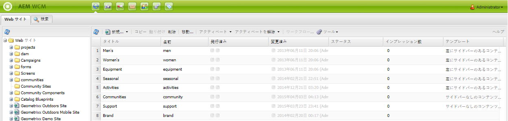
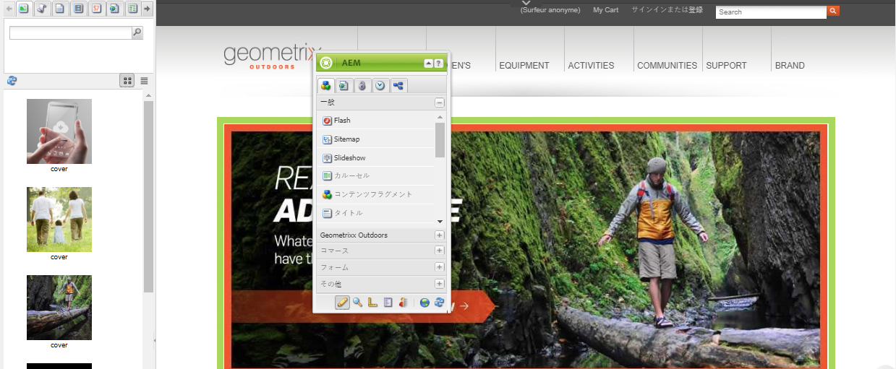

# について [!DNL Adobe Experience Manager Assets] as a DAM ソリューション {#about-assets}

[!DNL Assets] は、 [!DNL Experience Manager] プラットフォームを使用し、企業がデジタルアセットを管理および配布できるようにします。 組織全体のユーザーは、画像、ビデオ、ドキュメント、オーディオクリップ、3D ファイル、リッチメディアなど、Web 上、印刷、デジタル配信に使用する様々な種類のデジタルアセットの管理、保存、アクセスが可能です。

## Digital Asset Management とは {#what-is-digital-asset-management}

[!DNL Assets]AEM は、組織の主要なデジタルアセットを、企業全体で共有および配布する機能を提供します。組織のユーザーは、画像、グラフィック、オーディオ、ビデオおよびドキュメントなどのデジタルアセットを、Web インターフェイス（または CIFS や WebDAV フォルダー）を使用して格納、管理したり、これらのデジタルアセットにアクセスしたりできます。

[!DNL Assets] 能力 [!DNL Experience Manager] では、次の操作を実行できます。

* 様々なファイル形式の画像、ドキュメント、オーディオファイルおよびビデオファイルを追加および共有する。
* タグ、Lightbox、星（お気に入り）別にグループ化してアセットを管理します。 アセットに注釈を追加する。
* ファイル名、ドキュメントのフルテキスト、日付、ドキュメントタイプおよびタグに基づいてアセットを検索する。
* アセットのメタデータ情報を追加または編集する。メタデータは、関連するアセットと共に、自動的にバージョン管理されます。アセットのメタデータの読み込みまたは書き出しができます。
* 拡大縮小や画像フィルターの追加など、画像編集機能を実行する。WebDAV または CIFS フォルダーを使用して、複数のデジタルアセットを同時に読み込んだり、書き出したりする。
* ワークフローおよび通知を使用して、アセットのセットに関する結合処理とダウンロードを許可し、アセットへのアクセス権を管理する。

### [!DNL Experience Manager Assets] が [!DNL Experience Manager Sites] {#aem-assets-fully-integrated-in-cq-wcm}

[!DNL Assets] ～と完全に統合する [!DNL Sites] あらゆる用途にシームレスに対応します。 例えば、Web ページを作成する場合、 [!DNL Sites] 作成者は、コンテンツファインダーでデジタルアセットを検索して使用できます。 のユーザーインターフェイス [!DNL Assets] ～と同じである [!DNL Sites]. 詳しくは、 [サイトの概要](/help/sites-authoring/qg-page-authoring.md) 詳細はこちら。

<!-- TBD: Update image for branding 

 

Assets managed within [!DNL Experience Manager] DAM can then be accessed via the content finder of WCM:

 -->

### デジタルアセット管理と画像コンポーネントの比較 {#digital-asset-management-versus-image-component}

画像を DAM リポジトリに配置するか、画像コンポーネントを使用するかを決定する際は、画像のライフサイクルを考慮します。

* 画像がページと同じライフサイクルを持つ場合は、画像コンポーネントを使用します。
* 画像に別々のライフサイクルがある場合（例えば、画像を 2 回使用する場合や WCM の外部で使用する場合）は、 [!DNL Assets].

## デジタルアセットとは何か {#what-are-digital-assets}

アセットとは、複数のレンディションを持つことができ、サブアセット（Photoshop ファイルのレイヤー、PowerPoint ファイルのスライド、PDF のページ、ZIP 内のファイルなど）を持つことができるデジタルドキュメント、画像、ビデオ、オーディオ（またはその一部）です。

アセットは、基本的にバイナリ、メタデータ、レンディション、サブアセットを組み合わせたものです。詳しくは、[DAM パフォーマンスガイド](https://experienceleague.adobe.com/docs/experience-manager-64/assets/administer/performance-tuning-guidelines.html?lang=ja)を参照してください。

>[!CAUTION]
>
>大量のアセット（特に画像）のアップロードや編集は、 [!DNL Experience Manager] デプロイメント。

### [!DNL Experience Manager Assets] 用語 {#aem-assets-terminology}

でデジタルアセットを操作する場合 [!DNL Experience Manager]を使用する場合は、次の用語について理解する必要があります。

* **コレクション**:物理的な場所（フォルダー）、共通のプロパティ（保存済みの検索フォルダー）、ユーザー選択（Lightbox フォルダー）に基づく、アセットのコレクション。

* **メタデータ** [!DNL Assets] メタデータを持つ例えば、作成者、有効期限、DRM 情報 (Digital Rights Management) などです。 メタデータは、アクセスが制御されます。[!DNL Assets] では、追加設定なしに、次の共通の各種メタデータスキーマがサポートされます。

   * Dublin Core：作成者、説明、日付、件名などが含まれます。
   * IPTC：イベント、モデル、場所などが含まれます。
   * WCM :ページプロパティを含めます。 [!UICONTROL オンタイム] および [!UICONTROL オフタイム]など。

* **タグ付け**: [!DNL Assets] は、タグ付けおよび分類できます。 詳しくは、 [アセットの整理](/help/assets/organize-assets.md).

* **レンディション**:レンディションは、アセットのバイナリ表現です。 [!DNL Assets] 常に、アップロードされたファイルの主な表現を持ちます。 アセットは、例えば、カスタマイズされたワークフロー手順によって作成された、またはアセットがアップロードされた際に作成された、任意の数の追加の表現を持つことができます。レンディションには、様々なサイズや解像度のものがあります。また、透かしが追加されていたり、その他の変更された特徴を持つものもあります。

* **バージョン**:バージョン管理では、特定の時点でのデジタルアセットのスナップショットが作成されます。 これにより、以前のバージョンにアセットを復元できます。詳しくは、 [のバージョン管理 [!DNL Assets]](managing-assets-touch-ui.md#asset-versioning).

* **サブアセット**:サブアセットは、例えば [!DNL Adobe Photoshop] ファイルまたはPDFファイル内のページ。 In [!DNL Assets]サブアセットを管理する場合は、アセットと同様にサブアセットを管理できます。

### デジタルアセットの操作方法 {#how-to-work-with-assets}

アセットまたはコレクションに対してアクションを実行します。アクションでは、アセット、コレクションおよびレンディションを作成したり変更したりできます。アセットに対して実行する基本的なアクション ( アップロード、削除、更新、サブアセットの保存、トリガー事前設定済みワークフロー ) の多く。 これらは、で自動的にオンになります [!DNL Assets] 詳しくは、 [!DNL Assets] メディアハンドラー。

これらの事前設定済みワークフローで実行できるタスクは次のとおりです。

* アセットをリポジトリに保存するか、リポジトリからアセットを削除します。
* アセットのメタデータを抽出して保存する。個々のメタデータ項目はXMPとして保存されます。
* アセットのレンディションとサムネールの生成必要に応じて、自動サイズ変更や切り抜きを含めます。
* 必要に応じてアセットをトランスコードします。例えば、モバイルおよび Web での使用に関するビデオは、1 秒あたり 24 フレーム、1 秒あたり 30 フレームのビデオをダウンロードするようにトランスコードされます。モバイルおよび Web 使用用のオーディオは 128 Kbps でトランスコードされ、オーディオは 192 Kbps でダウンロード用にトランスコードされます。

また、ワークフローを手動で適用することもできます。デフォルトワークフローのリストについては、[ Assets メディアハンドラー](media-handlers.md)を参照してください。

## [!DNL Experience Manager Assets] および [!DNL Media Library] {#cq-dam-vs-cq-medialibrary}

詳しくは、 [Assets とMedia Library](medialibrary.md) を参照してください。

>[!MORELIKETHIS]
>
>* [ビデオの紹介 — Experience Manager Assets as a モダン DAM](https://www.youtube.com/watch?v=PBwQqZgC-yo)

