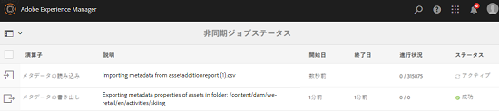
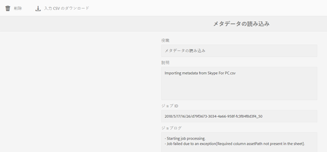

# 非同期操作 {#asynchronous-operations}

パフォーマンスに対する悪影響を軽減するには、 [!DNL Adobe Experience Manger Assets] は、長時間実行され、リソースを集中的に消費する特定のアセット操作を非同期的に処理します。 非同期処理では複数のタスクがエンキューされ、システムリソースの可用性に応じて順に実行されます。 このような操作には以下のようなものがあります。

* 多数のアセットの削除。
* 多数のアセットまたは多数の参照があるアセットの移動.
* アセットメタデータの一括書き出しと読み込み

非同期タスクのステータスは、 **[!UICONTROL 非同期ジョブステータス]** ページ。

>[!NOTE]
>
>デフォルトでは、 [!DNL Assets] タスクは並行して実行されます。 If `N` は、CPU コアの数です。 `N/2` タスクは、デフォルトで並行して実行できます。 タスクキューのカスタム設定を使用するには、 **[!UICONTROL 非同期操作のデフォルトキュー]** 設定を [!UICONTROL Web コンソール]. 詳しくは、[キューの設定](https://sling.apache.org/documentation/bundles/apache-sling-eventing-and-job-handling.html#queue-configurations)を参照してください。

## 非同期操作のステータスの監視 {#monitoring-the-status-of-asynchronous-operations}

いつでも [!DNL Assets] 操作を非同期で処理する場合、 [!DNL Experience Manager] [インボックス](/help/sites-authoring/inbox.md) 電子メールで送信できます。 非同期操作のステータスの詳細を表示するには、**[!UICONTROL 非同期ジョブステータス]**&#x200B;ページに移動します。

1. 内 [!DNL Experience Manager] インターフェイスクリック **[!UICONTROL 運用]** > **[!UICONTROL ジョブ]**.

1. **[!UICONTROL 非同期ジョブステータス]**&#x200B;ページで、操作の詳細をレビューします。

   

   操作の進行状況を確認するには、 **[!UICONTROL ステータス]** 列。 進行状況に応じて、以下のいずれかのステータスが表示されます。

   * **[!UICONTROL アクティブ]**：操作は処理中です。。
   * **[!UICONTROL 成功]**:操作が完了しました。
   * **[!UICONTROL 失敗]** または **[!UICONTROL エラー]**:操作を処理できませんでした。
   * **[!UICONTROL 予定]**:操作は後で処理するようにスケジュールされています。

1. アクティブな操作を停止するには、リストから選択し、 **[!UICONTROL 停止]**  をクリックします。

1. 説明やログなど、その他の詳細を表示するには、操作を選択し、 **[!UICONTROL 開く]**  をクリックします。 タスクの詳細ページが表示されます。

   

1. リストから操作を削除するには、ツールバーの「**[!UICONTROL 削除]**」を選択します。詳細を CSV ファイルでダウンロードするには、「**[!UICONTROL ダウンロード]**」をクリックします。

   >[!NOTE]
   >
   >タスクのステータスがアクティブまたはキューにある場合は、タスクを削除できません。

## 完了したタスクをパージ {#purge-completed-tasks}

[!DNL Experience Manager Assets] は、毎日 0100 時間にパージタスクを実行して、1 日以上経過した完了済みの非同期タスクを削除します。

<!-- TBD: Find out from the engineering team and mention the time zone of this 1:00 am task.
-->

パージタスクのスケジュールと、完了したタスクの詳細が削除前に保持される期間を変更できます。 また、完了したタスクの最大数を設定し、どの時点でも詳細を保持できます。

1. 内 [!DNL Experience Manager] インターフェイスクリック **[!UICONTROL ツール]** > **[!UICONTROL 運用]** > **[!UICONTROL Web コンソール]**.
1. を開きます。 **[!UICONTROL Adobe CQ DAM 非同期ジョブの削除がスケジュールされました]** タスク。
1. 完了したタスクを削除するまでの日数のしきい値と、詳細を履歴に保持するタスクの最大数を指定します。 変更を保存します。

   

## 非同期削除操作のしきい値の設定 {#configure-thresholds-for-asynchronous-delete-operations}

削除するアセットまたはフォルダーの数が、設定されたしきい値を超えると、削除操作が非同期的に実行されます。

1. 内 [!DNL Experience Manager] インターフェイスクリック **[!UICONTROL ツール]** > **[!UICONTROL 運用]** > **[!UICONTROL Web コンソール]**.
1. 次の [!UICONTROL Web コンソール]、 **[!UICONTROL 非同期削除操作ジョブの処理]** 設定。
1. 内 **[!UICONTROL アセット数のしきい値]** ボックスに、アセット、フォルダーまたは参照を非同期的に削除するしきい値を指定します。 変更を保存します。

   

## 非同期移動操作のしきい値の設定 {#configure-thresholds-for-asynchronous-move-operations}

移動するアセット、フォルダーまたは参照の数が設定したしきい値を超えると、移動操作が非同期的に実行されます。

1. 内 [!DNL Experience Manager] インタフェース、 **[!UICONTROL ツール]** > **[!UICONTROL 運用]** > **[!UICONTROL Web コンソール]**.
1. 次の [!UICONTROL Web コンソール]、 **[!UICONTROL 非同期移動操作ジョブ処理]** 設定。
1. 内 **[!UICONTROL アセット/参照のしきい値数]** ボックスに、アセット、フォルダーまたは参照を非同期的に移動する際のしきい値を指定します。 変更を保存します。

   

>[!MORELIKETHIS]
>
>* [Experience Manager で電子メールを設定します](/help/sites-administering/notification.md)。
>* [アセットメタデータの一括読み込みおよび書き出し](/help/assets/metadata-import-export.md)

