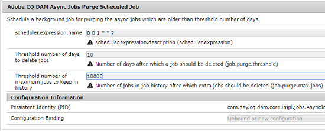

# 非同期操作 {#asynchronous-operations}

パフォーマンスへの悪影響を軽減するために、特定の長時間実行およびリソースを大量に消費するアセット操作を非同期に [!DNL Adobe Experience Manger Assets] 処理します。 非同期処理では、複数のタスクをエンキューし、システムリソースの可用性に応じて順次実行します。 このような操作には以下のようなものがあります。

* 多数のアセットの削除。
* 多数のアセットまたは多数の参照があるアセットの移動.
* アセットメタデータの一括書き出しと読み込み。

You can view the status of asynchronous tasks from the **[!UICONTROL Async Job Status]** page.

>[!NOTE]
>
>デフォルトでは、 [!DNL Assets] タスクは並行して実行されます。 If `N` is the number of CPU cores, `N/2` tasks can execute in parallel, by default. To use custom settings for the task queue, modify the **[!UICONTROL Async Operation Default Queue]** configuration from the [!UICONTROL Web Console]. 詳しくは、[キューの設定](https://sling.apache.org/documentation/bundles/apache-sling-eventing-and-job-handling.html#queue-configurations)を参照してください。

## Monitor the status of asynchronous operations {#monitoring-the-status-of-asynchronous-operations}

Whenever [!DNL Assets] processes an operation asynchronously, you receive a notification in your [!DNL Experience Manager] [Inbox](/help/sites-authoring/inbox.md) and via an email. 非同期操作のステータスの詳細を表示するには、**[!UICONTROL 非同期ジョブステータス]**&#x200B;ページに移動します。

1. In the [!DNL Experience Manager] interface click **[!UICONTROL Operations]** > **[!UICONTROL Jobs]**.

1. **[!UICONTROL 非同期ジョブステータス]**&#x200B;ページで、操作の詳細をレビューします。

   

   操作の進行状況を確認するには、「 **[!UICONTROL Status]** 」列を参照してください。 進行状況に応じて、以下のいずれかのステータスが表示されます。

   * **[!UICONTROL アクティブ]**：操作は処理中です。。
   * **[!UICONTROL 成功]**: 操作が完了しました。
   * **[!UICONTROL 失敗]** または **[!UICONTROL エラー]**: 操作を処理できませんでした。
   * **[!UICONTROL スケジュール済み]**: 操作は後で処理するようにスケジュールされます。

1. To stop an active operation, select it from the list and click **[!UICONTROL Stop]**  from the toolbar.

1. To view extra details, for example description and logs, select the operation and click **[!UICONTROL Open]**  from the toolbar. タスクの詳細ページが表示されます。

   

1. リストから操作を削除するには、ツールバーの「**[!UICONTROL 削除]**」を選択します。詳細を CSV ファイルでダウンロードするには、「**[!UICONTROL ダウンロード]**」をクリックします。

   >[!NOTE]
   >
   >ステータスがアクティブまたはキューに登録されているタスクは削除できません。

## 完了したタスクの削除 {#purge-completed-tasks}

[!DNL Experience Manager Assets] 毎日0100時間にパージタスクを実行し、1日以上経過している完了済みの非同期タスクを削除します。

<!-- TBD: Find out from the engineering team and mention the time zone of this 1:00 am task.
-->

削除タスクのスケジュールと、削除前に完了したタスクの詳細を保持する期間を変更できます。 完了したタスクの最大数を設定し、その詳細をいつでも保持することもできます。

1. インター [!DNL Experience Manager] フェイスで、 **[!UICONTROL ツール]** / **[!UICONTROL 操作]** / **[!UICONTROL Webコンソールをクリックします]**。
1. Open the **[!UICONTROL Adobe CQ DAM Async Jobs Purge Scheduled]** task.
1. 完了したタスクが削除されてからの日数と、詳細が履歴に保持されるタスクの最大数を指定します。 変更内容を保存します。

   

## 非同期削除操作のしきい値の設定 {#configure-thresholds-for-asynchronous-delete-operations}

削除するアセットまたはフォルダーの数が、設定したしきい値を超える場合は、非同期に削除操作が実行されます。

1. インター [!DNL Experience Manager] フェイスで、 **[!UICONTROL ツール]** / **[!UICONTROL 操作]** / **[!UICONTROL Webコンソールをクリックします]**。
1. [!UICONTROL Webコンソールから]、 **[!UICONTROL Async Delete Operation Job Processing]** Configurationを開きます。
1. 「アセット数の **[!UICONTROL しきい値]** 」ボックスに、アセット、フォルダーまたは参照を非同期に削除するしきい値を指定します。 変更内容を保存します。

   

## 非同期移動操作のしきい値の設定 {#configure-thresholds-for-asynchronous-move-operations}

移動するアセット、フォルダーまたは参照の数が、設定したしきい値を超える場合は、移動操作は非同期に実行されます。

1. インター [!DNL Experience Manager] フェイスで、 **[!UICONTROL ツール]** / **[!UICONTROL 操作]** / **[!UICONTROL Webコンソールをクリックします]**。
1. [!UICONTROL Webコンソールから]、 **[!UICONTROL Async Move操作ジョブ処理の設定を開きます]** 。
1. 「アセット/参照の **[!UICONTROL しきい値」ボックスで、アセット、フォルダーまたは参照を非同期に移動するしきい値を指定します]** 。 変更内容を保存します。

   

>[!MORELIKETHIS]
>
>* [Experience Managerで電子メールを設定します](/help/sites-administering/notification.md)。
>* [アセットメタデータの一括読み込みおよび書き出し](/help/assets/metadata-import-export.md)

