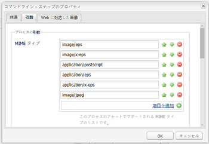
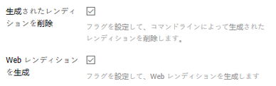
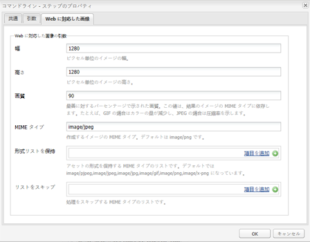
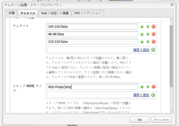
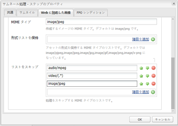

# [!DNL Experience Manager Assets] と連携するように ImageMagick をインストールして設定します。 {#install-and-configure-imagemagick-to-work-with-aem-assets}

ImageMagick は、ビットマップ画像の作成、編集、構成、変換を行うソフトウェアプラグインです。 PNG、JPEG、JPEG-2000、GIF、TIFF、DPX、EXR、WebP、Postscript、PDF、SVGなど、様々な形式（200 以上）で画像の読み取りと書き込みが可能です。 ImageMagick は、画像のサイズ変更、反転、ミラー、回転、変形、剪断および変換をおこなう場合に使用します。ImageMagick を使用して、画像の色を調整したり、各種特殊効果を適用したりすることもできます。また、テキスト、直線、多角形、楕円および曲線を描画することもできます。

ImageMagick を使用して画像を処理するには、コマンドラインからAdobe Experience Managerのメディアハンドラーを使用します。 ImageMagick を使用して様々なファイル形式を取り扱うには、[Assets のファイル形式に関するベストプラクティス](assets-file-format-best-practices.md)を参照してください。すべてのサポートされるファイル形式については、[Assets でサポートされるファイル形式](assets-formats.md)を参照してください。

ImageMagick を使用して大きなファイルを処理する場合は、必要なメモリが通常より多くなること、IM ポリシーの変更が必要になる可能性があること、パフォーマンスへの全体的な影響を考慮してください。メモリ要件は、解像度、ビット深度、カラープロファイル、ファイル形式などの様々な要因によって異なります。ImageMagick を使用して非常に大きなファイルを処理する場合は、[!DNL Experience Manager] サーバーを適切にベンチマークします。 いくつかの有用なリソースを最後に紹介します。

>[!NOTE]
>
>Adobe Managed Services(AMS) で [!DNL Experience Manager] を使用している場合、大きなPSDまたは PSB ファイルを大量に処理する予定がある場合は、Adobeカスタマーサポートにお問い合わせください。 Experience Managerは、30000 x 23000ピクセルを超える高解像度の PSB ファイルを処理できない場合があります。

## ImageMagick のインストール {#installing-imagemagick}

各種オペレーティングシステム向けに、様々なバージョンの ImageMagick インストールファイルが用意されています。オペレーティングシステムに適したバージョンを使用してください。

1. お使いのオペレーティングシステムに適した [ImageMagick のインストールファイル ](https://www.imagemagick.org/script/download.php) をダウンロードします。
1. [!DNL Experience Manager] サーバーをホストするディスクに ImageMagick をインストールするには、インストールファイルを起動します。

1. path 環境変数を ImageMagick のインストールディレクトリに設定します。
1. インストールが成功したかどうかを確認するには、`identify -version` コマンドを実行します。

## コマンドラインプロセスのステップの設定 {#set-up-the-command-line-process-step}

特定の使用例に応じてコマンドラインプロセスのステップを設定できます。[!DNL Experience Manager] サーバーの `/content/dam` にJPEG画像ファイルを追加するたびに、反転画像とサムネール (140 x 100、48 x 48、319 x 319、1280 x 1280) を生成するには、次の手順を実行します。

1. [!DNL Experience Manager] サーバーで、ワークフローコンソール (`https://[aem_server]:[Port]/workflow`) に移動し、**[!UICONTROL DAM アセットの更新]** ワークフローモデルを開きます。
1. **[!UICONTROL DAM アセットの更新]** ワークフローモデルから、**[!UICONTROL EPSサムネール（ImageMagick を利用）]** ステップを開きます。
1. **[!UICONTROL 「引数」タブ]** で、`image/jpeg` を **[!UICONTROL MIME タイプ]** リストに追加します。

   

1. 「**[!UICONTROL コマンド]**」ボックスに、次のコマンドを入力します。

   `convert ./${filename} -flip ./${basename}.flipped.jpg`

1. 「**[!UICONTROL 生成されたレンディションを削除]**」および「**[!UICONTROL Web レンディションを生成]**」フラグを選択します。

   

1. 「**[!UICONTROL Web に対応した画像]**」タブで、1280 x 1280 ピクセルというサイズでレンディションの詳細を指定します。さらに、「**[!UICONTROL Mimetype]**」ボックスに i *mage/jpeg* を指定します。

   

1. 「**[!UICONTROL OK]**」をタップまたはクリックして、変更内容を保存します。

   >[!NOTE]
   >
   >`convert` コマンドは、Windows のインストールに含まれるネイティブの `convert` ユーティリティと競合するので、特定の Windows バージョン（Windows SE など）では実行できない場合があります。 このような場合は、ImageMagick ユーティリティの完全パスを指定します。例えば、以下のように指定します。
   >
   >`"C:\Program Files\ImageMagick-6.8.9-Q16\convert.exe" -define jpeg:size=319x319 ./${filename} -thumbnail 319x319 cq5dam.thumbnail.319.319.png`

1. **[!UICONTROL サムネールを処理]** ステップを開き、**[!UICONTROL MIME タイプをスキップ]** の下に MIME タイプ `image/jpeg` を追加します。

   

1. 「**[!UICONTROL Web 対応の画像]**」タブで、「**[!UICONTROL リストをスキップ]**」の下に MIME タイプ `image/jpeg` を追加します。 「**[!UICONTROL OK]**」をタップまたはクリックして、変更内容を保存します。

   

1. ワークフローを保存します。
1. ImageMagic が画像を正しく処理できるかどうかを確認するには、[!DNL Assets] にJPG画像をアップロードします。 その画像の反転画像とレンディションが生成されるかどうかを確認します。

## セキュリティの脆弱性の緩和 {#mitigating-security-vulnerabilities}

ImageMagick を使用した画像の処理に関連して、セキュリティの脆弱性が複数存在します。例えば、ユーザーが送信した画像の処理は、リモートコード実行（RCE）のリスクを伴います。

また、様々な画像処理プラグインは、PHP の imagick、Ruby の rmagick と paperclip、Node.js の imagemagick など、ImageMagick ライブラリに依存します。

ImageMagick または影響を受けるライブラリを使用する場合は、以下のタスクのどちらか（できれば両方）を実行して、既知の脆弱性を緩和することをお勧めします。

1. ImageMagick に送信して処理する前に、すべての画像ファイルが、サポートする画像ファイルタイプに対応する予期された [&quot;magic bytes&quot;](https://en.wikipedia.org/wiki/List_of_file_signatures) で始まっていることを確認します。
1. ポリシーファイルを使用して、脆弱な ImageMagick コーダーを無効にします。 ImageMagick のグローバルポリシーは `/etc/ImageMagick` にあります。

>[!MORELIKETHIS]
>
>* [を使用して様々なファイル形式を処理するためのベストプラクティス [!DNL Assets]](assets-file-format-best-practices.md)
>* [ImageMagick のコマンドラインオプション](https://www.imagemagick.org/script/command-line-options.php)
>* [ImageMagick の基本的な使用例と高度な使用例](https://www.imagemagick.org/Usage/)
>* [ImageMagick 向けの Assets パフォーマンスチューニング](performance-tuning-guidelines.md)
>* [でサポートされるファイル形式の完全なリスト [!DNL Assets]](assets-formats.md)
>* [画像のファイル形式とメモリコストの理解](https://www.scantips.com/basics1d.html)

