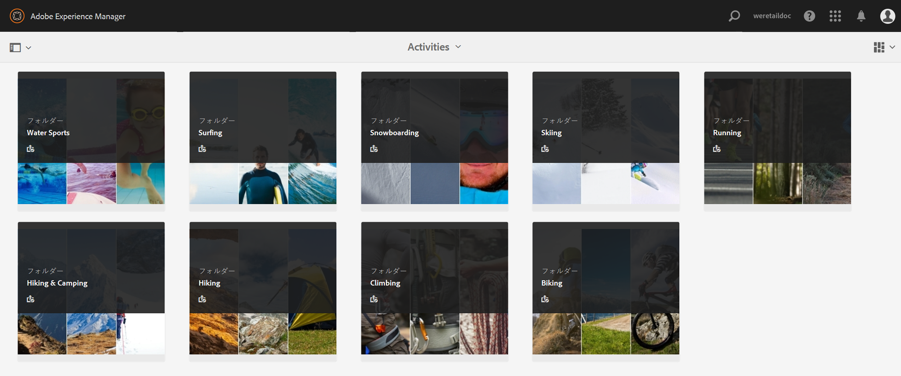

# Brand Portal へのアセットの公開 {#publish-assets-to-brand-portal}

Adobe Experience Manager Assets 管理者は、にアセットを公開できます [!DNL Experience Manager Assets Brand Portal] 組織のインスタンス（または公開ワークフローを後の日時にスケジュール）を作成する必要があります。 ただし、最初にを設定する必要があります [!DNL Assets] と [!DNL Brand Portal]. 詳しくは、 [設定 [!DNL Assets] と [!DNL Brand Portal]](configure-aem-assets-with-brand-portal.md).

アセットを公開すると、Brand Portalのユーザーがそのアセットを使用できるようになります。

その後、 [!DNL Assets]に設定した場合、アセットを再公開するまで、変更はBrand Portalに反映されません。 このため、作業中の変更が Brand Portal に提供されることがありません。管理者が公開した承認済みの変更のみが Brand Portal で提供されます。

レプリケーションが正常に完了したら、アセット、フォルダーおよびコレクションをに公開できます。 [!DNL Brand Portal]. アセットを Brand Portal に公開するには、次の手順を実行します。

>[!NOTE]
>
>Adobeは、可能な限りピーク時以外の時間帯に、時間をずらして公開することを推奨し、 [!DNL Experience Manager] 作成者は過剰なリソースを占有しません。

1. アセットコンソールで目的のアセットにマウスポインターを置き、クイックアクションから「**[!UICONTROL 公開]**」オプションを選択します。

   または、Brand Portal に公開するアセットを選択します。

   

2. アセットを Brand Portal に公開するには、次の 2 つのオプションを使用します。
   * [アセットを直ちに公開する](#publish-now)
   * [アセットを後で公開](#publish-later)

## アセットを今すぐ公開 {#publish-now}

選択したアセットを Brand Portal に公開するには、次のいずれかを実行します。

* ツールバーで「**[!UICONTROL クイック公開]**」を選択します。次に、メニューで「**[!UICONTROL Brand Portal に公開]**」を選択します。

* ツールバーで「**[!UICONTROL 公開を管理]**」を選択します。

   1. 次に、**[!UICONTROL アクション]**&#x200B;から「**[!UICONTROL Brand Portal に公開]**」を選択し、**[!UICONTROL スケジュール]**&#x200B;から「**[!UICONTROL 今すぐ]**」を選択します。タップまたはクリック **[!UICONTROL 次へ].**

   2. 内 **[!UICONTROL 範囲]**&#x200B;をクリックし、選択を確定してをタップまたはクリックします。 **[!UICONTROL Brand Portalに公開]**.

アセットが Brand Portal への公開用のキューに入れられたことを示すメッセージが表示されます。Brand Portal のインターフェイスにログインして、公開されたアセットを確認します。

## アセットを後で公開 {#publish-later}

アセットを Brand Portal に公開するスケジュールを後の日時に設定するには、次の手順を実行します。

1. 公開するアセットまたはフォルダーを選択したら、上部のツールバーから&#x200B;**[!UICONTROL 公開を管理]**&#x200B;を選択します。
2. **[!UICONTROL 公開を管理]**&#x200B;ページで、**[!UICONTROL アクション]**&#x200B;から「**[!UICONTROL Brand Portal に公開]**」を選択し、**[!UICONTROL スケジュール]**&#x200B;から「**[!UICONTROL 後で]**」を選択します。

   

3. 「**[!UICONTROL アクティベート日]**」を選択して時刻を指定します。「**[!UICONTROL 次へ]**」をタップまたはクリックします。
4. 「**[!UICONTROL アクティベート日]**」を選択して時刻を指定します。「**[!UICONTROL 次へ]**」をタップまたはクリックします。
5. 「**[!UICONTROL ワークフロー]**」でワークフロータイトルを指定します。タップまたはクリック **[!UICONTROL 後で公開]**.

   

次に、Brand Portalにログインして、公開したアセットがBrand Portalインターフェイスで使用できるかどうかを確認します。

