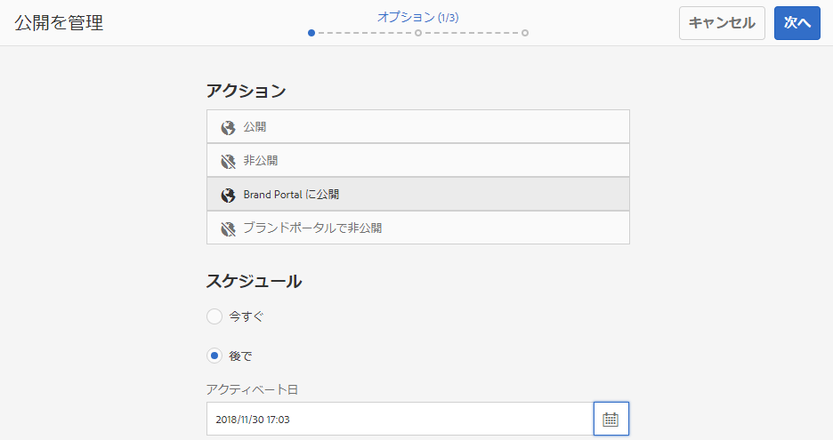

# Brand Portal へのアセットの公開 {#publish-assets-to-brand-portal}

Adobe Experience Manager(AEM)Assets管理者は、アセットをAEM Assets Brand Portalインスタンスに公開（または、組織の公開ワークフローを後日にスケジュール）できます。 ただし、最初に、AEM AssetsをBrand Portalで設定する必要があります。 For details, see [Configure AEM Assets with Brand Portal](configure-aem-assets-with-brand-portal.md).

アセットを公開すると、Brand Portalのユーザがそのアセットを使用できるようになります。

AEM Assetsの元のアセットに対して後で変更を加えた場合、その変更は、アセットを再公開するまでBrand Portalに反映されません。 この機能を使用すると、作業中の変更がBrand Portalで使用できなくなります。 Brand Portalでは、管理者が発行した承認済みの変更のみを利用できます。

レプリケーションが正常に終了したら、アセット、フォルダー、コレクションを Brand Portal に公開することができます。アセットを Brand Portal に公開するには、次の手順を実行します。

>[!NOTE]
>
>AEM オーサーが過剰なリソースを占有しないように、できればピーク時を避け、時間をずらして公開することをお勧めします。

1. アセットコンソールで目的のアセットにマウスポインターを置き、クイックアクションから「**[!UICONTROL 公開]**」オプションを選択します。

   または、Brand Portal に公開するアセットを選択します。

   

2. アセットをBrand Portalに公開するには、次の2つのオプションを使用できます。
   * [アセットを直ちに公開する](#publish-now)
   * [アセットを後で公開](#publish-later)

## アセットを今すぐ公開 {#publish-now}

選択したアセットを Brand Portal に公開するには、次のいずれかを実行します。

* From the toolbar, select **[!UICONTROL Quick Publish]**. Then from the menu, select **[!UICONTROL Publish to Brand Portal]**.

* From the toolbar, select **[!UICONTROL Manage Publication]**.

   1. Then from the **[!UICONTROL Action]** select **[!UICONTROL Publish to Brand Portal]**, and from **[!UICONTROL Scheduling]** select **[!UICONTROL Now]**. Tap/ click **[!UICONTROL Next].**

   2. Within **[!UICONTROL Scope]**, confirm your selection and tap/ click **[!UICONTROL Publish to Brand Portal]**.

アセットが Brand Portal への公開用のキューに入れられたことを示すメッセージが表示されます。Brand Portal のインターフェイスにログインして、公開されたアセットを確認します。

## アセットを後で公開 {#publish-later}

アセットを Brand Portal に公開するスケジュールを未来の日時で設定するには、次のようにします。

1. Once you have selected assets/ folders to publish, select **[!UICONTROL Manage Publication]** from the tool bar at the top.
2. On **[!UICONTROL Manage Publication]** page, select **[!UICONTROL Publish to Brand Portal]** from **[!UICONTROL Action]** and select **[!UICONTROL Later]** from **[!UICONTROL Scheduling]**.

   

3. Select an **[!UICONTROL Activation date]** and specify time. 「**[!UICONTROL 次へ]**」をタップまたはクリックします。
4. Select an **[!UICONTROL Activation date]** and specify time. 「**[!UICONTROL 次へ]**」をタップまたはクリックします。
5. Specify a Workflow title under **[!UICONTROL Workflows]**. Tap/ click **[!UICONTROL Publish Later]**.

   

次に、Brand Portalにログインして、公開されたアセットがBrand Portalインターフェイスで使用可能かどうかを確認します。

