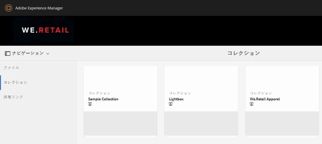
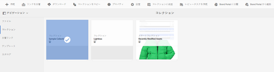
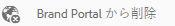

# Brand Portal へのコレクションの公開 {#publish-collections-to-brand-portal}

Adobe Experience Manager（AEM）Assets の管理者は、組織の AEM Assets Brand Portal のインスタンスにコレクションを公開できます。ただし、最初に AEM Assets を Brand Portal と統合する必要があります。詳しくは [AEM Assets と Brand Portal の連携の設定](configure-aem-assets-with-brand-portal.md)を参照してください。

AEM Assetsの元のコレクションにその後変更を加えた場合、そのコレクションを再度公開するまで、その変更はBrand Portalに反映されません。 この特性により、処理中の変更がBrand Portalで利用できなくなります。 管理者が公開した承認済みの変更のみが Brand Portal で提供されます。

>[!NOTE]
>
>コンテンツフラグメントは Brand Portal に公開できません。したがって、AEM作成者でコンテンツフラグメントを選択した場合、**[ブランドポータルに発行]**&#x200B;アクションは使用できません。
>
>コンテンツフラグメントを含むコレクションを AEM オーサーインスタンスから Brand Portal へ公開した場合は、そのフォルダー内のコンテンツフラグメントを除く全コンテンツが Brand Portal インターフェイスにレプリケートされます。

## Brand Portal へのコレクションの公開 {#publish-a-collection-to-brand-portal}

1. AEM Assets の UI で AEM のロゴをタップまたはクリックします。次に、**[!UICONTROL ナビゲーション]**&#x200B;ページで&#x200B;**[!UICONTROL アセット／コレクション]**&#x200B;に移動します。
2. コレクションコンソールから、ブランドポータルに公開するコレクションを選択します。

   

3. ツールバーで「**[!UICONTROL Brand Portal に公開]**」をタップまたはクリックします。

   

4. 確認ダイアログで「**[!UICONTROL 公開]**」をタップまたはクリックします。
5. 確認メッセージを閉じます。
6. 管理者として Brand Portal にログインします。公開したコレクションがコレクションインターフェイスで利用できます。

   

## コレクションを非公開にする {#unpublish-collections}

AEM Assetsからブランドポータルに公開するコレクションは公開取り消すことができます。 元のコレクションの公開を取り消すと、そのコピーはBrand Portalユーザーに対して使用できなくなります。

1. AEM Assets インスタンスのコレクションコンソールから、非公開にしたいコレクションを選択します。

   

2. ツールバーで、**[!UICONTROL ブランドポータルから削除]**&#x200B;アイコンをタップまたはクリックします。

   

3. 確認ダイアログで「**[!UICONTROL 非公開]**」をタップまたはクリックします。
4. 確認メッセージを閉じます。コレクションが Brand Portal インターフェイスから削除されます。
