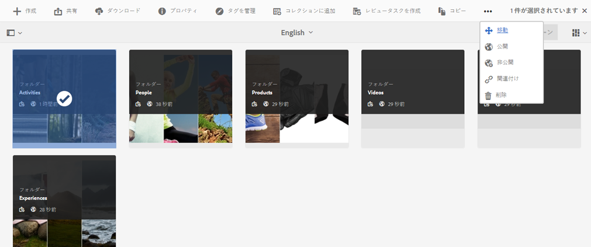
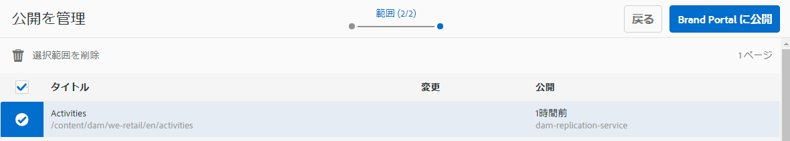
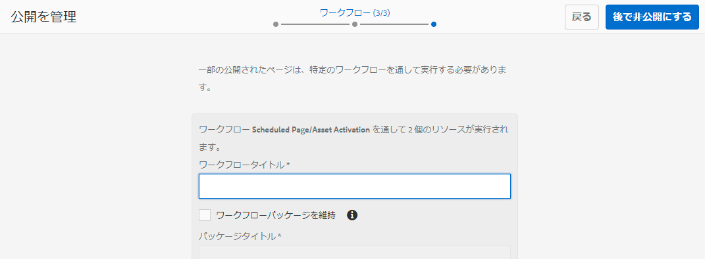

# Brand Portal へのフォルダーの公開 {#publish-folders-to-brand-portal}

Adobe Experience Manager（AEM）Assets の管理者は、アセットやフォルダーを組織の AEM Assets Brand Portal インスタンスに公開（または公開ワークフローを未来の日時で設定）できます。ただし、最初に AEM Assets を Brand Portal と統合する必要があります。詳しくは [AEM Assets と Brand Portal の連携の設定](configure-aem-assets-with-brand-portal.md)を参照してください。

アセットまたはフォルダーを公開すると、ブランドポータルでそのアセットまたはフォルダーをユーザーが使用できるようになります。

AEM Assetsの元のアセットまたはフォルダーに後で変更を加えた場合、その変更は、アセットまたはフォルダーを再公開するまでBrand Portalに反映されません。 このため、作業中の変更が Brand Portal に提供されることがありません。管理者が公開した承認済みの変更のみが Brand Portal で提供されます。

## Brand Portal へのフォルダーの公開 {#publish-folders-to-brand-portal-1}

1. AEM Assetsのインターフェイスで、目的のフォルダーの上にマウスポインターを置き、クイックアクションから「**[!UICONTROL 発行]**」オプションを選択します。

   あるいは、目的のフォルダーを選択して後述の手順に従います。

   

2. **フォルダーを今すぐ公開**

   選択したフォルダーを Brand Portal に公開するには、次のいずれかを実行します。

   * ツールバーで「**[!UICONTROL クイック公開]**」を選択します。次に、メニューから「**[!UICONTROL ブランドポータルに公開]**」を選択します。
   * ツールバーで「**[!UICONTROL 公開を管理]**」を選択します。

3. 次に、**[!UICONTROL アクション]**&#x200B;で「**[!UICONTROL ブランドポータルに公開]**」を選択し、**[!UICONTROL スケジュール]**&#x200B;で「**[!UICONTROL 今すぐ]**」を選択します。 「**[!UICONTROL 次へ]」をタップします。**
4. **[!UICONTROL スコープ]**&#x200B;内で、選択を確認し、「**[!UICONTROL ブランドポータルに発行]**」をタップします。

   フォルダーが Brand Portal への公開用のキューに入れられたことを示すメッセージが表示されます。Brand Portal のインターフェイスにログインして、公開されたフォルダーを確認します。

   **フォルダーを後で公開**

   アセットフォルダーのBrand Portalへの投稿ワークフローを後の日時にスケジュールするには：

   1. 発行するアセット/フォルダを選択したら、上部のツールバーから「**[!UICONTROL パブリケーションを管理]**」を選択します。
   2. **[!UICONTROL パブリケーションの管理]**&#x200B;ページで、**[!UICONTROL アクション]**&#x200B;から「**[!UICONTROL ブランドポータルに公開]**」を選択し、**[!UICONTROL スケジュール]**&#x200B;から「**[!UICONTROL 後で]**」を選択します。

      

   3. 「**[!UICONTROL アクティベート日]**」を選択して時刻を指定します。「**[!UICONTROL 次へ]**」をタップします。
   4. 「**[!UICONTROL 範囲]**」で選択内容を確認します。「**[!UICONTROL 次へ]**」をタップします。
   5. 「**[!UICONTROL ワークフロー]**」でワークフロータイトルを指定します。「**[!UICONTROL 後で公開]**」をタップします。

      

## Brand Portal へのフォルダーの非公開 {#unpublish-folders-from-brand-portal}

AEM オーサーインスタンスからアセットインスタンスの公開を取り消すことで、Brand Portal に公開されているアセットフォルダーを削除できます。元のフォルダーを非公開にすると、Brand Portal ユーザーはそのコピーを使用できなくなります。

Brand Portal へのフォルダーの公開をすぐに取り消すことも、取り消しのスケジュールを未来の日時で設定することもできます。Brand Portal へのアセットフォルダーを非公開にするには、次の手順を実行します。

1. AEM オーサーインスタンス内の AEM Assets インターフェイスで、公開を取り消すフォルダーを選択します。

   

2. ツールバーで「**[!UICONTROL 公開を管理]**」をタップまたはクリックします。

3. **Brand Portal への公開を今すぐ取り消し**

   Brand Portal へのフォルダーの公開をすぐに取り消すには、次のようにします。

   1. **[!UICONTROL パブリケーションの管理]**&#x200B;ページの&#x200B;**[!UICONTROL アクション]**&#x200B;から「**[!UICONTROL ブランドポータルから公開を取り消す]**」を選択し、**[!UICONTROL スケジュール]**&#x200B;から「**[!UICONTROL 今すぐ]**」を選択します。
   2. 「**[!UICONTROL 次へ]」をタップまたはクリックします。**
   3. **[!UICONTROL スコープ]**&#x200B;内で、選択を確認し、「**[!UICONTROL ブランドポータルから非公開]**」をタップします。

   

   **後でBrand Portalから非公開にする**

   Brand Portal へのフォルダーの公開を停止するスケジュールを未来の日時で設定するには、次のようにします。

   1. **[!UICONTROL パブリケーションの管理]**&#x200B;ページの&#x200B;**[!UICONTROL アクション]**&#x200B;から「**[!UICONTROL ブランドポータルから非公開]**」を選択し、**[!UICONTROL スケジュール]**&#x200B;から「**[!UICONTROL 後で]」を選択します。**
   2. 「**[!UICONTROL アクティベート日]**」を選択して時刻を指定します。「**[!UICONTROL 次へ]**」をタップします。
   3. **[!UICONTROL スコープ]**&#x200B;内で、選択を確認し、**[!UICONTROL 次へ]**&#x200B;をタップします。
   4. **[!UICONTROL ワークフロー]**&#x200B;の下に&#x200B;**[!UICONTROL ワークフロータイトル]**&#x200B;を指定します。 **[!UICONTROL 後で非公開]をタップします。**

      

>[!NOTE]
>
>Brand Portalに対してアセットを公開/非公開する手順は、フォルダーの対応する手順と似ています。
