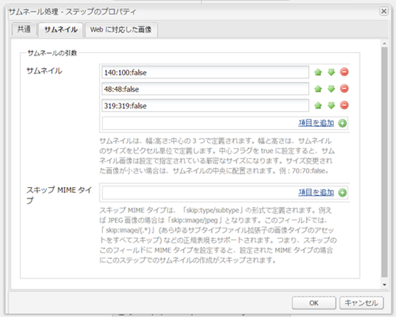
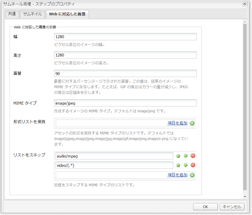
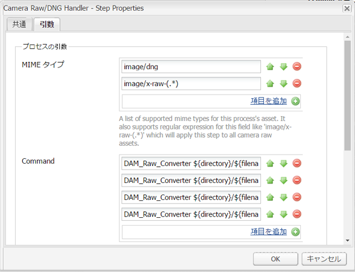
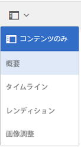
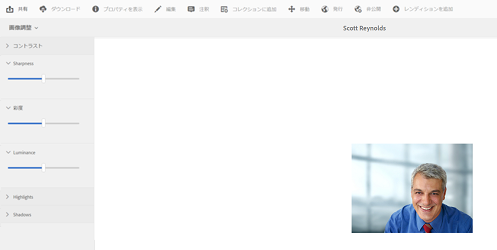

# Camera Rawを使用して画像を処理 {#camera-raw-support}

CR2、NEF、RAF などの生のファイル形式を処理し、画像をJPEG形式でレンダリングするCamera Rawサポートを有効にできます。 この機能は、Adobe Experience Manager Assets で [Camera Raw包装](https://experience.adobe.com/#/downloads/content/software-distribution/en/aem.html?package=/content/software-distribution/en/details.html/content/dam/aem/public/adobe/packages/aem630/product/assets/aem-assets-cameraraw-pkg) は、「ソフトウェア配布」から入手できます。

>[!NOTE]
>
>この機能は JPEG レンディションのみをサポートします。Windows 64 ビット、Mac OS、RHEL 7.x でサポートされています。

Adobe Experience Manager Assets でCamera Rawサポートを有効にするには、次の手順に従います。

1. をダウンロードします。 [Camera Raw包装](https://experience.adobe.com/#/downloads/content/software-distribution/en/aem.html?package=/content/software-distribution/en/details.html/content/dam/aem/public/adobe/packages/aem630/product/assets/aem-assets-cameraraw-pkg) を「ソフトウェア配布」から。

1. `https://[aem_server]:[port]/workflow` にアクセスします。を開きます。 **[!UICONTROL DAM アセットの更新]** ワークフロー。

1. を開きます。 **[!UICONTROL サムネールを処理]** 手順

1. で次の設定をおこないます。 **[!UICONTROL サムネール]** タブ：

   * **[!UICONTROL サムネール]**: `140:100:false, 48:48:false, 319:319:false`
   * **[!UICONTROL スキップ MIME タイプ]**: `skip:image/dng, skip:image/x-raw-(.*)`

   

1. 内 **[!UICONTROL Web に対応した画像]** タブ、 **[!UICONTROL リストをスキップ]** フィールド、指定 `audio/mpeg, video/(.*), image/dng, image/x-raw-(.*)`.

   

1. サイドパネルから、 **[!UICONTROL Camera Raw/DNG ハンドラー]** 下のステップ **[!UICONTROL サムネールの作成]** 手順

1. 内 **[!UICONTROL Camera Raw/DNG ハンドラー]** 手順を実行する場合は、 **[!UICONTROL 引数]** タブ：

   * **[!UICONTROL MIME タイプ]**: `image/dng` および `image/x-raw-(.*)`
   * **[!UICONTROL コマンド]**:

      * `DAM_Raw_Converter ${directory}/${filename} ${directory} cq5dam.web.1280.1280.jpeg 1280 1280`
      * `DAM_Raw_Converter ${directory}/${filename} ${directory} cq5dam.thumbnail.319.319.jpeg 319 319`
      * `DAM_Raw_Converter ${directory}/${filename} ${directory} cq5dam.thumbnail.140.100.jpeg 140 100`
      * `DAM_Raw_Converter ${directory}/${filename} ${directory} cq5dam.thumbnail.48.48.jpeg 48 48`

   

1. 「**[!UICONTROL 保存]**」をクリックします。

>[!NOTE]
>
>上記の設定が **[!UICONTROL Camera RAW および DNG 処理ステップによるサンプルの DAM 更新アセット]**&#x200B;設定と同じであることを確認してください。

これで、Camera Raw ファイルをに読み込めるようになりました。 [!DNL Experience Manager] アセット。 Camera Rawパッケージをインストールし、必要なワークフローを設定した後、 **[!UICONTROL 画像調整]** オプションがサイドパネルのリストに表示されます。

*図：サイドパネルのオプション*

*図：画像に軽量な編集を行うには、「 」オプションを使用します*

Camera Raw 画像に対する編集を保存すると、その画像に対して、新しいレンディション「`AdjustedPreview.jpg`」が生成されます。Camera Raw 以外の画像タイプの場合は、変更内容がすべてのレンディションに反映されます。

## ベストプラクティス、既知の問題、および制限 {#best-practices}

この機能には次の制限があります。

* この機能は JPEG レンディションのみをサポートします。これは、Windows 64 ビット、Mac OS および RHEL 7.x でサポートされます。
* メタデータの書き戻しは、RAW および DNG 形式ではサポートされていません。
* Camera Raw ライブラリには、一度に処理できる合計ピクセルに関する制限があります。現在、ファイルの長辺で最大65000ピクセル、または最初に検出された条件に応じて 512 MP を処理できます。
