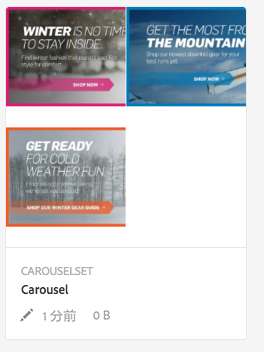
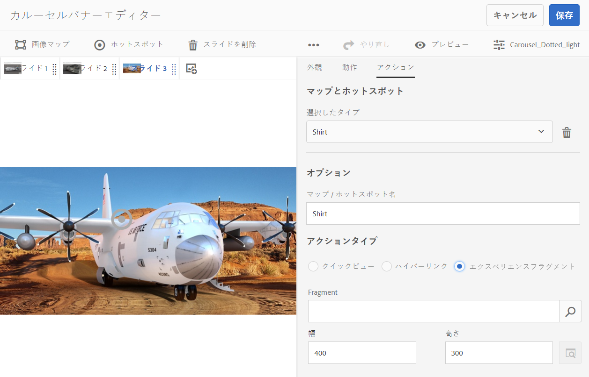
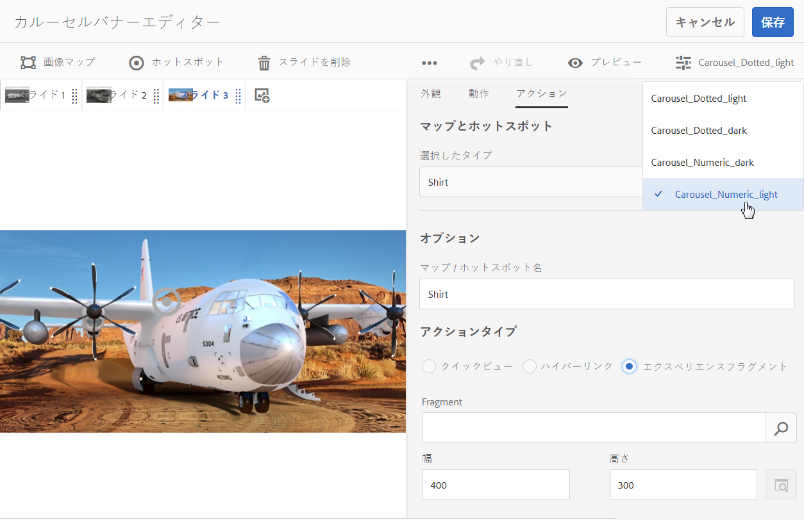

# カルーセルバナー {#carousel-banners}

>[!CAUTION]
>
>AEM 6.4 の拡張サポートは終了し、このドキュメントは更新されなくなりました。 詳細は、 [技術サポート期間](https://helpx.adobe.com/jp/support/programs/eol-matrix.html). サポートされているバージョンを見つける [ここ](https://experienceleague.adobe.com/docs/?lang=ja).

カルーセルバナーを使用すると、マーケターは、インタラクティブで回転するプロモーションコンテンツを簡単に作成し、任意の画面に配信することで、コンバージョンを促進できます。

プロモーションバナーで特集するコンテンツの作成と変更には時間がかかり、新しいコンテンツをすばやく公開したり、ターゲットを絞り込んだりできなくなる可能性があります。 カルーセルバナーを使用すると、回転バナーの作成や変更、製品の詳細や関連リソースにリンクするホットスポットなどのインタラクティビティの追加、任意の画面への配信をすばやくおこなうことができます。

カルーセルバナーには「**CAROUSELSET**」と表示されます。

Web サイトではカルーセルバナーは次のように表示されます。

ここでは、数字をクリックして画像間を移動できます。 また、カスタマイズできる間隔に基づいて自動的にスライドを切り替えることもできます。カルーセルバナーに追加する画像は、ホットスポットと画像マップの両方をサポートし、ユーザーは、タップまたはタップしてハイパーリンクに移動したり、クイックビューウィンドウにアクセスしたりできます。

この例では、ユーザーは画像マップをタップまたはクリックして、グローブ用のクイックビューウィンドウにアクセスします。

## カルーセルバナーの作成方法の視聴 {#watch-how-carousel-banners-are-created}

10 分 33 秒の[カルーセルバナーの作成方法](https://s7d5.scene7.com/s7viewers/html5/VideoViewer.html?videoserverurl=https://s7d5.scene7.com/is/content/&amp;emailurl=https://s7d5.scene7.com/s7/emailFriend&amp;serverUrl=https://s7d5.scene7.com/is/image/&amp;config=Scene7SharedAssets/Universal_HTML5_Video_social&amp;contenturl=https://s7d5.scene7.com/skins/&amp;asset=S7tutorials/InteractiveCarouselBanner)に関する説明を視聴してください。また、カルーセルバナーのプレビュー、編集および配信方法についても説明します。

>[!NOTE]
>
>管理者以外のユーザーは、カルーセルバナーを作成または編集できるように、**dam-users** グループに追加される必要があります。作成や編集で問題が発生した場合は、 **dam-users** グループ化します。

## クイックスタート：カルーセルバナー {#quick-start-carousel-banners}

すぐに使い始めるには：

1. [ホットスポットと画像マップの変数を識別します](#identifying-hotspot-and-image-map-variables)（AEM Assets と Dynamic Media の両方を使用するユーザーのみ）。

   まず、既存のクイックビュー実装で使用されている動的変数を識別します。これにより、AEM Assetsでのカルーセルバナー作成プロセスで、ホットスポットと画像マップのデータを適切に入力できます。

   >[!NOTE]
   >
   >AEM Sitesまたは E コマースをご利用のお客様は、組み込み機能を使用して製品ページに移動し、製品カタログ内の既存の SKU を参照できます。 ホットスポットまたは画像マップの変数を手動で入力する必要はありません。[eCommerce の設定](/help/sites-administering/generic.md)に関する情報を参照してください。
   >
   >AEM AssetsとDynamic Mediaのユーザーである場合は、ホットスポットと画像マップのデータを手動で入力し、公開済みの URL または埋め込みコードをサードパーティのコンテンツ管理システムに統合します。

1. オプション：必要であれば、[カルーセルセットビューアプリセットを作成します](managing-viewer-presets.md)。

   管理者は、独自のカルーセルビューアプリセットを作成して、カルーセルの動作と外観をカスタマイズできます。主な利点は、複数のカルーセルに対してこのカスタムビューアプリセットを再利用できることです。ただし、ユーザーがカルーセルを作成するときに、カルーセルの動作や外観を直接カスタマイズすることもできます。カルーセルで特定のデザインが求められるケースではこの方法が適しています。

1. [画像バナーをアップロードします](#uploading-image-banners)。

   インタラクティブにする画像バナーをアップロードします。

1. [カルーセルセットを作成します](#creating-carousel-sets)。

   カルーセルセットで、ユーザーはバナー画像間を移動し、ホットスポットまたは画像マップをタップして、関連するコンテンツにアクセスします。

   Assets でカルーセルセットを作成するには、「**[!UICONTROL 作成]**」をタップし、「**[!UICONTROL カルーセルセット]**」を選択します。アセットをスライドに追加し、「**[!UICONTROL 保存]**」をタップします。エディター内で、カルーセルの外観と動作を直接編集することもできます。

1. [画像バナーにホットスポットまたは画像マップを追加します。](#adding-hotspots-or-image-maps-to-an-image-banner)

   1 つ以上のホットスポットまたは画像マップを画像バナーに追加し、それぞれにアクション（リンクやクイックビュー、エクスペリエンスフラグメントなど）を関連付けます。ホットスポットまたは画像マップを追加した後、カルーセルセットを公開して、このタスクを完了します。 公開によって埋め込みコードが生成されます。これは、コピーして Web サイトのランディングページに適用するために使用できます。

   詳しくは、 [（オプション）カルーセルバナーのプレビュー](#optional-previewing-carousel-banners)  — オプション。 必要に応じて、カルーセルセットの表示を確認して、インタラクティビティをテストすることができます。

1. [カルーセルバナーの公開.](#publishing-carousel-banners)

   他のアセットと同じようにカルーセルセットを公開します。Assets でカルーセルセットに移動し、選択してタップまたはタップします **[!UICONTROL 公開]**. カルーセルセットを公開すると、URL と埋め込み文字列がアクティベートされます。

1. 次のいずれかの操作を行います。

   * [Web サイトページへのカルーセルバナーの追加](#adding-a-carousel-banner-to-your-website-page)Web サイトページにカルーセルバナーの URL またはコピーした埋め込みコードを追加できます。

      * [カルーセルバナーと既存のクイックビューの統合](#integrating-the-carousel-banner-with-an-existing-quickview)。サードパーティの Web コンテンツ管理システムを使用している場合は、新しいカルーセルバナーを、Web サイト上の既存のクイックビュー実装に統合する必要があります。
   * [AEM で Web サイトへのカルーセルバナーの追加](adding-dynamic-media-assets-to-pages.md)AEM Sites のお客様は、インタラクティブメディアコンポーネントを使用して、カルーセルセットを AEM 内のページに直接追加できます。

カルーセルセットを編集する必要がある場合は、 [カルーセルセットの編集](#editing-carousel-sets). また、[カルーセルセットのプロパティ](/help/assets/managing-assets-touch-ui.md#editing-properties)を表示および編集することができます。

## ホットスポットと画像マップの変数の識別 {#identifying-hotspot-and-image-map-variables}

まず、既存のクイックビュー実装で使用されている動的変数を識別します。これにより、AEM Assetsでのカルーセルセット作成プロセス中に、ホットスポットまたは画像マップのデータを適切に入力できます。

AEM Assetsでバナー画像にホットスポットまたは画像マップを追加する場合は、各ホットスポットまたは画像マップに SKU とオプションの追加変数を割り当てる必要があります。 これらの変数は、後でホットスポットまたは画像マップとクイックビューコンテンツを対応付けるために使用されます。

>[!NOTE]
>
>AEM SitesまたはAEM eCommerce をご利用のお客様は、この手順をスキップしてください。 ホットスポットまたは画像マップの変数を手動で識別する必要はありません。製品統合のために Ecommerce との統合を使用できます。[eCommerce の設定](/help/sites-administering/generic.md)に関する情報を参照してください。さらに、インタラクティブコンポーネントを使用して、Web ページに追加できます。
>
>AEM Assetsまたはメディアのユーザーである場合は、URL または埋め込みコードを公開し、サードパーティのコンテンツ管理システムと統合して、ホットスポットと画像マップを手動で識別します。

重要なのは、ホットスポットまたは画像マップのデータに関連付けられる変数の数とタイプを正しく識別することです。バナー画像に追加する各ホットスポットまたは画像マップには、既存のバックエンドシステムで製品を明確に識別するのに十分な情報を含める必要があります。 同時に、各ホットスポットまたは画像マップに必要な数以上のデータを含めないようにする必要があります。 その結果、データ入力プロセスが過度に複雑になり、継続的なホットスポットや画像マップ管理がエラーが発生しやすくなるからです。

ホットスポットまたは画像マップのデータに使用する変数のセットを識別する方法は異なります。

システム内のクイックビューを識別するために必要な最小のデータセットは何かを知っている可能性が高いので、既存のクイックビューの実装を担当する IT 専門家に相談するのに十分な場合があります。 ただし、ほとんどの場合は、フロントエンドコードの既存の動作を簡単に分析することもできます。

クイックビュー実装の大部分では、次のパラダイムを使用しています。

* ユーザーは Web サイト上の特定のユーザーインターフェイス要素をアクティベートします。例えば、 **[!UICONTROL クイックビュー]** 」ボタンをクリックします。
* Web サイトでは、必要に応じて、クイックビューのデータまたはコンテンツを読み込むための Ajax リクエストをバックエンドに送信します。
* クイックビューのデータは、Web ページでのレンダリングに備えて、コンテンツに変換されます。
* 最後に、フロントエンドコードによってそのコンテンツが画面上に視覚的にレンダリングされます。

その後、クイックビュー機能が実装されている既存の Web サイトの様々な領域にアクセスし、クイックビューをトリガーして、Web ページから送信された Ajax URL を取り込み、クイックビューのデータやコンテンツを読み込みます。

通常は、特別なデバッグツールを使用する必要はありません。最新の Web ブラウザーには、十分なタスクを実行できる Web インスペクターが備わっています。Web インスペクターが搭載されている Web ブラウザーの例を次に示します。

* Google Chrome で、送信されるすべての HTTP リクエストを表示するには、F12 キー (Windows) または Command + Option + I キー (Mac) を押してデベロッパーツールパネルを開き、 **[!UICONTROL ネットワーク]** タブをクリックします。
* Firefox では、F12 キー（Windows）または Command + Option + I キー（Mac）を押して Firebug プラグインを有効にして「Net」タブを使用するか、組み込みの Inspector ツールとその「Network」タブを使用します。

ブラウザーでネットワーク監視をオンにして、ページ上でクイックビューをトリガーします。

次に、ネットワークログ内でクイックビューの Ajax URL を見つけ、記録された URL を今後の分析のためにコピーします。ほとんどの場合、クイックビューをトリガーすると、サーバーに送信される多数のリクエストが存在します。 クイックビューの Ajax URL は通常、そのリスト内の最初のほうにあります。この URL には複雑なクエリ文字列部分またはパスが含まれ、その応答の MIME タイプは `text/html`、`text/xml`、`text/javascript` のいずれかになります。

このプロセスの実行中は、様々な製品カテゴリや製品タイプが含まれる Web サイトの様々な領域にアクセスすることが重要です。なぜなら、クイックビュー URL には、ある特定の Web サイトカテゴリに共通するが、Web サイトの異なる領域にアクセスした場合にのみ変化する部分が存在する場合があるからです。

単純なケースでは、クイックビュー URL 内で変化する唯一の部分が製品 SKU となります。その場合、SKU の値が、ホットスポットまたは画像マップをバナー画像に追加するために必要になる唯一のデータです。

一方、複雑なケースでは、クイックビュー URL に SKU 以外の様々な要素が含まれます（カテゴリ ID、カラーコード、サイズコードなど）。その場合、各要素は、カルーセルバナー機能のホットスポットまたは画像マップのデータ定義内の個別の変数になります。

次のクイックビュー URL の例と、その結果となるホットスポットまたは画像マップの変数について見てみましょう。

<table> 
 <tbody> 
  <tr> 
   <td>単一の SKU（クエリ文字列内）</td> 
   <td>
記録されたクイックビューの URLとしては以下が挙げられます。
 
    <ul> 
     <li>
<code>https://server/json?productId=866558&amp;source=100</code>
 </li> 
     <li>
<code>https://server/json?productId=1196184&amp;source=100</code>
 </li> 
     <li>
<code>https://server/json?productId=1081492&amp;source=100</code>
 </li> 
     <li>
<code>https://server/json?productId=1898294&amp;source=100</code>
 </li> 
    </ul> 
この URL で変化する唯一の部分は <code>productId=</code> というクエリ文字列パラメーターの値であり、これが SKU 値であることは明白です。したがって、ホットスポットや画像マップには、次のような値が設定された SKU フィールドのみが必要になります。 <code>866558,</code> <code>1196184,</code> <code>1081492,</code> <code>1898294.</code>
 </td> 
  </tr> 
  <tr> 
   <td>単一の SKU（URL パス内）</td> 
   <td>
記録されたクイックビューの URLとしては以下が挙げられます。
 
    <ul> 
     <li>
<code>https://server/product/6422350843</code>
 </li> 
     <li>
<code>https://server/product/1607745002</code>
 </li> 
     <li>
<code>https://server/product/0086724882</code>
 </li> 
    </ul> 
変化する部分はパスの最後の部分にあり、ホットスポット／画像マップの SKU 値（<strong><code>6422350843</code>、<code>1607745002,</code>、</strong><code>0086724882.</code>）になります
 </td> 
  </tr> 
  <tr> 
   <td>SKU とカテゴリ ID（クエリ文字列内）</td> 
   <td>
記録されたクイックビューの URLとしては以下が挙げられます。
 
    <ul> 
     <li>
<code>https://server/quickView/product/?category=1100004&amp;prodId=305466</code>
 </li> 
     <li>
<code>https://server/quickView/product/?category=1100004&amp;prodId=310181</code>
 </li> 
     <li>
<code>https://server/quickView/product/?category=1740148&amp;prodId=308706</code>
 </li> 
    </ul> 
この場合、URL には変化する部分が 2 つあります。SKU が <code>prodId</code> パラメーターに、カテゴリ ID が <code>category=</code> パラメーターに格納されています。
 
そのため、ホットスポット／画像マップ定義はペアになります。つまり、SKU 値と、<code>categoryId</code> という追加の変数です。結果のペアは次のようになります。
 
    <ul> 
     <li>
SKU が <strong><code>305466</code></strong>、<code>categoryId</code> が <code>1100004</code>。
 </li> 
     <li>
SKU が <strong><code>310181</code></strong>、<code>categoryId</code> が <strong><code>1100004</code></strong>。
 </li> 
     <li>
SKU が <strong><code>308706</code></strong>、<code>categoryId</code> が <strong><code>1740148</code></strong>。
 </li> 
    </ul> </td> 
  </tr> 
 </tbody> 
</table>

## 画像バナーのアップロード {#uploading-image-banners}

使用する画像を既にアップロードしている場合は、次の手順（[カルーセルセットの作成](#creating-carousel-sets)）に進んでください。カルーセルで使用される画像をアップロードする前に Dynamic Media を有効にしておく必要があることに注意してください。

画像バナーをアップロードするには、 [アセットのアップロード](managing-assets-touch-ui.md).

## カルーセルセットの作成 {#creating-carousel-sets}

>[!NOTE]
>
>管理者以外のユーザーは、カルーセルバナーを作成または編集できるように、**[!UICONTROL dam-users]** グループに追加される必要があります。作成や編集で問題が発生した場合は、 **dam-users** グループ化します。

**カルーセルセットを作成するには**:

1. Assets で、カルーセルセットを作成するフォルダーに移動し、**[!UICONTROL 作成／カルーセルセット]**&#x200B;をタップします。
1. の **[!UICONTROL カルーセルバナーエディター]** ページ、タップ **[!UICONTROL タップしてアセットセレクターを開く]** をクリックして、最初のスライドの画像を選択します。

   の **[!UICONTROL カルーセルバナーエディター]** ページで、次のいずれかの操作を行います。

   * ページの左上隅付近にある「**[!UICONTROL スライドを追加]**」をタップします。
   * ページの中央付近にあるをタップします。 **[!UICONTROL タップしてアセットセレクターを開く]**.

   カルーセルセットに含めるアセットをタップして選択します。選択済みのアセットにはチェックマークアイコンが付いています。作業が完了したら、ページの右上隅付近にあるをタップします。 **[!UICONTROL 選択]**.

   アセットセレクターでは、キーワードを入力して **[!UICONTROL Enter]** キーをタップすることで、アセットを検索することができます。フィルターを適用して、検索結果を絞り込むこともできます。パス、コレクション、ファイルタイプおよびタグでフィルタリングできます。フィルターを選択してから、ツールバーの&#x200B;**[!UICONTROL フィルター]**&#x200B;アイコンをタップします。次をタップしてビューを変更 **[!UICONTROL 表示]** アイコンと選択 **[!UICONTROL 列表示]**, **[!UICONTROL カード表示]**&#x200B;または **[!UICONTROL リスト表示]**.

   詳しくは、[セレクターの操作](working-with-selectors.md)を参照してください。

1. カルーセルセットで回転させるすべての画像が追加されるまで、スライドの追加を続けます。
1. （オプション）次のいずれかの操作を行います。

   * 必要に応じて、スライドをドラッグして、セットリスト内の画像を並べ替えます。
   * 画像を削除するには、画像を選択し、「**[!UICONTROL スライドを削除]**」をタップします。
   * プリセットを適用するには、ページの右上隅付近にある「プリセット」ドロップダウンリストをタップし、セットに一度に適用するプリセットを選択します。

   スライドを削除するには、スライドをタップし、 **[!UICONTROL スライドを削除]** 」と入力します。 スライドを移動するには、並べ替えアイコンをタップし、長押しして目的の場所に移動します。

1. スライドに画像を追加した後で、ホットスポットまたは画像マップ（または両方）を画像に追加できます。[ホットスポットまたは画像マップの追加](#adding-hotspots-or-image-maps-to-an-image-banner)を参照してください。
1. 「動作」タブと「外観」タブをタップまたはクリックし、カルーセルバナーの外観や特定のコンポーネントの動作を調整することで、カルーセルセットのビジュアルデザインと動作を変更できます。 ビューアエディターの使用方法について詳しくは、[ビューアプリセットの管理](viewer-presets.md)を参照してください。

   >[!NOTE]
   >
   >カルーセルバナーの場合、調整が必要な項目は次のとおりです。
   >* 画像が表示される期間。 デフォルトでは、各画像は 9 秒間表示されます。
   >* アニメーション.デフォルトでは、各スライド切り替えはフェードです。 これをスライド切り替えに変更できます。
   >* ボタンのスタイル。 ユーザーは、各点または数字をタップしてバナーを回転できます。 セットインジケーターボタンの表示位置（とスタイルが番号か点か）と大きさを変更できます。
   >* 画像マップまたはホットスポットに使用されるアイコンのハイライトスタイルを変更します。
   >* ビューアプリセットを編集する前に、プリセットの基にするスタイルを選択します。 この操作を行わない場合、ビューアプリセットの編集を開始する際に、別のプリセットに変更すると決めた場合は、すべての変更内容が失われます。

   カルーセルバナーがどのように表示されるかをプレビューすることもできます。 [（オプション）カルーセルバナーのプレビュー](#optional-previewing-carousel-banners)を参照してください。

1. 終了したら「**[!UICONTROL 保存]**」をタップします。

## 画像バナーへのホットスポットまたは画像マップの追加 {#adding-hotspots-or-image-maps-to-an-image-banner}

カルーセルセットエディターを使用して、ホットスポットまたは画像マップをバナーに追加できます。

ホットスポットまたは画像マップを追加する際に、クイックビューポップアップ表示、ハイパーリンクまたはエクスペリエンスフラグメントとして定義できます。

[エクスペリエンスフラグメント](/help/sites-authoring/experience-fragments.md)を参照してください。

>[!NOTE]
>
>カルーセルバナーのソーシャルメディア共有ツールは、エクスペリエンスフラグメントにビューアを埋め込む場合はサポートされないことに注意してください。
この問題を回避するには、ソーシャルメディア共有ツールのないビューアプリセットを使用または作成します。このようなビューアプリセットを使用すると、ビューアをエクスペリエンスフラグメントに正常に埋め込むことができます。

画像にホットスポットまたは画像マップを追加したら、忘れずに作業内容を保存してください。**[!UICONTROL ページの右上隅にある「取り消し」および「やり直し」オプションは、現在の作成／編集セッションの間で有効です。]******

カルーセルバナーの作成が完了したら、必要に応じて **[!UICONTROL プレビュー]** を参照して、カルーセルバナーが顧客にどのように表示されるかを確認します。

[（オプション）カルーセルバナーのプレビュー](#optional-previewing-carousel-banners)を参照してください。

>[!NOTE]
>
>画像にホットスポットを追加する際に、 [インタラクティブ画像](interactive-images.md) カルーセルバナーの場合、ホットスポット情報は、インタラクティブ画像かカルーセルバナーかに関係なく、画像の場所を基準とした同じメタデータの場所に保存されます。 つまり、どちらのビューアでも、同じ画像を定義済みのホットスポットデータと共に簡単に再利用できます。
>
>ただし、カルーセルバナーでは、画像上の画像マップ（ホットスポットを含むことができる）がサポートされることに注意してください。インタラクティブ画像ではサポートされません。同じ画像を使用するインタラクティブ画像またはカルーセルバナーを作成する場合は、この点に注意してください。 同じ画像の別のコピーを使用して、インタラクティブ画像とカルーセルバナーを作成することもできます。

>[!NOTE]
>
>ホットスポットを含むインタラクティブ画像を編集しているときに、画像を切り取ると、ホットスポットは削除されます。

**画像バナーにホットスポットを追加するには：**:

1. Assets ビューで、インタラクティブにするカルーセルセットに移動します。
1. カルーセルセットを選択し、「**[!UICONTROL 編集]**」をタップします。
1. カルーセルビューアエディターで、インタラクティブにするスライドを選択します。
1. ページの左上隅付近にある「**[!UICONTROL ホットスポット]**」または「**[!UICONTROL 画像マップ]**」をタップします。
1. 次のいずれかの操作を行います。

   * ホットスポットの場合：画像上で、ホットスポットを表示する場所をタップします。
   * 画像マップの場合：画像上でをタップし、左上から右下にドラッグして、画像マップ領域を作成します。 画像マップのサイズを調整するには、コーナーをドラッグします。

   必要に応じて、ホットスポットまたは画像マップを別の場所にドラッグします。必要に応じて、他のホットスポットまたは画像マップを追加します。

   ホットスポットまたは画像マップを削除するには、「**[!UICONTROL アクション]**」タブをタップします。**[!UICONTROL マップとホットスポット]**&#x200B;見出しの下にある&#x200B;**[!UICONTROL 選択したタイプ]**&#x200B;ドロップダウンメニューから、削除するホットスポットまたは画像マップの名前を選択します。メニューの横にある&#x200B;**[!UICONTROL ごみ箱]**&#x200B;アイコンをタップし、「**[!UICONTROL 削除]**」をタップします。

1. 「名前」テキストフィールドに、ホットスポットまたは画像マップの名前を入力します。 この名前は、 **[!UICONTROL マップとホットスポット]** 」ドロップダウンリストから選択できます。 名前を指定すると、後で変更を加える際に、ホットスポットまたは画像マップを特定しやすくなります。
1. 「**[!UICONTROL アクション]**」タブで次のいずれかの操作を行います。

   * 「**[!UICONTROL クイックビュー]**」をタップします。

      * AEM Sitesおよび E コマースのユーザーである場合は、 **[!UICONTROL 製品ピッカー]** アイコン（虫眼鏡）を使用して **[!UICONTROL 製品を選択]** ページ。 使用する製品をタップし、ページの右上隅にあるチェックマークをタップして、 **[!UICONTROL カルーセルバナーエディター]**.
      * AEM Sites または AEM eCommerce のユーザーではない場合は次のようにします。

         * これらの変数を定義するときは、[ホットスポットの変数の識別](#identifying-hotspot-and-image-map-variables)を参照してください。
         * 次に、SKU 値を手動で入力します。内 **[!UICONTROL SKU 値]** 「 」テキストフィールドに、製品の SKU(Stock Keeping Unit) を入力します。SKU は、提供する個々の製品またはサービスの一意の識別子です。 入力した SKU 値によってクイックビューテンプレートの変数部分が自動的に入力され、タップされたホットスポットが特定の SKU のクイックビューに関連付けられます。
         * （オプション）クイックビュー内で製品をさらに識別するために必要になる他の変数がある場合は、「**[!UICONTROL 汎用変数を追加]**」をタップします。テキストフィールドに追加の変数を指定します。例えば、追加の変数として `category=Mens` などと指定します。
         * 詳しくは、[セレクターの操作](working-with-selectors.md)を参照してください。
   * 「**[!UICONTROL ハイパーリンク]**」をタップします。

      * AEM Sitesのユーザーである場合は、 **[!UICONTROL サイトセレクター]** アイコン（フォルダー）を使用して URL に移動します。

         >[!NOTE]
         >インタラクティブコンテンツに相対 URL のリンク（特に AEM Sites ページへのリンク）がある場合、URL ベースのリンク方法は使用できません。

      * スタンドアロンのユーザーの場合は、 **[!UICONTROL HREF]** テキストフィールドで、リンクされた Web ページへの完全な URL パスを指定します。

         このリンクを新しいブラウザータブで開く（推奨のデフォルト）か同じタブで開くかを指定してください。

         詳しくは、[セレクターの操作](working-with-selectors.md)を参照してください。
   * 「**[!UICONTROL エクスペリエンスフラグメント]**」をタップします。

      * AEM Sitesのユーザーである場合は、 **[!UICONTROL 検索]** アイコン（虫眼鏡）を使用して、エクスペリエンスフラグメントページを開きます。 使用するエクスペリエンスフラグメントをタップし、 **[!UICONTROL 選択]** をクリックして、ホットスポット管理ページに戻ります。

         [エクスペリエンスフラグメント](/help/sites-authoring/experience-fragments.md)を参照してください。

         **注意**:カルーセルバナーのソーシャルメディア共有ツールは、エクスペリエンスフラグメントにビューアを埋め込む場合はサポートされないことに注意してください。 この問題を回避するには、ソーシャルメディア共有ツールのないビューアプリセットを使用または作成します。このようなビューアプリセットを使用すると、ビューアをエクスペリエンスフラグメントに正常に埋め込むことができます。

      * エクスペリエンスフラグメントがバナーに表示されるときの幅と高さを指定します。

   

   カルーセルバナーがどのように表示されるかをプレビューすることもできます。 [（オプション）カルーセルバナーのプレビュー](#optional-previewing-carousel-banners)を参照してください。

1. 「**[!UICONTROL 保存]**」をタップします。
1. カルーセルセットを公開します。 公開によって、Web サイトのページで使用できる、埋め込みコードまたは URL が生成されます。AEM Sites のユーザーである場合は、カルーセルセットを Web ページに直接追加できます。

   [アセットの公開](publishing-dynamicmedia-assets.md)を参照してください。

   [Web サイトランディングページへのカルーセルセットの追加](#adding-a-carousel-banner-to-your-website-page)を参照してください。

## カルーセルセットの編集 {#editing-carousel-sets}

>[!NOTE]
>
>管理者以外のユーザーは、カルーセルバナーを作成または編集できるように、**[!UICONTROL dam-users]** グループに追加される必要があります。作成や編集で問題が発生した場合は、 **[!UICONTROL dam-users]** グループ化します。

カルーセルセットでは、次のような様々な編集タスクを実行できます。

* カルーセルセットにスライドを追加します。[セレクターの操作](working-with-selectors.md)も参照してください。
* カルーセルセット内のスライドを並べ替えます。
* カルーセルセットのアセットを削除します。
* ビューアプリセットを適用します。
* カルーセルセットを削除します。
* ホットスポットや画像マップを追加または編集します。[セレクターの操作](working-with-selectors.md)も参照してください。

ホットスポットを含むインタラクティブ画像を編集し、画像を切り抜くと、ホットスポットは削除されます。

**カルーセルセットを編集するには**:

1. 次のいずれかの操作を行います。

   * カルーセルセットアセットの上にマウスポインターを置いて、をタップします。 **[!UICONTROL 編集]** （鉛筆アイコン）を使用します。
   * カルーセルセットアセットの上にマウスポインターを置いて、 **[!UICONTROL 選択]** （チェックマークアイコン）をタップし、 **[!UICONTROL 編集]** をクリックします。
   * カルーセルセットアセットをタップし、ページの左上隅にあるをタップします。 **[!UICONTROL 編集]** （鉛筆アイコン）を使用します。

1. カルーセルセットを編集するには、次のいずれかの操作を行います。

   * スライドを追加するには、 **[!UICONTROL スライドを追加]** アイコンをクリックし、そのスライドに追加するアセットの場所に移動して、チェックマークをタップします。
   * スライドを並べ替えるには、スライドを新しい位置までドラッグします（並べ替えアイコンを選択して項目を移動します）。
   * ホットスポットまたは画像マップを追加するには、ホットスポットまたは画像マップのアイコンをタップし、「 [ホットスポットと画像マップの追加](#adding-hotspots-or-image-maps-to-an-image-banner).
   * カルーセルセットの外観や動作を編集するには、「**[!UICONTROL 外観]**」タブまたは「**[!UICONTROL 動作]**」タブをタップし、必要なオプションを設定します。
   * ホットスポットまたは画像マップを編集するには、該当するスライドでホットスポットまたは画像マップを選択し、必要に応じて「 **[!UICONTROL アクション]** タブをクリックします。
   * スライドを削除するには、スライドを選択し、 **[!UICONTROL スライドを削除]** をクリックします。
   * プリセットを適用するには、ページの右上隅付近にある「プリセット」ドロップダウンリストをタップし、ビューアプリセットを選択します。
   * カルーセルセット全体を削除するには、カルーセルセットの場所に移動して選択し、 **[!UICONTROL 削除]**.

## （オプション）カルーセルバナーのプレビュー  {#optional-previewing-carousel-banners}

以下を使用できます。 **[!UICONTROL プレビュー]** を使用すると、カルーセルバナーが顧客に対してどのように表示されるかを確認し、カルーセルバナーのホットスポットと画像マップをテストして動作が期待どおりであるかを確認できます。

カルーセルバナーの設定が完了したら、このカルーセルバナーを公開できます。

* [Web ページへのビデオビューアまたは画像ビューアの埋め込み](embed-code.md)を参照してください。
* [Web アプリケーションへの URL のリンク](linking-urls-to-yourwebapplication.md)を参照してください。インタラクティブコンテンツに相対 URL のリンク（特に AEM Sites ページへのリンク）がある場合、URL ベースのリンク方法は使用できません。
* [ページへの Dynamic Media アセットの追加](adding-dynamic-media-assets-to-pages.md)を参照してください。

カルーセルバナーは、カルーセルエディター（推奨）または&#x200B;**[!UICONTROL ビューア]**&#x200B;リストでプレビューできます。

**カルーセルバナーをプレビューするには**：

1. In **[!UICONTROL Assets]**&#x200B;作成した既存のカルーセルバナーに移動し、タップして開きます。
1. 「**[!UICONTROL 編集]**」をタップします。
1. ツールバーの右隅にあるビューアプリセットリストで、カルーセルバナーをプレビューするビューアを選択します。

   

1. 「**[!UICONTROL プレビュー]**」をタップします。
1. 画像上のホットスポットまたは画像マップをタップし、関連付けられたアクションをテストします。

**ビューアリストでカルーセルバナーをプレビューするには**:

1. In **[!UICONTROL Assets]**&#x200B;作成した既存のカルーセルバナーに移動し、タップして開きます。
1. の左上隅付近 **[!UICONTROL プレビュー]** ページで、 **[!UICONTROL コンテンツ]** アイコン
1. ページの左側のパネルにある「**[!UICONTROL ビューア]**」リストで、使用するカルーセルバナービューアプリセットの名前をタップします。
1. 画像上のホットスポットまたは画像マップをタップし、関連付けられたアクションをテストします。

## カルーセルバナーの公開 {#publishing-carousel-banners}

カルーセルを使用するには、公開する必要があります。カルーセルセットを公開すると、URL と埋め込みコードがアクティベートされます。これにより、スケーラブルで効率の良い配信を実現するため、CDN と統合された Dynamic Media クラウドにもカルーセルが公開されます。

ホットスポットを含む既存のインタラクティブ画像をカルーセルバナー用として使用する場合は、カルーセルバナーを公開した後で、そのインタラクティブ画像を別に公開する必要があります。

また、カルーセルバナーで使用している公開済みインタラクティブ画像を変更する場合は、そのインタラクティブ画像を公開する必要があります。その後、変更がカルーセルバナーに反映されます。

カルーセルバナーの公開方法に関する情報については、[Dynamic Media アセットの公開](publishing-dynamicmedia-assets.md)を参照してください。

## Web サイトページへのカルーセルバナーの追加 {#adding-a-carousel-banner-to-your-website-page}

バナー画像をアップロードしてカルーセルを作成し、ホットスポットまたは画像マップ（あるいは両方）を画像に追加し、カルーセルセットを公開したら、次は既存の Web サイトページにカルーセルを追加できます。

AEM Sites のユーザーである場合は、インタラクティブメディアコンポーネントをページにドラッグすることにより、カルーセルバナーをページに直接追加できます。[ページへの Dynamic Media アセットの追加](adding-dynamic-media-assets-to-pages.md)を参照してください。

ただし、スタンドアロン AEM Assets のユーザーである場合は、この節で説明するようにカルーセルバナーを手動で Web サイトのランディングページに追加できます。

1. 公開済みのカルーセルバナーの埋め込みコードをコピーします。

   [Web ページへのビデオビューアまたは画像ビューアの埋め込み](embed-code.md)を参照してください。

1. AEM Assets からコピーした埋め込みコードを Web ページに追加します。

   コピーされた埋め込みコードはレスポンシブです。つまり、ページの埋め込み領域に自動的に適応します。

## カルーセルバナーと既存のクイックビューの統合 {#integrating-the-carousel-banner-with-an-existing-quickview}

このタスクは、スタンドアロンのAEM Assetsユーザーの場合にのみ適用されます。

このプロセスの最後のステップは、カルーセルバナーを web サイトの既存のクイックビュー実装に統合することです。クイックビューの実装はすべて独自であり、最も多くの場合、フロントエンドの IT 担当者の支援を伴う具体的なアプローチが必要です。

既存のクイックビュー実装は一般的に、Web ページ上で以下の順に発生する、相互に関連するアクションの連鎖となっています。

1. ユーザーは、Web サイトのユーザーインターフェイス内で、特定の要素を起動します。
1. フロントエンドコードは、手順 1 で起動されたユーザーインターフェイスの要素に基づいてクイックビュー URL を取得します。
1. フロントエンドコードは、手順 2 で取得した URL を使用して Ajax リクエストを送信します。
1. バックエンドロジックは、対応するクイックビューのデータまたはコンテンツをフロントエンドコードに返します。
1. フロントエンドコードは、クイックビューのデータまたはコンテンツを読み込みます。
1. （オプション）フロントエンドコードは、読み込んだクイックビューのデータを HTML 表現に変換します。
1. フロントエンドコードは、モーダルダイアログボックスまたはパネルを表示し、エンドユーザー向けに、画面上に HTML コンテンツをレンダリングします。

これらの呼び出しは、必ずしもそれぞれ独立した、Web ページのロジックから任意の手順で呼び出すことができるパブリックな API 呼び出しを表すわけではありません。むしろ、次の手順が前の手順の最後のフェーズ（コールバック）に隠されているような連鎖的な呼び出しになっています。

カルーセルバナーが手順 1 と部分的な手順 2 を置き換えるのと同時に、ユーザーがカルーセルバナー内のホットスポットまたは画像マップをクリックすると、そのようなユーザー操作がビューアによって処理されます。 ビューアは、以前に追加されたすべてのホットスポットまたは画像マップのデータを含む Web ページにイベントを返します。

そのようなイベントハンドラーでは、フロントエンドコードは次の処理を実行します。

* カルーセルバナーから発生するイベントをリッスンします。
* ホットスポットデータまたは画像マップデータにもとづいて、クイックビューの URL を作成します。
* バックエンドからクイックビューを読み込み、表示用に画面にレンダリングするプロセスをトリガーします。

AEM Assetsから返される埋め込みコードには、既に使用可能なイベントハンドラーがコメントアウトされています。

そのため、必要な処理は、このコードのコメントアウトを解除し、ダミーのハンドラー本体を、特定の Web ページ専用のコードに置き換えることだけです。

クイックビュー URL を作成するプロセスは、基本的に、前述のホットスポットおよび画像マップの変数を識別するためのプロセスとは反対です。

[ホットスポットと画像マップの変数の識別](#identifying-hotspot-and-image-map-variables)を参照してください。

クイックビュー URL をトリガーしてクイックビューパネルをアクティベートするための最後の手順では、フロントエンドの IT 担当者のサポートが必要になる可能性が高くなります。フロントエンド IT 担当者は、すぐに使用できるクイックビュー URL を用意し、クイックビューを適切な手順で正しく実装するための最適な方法を知っています。

## クイックビューを使用したカスタムポップアップの作成 {#using-quickviews-to-create-custom-pop-ups}

[クイックビューを使用したカスタムポップアップの作成](custom-pop-ups.md)を参照してください。
