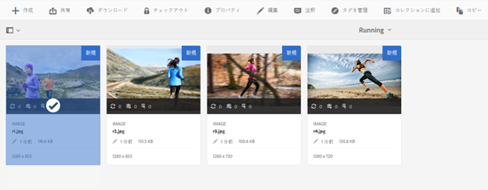
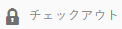
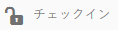
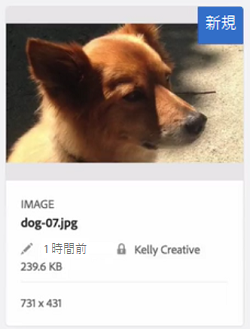
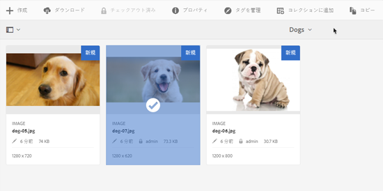
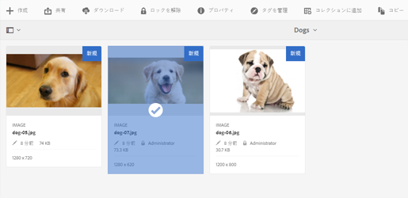
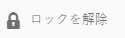

# アセット内ファイルのチェックイン、チェック-アウト {#check-in-and-check-out-files-in-assets}

Adobe Experience Manager(AEM)アセットを使用すると、変更が完了した後、アセットを編集用にチェックアウトし、再びチェックインできます。 アセットをチェックアウトした後は、アセットの編集、注釈の付加、公開、移動または削除のみが可能です。 アセットのチェックアウトでアセットにロックがかかることになります。他のユーザーは、アセットをAEM Assetsにチェックインし直すまで、アセットに対してこれらの操作を実行できません。 ただし、ロックされたアセットのメタデータは変更することができます。

アセットをチェックアウトまたはチェックインするには、アセットに対する書き込みアクセス権が必要です。

この機能は、複数のユーザーが複数のチームにわたるワークフローの編集で共同作業をする際、ある作成者が変更した内容を他のユーザーが書き換えてしまう事態を防ぐのに役立ちます。

## アセットをチェックアウト{#checking-out-assets}

1. アセットUIから、チェックアウトするアセットを選択します。 複数のアセットを選択してチェックアウトすることもできます。

   

1. ツールバーの「**[!UICONTROL チェックアウト]**」アイコンをクリックまたはタップします。

   

   「**[!UICONTROL チェックアウト]**」アイコンが、鍵の開いた「**[!UICONTROL チェックイン]**」アイコンに変わることを確認します。

   

   チェックアウトしたアセットを他のユーザーが編集できるかを確認するには、別のユーザーとしてログインします。チェックアウトしたアセットのサムネールには鍵のアイコンが表示されます。

   

   アセットを選択します。アセットを編集、注釈、公開または削除するためのオプションがツールバーに一切表示されないことを確認します。

   

   ただし、「**[!UICONTROL プロパティを表示]**」アイコンをクリックまたはタップすれば、ロックされたアセットのメタデータを編集できます。

1. 編集アイコンをクリックまたはタップして、編集モードでアセットを開きます。

   

1. アセットを編集して、変更内容を保存します。例えば、画像を切り抜いて保存します。

   

   アセットに注釈を付けたり公開したりすることもできます。

1. Assets UI で編集したアセットを選択し、ツールバーで&#x200B;**[!UICONTROL チェックイン]**&#x200B;アイコンをクリックまたはタップします。

   

   変更されたアセットは AEM Assets にチェックインされ、他のユーザーが編集できるようになります。

## 強制チェックイン{#forced-check-in}

管理者は、他のユーザーがチェックアウトしたアセットをチェックインできます。

1. 管理者として AEM Assets にログインします。
1. Assets UI で他のユーザーにチェックアウトされているアセットを 1 つ以上選択します。

   

1. ツールバーの「**[!UICONTROL ロックを解除]**」アイコンをクリックまたはタップします。アセットはチェックインされ、他のユーザーが編集できるようになります。

   