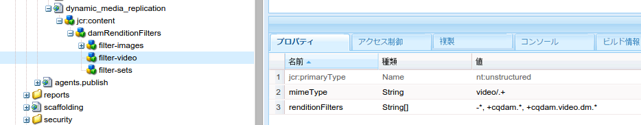
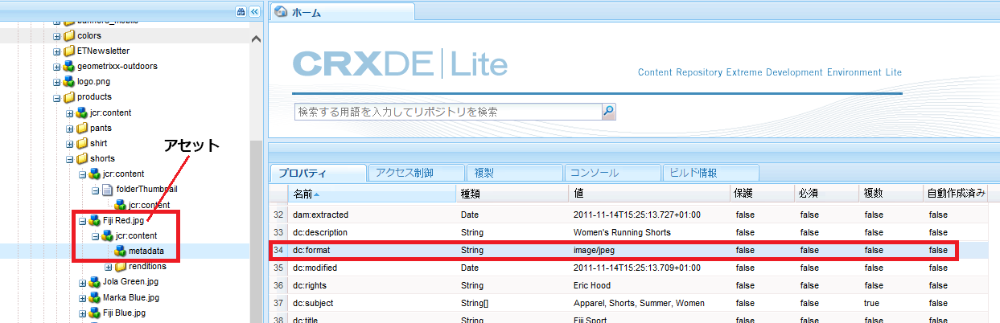

# Dynamic Media - Scene7 モードの設定 {#configuring-dynamic-media-scene-mode}

開発、ステージング、実稼動など、様々な環境用に設定されたAdobe Experience Managerを使用する場合は、各環境用にDynamic MediaCloud Servicesを設定する必要があります。

## Dynamic Media - Scene7 モードのアーキテクチャ図 {#architecture-diagram-of-dynamic-media-scene-mode}

以下のアーキテクチャ図に Dynamic Media - Scene7 モードの仕組みを示します。

新しいアーキテクチャでは、Experience Managerはマスターアセットを管理し、Dynamic Mediaと同期してアセットの処理と公開を行います。

1. マスターアセットがExperience Managerにアップロードされると、そのアセットはDynamic Mediaに複製されます。 その時点で、Dynamic Media は、ビデオエンコーディングおよび画像の動的バリアントなど、すべてのアセットの処理とレンディションの生成を扱います。
1. レンディションの生成後、Experience ManagerはリモートDynamic Mediaレンディションに安全にアクセスし、プレビューできます(バイナリがExperience Managerインスタンスに送り返されることはありません)。
1. コンテンツを公開および承認する準備ができると、Dynamic Media サービスがトリガーされ、コンテンツが配信サーバーにプッシュされて、CDN にコンテンツがキャッシュされます。


## Scene7 モードの Dynamic Media の有効化 {#enabling-dynamic-media-in-scene-mode}

[Dynamic Media はデフォルトで無効になっています。](https://www.adobe.com/solutions/web-experience-management/dynamic-media.html)ダイナミックメディア機能を利用するには、有効にする必要があります。

>[!NOTE]
>
>Dynamic Media-Scene7モードは、Experience Manager作成者インスタンス専用です。 したがって、Experience Managerの発行インスタンスではなく、Experience Managerの作成者インスタンスに`runmode=dynamicmedia_scene7`を設定する必要があります。

Dynamic Mediaを有効にするには、コマンドラインから`dynamicmedia_scene7`実行モードを使用して、ターミナルウィンドウで次のように入力する必要があります（例えば、ポートは4502です）。

```shell
java -Xms4096m -Xmx4096m -Doak.queryLimitInMemory=500000 -Doak.queryLimitReads=500000 -jar cq-quickstart-6.4.0.jar -gui -r author,dynamicmedia_scene7 -p 4502
```

## （オプション）Dynamic Media のプリセットおよび設定を 6.3 から 6.4 にダウンタイムなしで移行{#optional-migrating-dynamic-media-presets-and-configurations-from-to-zero-downtime}

Experience ManagerDynamic Mediaを6.3から6.4にアップグレードする場合（ダウンタイムをゼロにする機能を含む）、次のcurlコマンドを実行して、CRXDE Lite内の`/etc`から`/conf`にすべてのプリセットと設定を移行します。

>[!NOTE]
>
>Experience Managerインスタンスを互換モードで実行する場合（つまり、互換性パッケージがインストールされている場合）は、これらのコマンドを実行する必要はありません。

カスタムプリセットと設定を`/etc`から`/conf`に移行するには、次のLinux® curlコマンドを実行します。

`curl -u admin:admin http://localhost:4502/libs/settings/dam/dm/presets.migratedmcontent.json`

互換パッケージの有無を問わず、すべてのアップグレードについて、次のコマンドを実行することにより標準提供ビューアプリセットをコピーできます。

`curl -u admin:admin http://localhost:4502/libs/settings/dam/dm/presets/viewer.pushviewerpresets`

## （オプション）一括アセット移行のための機能パック18912をインストールします{#installing-feature-pack}

機能パック18912では、FTPを使用してアセットを一括インジェストするか、Experience Manager時にDynamic Media — ハイブリッドモードまたはDynamic MediaクラシックからDynamic Media-Scene7モードにアセットを移行できます。 Adobe Professional Servicesから入手できます。

詳しくは、[一括アセット移行の機能パック18912のインストール](bulk-ingest-migrate.md)を参照してください。

## Dynamic Media クラウドサービスの設定 {#configuring-dynamic-media-cloud-services}

パスワードを変更してから、Dynamic MediaCloud Servicesを設定します。 プロビジョニング用の電子メールを受信したら、[](https://experienceleague.adobe.com/docs/dynamic-media-classic/using/intro/dynamic-media-classic-desktop-app.html?lang=en#system-requirements-dmc-app)をDynamic Mediaクラシックデスクトップアプリケーションにサインインして、パスワードを変更する必要があります。 プロビジョニング電子メールで提供されたパスワードは、システムが生成したもので、一時的なパスワードです。Dynamic Media Cloud Service が正しい資格情報で設定されるように、パスワードを更新することが重要です。

>[!NOTE]
>
>デフォルトでは、Cloud Servicesの設定パスは`/content/dam`です。 その他の設定パスは、Dynamic Media-Scene7モードではサポートされません。

Dynamic MediaCloud Servicesを設定するには：

1. Experience Managerで、Experience Managerのロゴをタップしてグローバルナビゲーションコンソールにアクセスし、ツールアイコンをタップします。次に&#x200B;**[!UICONTROL Cloud Services/Dynamic Media設定]**&#x200B;をタップします。
1. Dynamic Media構成ブラウザーページの左ペインで、**[!UICONTROL グローバル]**&#x200B;をタップし、**[!UICONTROL 作成]**&#x200B;をタップします。 [!UICONTROL グローバル]の左にあるフォルダーアイコンをタップまたは選択しないでください。
1. [!UICONTROL Dynamic Media設定を作成]ページで、タイトル、Dynamic Mediaアカウントの電子メールアドレス、パスワードを入力します。 地域を選択します。 この情報は、プロビジョニング用の電子メールにAdobeが提供します。 電子メールを受信しなかった場合は、Adobeカスタマーケアにお問い合わせください。

   「**[!UICONTROL Dynamic Mediaに接続]**」をタップします。

   >[!NOTE]
   >
   >プロビジョニング用の電子メールを受け取ったら、[Dynamic Mediaクラシックデスクトップアプリケーション](https://experienceleague.adobe.com/docs/dynamic-media-classic/using/getting-started/signing-out.html?lang=ja#getting-started)を開き、会社アカウントにサインインしてパスワードを変更します。 プロビジョニング電子メールで提供されたパスワードは、システムが生成したもので、一時的なパスワードです。パスワードを更新して、Dynamic MediaCloud Serviceが正しい資格情報で設定されるようにすることが重要です。

1. 接続に成功すると、次も設定できます。

   * **[!UICONTROL 会社]** - Dynamic Media アカウントの名前です。様々なサブブランド、部門、異なるステージング/実稼動環境に対して複数のDynamic Mediaアカウントを設定できます。
   * **[!UICONTROL 会社のルートフォルダーのパス]**
   * **[!UICONTROL アセットを公開]** - 「**[!UICONTROL 即時]**」オプションは、アセットがアップロードされると、システムによってアセットが取り込まれ、URL／埋め込みがすぐに提供されることを意味します。アセットを公開するためにユーザーが操作する必要はありません。「**[!UICONTROL アクティベーション時]**」オプションは、URL/埋め込みリンクを指定する前に、最初にアセットを明示的に発行する必要があることを意味します。
   * **[!UICONTROL プレビューサーバーを保護]** - セキュアなレンディションプレビューサーバーへの URL パスを指定できます。つまり、レンディションが生成された後、Experience ManagerはリモートDynamic Mediaレンディションに安全にアクセスし、プレビューできます(バイナリがExperience Managerインスタンスに送り返されることはありません)。

      独自の会社サーバーまたは特別なサーバーを使用する特別な設定がない限り、Adobeはデフォルト設定を使用することを推奨します。
   >[!NOTE]
   >
   >DMS7 ではバージョン管理はサポートされていません。また、遅延アクティベーションは、Dynamic Media 設定を編集ページの「**[!UICONTROL アセットを公開]**」が「**[!UICONTROL アクティベーション時]**」に設定されている場合にのみ、アセットが最初にアクティベートされるまでの間に限って適用されます。
   >
   >アセットがアクティベートされるとすぐに、すべての更新が S7 配信にライブ公開されます。

   

1. 「**[!UICONTROL 保存]**」をタップします。
1. Dynamic Mediaコンテンツが公開される前に、安全にプレビューするには、Experience Manager作成者インスタンスを「許可リスト」してDynamic Mediaに接続する必要があります。

   * [Dynamic Media Classic デスクトップアプリケーション](https://experienceleague.adobe.com/docs/dynamic-media-classic/using/getting-started/signing-out.html#getting-started)を開き、アカウントにログインします。資格情報とログオンの詳細は、プロビジョニング時にアドビから付与されたものです。この情報をお持ちでない場合は、テクニカルサポートにお問い合わせください。
   * ページ右上付近のナビゲーションバーで、**[!UICONTROL 設定/アプリケーション設定/公開設定/Image Server]**&#x200B;をタップします。
   * Image Server 公開ページの「公開コンテキスト」ドロップダウンリストで、「**[!UICONTROL 画像サービングをテスト]**」を選択します。
   * 「クライアントアドレスフィルター」で、**[!UICONTROL 「追加」]**&#x200B;をタップします。
   * アドレスを有効（有効）にするには、チェックボックスをオンにします。 Experience Manager作成者インスタンスのIPアドレスを入力します（ディスパッチャーIPではありません）。
   * 「**[!UICONTROL 保存]**」をタップします。

これで基本設定が完了しました。Dynamic Media - Scene7 モードを使用する準備が整いました。

設定をさらにカスタマイズする場合は、[（オプション）Dynamic Media - Scene7 モードでの詳細設定](#optional-configuring-advanced-settings-in-dynamic-media-scene-mode)で示す任意のタスクをオプションで実行できます。

## （オプション）Dynamic Media - Scene7 モードでの詳細設定{#optional-configuring-advanced-settings-in-dynamic-media-scene-mode}

Dynamic Media - Scene7 モードのセットアップと設定をさらにカスタマイズしたり、パフォーマンスを最適化したりする場合は、次のオプションタスクを 1 つまたは複数実行できます。

* [（オプション）Dynamic Media - Scene7 モードのセットアップと設定](#optional-setup-and-configuration-of-dynamic-media-scene-mode-settings-p)

* [（オプション）Dynamic Media - Scene7 モードのパフォーマンスの調整](#optional-tuning-the-performance-of-dynamic-media-scene-mode)
* [（オプション）レプリケーション用のアセットのフィルタリング](#optional-filtering-assets-for-replication)

### （オプション）Dynamic Media - Scene7 モードのセットアップと設定</p> {#optional-setup-and-configuration-of-dynamic-media-scene-mode-settings-p}

**dynamicmedia_scene7**&#x200B;実行モードになっている場合は、Dynamic Mediaクラシックユーザインターフェイスを使用してDynamic Media設定を変更します。

上記のタスクの一部では、[Dynamic Media Classic デスクトップアプリケーション](https://experienceleague.adobe.com/docs/dynamic-media-classic/using/getting-started/signing-out.html#getting-started)を開いて、アカウントにログインする必要があります。

セットアップおよび設定のタスクは次のとおりです。

* [Image Server の公開設定 ](#publishing-setup-for-image-server)
* [アプリケーションの一般設定の指定](#configuring-application-general-settings)
* [カラーマネジメントの設定](#configuring-color-management)
* [サポートされる形式の MIME タイプの編集](#editing-mime-types-for-supported-formats)
* [サポートされていない形式のカスタム MIME タイプの追加](#adding-mime-types-for-unsupported-formats)
* [画像セットおよびスピンセットを自動生成するためのバッチセットプリセットの作成](#creating-batch-set-presets-to-auto-generate-image-sets-and-spin-sets)

#### Image Server の公開設定     {#publishing-setup-for-image-server}

公開設定は、アセットがデフォルトで Dynamic Media からどのように配信されるかを決定します。設定が指定されていない場合、Dynamic Media は、公開設定で定義されたデフォルト設定に従ってアセットを配信します。例えば、解像度属性が含まれていない画像を配信するように要求した場合、画像は初期設定のオブジェクト解像度設定で配信されます。

公開設定を設定するには：Dynamic Mediaクラシックで、**[!UICONTROL 設定/アプリケーション設定/公開設定/Image Server]**&#x200B;をタップします。

Image Server 画面では、画像を配信するためのデフォルト設定を指定します。各設定について詳しくは、ユーザーインターフェイスを参照してください。

* **[!UICONTROL 要求属性]** - これらの設定は、サーバーから配信できる画像を制限します。
* **[!UICONTROL 初期設定の要求属性]** - これらの設定は、画像のデフォルトの表示に関係します。
* **[!UICONTROL 共通のサムネール属性]** - これらの設定は、サムネール画像のデフォルトの表示に関係します。
* **[!UICONTROL カタログフィールドの初期設定]** - これらの設定は、画像の解像度とデフォルトのサムネールの種類に関係します。
* **[!UICONTROL カラーマネジメント属性]** - これらの設定は、使用する ICC カラープロファイルを決定します。
* **[!UICONTROL 互換性の属性]** - この設定により、後方互換性の確保のためにバージョン 3.6 の場合と同様に、テキストレイヤーの先頭と末尾の段落が処理されます。
* **[!UICONTROL ローカリゼーションサポート]** - これらの設定によって、複数のロケール属性を管理します。また、ロケールマップ文字列を指定することもできます。これにより、ビューアのツールチップで使用する言語を指定できます。ローカライゼーションサポートの設定について詳しくは、[ローカライゼーションサポートを実装する際の重要な考慮事項](https://experienceleague.adobe.com/docs/dynamic-media-classic/using/setup/publish-setup.html#image-server)を参照してください。

#### アプリケーションの一般設定の指定 {#configuring-application-general-settings}

[!UICONTROL アプリケーションの全般設定]ページを開くには、Dynamic Mediaクラシックグローバルナビゲーションバーで&#x200B;**[!UICONTROL 設定/アプリケーション設定/全般設定]**&#x200B;をタップします。

**[!UICONTROL サーバー -]**&#x200B;アカウントのプロビジョニング時に、会社に割り当てられているサーバーが Dynamic Media によって自動的に提供されます。これらのサーバーは、Web サイトとアプリケーションの URL 文字列を生成するのに使用されます。これらの URL 呼び出しは、アカウントに固有です。Experience Managerサポートによってサーバー名の変更が明示的に指示されない限り、サーバー名は変更しないでください。

**[!UICONTROL 画像を上書き]** - Dynamic Media は、2 つのファイルが同じ名前を持つことを許可しません。各項目の URL ID（ファイル名から拡張子を取り除いた部分）は一意である必要があります。これらのオプションは、置き換えるアセットのアップロード方法、つまり元のアセットを置き換えるか、重複させるかを指定します。重複するアセット名には「-1」が付けられます（例えば、chair.tif は chair-1.tif に変更されます）。これらのオプションは、元のアセットとは別のフォルダーにアップロードされるアセットや、元のアセットと異なるファイル名拡張子（JPG、TIF、PNG など）を持つアセットに影響を与えます。

* **[!UICONTROL 現在のフォルダーでベース名と拡張子が同じファイルを上書き]** - このオプションは最も厳格な置換規則です。置き換え画像を元の画像と同じフォルダーにアップロードし、置き換え画像と元の画像のファイル名拡張子が同じになっている必要があります。これらの要件が満たされない場合は、重複が作成されます。

>[!NOTE]
>
>Experience Managerとの整合性を維持するには、「**[!UICONTROL 現在のフォルダーでベース名と拡張子が同じファイルを上書き]**」を選択します。

* **[!UICONTROL 任意のフォルダーでベース名と拡張子が同じファイルを上書き]**  — 置き換え画像と元の画像のファイル名拡張子が同じである必要があります(例えば、置き換え画像と置き換え画像のファイル名拡張子は同じです( `chair.jpg` 置き換え `chair.jpg` ではなく `chair.tif`)。ただし、置き換え画像を、元の画像と別のフォルダーにアップロードできます。更新された画像は新しいフォルダーにあり、元の場所のファイルはなくなります.
* **[!UICONTROL 任意のフォルダーでベース名が同じファイルを上書き]** - このオプションは最も包括的な置換規則です。置き換え画像を、元の画像と別のフォルダーにアップロードでき、ファイル名拡張子が異なるファイルをアップロードして、元のファイルと置き換えることができます。元のファイルが別のフォルダーにある場合、置き換え画像は、アップロード先の新しいフォルダーに存在します。

**[!UICONTROL 初期設定のカラープロファイル]** - 詳細については、[カラーマネジメントの設定](#configuring-color-management)を参照してください。

>[!NOTE]
>
>デフォルトでは、アセットの詳細表示で「**[!UICONTROL レンディション]**」を選択した場合 15 個のレンディションが表示され、「**[!UICONTROL ビューア]**」を選択した場合 15 個のビューアプリセットが表示されます。この制限は増やすことができます。詳しくは、[表示する画像プリセットの数の増加](managing-image-presets.md#increasing-or-decreasing-the-number-of-image-presets-that-display)または[表示するビューアプリセットの数の増加](managing-viewer-presets.md#increasing-the-number-of-viewer-presets-that-display)を参照してください。

#### カラーマネジメントの設定 {#configuring-color-management}

Dynamic Media カラーマネジメントを使用すると、アセットをカラー補正できます。カラー補正により、取り込まれたアセットは、カラースペース（RGB、CMYK、グレー）および埋め込みカラープロファイルを維持します。動的レンディションを要求した場合、画像の色は、CMYK、RGB またはグレー出力を使用するターゲットのカラースペースに補正されます。[画像プリセットの設定](managing-image-presets.md)を参照してください。

画像を要求する際にカラー補正を有効にするためのデフォルトのカラープロパティを設定するには：

1. [Dynamic Media Classic デスクトップアプリケーション](https://experienceleague.adobe.com/docs/dynamic-media-classic/using/getting-started/signing-out.html#getting-started)を開き、プロビジョニング時に提供された資格情報を使用してアカウントにログインします。**[!UICONTROL 設定／アプリケーション設定]**&#x200B;に移動します。
1. 「**[!UICONTROL 公開設定]**」領域を展開して、「**[!UICONTROL Image Server]**」を選択します。パブリッシュインスタンスのデフォルトを設定する際に、「**[!UICONTROL 公開コンテキスト]**」を「**[!UICONTROL 画像サービング]**」に設定します。
1. 変更する必要のあるプロパティまでスクロールします。 例えば、**[!UICONTROL カラーマネジメント属性]**&#x200B;領域のプロパティ。

   次のカラー補正プロパティを設定できます。

   * [!UICONTROL CMYK のデフォルトカラースペース] - デフォルトの CMYK カラープロファイルの名前
   * [!UICONTROL グレースケールのデフォルトカラースペース] - デフォルトのグレーカラープロファイルの名前
   * [!UICONTROL RGB のデフォルトカラースペース] - デフォルトの RGB カラープロファイルの名前
   * [!UICONTROL カラー変換レンダリングの方法] - レンダリング方法を指定します。指定できる値は、`perceptual`、`relative`、`colometric`、`saturation`および`absolute colometric`です。 Adobeは、デフォルトとして`relative`を推奨します。

1. 「**[!UICONTROL 保存]**」をタップします。

例えば、**[!UICONTROL RGB の初期設定カラースペース]**&#x200B;を `sRGB` に、**[!UICONTROL CMYK の初期設定カラースペース]**&#x200B;を `WebCoated` に設定できます。

それには、次のようにします。

* RGB および CMYK 画像のカラー補正を有効にします。
* カラープロファイルのないRGB画像は、`sRGB`カラースペースにあると見なされます。
* カラープロファイルのないCMYK画像は、`WebCoated`カラースペースにあると見なされます。
* RGB出力を返すダイナミックレンディションは、`sRGB`カラースペースに返します。
* CMYK出力を返すダイナミックレンディションは、`WebCoated`カラースペースに返します。

#### サポートされる形式の MIME タイプの編集 {#editing-mime-types-for-supported-formats}

Dynamic Media によって処理されるアセットタイプを定義して、高度なアセット処理パラメーターをカスタマイズできます。例えば、アセット処理パラメーターを指定して次のことができます。

* Adobe PDF を eCatalog アセットに変換する。
* Adobe Photoshop ドキュメント（.PSD）をパーソナライズ用のバナーテンプレートアセットに変換する。
* Adobe Illustratorファイル(.AI)またはAdobe Photoshopカプセル化PostScript®ファイル(.EPS)をラスタライズします。
* [ビデオプロファイル](/help/assets/video-profiles.md)および[イメージングプロファイル](/help/assets/image-profiles.md)は、それぞれ、ビデオおよび画像の処理を定義するのに使用できます。

[アセットのアップロード](managing-assets-touch-ui.md#uploading-assets)を参照してください。

**サポートされる形式のMIMEタイプを編集するには**

1. Experience Managerで、Experience Managerのロゴをタップしてグローバルナビゲーションコンソールにアクセスし、**[!UICONTROL ツール]** （ハンマー）アイコンをタップして、**[!UICONTROL 一般/CRXDE Lite]**&#x200B;に移動します。
1. 左側のパネルで、次の場所に移動します。

   `/conf/global/settings/cloudconfigs/dmscene7/jcr:content/mimeTypes`

   

1. `mimeTypes`フォルダーの下で、MIMEタイプを選択します。
1. CRXDE Lite ページの右側の下部で、次の操作をおこないます。

   * 「**[!UICONTROL 有効]**」フィールドをダブルクリックします。デフォルトでは、すべてのアセットのMIMEタイプが有効（**[!UICONTROL true]**&#x200B;に設定）になります。これは、アセットがDynamic Mediaと同期されて処理されることを意味します。 このアセットの MIME タイプを処理から除外する場合、この設定を **[!UICONTROL false]** に変更します。
   * **[!UICONTROL jobParam]** をダブルクリックして、関連するテキストフィールドを開きます。特定の MIME タイプに使用可能な、許可されている処理パラメーター値のリストについては、[サポートされる MIME タイプ](assets-formats.md#supported-mime-types)を参照してください。

1. 次のいずれかの操作をおこないます。

   * 手順3 ～ 4を繰り返して、さらにMIMEタイプを編集します。
   * CRXDE Liteページのメニューバーで、「**[!UICONTROL すべて保存]**」をタップします。

1. ページの左上隅にある&#x200B;**[!UICONTROL CRXDE Lite]**&#x200B;をタップしてExperience Managerに戻ります。

#### サポートされていない形式のカスタム MIME タイプの追加 {#adding-custom-mime-types-for-unsupported-formats}

Experience Managerアセットで、サポートされていない形式のカスタムMIMEタイプを追加できます。 CRXDE Liteに追加した新しいノードがExperience Managerによって削除されないようにするには、**[!UICONTROL image_]**&#x200B;の前にMIMEタイプを移動し、有効値を&#x200B;**[!UICONTROL false]**&#x200B;に設定します。

**サポートされていない形式のカスタム MIME タイプを追加するには**

1. Experience Managerから、**[!UICONTROL ツール/操作/Webコンソール]**&#x200B;をクリックします。

   

1. 新しいブラウザータブが開き、**[!UICONTROL Adobe Experience Manager Web コンソール設定]**&#x200B;ページが表示されます。

   

1. ページ上で、**[!UICONTROL Adobe CQScene7アセットのMIMEタイプService]**&#x200B;の名前まで下にスクロールします。 名前の右側にある&#x200B;**[!UICONTROL 設定値を編集]**（鉛筆アイコン）をタップします。

   

1. **[!UICONTROL Adobe CQScene7アセットのMIMEタイプ「サービス]**」ページで、任意のプラス記号アイコン`+`をクリックします。 新しい MIME タイプを追加する場合にクリックする、プラス記号のテーブルの場所はすぐわかります。

   

1. 空のテキストフィールドに追加した `DWG=image/vnd.dwg` を入力します。

   例`DWG=image/vnd.dwg`は説明用です。 ここで追加する MIME タイプは、その他のサポートされていない形式でもかまいません。

   

1. ページ右下隅の「**[!UICONTROL 保存]**」をクリックします。

   この時点で、Adobe Experience Manager Web コンソール設定ページが開いているブラウザータブを閉じることができます。

1. Experience Managerコンソールを開いているブラウザータブに戻ります。

1. Experience Managerから、**[!UICONTROL ツール/一般/CRXDE Lite]**&#x200B;をクリックします。

   

1. 左側のパネルで、次の場所に移動します。

   `conf/global/settings/cloudconfigs/dmscene7/jcr:content/mimeTypes`

1. MIMEタイプ`image_vnd.dwg`をドラッグし、ツリー内の`image_`のすぐ上にドロップします。

   

1. ツリーでMIMEタイプ`image_vnd.dwg`が選択されたままの状態で、**[!UICONTROL 「プロパティ]**」タブの&#x200B;**[!UICONTROL enabled]**&#x200B;行の&#x200B;**[!UICONTROL Value]**&#x200B;列ヘッダーの下の値を重複クリックし、**[!UICONTROL Value]**&#x200B;ドロップダウンリストを開きます。

1. フィールドに `false` と入力します（または、ドロップダウンリストから「`false`」を選択します）。

   

1. CRXDE Lite ページの左上隅付近にある「**[!UICONTROL すべて保存]**」をクリックします。

#### 画像セットおよびスピンセットを自動生成するためのバッチセットプリセットの作成 {#creating-batch-set-presets-to-auto-generate-image-sets-and-spin-sets}

アセットを Dynamic Media にアップロードしながら画像セットやスピンセットを自動作成するには、バッチセットプリセットを使用します。

最初に、セット内でアセットをグループ化する方法の命名規則を定義します。 次に、バッチセットプリセットを作成できます。このプリセットは、プリセット手法で定義された命名規則に一致する画像を使用してセットの構成方法を定義する、固有の名前を持つ自己完結した命令のセットです。

ファイルをアップロードする際に、Dynamic Media によって、アクティブプリセット内の定義された命名規則に一致するすべてのファイルのセットが自動的に作成されます。

**デフォルトの命名規則の設定**

バッチセットプリセット手法で使用するデフォルトの命名規則を作成します。バッチセットプリセット定義で選択された初期設定の命名規則は、会社がセットをバッチ生成する際に必要な規則のみに該当する場合があります。 バッチセットプリセットは、定義するデフォルトの命名規則を使用するために作成されます。会社が定義するデフォルトの命名規則に例外がある場合のために、特定のコンテンツのセットに必要な代替のカスタム命名規則を含むバッチセットプリセットを、必要なだけいくつでも作成できます。

バッチセットプリセット機能を使用するために初期設定の命名規則は必要ありませんが、この関数を使用して、セットにグループ化する命名規則の要素をいくつでも定義できます。 これにより、バッチセットの作成を効率化できます。

別の方法として、**[!UICONTROL 表示コード]**&#x200B;を使用し、使用できるフォームフィールドはありません。 この表示では、正規式を使用する命名規則の定義を作成します。

定義には、**[!UICONTROL 一致]**&#x200B;と&#x200B;**[!UICONTROL ベース名]**&#x200B;の2つの要素を使用できます。 これらのフィールドでは、命名規則のすべての要素を定義して、要素が含まれるセットを命名するために使用される規則の一部を指定できます。会社の個々の命名規則では、これらのエレメントごとに1行以上の定義を使用できます。 一意の定義に対して行をいくつでも使用し、異なる要素にグループ化します。 例えば、メイン画像、カラー要素、代替表示要素、スウォッチ要素です。

**デフォルトの命名規則を設定するには：:**

1. [Dynamic Media Classic デスクトップアプリケーション](https://experienceleague.adobe.com/docs/dynamic-media-classic/using/getting-started/signing-out.html#getting-started)を開き、アカウントにログインします。

   資格情報とログオンの詳細は、プロビジョニング時にアドビから付与されたものです。この情報をお持ちでない場合は、テクニカルサポートにお問い合わせください。

1. ページの上付近にあるナビゲーションバーで、**[!UICONTROL 設定／アプリケーション設定／バッチセットプリセット／デフォルトの名前]をタップします。**
1. 「**[!UICONTROL フォームを表示]**」または「**[!UICONTROL コードを表示]**」を選択し、各要素に関する情報の表示と入力の方法を指定します。

   「**[!UICONTROL コードを表示]**」チェックボックスを選択して、選択した形式と同時に作成される正規表現値を表示できます。フォーム表示により制限を受ける場合、命名規則の要素を定義するために正規表現値を入力または変更できます。値をフォーム表示で解析できない場合は、フォームフィールドは非アクティブになります。

   >[!NOTE]
   >
   >非アクティブなフォームフィールドは、正規表現の正誤に関する検証を実行しません。「結果」行で各要素に作成する正規表現の結果を確認できます。完全な正規表現は、ページの一番下に表示されます。

1. 必要に応じて各要素を展開し、使用する命名規則を入力します。
1. 必要に応じて、次の操作をおこないます。

   * 別の命名規則を要素に追加するには、「**[!UICONTROL 追加]**」をタップします。
   * 要素の命名規則を削除するには、「**[!UICONTROL 削除]**」をタップします。

1. 次のいずれかの操作をおこないます。

   * 「**[!UICONTROL 名前を付けて保存]**」をタップし、プリセットの名前を入力します。
   * 既存のプリセットを編集している場合は、「**[!UICONTROL 保存]**」をタップします。

**バッチセットプリセットの作成**

Dynamic Media では、バッチセットプリセットを使用して、アセットをビューアで表示するための画像のセット（代替画像、カラーオプション、360 スピン）に整理します。バッチセットプリセットは、Dynamic Media でのアセットアップロード処理と同時に自動的に実行されます。

バッチセットプリセットを作成、編集および管理できます。バッチセットプリセット定義には2つの形式があります。1つは、設定する初期設定の命名規則のもので、もう1つは、その場で作成するカスタムの命名規則のものです。

バッチセットプリセットを定義するフォームフィールドメソッドとコードメソッドのどちらかを使用できます（正規表現を使用できます）。「デフォルトの名前」のように、[!UICONTROL フォーム表示]での定義と同時に[!UICONTROL 表示コード]を選択し、正規式を使用して定義を作成できます。 また、どちらかの表示をオフにして、一方の表示のみを使用することもできます。

**バッチセットプリセットを作成するには：:**

1. [Dynamic Media Classic デスクトップアプリケーション](https://experienceleague.adobe.com/docs/dynamic-media-classic/using/getting-started/signing-out.html#getting-started)を開き、アカウントにログインします。

   資格情報とログオンの詳細は、プロビジョニング時にアドビから付与されたものです。この情報をお持ちでない場合は、テクニカルサポートにお問い合わせください。

1. ページの上付近にあるナビゲーションバーで、**[!UICONTROL 設定／アプリケーション設定／バッチセットプリセット／バッチセットプリセット]をタップします。**

   [!UICONTROL 「表示フォーム]」は、  詳細ページの右上隅に設定されているデフォルトの表示です。

1. プリセットリストパネルで、追加&#x200B;****&#x200B;をタップして、画面の右側の&#x200B;**[!UICONTROL 詳細]**&#x200B;パネルの定義フィールドをアクティブにします。
1. **[!UICONTROL 詳細]**&#x200B;パネルの「**[!UICONTROL プリセット名]**」フィールドにプリセットの名前を入力します。
1. **[!UICONTROL バッチセットの種類]**&#x200B;ドロップダウンメニューで、プリセットの種類を選択します。
1. 次のいずれかの操作をおこないます。

   * 以前、**[!UICONTROL アプリケーション設定／バッチセットプリセット／デフォルトの名前]**&#x200B;で設定したデフォルトの命名規則を使用する場合は、「**[!UICONTROL アセットの命名規則]******」を展開し、「ファイル名」ドロップダウンリストで「**[!UICONTROL デフォルト]**」をタップします。
   * プリセット&#x200B;**[!UICONTROL アセットの命名規則]**&#x200B;を設定する際に新しい命名規則を定義するには、**[!UICONTROL ファイル名]**&#x200B;ドロップダウンリストで&#x200B;**[!UICONTROL カスタム]**&#x200B;をタップします。

1. [!UICONTROL シーケンスの順序]に対して、セットがDynamic Mediaでグループ化された後に画像が表示される順序を定義します。

   デフォルトでは、アセットはアルファベット順に並んでいます。ただし、コンマ区切りの正規表現リストを使用して順番を定義できます。

1. **[!UICONTROL 名前]**&#x200B;と&#x200B;**[!UICONTROL 作成規則]**&#x200B;を設定するには、**[!UICONTROL アセットの命名規則]**&#x200B;で定義したベース名にサフィックスまたはプレフィックスを指定します。 また、Dynamic Mediaフォルダー構造内のセットの作成場所を定義します。

   大量のセットを定義する場合は、アセット自体を含むフォルダとは別にセットを保存します。 例えば、画像セットフォルダーを作成し、生成されたセットをここに配置します。

1. **[!UICONTROL 詳細]**&#x200B;パネルで、**[!UICONTROL 保存]**&#x200B;をタップします。
1. 新しいプリセット名の隣にある「**[!UICONTROL アクティブ]**」をタップします。

   プリセットをアクティブにすると、アセットを Dynamic Media にアップロードする際に、バッチセットプリセットを適用してセットを生成できます。

**2D スピンセットを自動生成するためのバッチセットプリセットの作成**

バッチセットの種類の&#x200B;**[!UICONTROL 多軸スピンセット]**&#x200B;を使用して、2D スピンセットの生成を自動化する手法を作成できます。画像のグループ化では行と列の正規表現を使用するので、画像アセットが多次元の配列の対応する場所に正しく配置されます。多軸スピンセットの行数または列数には、上限または下限はありません。

例として、`spin-2dspin` という名前の多軸スピンセットを作成します。1 行あたり 12 個の画像が含まれる 3 行のスピンセット画像セットがあります。画像の名前は次のとおりです。

```
spin-01-01 
 spin-01-02 
 … 
 spin-01-12 
 spin-02-01 
 … 
 spin-03-12
```

この情報を使用して、[!UICONTROL バッチセットの種類]のレシピを次のように作成できます。


スピンセットのアセット名の一部を共有する部分のグループは、「**[!UICONTROL 一致]**」フィールドに追加されます（強調表示されています）。 行と列を含むアセット名の可変部分は、それぞれ「**[!UICONTROL 行]**」フィールドと「**[!UICONTROL 列]**」フィールドに追加しています。

スピンセットをアップロードして公開するときに、**[!UICONTROL アップロードオプションを設定]**&#x200B;ダイアログボックスの&#x200B;**[!UICONTROL バッチセットプリセット]**&#x200B;に表示される2Dスピンセット手法の名前をアクティブ化します。

**2D スピンセットを自動生成するためのバッチセットプリセットを作成するには：:**

1. [Dynamic Media Classic デスクトップアプリケーション](https://experienceleague.adobe.com/docs/dynamic-media-classic/using/getting-started/signing-out.html#getting-started)を開き、アカウントにログインします。

   資格情報とログオンの詳細は、プロビジョニング時にアドビから付与されたものです。この情報をお持ちでない場合は、テクニカルサポートにお問い合わせください。

1. ページの上付近にあるナビゲーションバーで、**[!UICONTROL 設定／アプリケーション設定／バッチセットプリセット／バッチセットプリセット]**&#x200B;をタップします。

   [!UICONTROL 「表示フォーム]」は、  詳細ページの右上隅に設定されているデフォルトの表示です。

1. **[!UICONTROL プリセットリスト]**&#x200B;パネルで&#x200B;**[!UICONTROL 追加]**&#x200B;をタップし、画面の右側の&#x200B;**[!UICONTROL 詳細]**&#x200B;パネルの定義フィールドをアクティブにします。
1. **[!UICONTROL 詳細]**&#x200B;パネルの「[!UICONTROL プリセット名]」フィールドにプリセットの名前を入力します。
1. **[!UICONTROL バッチセットの種類]**&#x200B;ドロップダウンメニューで、**[!UICONTROL アセットセット]**&#x200B;を選択します。
1. **[!UICONTROL サブタイプ]**&#x200B;ドロップダウンリストで、**[!UICONTROL 多軸スピンセット]**&#x200B;を選択します。
1. **[!UICONTROL アセットの命名規則]**&#x200B;を展開し、**[!UICONTROL ファイル名]**&#x200B;ドロップダウンリストで&#x200B;**[!UICONTROL カスタム]**&#x200B;をタップします。
1. 「**[!UICONTROL 一致]**」およびオプションとして「**[!UICONTROL ベース名]**」の属性を使用して、グループを構成する画像アセットの命名に使用する正規表現を定義します。

   リテラル一致正規式の例を次に示します。

   `(w+)-w+-w+`

1. 「**[!UICONTROL 行と列の位置]**」を展開し、2D スピンセット配列内の画像アセットの位置の名前形式を定義します。

   ファイル名内での行または列の位置は丸括弧で囲みます。

   例えば、行の正規式の場合、次のようになります。

   `\w+-R([0-9]+)-\w+`

   または

   `\w+-(\d+)-\w+`

   列の正規式の場合、次のようになります。

   `\w+-\w+-C([0-9]+)`

   または

   `\w+-\w+-C(\d+)`

   これらの式は説明用の例に過ぎません。 必要に応じて独自の正規表現を作成できます。

   >[!NOTE]
   >
   >行と列の正規式の組み合わせが、多次元スピンセット配列内でアセットの位置を特定できない場合、そのアセットはセットに追加されず、エラーが記録されます。

1. **[!UICONTROL 名前]**&#x200B;と&#x200B;**[!UICONTROL 作成規則]**&#x200B;を設定するには、**[!UICONTROL アセットの命名規則]**&#x200B;で定義したベース名にサフィックスまたはプレフィックスを指定します。

   また、Dynamic Mediaクラシックフォルダ構造内のスピンセットの作成場所を定義します。

   大量のセットを定義する場合は、アセット自体を含むフォルダとは別にセットを保存します。 例えば、スピンセットフォルダーを作成して、そこに生成されたセットを配置します。

1. **[!UICONTROL 詳細]**&#x200B;パネルで、**[!UICONTROL 保存]**&#x200B;をタップします。
1. 新しいプリセット名の隣にある「**[!UICONTROL アクティブ]**」をタップします。

   プリセットをアクティブにすると、アセットを Dynamic Media にアップロードする際に、バッチセットプリセットを適用してセットを生成できます。

### （オプション）Dynamic Media - Scene7 モードのパフォーマンスの調整  {#optional-tuning-the-performance-of-dynamic-media-scene-mode}

Dynamic Media-Scene7モードをスムーズに動作させるため、Adobeでは、次の同期パフォーマンス/スケーラビリティの最適な調整のヒントを推奨します。

* 様々なファイル形式の処理に対応する定義済みのジョブパラメーターを更新する。
* 事前定義済みの Granite のワークフロー（ビデオアセット）キューワーカースレッドを更新する。
* Granite の事前定義済みの一時的なワークフロー（画像および非ビデオアセット）キューワーカースレッドを更新する。
* Dynamic Media Classic サーバーへの最大アップロード接続数を更新する。

#### 様々なファイル形式の処理に対応する定義済みのジョブパラメーターを更新する

ジョブパラメータを調整して、ファイルアップロード時の処理を高速化できます。例えば、PSDファイルをアップロードし、テンプレートとして処理したくない場合に、レイヤーの抽出をfalse（オフ）に設定できます。 この場合、調整されたジョブパラメーターは次のように表示されます。`process=None&createTemplate=false`.

テンプレートの作成を有効にする場合は、次のパラメーターを使用します。`process=MaintainLayers&layerNaming=AppendName&createTemplate=true`.

<!-- REMOVED BASED ON CQDOC-17657 You can tune job parameters for faster processing when you upload files. For example, if you are uploading PSD files, but do not want to process them as templates, you can set layer extraction to false (off). In such case, the tuned job parameter would appear as `process=None&createTemplate=false`. -->

Adobeでは、PDF、PostScript®およびPSDファイルに対して、次の「調整済み」ジョブパラメーターを使用することをお勧めします。

<!-- OLD PDF JOB PARAMETERS `pdfprocess=Rasterize&resolution=150&colorspace=Auto&pdfbrochure=false&keywords=false&links=false` -->

<!-- OLD POSTSCRIPT JOB PARAMETERS `psprocess=Rasterize&psresolution=150&pscolorspace=Auto&psalpha=false&psextractsearchwords=false&aiprocess=Rasterize&airesolution=150&aicolorspace=Auto&aialpha=false` -->

| ファイルタイプ | 推奨されるジョブパラメーター |
| ---| ---|
| PDF | `pdfprocess=Thumbnail&resolution=150&colorspace=Auto&pdfbrochure=false&keywords=false&links=false` |
| PostScript® | `psprocess=Rasterize&psresolution=150&pscolorspace=Auto&psalpha=false&psextractsearchwords=false&aiprocess=Thumbnail&airesolution=150&aicolorspace=Auto&aialpha=false` |
| PSD | `process=None&layerNaming=AppendName&anchor=Center&createTemplate=false&extractText=false&extendLayers=false` |

<!-- CQDOC-17657 for PSD entry in table above -->

これらのパラメーターのいずれかを更新するには、[MIME タイプベースの Assets／Dynamic Media Classic アップロードジョブパラメーターサポートの有効化](/help/sites-administering/scene7.md#enabling-mime-type-based-assets-scene-upload-job-parameter-support)の手順に従います。

#### Granite の一時的なワークフローキューの更新 {#updating-the-granite-transient-workflow-queue}

Granite の一時的なワークフローキューは、**[!UICONTROL DAM アセットの更新]**&#x200B;ワークフローに使用されます。Dynamic Media では、画像の取り込みおよび処理に使用されます。

**Granite の一時的なワークフローキューを更新するには：**

1. [https://&lt;server>/system/console/configMgr](http://localhost:4502/system/console/configMgr) に移動して、**[!UICONTROL Queue: Granite Transient Workflow Queue]** を検索します。

   >[!NOTE]
   >
   >OSGi PID は動的に生成されるので、ダイレクト URL ではなく、テキスト検索が必要です。

1. 「**[!UICONTROL 並列ジョブの最大数]**」フィールドで、目的の値に数値を変更します。

   **[!UICONTROL 並列ジョブの最大数]**&#x200B;を増やすと、Dynamic Media へのファイルの大量アップロードを適切にサポートできます。正確な値は、ハードウェア容量によって異なります。 初回移行や1回限りのバルクアップロードなど、特定のシナリオでは、大きな値を使用できます。 ただし、大きな値（コア数の2倍など）を使用すると、他の同時アクティビティに悪影響を及ぼす可能性があることに注意してください。 そのため、特定の使用事例に基づいて値をテストし、調整します。

<!--    By default, the maximum number of parallel jobs depends on the number of available CPU cores. For example, on a 4-core server, it assigns 2 worker threads. (A value between 0.0 and 1.0 is ratio based, or any numbers greater than 1 will assign the number of worker threads.)

   Adobe recommends that 32 **[!UICONTROL Maximum Parallel Jobs]** be configured to adequately support heavy upload of files to Dynamic Media Classic. -->


1. 「**[!UICONTROL 保存]**」をタップします。

#### Granite のワークフローキューの更新 {#updating-the-granite-workflow-queue}

Granite のワークフローキューは、一時的でないワークフローに使用されます。Dynamic Mediaでは、**[!UICONTROL Dynamic Mediaエンコードビデオ]**&#x200B;のワークフローでビデオを処理するのに使用しました。

**Granite のワークフローキューを更新するには：:**

1. `https://<server>/system/console/configMgr` に移動して、**[!UICONTROL Queue: Granite Workflow Queue]** を検索します。

   >[!NOTE]
   >
   >OSGi PID は動的に生成されるので、ダイレクト URL ではなく、テキスト検索が必要です。

1. 「**[!UICONTROL 並列ジョブの最大数]**」フィールドで、目的の値に数値を変更します。

   デフォルトでは、並列ジョブの最大数は、使用可能な CPU コア数によって異なります。例えば、4コアサーバーでは、2つのワーカースレッドが割り当てられます。 （0.0 ～ 1.0の値は比率ベース、または1より大きい任意の数値によって、ワーカースレッドの数が割り当てられます）。

   ほとんどの事例では、デフォルト設定の 0.5 で十分です。

   

1. 「**[!UICONTROL 保存]**」をタップします。

#### Scene7 アップロード接続の更新 {#updating-the-scene-upload-connection}

「Scene7アップロード接続」設定により、Experience ManagerアセットがDynamic Mediaクラシックサーバーに同期されます。

**Scene7 アップロード接続を更新するには：:**

1. `https://<server>/system/console/configMgr/com.day.cq.dam.scene7.impl.Scene7UploadServiceImpl` に移動します。
1. 「[!UICONTROL Number of connections]」フィールドおよび「[!UICONTROL Active job timeout]」フィールドで、必要に応じて数値を変更します。

   **[!UICONTROL 接続数]**&#x200B;設定は、Dynamic MediaへのアップロードにExperience ManagerできるHTTP接続の最大数を制御します。通常、10個の接続の定義済み値で十分です。

   「**[!UICONTROL Active job timeout]**」設定は、アップロードされた Dynamic Media アセットが配信サーバーで公開されるまでの待機時間を決定します。デフォルトでは、この値は 2100 秒または 35 分です。

   ほとんどの事例では、2100 の設定で十分です。

   

1. 「**[!UICONTROL 保存]**」をタップします。

### （オプション）レプリケーション用のアセットのフィルタリング{#optional-filtering-assets-for-replication}

Dynamic Media以外のデプロイメントでは、Experience Manager作成者環境からExperience Manager発行ノードに、*すべての*&#x200B;アセット（画像とビデオの両方）を複製します。 このワークフローは、Experience Managerの発行サーバーがアセットも配信するので必要です。

ただし、Dynamic Mediaのデプロイメントでは、アセットはCloud Service経由で配信されるので、同じアセットをExperience Managerの発行ノードに複製する必要はありません。 このような「ハイブリッドパブリッシング」ワークフローは、アセットの複製に伴うストレージの余分なコストと処理時間を回避します。 サイトページなどの他のコンテンツは、引き続きExperience Managerの公開ノードから提供されます。

フィルターを使用すると、Experience Managerの発行ノードにアセットがレプリケートされないように&#x200B;*除外*&#x200B;できます。

#### レプリケーションへのデフォルトのアセットフィルターの使用 {#using-default-asset-filters-for-replication}

画像処理、ビデオ、またはその両方にDynamic Mediaを使用している場合は、Adobeがそのまま提供する初期設定のフィルターを使用できます。 次のフィルターがデフォルトでアクティブです。

<table> 
 <tbody> 
  <tr> 
   <td> </td> 
   <td><strong>フィルター</strong></td> 
   <td><strong>MIME タイプ</strong></td> 
   <td><strong>レンディション</strong></td> 
  </tr> 
  <tr> 
   <td>ダイナミックメディア画像配信</td> 
   <td><p>filter-images</p> <p>filter-sets</p> <p> </p> </td> 
   <td><p><strong>image/</strong> で始まる</p> <p><strong>application/</strong> を含み、<strong>set</strong> で終わる</p> </td> 
   <td>標準提供の「filter-images」（インタラクティブな画像などの単一の画像アセットに適用）および「filter-sets」（スピンセット、画像セット、混在メディアセットおよびカルーセルセット）では、次のようになります。 
    <ul> 
     <li>オリジナル画像と静的画像レンディションがレプリケーションから除外されます。</li> 
    </ul> </td> 
  </tr> 
  <tr> 
   <td>ダイナミックメディアビデオ配信</td> 
   <td>filter-video</td> 
   <td><strong>video/</strong> で始まる</td> 
   <td>標準提供の「filter-video」では、次のようになります。 
    <ul> 
     <li>元のビデオと静的なサムネールレンディションを複製から除外します。<br /> <br /> </li> 
    </ul> </td> 
  </tr> 
 </tbody> 
</table>

>[!NOTE]
>
>フィルターはMIME型に適用され、パスに固有のものにすることはできません。

#### レプリケーション用のアセットフィルターのカスタマイズ {#customizing-asset-filters-for-replication}

1. Experience Managerで、Experience Managerのロゴをタップしてグローバルナビゲーションコンソールにアクセスし、**[!UICONTROL ツール]**&#x200B;アイコンをタップして、**[!UICONTROL 一般/CRXDE Lite]**&#x200B;に移動します。
1. 左のフォルダーツリーで、`/etc/replication/agents.author/publish/jcr:content/damRenditionFilters`に移動してフィルターを確認します。

   

1. フィルターの MIME タイプを定義するために、次のように MIME タイプを特定することができます。

   左側のレールで、**[!UICONTROL コンテンツ/dam/&lt;`locate_your_asset`>/jcr:content/metadata]**&#x200B;を展開し、テーブルで&#x200B;**[!UICONTROL dc:format]**&#x200B;を探します。

   次の図は、あるアセットの dc:format へのパスの例を示しています。

   

   アセット`Fiji Red.jpg`の`dc:format`は`image/jpeg`です。

   このフィルターをすべての画像に適用するには、その形式に関係なく、値を`image/*`に設定します。`*`は、任意の形式のすべての画像に適用される正規式です。

   JPEG形式の画像にのみフィルターを適用するには、`image/jpeg`の値を入力します。

1. レプリケーションに含めるレンディションまたは除外するレンディションを定義します。

   レプリケーション用のフィルターに使用できる文字は次のとおりです。

   <table> 
    <tbody> 
    <tr> 
    <td><strong>使用する文字</strong></td> 
    <td><strong>レプリケーション用のアセットのフィルター方法</strong></td> 
    </tr> 
    <tr> 
    <td>*</td> 
    <td>ワイルドカード文字<br /> </td> 
    </tr> 
    <tr> 
    <td>+</td> 
    <td>レプリケーション用にアセットを含める</td> 
    </tr> 
    <tr> 
    <td>-</td> 
    <td>レプリケーションからアセットを除外する</td> 
    </tr> 
    </tbody> 
   </table>

   **content/dam/&lt;`locate your asset`>/jcr:content/renditions**&#x200B;に移動します。

   次の図は、あるアセットのレンディションの例を示しています。

   

   オリジナルを複製したい場合は、`+original`と入力します。
