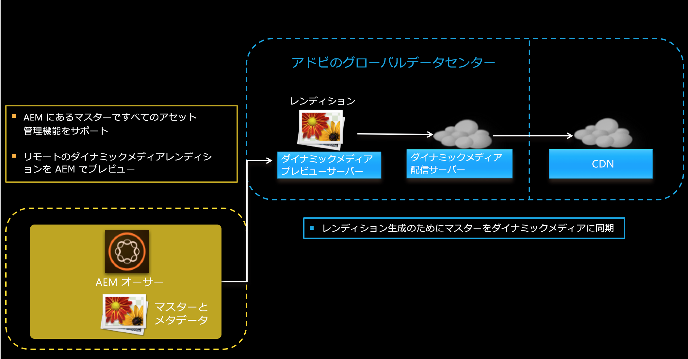
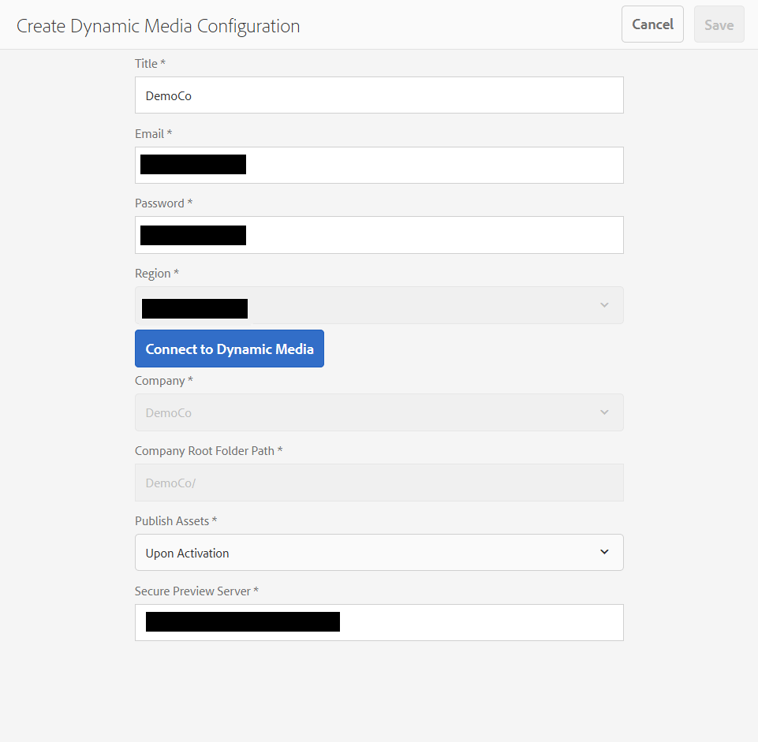

# Dynamic Media - Scene7 モードの設定 {#configuring-dynamic-media-scene-mode}

開発用、ステージング用、実稼動用など、複数の異なる環境向けに Adobe Experience Manager をセットアップして使用する場合は、それぞれの環境向けに Dynamic Media Cloud Services を設定する必要があります。

## Dynamic Media - Scene7 モードのアーキテクチャ図 {#architecture-diagram-of-dynamic-media-scene-mode}

以下のアーキテクチャ図に Dynamic Media - Scene7 モードの仕組みを示します。

新しいアーキテクチャでは、AEM は、マスターアセットを担当し、アセットの処理および公開のための Dynamic Media と同期します。

1. マスターアセットが AEM にアップロードされると、Dynamic Media にレプリケートされます。その時点で、Dynamic Media は、ビデオエンコーディングおよび画像の動的バリアントなど、すべてのアセットの処理とレンディションの生成を扱います。
1. レンディションが生成されると、AEM は、リモートの Dynamic Media レンディションに安全にアクセスおよびプレビューできます（バイナリは AEM インスタンスに送り返されません）。
1. コンテンツを公開および承認する準備ができると、Dynamic Media サービスがトリガーされ、コンテンツが配信サーバーにプッシュされて、CDN にコンテンツがキャッシュされます。



## Scene7 モードの Dynamic Media の有効化 {#enabling-dynamic-media-in-scene-mode}

[Dynamic Media はデフォルトで無効になっています。](https://www.adobe.com/solutions/web-experience-management/dynamic-media.html)Dynamic Media の機能を活用するには、Dynamic Media を有効にする必要があります。

>[注意]
>
>ダイナミックメディア —Scene7モードは、AEMオーサーインスタンス専用です。 したがって、AEM発行インスタンス `runmode=dynamicmedia_scene7`ではなく、AEM作成者インスタンスで設定する必要があります。

To enable Dynamic Media, you must startup AEM using the `dynamicmedia_scene7` runmode from the command line by entering the folllowing in a terminal window (example port used is 4502):

```shell
java -Xms4096m -Xmx4096m -Doak.queryLimitInMemory=500000 -Doak.queryLimitReads=500000 -jar cq-quickstart-6.4.0.jar -gui -r author,dynamicmedia_scene7 -p 4502
```

## （オプション）Dynamic Media のプリセットおよび設定を 6.3 から 6.4 にダウンタイムなしで移行{#optional-migrating-dynamic-media-presets-and-configurations-from-to-zero-downtime}

If you are upgrading AEM Dynamic Media from 6.3 to 6.4 (which now includes the ability for zero downtime deployments), you are required to run the following curl command to migrate all your presets and configurations from `/etc` to `/conf` in CRXDE Lite.

>[注意]
>
>互換モードでAEMインスタンスを実行する場合（つまり、互換性パッケージがインストールされている場合）は、これらのコマンドを実行する必要はありません。

To migrate your custom presets and configurations from `/etc` to `/conf`, run the following Linux curl command:

`curl -u admin:admin http://localhost:4502/libs/settings/dam/dm/presets.migratedmcontent.json`

互換パッケージの有無を問わず、すべてのアップグレードについて、次のコマンドを実行することにより標準提供ビューアプリセットをコピーできます。

`curl -u admin:admin http://localhost:4502/libs/settings/dam/dm/presets/viewer.pushviewerpresets`

## (Optional) Installing feature pack 18912 for bulk asset migration {#installing-feature-pack}

機能パック18912では、FTPを使用してアセットを一括取り込むか、アセットをダイナミックメディア — ハイブリッドモードまたはダイナミックメディアクラシックからAEMのダイナミックメディア —Scene7モードに移行できます。 Adobe Professional Servicesから入手できます。

詳しくは、一括アセット移行について [機能パック18912のインストールを参照してください](bulk-ingest-migrate.md) 。

## Dynamic Media クラウドサービスの設定 {#configuring-dynamic-media-cloud-services}

ダイナミックメディアCloud Servicesを設定する前に、パスワードを変更します。 After you receive your provisioning email with Dynamic Media credentials, you must [log in](https://www.adobe.com/jp/marketing/experience-manager/scene7-login.html) to Dynamic Media Classic to change your password. プロビジョニング電子メールで提供されたパスワードは、システムが生成したもので、一時的なパスワードです。Dynamic Media Cloud Service が正しい資格情報で設定されるように、パスワードを更新することが重要です。

>[!NOTE]
>
>デフォルトでは、Cloud Servicesの設定パスはです `/content/dam`。 その他の設定パスは、ダイナミックメディア —Scene7モードではサポートされません。

ダイナミックメディアCloud Servicesを設定するには：

1. In AEM, tap the AEM logo to access the global navigation console and tap the Tools icon, then tap **[!UICONTROL Cloud Services > Dynamic Media Configuration]**.
1. On the Dynamic Media Configuration Browser page, in the left pane, tap **[!UICONTROL global]** and tap **[!UICONTROL Create]**. グロー [!UICONTROL バルの左側にあるフォルダーアイコンをタップまたは選択しないでください]。
1. On the [!UICONTROL Create Dynamic Media Configuration] page, enter a title, the Dynamic Media account email address, password, then select your region. これらは、プロビジョニング電子メールでアドビから提供されます。このメッセージを受け取っていない場合は、サポートにお問い合わせください。

   Tap **[!UICONTROL Connect to Dynamic Media]**.

   >[!NOTE]
   >
   >Dynamic Media の資格情報を含むプロビジョニング電子メールを受信したら、Dynamic Media Classic に[ログイン](https://www.adobe.com/jp/marketing/experience-manager/scene7-login.html)して、パスワードを変更してください。プロビジョニング電子メールで提供されたパスワードは、システムが生成したもので、一時的なパスワードです。Dynamic Media Cloud Service が正しい資格情報で設定されるように、パスワードを更新することが重要です。

1. 接続に成功すると、次も設定できます。

   * **[!UICONTROL 会社]** - Dynamic Media アカウントの名前です。異なるサブブランドや事業部、または異なるステージング／実稼動環境のために、複数の Dynamic Media アカウントを持っていることがあります。
   * **[!UICONTROL 会社のルートフォルダーのパス]**
   * **[!UICONTROL アセットを公開]** - 「**[!UICONTROL 即時]**」オプションは、アセットがアップロードされると、システムによってアセットが取り込まれ、URL／埋め込みがすぐに提供されることを意味します。アセットを公開するためにユーザーが操作する必要はありません。「**[!UICONTROL アクティベーション時]**」オプションは、URL／埋め込みリンクが提供される前に、最初にアセットを明示的に公開する必要があることを意味します。
   * **[!UICONTROL プレビューサーバーを保護]** - セキュアなレンディションプレビューサーバーへの URL パスを指定できます。つまり、レンディションが生成されると、AEM は、リモートの Dynamic Media レンディションに安全にアクセスしてプレビューできます（バイナリは AEM インスタンスに送り返されません）。

      独自の会社のサーバまたは特別なサーバを使用する特別な配置がない限り、Adobeはデフォルト設定を使用することを推奨します。
   >[!NOTE]
   >
   >DMS7 ではバージョン管理はサポートされていません。また、遅延アクティベーションは、Dynamic Media 設定を編集ページの「**[!UICONTROL アセットを公開]**」が「**[!UICONTROL アクティベーション時]**」に設定されている場合にのみ、アセットが最初にアクティベートされるまでの間に限って適用されます。
   >
   >アセットがアクティベートされるとすぐに、すべての更新が S7 配信にライブ公開されます。

   

1. 「**[!UICONTROL 保存]**」をタップします。
1. Dynamic Media コンテンツを公開する前に安全にプレビューするには、AEM オーサーインスタンスを「許可リストに登録」して、Dynamic Media に接続する必要があります。

   * Dynamic Media Classic アカウントにログインします（[http://www.adobe.com/jp/marketing-cloud/experience-manager/scene7-login.html](https://www.adobe.com/jp/marketing/experience-manager/scene7-login.html)）。資格情報とログオンは、プロビジョニング時にアドビから付与されたものです。この情報をお持ちでない場合は、テクニカルサポートにお問い合わせください。
   * On the navigation bar near the top right of the page, tap **[!UICONTROL Setup > Application Setup > Publish Setup > Image Server]**.
   * Image Server 公開ページの「公開コンテキスト」ドロップダウンリストで、「**[!UICONTROL 画像サービングをテスト]**」を選択します。
   * 「クライアントアドレスフィルター」で、**[!UICONTROL 「追加」]**&#x200B;をタップします。
   * チェックボックスを選択してアドレスを有効（オン）にしてから、AEM オーサーインスタンスの IP アドレス（Dispatcher IP ではない）を入力します。
   * 「**[!UICONTROL 保存]**」をタップします。

これで基本設定が完了しました。Dynamic Media - Scene7 モードを使用する準備が整いました。

設定をさらにカスタマイズする場合は、[（オプション）Dynamic Media - Scene7 モードでの詳細設定](#optional-configuring-advanced-settings-in-dynamic-media-scene-mode)で示す任意のタスクをオプションで実行できます。

## （オプション）Dynamic Media - Scene7 モードでの詳細設定{#optional-configuring-advanced-settings-in-dynamic-media-scene-mode}

Dynamic Media - Scene7 モードのセットアップと設定をさらにカスタマイズしたり、パフォーマンスを最適化したりする場合は、次のオプションタスクを 1 つまたは複数実行できます。

* [（オプション）Dynamic Media - Scene7 モードのセットアップと設定](#optional-setup-and-configuration-of-dynamic-media-scene-mode-settings-p)

* [（オプション）Dynamic Media - Scene7 モードのパフォーマンスの調整](#optional-tuning-the-performance-of-dynamic-media-scene-mode)
* [（オプション）レプリケーション用のアセットのフィルタリング](#optional-filtering-assets-for-replication)

### （オプション）Dynamic Media - Scene7 モードのセットアップと設定</p> {#optional-setup-and-configuration-of-dynamic-media-scene-mode-settings-p}

When you are in run mode **dynamicmedia_scene7**, you use the Dynamic Media Classic (Scene7) user interface to make changes to your Dynamic Media settings.

Some of the tasks above require that you log into Dynamic Media Classic here: [https://www.adobe.com/marketing-cloud/experience-manager/scene7-login.html](https://www.adobe.com/jp/marketing/experience-manager/scene7-login.html)

セットアップおよび設定のタスクは次のとおりです。

* [Image Server の公開設定 ](#publishing-setup-for-image-server)
* [アプリケーションの一般設定の指定](#configuring-application-general-settings)
* [カラーマネジメントの設定](#configuring-color-management)
* [アセット処理の設定](#configuring-asset-processing)
* [サポートされていない形式のカスタム MIME タイプの追加](#adding-custom-mime-types-for-unsupported-formats)
* [画像セットおよびスピンセットを自動生成するためのバッチセットプリセットの作成](#creating-batch-set-presets-to-auto-generate-image-sets-and-spin-sets)

#### Image Server の公開設定    {#publishing-setup-for-image-server}

公開設定は、アセットがデフォルトで Dynamic Media からどのように配信されるかを決定します。設定が指定されていない場合、Dynamic Media は、公開設定で定義されたデフォルト設定に従ってアセットを配信します。例えば、解像度属性が含まれていない画像を配信するように要求した場合、画像は初期設定のオブジェクト解像度設定で配信されます。

To configure Publish Setup: in Dynamic Media Classic, tap **[!UICONTROL Setup > Application Setup > Publish Setup > Image Server]**.

Image Server 画面では、画像を配信するためのデフォルト設定を指定します。各設定について詳しくは、ユーザーインターフェイスを参照してください。

* **[!UICONTROL 要求属性]** - これらの設定は、サーバーから配信できる画像を制限します。
* **[!UICONTROL 初期設定の要求属性]** - これらの設定は、画像のデフォルトの表示に関係します。
* **[!UICONTROL 共通のサムネール属性]** - これらの設定は、サムネール画像のデフォルトの表示に関係します。
* **[!UICONTROL カタログフィールドの初期設定]** - これらの設定は、画像の解像度とデフォルトのサムネールの種類に関係します。
* **[!UICONTROL カラーマネジメント属性]** - これらの設定は、使用する ICC カラープロファイルを決定します。
* **[!UICONTROL 互換性の属性]** - この設定により、後方互換性の確保のためにバージョン 3.6 の場合と同様に、テキストレイヤーの先頭と末尾の段落が処理されます。
* **[!UICONTROL ローカリゼーションサポート]** - これらの設定によって、複数のロケール属性を管理します。また、ロケールマップ文字列を指定することもできます。これにより、ビューアのツールチップで使用する言語を指定できます。For more information about setting up Localization Support, see [Considerations when setting up localization of assets](https://docs.adobe.com/content/help/ja-JP/dynamic-media-classic/using/intro/introduction.html).

#### アプリケーションの一般設定の指定 {#configuring-application-general-settings}

To open the [!UICONTROL Application General Settings] page, in Dynamic Media Classic Global Navigation bar, tap **[!UICONTROL Setup > Application Setup > General Settings]**.

**[!UICONTROL サーバー -]**&#x200B;アカウントのプロビジョニング時に、会社に割り当てられているサーバーが Dynamic Media によって自動的に提供されます。これらのサーバーは、Web サイトとアプリケーションの URL 文字列を生成するのに使用されます。これらの URL 呼び出しは、アカウントに固有です。AEM サポートによって明示的に指示されない限り、サーバー名は変更しないでください。

**[!UICONTROL 画像を上書き]** - Dynamic Media は、2 つのファイルが同じ名前を持つことを許可しません。各項目の URL ID（ファイル名から拡張子を取り除いた部分）は一意である必要があります。これらのオプションは、置き換えるアセットのアップロード方法、つまり元のアセットを置き換えるか、重複させるかを指定します。重複するアセット名には「-1」が付けられます（例えば、chair.tif は chair-1.tif に変更されます）。これらのオプションは、元のアセットとは別のフォルダーにアップロードされるアセットや、元のアセットと異なるファイル名拡張子（JPG、TIF、PNG など）を持つアセットに影響を与えます。

* **[!UICONTROL 現在のフォルダーでベース名と拡張子が同じファイルを上書き]** - このオプションは最も厳格な置換規則です。置き換え画像を元の画像と同じフォルダーにアップロードし、置き換え画像と元の画像のファイル名拡張子が同じになっている必要があります。これらの要件が満たされない場合は、重複が作成されます。

>[!NOTE]
>
>To maintain consistency with AEM, select **[!UICONTROL Overwrite in current folder, same base image name/extension]**.

* **[!UICONTROL Overwrite in any folder, same base name/extension]** — 置き換え画像と元の画像とのファイル名拡張子が同じである必要があります(例えば、置き換え画像と元の画像のファイル名拡張子は同じです( `chair.jpg` 置き換えではなく置き換えるな `chair.jpg` ど `chair.tif`)。 ただし、置き換え画像を、元の画像と別のフォルダーにアップロードできます。更新された画像は新しいフォルダーにあり、元の場所のファイルはなくなります。。
* **[!UICONTROL 任意のフォルダーでベース名が同じファイルを上書き]** - このオプションは最も包括的な置換規則です。置き換え画像を、元の画像と別のフォルダーにアップロードでき、ファイル名拡張子が異なるファイルをアップロードして、元のファイルと置き換えることができます。元のファイルが別のフォルダーにある場合、置き換え画像は、アップロード先の新しいフォルダーに存在します。

**[!UICONTROL 初期設定のカラープロファイル]** - 詳細については、[カラーマネジメントの設定](#configuring-color-management)を参照してください。

>[!NOTE]
>
>デフォルトでは、アセットの詳細表示で「**[!UICONTROL レンディション]**」を選択した場合 15 個のレンディションが表示され、「**[!UICONTROL ビューア]**」を選択した場合 15 個のビューアプリセットが表示されます。この制限は増やすことができます。See [Increasing the number of image presets that display](managing-image-presets.md#increasing-or-decreasing-the-number-of-image-presets-that-display) or [Increasing the number of viewer presets that display](managing-viewer-presets.md#increasing-the-number-of-viewer-presets-that-display).

#### カラーマネジメントの設定 {#configuring-color-management}

Dynamic Media カラーマネジメントを使用すると、アセットをカラー補正できます。カラー補正により、取り込まれたアセットは、カラースペース（RGB、CMYK、グレー）および埋め込みカラープロファイルを維持します。動的レンディションを要求した場合、画像の色は、CMYK、RGB またはグレー出力を使用するターゲットのカラースペースに補正されます。[画像プリセットの設定](managing-image-presets.md)を参照してください。

画像を要求する際にカラー補正を有効にするためのデフォルトのカラープロパティを設定するには：

1. プロビジョニング中に提供された資格情報を使用して、[Dynamic Media Classic にログイン](https://www.adobe.com/jp/marketing/experience-manager/scene7-login.html)します。**[!UICONTROL 設定／アプリケーション設定]**&#x200B;に移動します。
1. 「**[!UICONTROL 公開設定]**」領域を展開して、「**[!UICONTROL Image Server]**」を選択します。パブリッシュインスタンスのデフォルトを設定する際に、「**[!UICONTROL 公開コンテキスト]**」を「**[!UICONTROL 画像サービング]**」に設定します。
1. 例えば「**[!UICONTROL カラーマネジメント属性]**」領域のプロパティなど、変更が必要なプロパティにスクロールします。

   次のカラー補正プロパティを設定できます。

   * [!UICONTROL CMYK のデフォルトカラースペース] - デフォルトの CMYK カラープロファイルの名前
   * [!UICONTROL グレースケールのデフォルトカラースペース] - デフォルトのグレーカラープロファイルの名前
   * [!UICONTROL RGB のデフォルトカラースペース] - デフォルトの RGB カラープロファイルの名前
   * [!UICONTROL カラー変換レンダリングの方法] - レンダリング方法を指定します。指定できる値は、、、、 `perceptual`お `relative` よび `colometric``saturation``absolute colometric`です。 Adobe recommends `relative` as the default.

1. 「**[!UICONTROL 保存]**」をタップします。

例えば、**[!UICONTROL RGB の初期設定カラースペース]**&#x200B;を `sRGB` に、**[!UICONTROL CMYK の初期設定カラースペース]**&#x200B;を `WebCoated` に設定できます。

それには、次のようにします。

* RGB および CMYK 画像のカラー補正を有効にします。
* カラープロファイルを持たない RGB 画像は、`sRGB` カラースペースと見なされます。
* カラープロファイルを持たない CMYK 画像は、`WebCoated` カラースペースと見なされます。
* Dynamic renditions that return RGB output, will return it in the `sRGB` color space.
* CMYK 出力を返す動的レンディションは、CMYK 出力を `WebCoated` カラースペースで返します。

#### アセット処理の設定 {#configuring-asset-processing}

Dynamic Media によって処理されるアセットタイプを定義して、高度なアセット処理パラメーターをカスタマイズできます。例えば、アセット処理パラメーターを指定して次のことができます。

* Adobe PDF を eCatalog アセットに変換する。
* Adobe Photoshop ドキュメント（.PSD）をパーソナライズ用のバナーテンプレートアセットに変換する。
* Adobe Illustrator ファイル（.AI）または Adobe Photoshop Encapsulated Postscript ファイル（.EPS）をラスタライズする。

>[注意]
>
>ビデオプロファイルとイメージングプロファイルは、それぞれビデオとイメージの処理を定義するのに使用できます。

[アセットのアップロード](managing-assets-touch-ui.md#uploading-assets)を参照してください。

**アセット処理を設定するには**：：

1. In AEM, tap the AEM logo to access the global navigation console, then tap the **[!UICONTROL Tools]** (hammer) icon and navigate to **[!UICONTROL General > CRXDE Lite]**.
1. 左側のレールで、次の場所に移動します。

   `/conf/global/settings/cloudconfigs/dmscene7/jcr:content/mimeTypes`

   

1. Under the `mimeTypes` folder, select a mime type.
1. CRXDE Lite ページの右側の下部で、次の操作をおこないます。

   * 「**[!UICONTROL 有効]**」フィールドをダブルクリックします。デフォルトでは、すべてのアセットの MIME タイプが有効になって（**[!UICONTROL true]** に設定されて）います。これは、処理に関してアセットが Dynamic Media に同期されることを意味します。このアセットの MIME タイプを処理から除外する場合、この設定を **[!UICONTROL false]** に変更します。
   * **[!UICONTROL jobParam]** をダブルクリックして、関連するテキストフィールドを開きます。特定の MIME タイプに使用可能な、許可されている処理パラメーター値のリストについては、[サポートされる MIME タイプ](assets-formats.md#supported-mime-types)を参照してください。

1. 次のいずれかの操作をおこないます。

   * 手順 3～4 を繰り返して、その他の MIME タイプを編集します。
   * On the menu bar of the CRXDE Lite page, tap **[!UICONTROL Save All]**.

1. ページの左上隅で、「**[!UICONTROL CRXDE Lite]**」をタップして AEM に戻ります。

#### サポートされていない形式のカスタム MIME タイプの追加 {#adding-custom-mime-types-for-unsupported-formats}

AEM Assets でサポートされていない形式のカスタム MIME タイプを追加できます。To ensure that any new node you add in CRXDE Lite is not deleted by AEM, you must ensure that you move the MIME type before **[!UICONTROL image_]** and its enabled value is set to **[!UICONTROL false]**.

**サポートされていない形式のカスタム MIME タイプを追加するには**:

1. From AEM, click **[!UICONTROL Tools > Operations > Web Console]**.

   

1. 新しいブラウザータブが開き、**[!UICONTROL Adobe Experience Manager Web コンソール設定]**&#x200B;ページが表示されます。

   

1. On the page, scroll down to the name **[!UICONTROL Adobe CQ Scene7 Asset MIME type Service]**. To the right of the name, tap **[!UICONTROL Edit the configuration values]** (pencil icon).

   

1. On the **[!UICONTROL Adobe CQ Scene7 Asset MIME type Service]** page, click any plus sign icon `+`. 新しい MIME タイプを追加する場合にクリックする、プラス記号のテーブルの場所はすぐわかります。

   

1. 空のテキストフィールドに追加した `DWG=image/vnd.dwg` を入力します。

   この `DWG=image/vnd.dwg` 例は、説明の目的でのみ使用します。ここで追加する MIME タイプは、その他のサポートされていない形式でもかまいません。

   

1. In the lower-right corner of the page, click **[!UICONTROL Save]**.

   この時点で、Adobe Experience Manager Web コンソール設定ページが開いているブラウザータブを閉じることができます。

1. AEM コンソールを開いているブラウザータブに戻ります。

1. From AEM, click **[!UICONTROL Tools > General > CRXDE Lite]**.

   

1. 左側のレールで、次の場所に移動します。

   `conf/global/settings/cloudconfigs/dmscene7/jcr:content/mimeTypes`

1. MIMEタイプをドラッグ `image_vnd.dwg` し、ツリーの真上にドロップ `image_` します。

   

1. With the mime type `image_vnd.dwg` still selected in the tree, from the **[!UICONTROL Properties]** tab, in the **[!UICONTROL enabled]** row, under the **[!UICONTROL Value]** column header, double-click the value to open the **[!UICONTROL Value]** drop-down list.

1. フィールドに `false` と入力します（または、ドロップダウンリストから「`false`」を選択します）。

   

1. CRXDE Lite ページの左上隅付近にある「**[!UICONTROL すべて保存]**」をクリックします。

#### 画像セットおよびスピンセットを自動生成するためのバッチセットプリセットの作成 {#creating-batch-set-presets-to-auto-generate-image-sets-and-spin-sets}

アセットを Dynamic Media にアップロードしながら画像セットやスピンセットを自動作成するには、バッチセットプリセットを使用します。

最初に、アセットをセットにグループ化するための命名規則を定義します。次に、バッチセットプリセットを作成できます。このプリセットは、プリセット手法で定義された命名規則に一致する画像を使用してセットの構成方法を定義する、固有の名前を持つ自己完結した命令のセットです。

ファイルをアップロードする際に、Dynamic Media によって、アクティブプリセット内の定義された命名規則に一致するすべてのファイルのセットが自動的に作成されます。

**デフォルトの命名規則の設定**

バッチセットプリセット手法で使用するデフォルトの命名規則を作成します。バッチセットプリセット定義で選択されたデフォルトの命名規則は、セットをバッチ生成するための会社の要件になる場合があります。バッチセットプリセットは、定義するデフォルトの命名規則を使用するために作成されます。会社が定義するデフォルトの命名規則に例外がある場合のために、特定のコンテンツのセットに必要な代替のカスタム命名規則を含むバッチセットプリセットを、必要なだけいくつでも作成できます。

デフォルトの命名規則を設定しなくてもバッチセットプリセット機能を使用できますが、バッチセット生成を効率化できるように、デフォルトの命名規則を使用して、セットにグループ化する命名規則の要素を必要なだけ定義することをお勧めします。

または、フォームフィールドを利用しないで、「**[!UICONTROL コードを表示]**」を使用することもできます。この表示では、正規表現を使用する命名規則の定義を作成します。

Two elements are available for definition, **[!UICONTROL Match]** and **[!UICONTROL Base Name]**. これらのフィールドでは、命名規則のすべての要素を定義して、要素が含まれるセットを命名するために使用される規則の一部を指定できます。会社の個別の命名規則では、これらの各要素について 1 つまたは複数の定義行を使用できます。独自の定義行を必要なだけ使用して、メイン画像、カラー要素、代替表示要素およびスウォッチ要素などの個別の要素にグループ化できます。

**デフォルトの命名規則を設定するには：**

1. Log on to your Dynamic Media Classic (Scene7) account: [www.adobe.com/marketing-cloud/experience-manager/scene7-login.html](https://www.adobe.com/jp/marketing/experience-manager/scene7-login.html)

   資格情報とログオンは、プロビジョニング時にアドビから付与されたものです。この情報をお持ちでない場合は、テクニカルサポートにお問い合わせください。

1. ページの上付近にあるナビゲーションバーで、**[!UICONTROL 設定／アプリケーション設定／バッチセットプリセット／デフォルトの名前]をタップします。**
1. 「**[!UICONTROL フォームを表示]**」または「**[!UICONTROL コードを表示]**」を選択し、各要素に関する情報の表示と入力の方法を指定します。

   「**[!UICONTROL コードを表示]**」チェックボックスを選択して、選択した形式と同時に作成される正規表現値を表示できます。フォーム表示により制限を受ける場合、命名規則の要素を定義するために正規表現値を入力または変更できます。値をフォーム表示で解析できない場合は、フォームフィールドは非アクティブになります。

   >[!NOTE]
   >
   >非アクティブなフォームフィールドは、正規表現の正誤に関する検証を実行しません。「結果」行で各要素に作成する正規表現の結果を確認できます。完全な正規表現は、ページの一番下に表示されます。

1. 必要に応じて各要素を展開し、使用する命名規則を入力します。
1. 必要に応じて、次の操作をおこないます。

   * 別の命名規則を要素に追加するには、「**[!UICONTROL 追加]**」をタップします。
   * 要素の命名規則を削除するには、「**[!UICONTROL 削除]**」をタップします。

1. 次のいずれかの操作をおこないます。

   * 「**[!UICONTROL 名前を付けて保存]**」をタップし、プリセットの名前を入力します。
   * 既存のプリセットを編集している場合は、「**[!UICONTROL 保存]**」をタップします。

**バッチセットプリセットの作成**

Dynamic Media では、バッチセットプリセットを使用して、アセットをビューアで表示するための画像のセット（代替画像、カラーオプション、360 スピン）に整理します。バッチセットプリセットは、Dynamic Media でのアセットアップロード処理と同時に自動的に実行されます。

バッチセットプリセットを作成、編集および管理できます。バッチセットプリセット定義には 2 つの形式があります。既に設定したデフォルトの命名規則のものと、その場で作成するカスタムの命名規則のものです。

バッチセットプリセットを定義するフォームフィールドメソッドとコードメソッドのどちらかを使用できます（正規表現を使用できます）。As in Default Naming, you can choose [!UICONTROL View Code] at the same time you are defining in the [!UICONTROL Form View] and use regular expressions to build your definitions. また、どちらかの表示をオフにして、一方の表示のみを使用することもできます。

**バッチセットプリセットを作成するには：**

1. Log on to your Dynamic Media Classic (Scene7) account: [www.adobe.com/marketing-cloud/experience-manager/scene7-login.html](https://www.adobe.com/jp/marketing/experience-manager/scene7-login.html)

   資格情報とログオンは、プロビジョニング時にアドビから付与されたものです。この情報をお持ちでない場合は、テクニカルサポートにお問い合わせください。

1. ページの上付近にあるナビゲーションバーで、**[!UICONTROL 設定／アプリケーション設定／バッチセットプリセット／バッチセットプリセット]をタップします。**

   詳細ページの右上隅に設定されている「[!UICONTROL フォームを表示]」は、デフォルトの表示です。

1. プリセットリストパネルの「**[!UICONTROL 追加]**」をタップして、画面の右側にある詳細パネルの定義フィールドをアクティブにします。****
1. **[!UICONTROL 詳細]** パネルの「 **[!UICONTROL プリセット名]** 」フィールドにプリセットの名前を入力します。
1. In the **[!UICONTROL Batch Set Type]** drop-down menu, select a preset type.
1. 次のいずれかの操作をおこないます。

   * 以前、**[!UICONTROL アプリケーション設定／バッチセットプリセット／デフォルトの名前]**&#x200B;で設定したデフォルトの命名規則を使用する場合は、「**[!UICONTROL アセットの命名規則]******」を展開し、「ファイル名」ドロップダウンリストで「**[!UICONTROL デフォルト]**」をタップします。
   * To define a new naming convention as you set up the preset, **[!UICONTROL Asset Naming Conventions]**, and then in the **[!UICONTROL File Naming]** drop-down list, tap **[!UICONTROL Custom]**.

1. For [!UICONTROL Sequence order], define the order in which images are displayed after the set is grouped together in Dynamic Media.

   デフォルトでは、アセットはアルファベット順に並んでいます。ただし、コンマ区切りの正規表現リストを使用して順番を定義できます。

1. For **[!UICONTROL Set Naming]** and **[!UICONTROL Creation Convention]**, specify the suffix or prefix to the base name you defined in the **[!UICONTROL Asset Naming Convention]**. また、Dynamic Media のフォルダー構造内のセットの作成場所を定義します。

   大量のセットを定義する場合は、アセット自体を含むフォルダーとは別にセットを保存することをお勧めします。例えば、画像セットフォルダーを作成して、そこに生成されたセットを配置できます。

1. In the **[!UICONTROL Details]** panel, tap **[!UICONTROL Save]**.
1. 新しいプリセット名の隣にある「**[!UICONTROL アクティブ]**」をタップします。

   プリセットをアクティブにすると、アセットを Dynamic Media にアップロードする際に、バッチセットプリセットを適用してセットを生成できます。

**2D スピンセットを自動生成するためのバッチセットプリセットの作成**

バッチセットの種類の&#x200B;**[!UICONTROL 多軸スピンセット]**&#x200B;を使用して、2D スピンセットの生成を自動化する手法を作成できます。画像のグループ化では行と列の正規表現を使用するので、画像アセットが多次元の配列の対応する場所に正しく配置されます。多軸スピンセットの行数または列数には、上限または下限はありません。

例として、`spin-2dspin` という名前の多軸スピンセットを作成します。1 行あたり 12 個の画像が含まれる 3 行のスピンセット画像セットがあります。画像の名前は次のとおりです。

```
spin-01-01 
 spin-01-02 
 … 
 spin-01-12 
 spin-02-01 
 … 
 spin-03-12
```

With this information, your [!UICONTROL Batch Set Type] recipe might be created as follows:


スピンセットのアセット名における共通部分のグループは、（ハイライト表示されているように）「**[!UICONTROL 一致]**」フィールドに追加しています。行と列を含むアセット名の可変部分は、それぞれ「**[!UICONTROL 行]**」フィールドと「**[!UICONTROL 列]**」フィールドに追加しています。

When the Spin Set is uploaded and published, you activate the name of the 2D Spin Set recipe that is listed under **[!UICONTROL Batch Set Presets]** in the **[!UICONTROL Upload Job Options]** dialog box.

**2D スピンセットを自動生成するためのバッチセットプリセットを作成するには：:**

1. Dynamic Media Classic（Scene7）アカウントにログインします（[http://www.adobe.com/jp/marketing-cloud/experience-manager/scene7-login.html](https://www.adobe.com/jp/marketing/experience-manager/scene7-login.html)）。

   資格情報とログオンは、プロビジョニング時にアドビから付与されたものです。この情報をお持ちでない場合は、テクニカルサポートにお問い合わせください。

1. ページの上付近にあるナビゲーションバーで、**[!UICONTROL 設定／アプリケーション設定／バッチセットプリセット／バッチセットプリセット]**&#x200B;をタップします。

   詳細ページの右上隅に設定されている「[!UICONTROL フォームを表示]」は、デフォルトの表示です。

1. In the **[!UICONTROL Preset List]** panel, tap **[!UICONTROL Add]** to activate the definition fields in the **[!UICONTROL Details]** panel on the right hand side of the screen.
1. In the **[!UICONTROL Details]** panel, in the [!UICONTROL Preset Name[!UICONTROL field, type a name for the preset.
1. In the **[!UICONTROL Batch Set Type]** drop-down menu, select **[!UICONTROL Asset Set]**.
1. In the **[!UICONTROL Sub Type]** drop-down list, select **[!UICONTROL Multi-Axis Spin Set]**.
1. Expand **[!UICONTROL Asset Naming Conventions]**, and then in the **[!UICONTROL File Naming]** drop-down list, tap **[!UICONTROL Custom]**.
1. 「**[!UICONTROL 一致]**」およびオプションとして「**[!UICONTROL ベース名]**」の属性を使用して、グループを構成する画像アセットの命名に使用する正規表現を定義します。

   リテラル一致正規表現の例を次に示します。

   `(w+)-w+-w+`

1. 「**[!UICONTROL 行と列の位置]**」を展開し、2D スピンセット配列内の画像アセットの位置の名前形式を定義します。

   ファイル名内での行または列の位置は丸括弧で囲みます。

   行の正規表現の例を次に示します。

   `\w+-R([0-9]+)-\w+`

   または

   `\w+-(\d+)-\w+`

   列の正規表現の例を次に示します。

   `\w+-\w+-C([0-9]+)`

   または

   `\w+-\w+-C(\d+)`

   これらは例に過ぎません。必要に応じて独自の正規表現を作成できます。

   >[!NOTE]
   >
   >行と列の正規表現の組み合わせから、多次元スピンセットの配列内でアセットの位置を特定できない場合、そのアセットはセットに追加されず、エラーが記録されます。

1. For **[!UICONTROL Set Naming]** and **[!UICONTROL Creation Convention]**, specify the suffix or prefix to the base name you defined in the **[!UICONTROL Asset Naming Convention]**.

   また、Dynamic Media Classic のフォルダー構造内のスピンセットの作成場所を定義します。

   大量のセットを定義する場合は、アセット自体を含むフォルダーとは別にセットを保存することをお勧めします。例えば、スピンセットフォルダーを作成して、そこに生成されたセットを配置します。

1. In the **[!UICONTROL Details]** panel, tap **[!UICONTROL Save]**.
1. 新しいプリセット名の隣にある「**[!UICONTROL アクティブ]**」をタップします。

   プリセットをアクティブにすると、アセットを Dynamic Media にアップロードする際に、バッチセットプリセットを適用してセットを生成できます。

### （オプション）Dynamic Media - Scene7 モードのパフォーマンスの調整 {#optional-tuning-the-performance-of-dynamic-media-scene-mode}

ダイナミックメディア —Scene7モードの円滑な動作を維持するために、Adobeでは、次の同期パフォーマンス/スケーラビリティの最適な調整のヒントを推奨します。

* 様々なファイル形式の処理に対応する定義済みのジョブパラメーターを更新する。
* 事前定義済みの Granite のワークフロー（ビデオアセット）キューワーカースレッドを更新する。
* Granite の事前定義済みの一時的なワークフロー（画像および非ビデオアセット）キューワーカースレッドを更新する。
* Dynamic Media Classic サーバーへの最大アップロード接続数を更新する。

#### 様々なファイル形式の処理に対応する定義済みのジョブパラメーターを更新する

ジョブパラメータを調整して、ファイルアップロード時の処理を高速化できます。例えば、PSD ファイルをアップロードするものの、テンプレートとして処理しない場合は、レイヤー抽出を false（オフ）に設定できます。このような場合、調整されたジョブパラメータは `process=None&createTemplate=false` と表示されます。

PDF ファイル、Postscript ファイル、PSD ファイルには、以下の「調整済み」ジョブパラメーターを使用することをお勧めします。

<!-- OLD PDF JOB PARAMETERS `pdfprocess=Rasterize&resolution=150&colorspace=Auto&pdfbrochure=false&keywords=false&links=false` -->

<!-- OLD POSTSCRIPT JOB PARAMETERS `psprocess=Rasterize&psresolution=150&pscolorspace=Auto&psalpha=false&psextractsearchwords=false&aiprocess=Rasterize&airesolution=150&aicolorspace=Auto&aialpha=false` -->

| ファイルタイプ | 推奨されるジョブパラメーター |
| ---| ---|
| PDF | `pdfprocess=Thumbnail&resolution=150&colorspace=Auto&pdfbrochure=false&keywords=false&links=false` |
| Postscript | `psprocess=Rasterize&psresolution=150&pscolorspace=Auto&psalpha=false&psextractsearchwords=false&aiprocess=Thumbnail&airesolution=150&aicolorspace=Auto&aialpha=false` |
| PSD | `process=None&layerNaming=Layername&anchor=Center&createTemplate=false&extractText=false&extendLayers=false` |

これらのパラメーターのいずれかを更新するには、[MIME タイプベースの Assets／Dynamic Media Classic アップロードジョブパラメーターサポートの有効化](#enabling-mime-type-based-assets-scene-upload-job-parameter-support)の手順に従います。

#### Granite の一時的なワークフローキューの更新 {#updating-the-granite-transient-workflow-queue}

Granite の一時的なワークフローキューは、**[!UICONTROL DAM アセットの更新]**&#x200B;ワークフローに使用されます。Dynamic Media では、画像の取り込みおよび処理に使用されます。

**Granite の一時的なワークフローキューを更新するには：**：

1. [https://&lt;server>/system/console/configMgr](http://localhost:4502/system/console/configMgr) に移動して、**[!UICONTROL Queue: Granite Transient Workflow Queue]** を検索します。

   >[!NOTE]
   >
   >OSGi PID は動的に生成されるので、ダイレクト URL ではなく、テキスト検索が必要です。

1. 「**[!UICONTROL Maximum Parallel Jobs]**」フィールドで、目的の値に数値を変更します。

   デフォルトでは、並列ジョブの最大数は、使用可能な CPU コア数によって異なります。例えば、4 コアサーバーでは、2 ワーカースレッドが割り当てられます。（0.0～1.0 の値は比率に基づき、1 より大きい数はワーカースレッドの数を割り当てます）。

   Adobe recommends that 32 **[!UICONTROL Maximum Parallel Jobs]** be configured to adequately support heavy upload of files to Dynamic Media Classic.

   

1. 「**[!UICONTROL 保存]**」をタップします。

#### Granite のワークフローキューの更新 {#updating-the-granite-workflow-queue}

Granite のワークフローキューは、一時的でないワークフローに使用されます。Dynamic Media では、**[!UICONTROL Dynamic Media エンコーディングビデオ]**&#x200B;ワークフローでビデオを処理するために使用されます。

**Granite のワークフローキューを更新するには：:**

1. `https://<server>/system/console/configMgr` に移動して、**[!UICONTROL Queue: Granite Workflow Queue]** を検索します。

   >[!NOTE]
   >
   >OSGi PID は動的に生成されるので、ダイレクト URL ではなく、テキスト検索が必要です。

1. 「**[!UICONTROL Maximum Parallel Jobs]**」フィールドで、目的の値に数値を変更します。

   デフォルトでは、並列ジョブの最大数は、使用可能な CPU コア数によって異なります。例えば、4 コアサーバーでは、2 ワーカースレッドが割り当てられます。（0.0～1.0 の値は比率に基づき、1 より大きい数はワーカースレッドの数を割り当てます）。

   ほとんどの事例では、デフォルト設定の 0.5 で十分です。

   

1. 「**[!UICONTROL 保存]**」をタップします。

#### Scene7 アップロード接続の更新 {#updating-the-scene-upload-connection}

Scene7 アップロード接続の設定は、AEM Assets を Dynamic Media Classic サーバーと同期します。

**Scene7 アップロード接続を更新するには：:**

1. `https://<server>/system/console/configMgr/com.day.cq.dam.scene7.impl.Scene7UploadServiceImpl` に移動します。
1. 「[!UICONTROL Number of connections]」フィールドおよび「[!UICONTROL Active job timeout]」フィールドで、必要に応じて数値を変更します。

   「**[!UICONTROL Number of connections]**」設定は、AEM が Dynamic Media へのアップロードで許可される HTTP 接続の最大数を制御します。通常、事前定義済みの値の 10 接続で十分です。

   「**[!UICONTROL Active job timeout]**」設定は、アップロードされた Dynamic Media アセットが配信サーバーで公開されるまでの待機時間を決定します。デフォルトでは、この値は 2100 秒または 35 分です。

   ほとんどの事例では、2100 の設定で十分です。

   

1. 「**[!UICONTROL 保存]**」をタップします。

### （オプション）レプリケーション用のアセットのフィルタリング{#optional-filtering-assets-for-replication}

非ダイナミックメディアデプロイメントでは、AEMの作成者環境からAEMの公開ノードに、*すべての*アセット（画像とビデオの両方）を複製します。 AEMパブリッシュサーバーもアセットを配信するので、このワークフローが必要です。

ただし、ダイナミックメディアデプロイメントでは、アセットはクラウドサービスを介して配信されるので、AEMの発行ノードに同じアセットを複製する必要はありません。 このような「ハイブリッドパブリッシング」ワークフローは、アセットの複製に伴うストレージの余分なコストと処理時間を回避します。 サイトページなどのその他のコンテンツは、引き続き AEM パブリッシュノードから配信されます。

フィルターによって、アセットを AEM パブリッシュノードへのレプリケート対象から&#x200B;**&#x200B;除外することができます。

#### レプリケーションへのデフォルトのアセットフィルターの使用 {#using-default-asset-filters-for-replication}

画像処理やビデオ処理にダイナミックメディアを使用している場合は、そのまま提供する初期設定のフィルターを使用できます。 次のフィルターがデフォルトでアクティブです。

<table> 
 <tbody> 
  <tr> 
   <td> </td> 
   <td><strong>フィルター</strong></td> 
   <td><strong>MIME タイプ</strong></td> 
   <td><strong>レンディション</strong></td> 
  </tr> 
  <tr> 
   <td>ダイナミックメディア画像配信</td> 
   <td><p>filter-images</p> <p>filter-sets</p> <p> </p> </td> 
   <td><p><strong>image/</strong> で始まる</p> <p><strong>application/</strong> を含み、<strong>set</strong> で終わる</p> </td> 
   <td>標準提供の「filter-images」（インタラクティブな画像などの単一の画像アセットに適用）および「filter-sets」（スピンセット、画像セット、混在メディアセットおよびカルーセルセット）では、次のようになります。 
    <ul> 
     <li>オリジナル画像と静的画像レンディションがレプリケーションから除外されます。</li> 
    </ul> </td> 
  </tr> 
  <tr> 
   <td>ダイナミックメディアビデオ配信</td> 
   <td>filter-video</td> 
   <td><strong>video/</strong> で始まる</td> 
   <td>標準提供の「filter-video」では、次のようになります。 
    <ul> 
     <li>Exclude from replication the original video and static thumbnail renditions.<br /> <br /> </li> 
    </ul> </td> 
  </tr> 
 </tbody> 
</table>

>[!NOTE]
>
>フィルターは、MIME タイプに適用され、パス用にはできません。

#### レプリケーション用のアセットフィルターのカスタマイズ {#customizing-asset-filters-for-replication}

1. In AEM, tap the AEM logo to access the global navigation console and tap the **[!UICONTROL Tools]** icon and navigate to **[!UICONTROL General > CRXDE Lite]**.
1. In the left folder tree, navigate to `/etc/replication/agents.author/publish/jcr:content/damRenditionFilters` to review the filters.

   

1. フィルターの MIME タイプを定義するために、次のように MIME タイプを特定することができます。

   In the left rail, expand **[!UICONTROL content > dam > &lt;`locate_your_asset`> > jcr:content > metadata]**, and then in the table, locate **[!UICONTROL dc:format]**.

   次の図は、あるアセットの dc:format へのパスの例を示しています。

   

   Notice that the `dc:format` for the asset `Fiji Red.jpg` is `image/jpeg`.

   To have this filter apply to all images, regardless of their format, set the value to `image/*` where `*` is a regular expression that is applied to all images of any format.

   To have the filter apply only to images of the type JPEG, enter a value of `image/jpeg`.

1. レプリケーションに含めるレンディションまたは除外するレンディションを定義します。

   レプリケーション用のフィルターに使用できる文字は次のとおりです。

   <table> 
    <tbody> 
    <tr> 
    <td><strong>使用する文字</strong></td> 
    <td><strong>レプリケーション用のアセットのフィルター方法</strong></td> 
    </tr> 
    <tr> 
    <td>*</td> 
    <td>ワイルドカード文字<br /> </td> 
    </tr> 
    <tr> 
    <td>+</td> 
    <td>レプリケーション用にアセットを含める</td> 
    </tr> 
    <tr> 
    <td>-</td> 
    <td>レプリケーションからアセットを除外する</td> 
    </tr> 
    </tbody> 
   </table>

   Navigate to **content/dam/&lt;`locate your asset`>/jcr:content/renditions**.

   次の図は、あるアセットのレンディションの例を示しています。

   

   If you only wanted to replicate the original, then you would enter `+original`.

