# Dynamic Media - ハイブリッドモードの設定 {#configuring-dynamic-media-hybrid-mode}

Dynamic Media — ハイブリッドを有効にし、使用するように設定する必要があります。 Dynamic Media では、使用例に応じて、[サポートされる設定](#supported-dynamic-media-configurations)がいくつか用意されています。

>[!NOTE]
>
>Scene7 実行モードの Dynamic Media を設定して実行する場合は、[Dynamic Media - Scene7 モードの設定](config-dms7.md)を参照してください。
>
>ハイブリッド実行モードの Dynamic Media を設定して実行する場合は、このページの手順に従ってください。

Dynamic Media での[ビデオ](video.md)の操作方法を参照してください。

開発用、ステージング用、実稼動用など、複数の異なる環境向けに Adobe Experience Manager をセットアップして使用する場合は、それぞれの環境向けに Dynamic Media Cloud Services を設定する必要があります。

Dynamic Media 設定に問題がある場合は、Dynamic Media 固有のログファイルを確認することが重要です。これらは Dynamic Media を有効化するときに自動的にインストールされます。

* `s7access.log`
* `ImageServing.log`

これらは、[AEMインスタンスの監視と保守](/help/sites-deploying/monitoring-and-maintaining.md)に記載されています。

ハイブリッド公開および配信は、Adobe Experience Manager に対して Dynamic Media によって追加される中心機能です。ハイブリッドパブリッシングを使用すると、画像、セット、ビデオなどのDynamic Mediaアセットを、AEMパブリッシュノードからではなく、クラウドから配信できます。

 Dynamic Media ビューア、サイトページ、静的コンテンツなどのその他のコンテンツは、引き続き AEM パブリッシュノードから配信されます。

Dynamic Mediaをご利用の場合は、すべてのDynamic Mediaコンテンツの配信メカニズムとしてハイブリッド配信を使用する必要があります。

## ビデオのハイブリッド公開アーキテクチャ {#hybrid-publishing-architecture-for-videos}

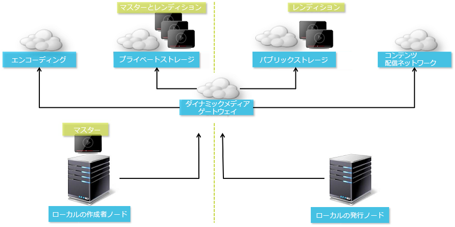

## 画像のハイブリッド公開アーキテクチャ {#hybrid-publishing-architecture-for-images}

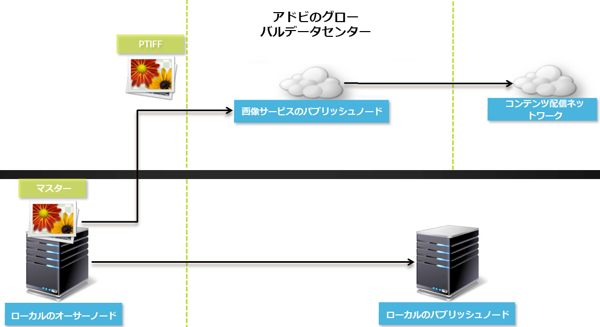

## サポートされるDynamic Media構成{#supported-dynamic-media-configurations}

各設定タスクで参照される用語を次に示します。

| **用語** | **ダイナミックメディア有効** | **説明** |
|---|---|---|
| AEM オーサーノード | 緑色の円の中に白色のチェックマーク | オンプレミスまたはManaged Services経由でデプロイする作成者ノードです。 |
| AEM パブリッシュノード | 赤色の四角の中に白色の「X」 | オンプレミスまたはManaged Services経由でデプロイする発行ノードです。 |
| 画像サービスのパブリッシュノード | 緑色の円の中に白色のチェックマーク | Adobeが管理するデータセンターで実行する発行ノード。画像サービスのURLを指します。 |

Dynamic Media を画像専用、ビデオ専用、またはその両方の用途で実装できます。具体的なシナリオに合わせた Dynamic Media を設定する手順を決定するには、次の表を参照してください。

<table> 
 <tbody> 
  <tr> 
   <td><strong>シナリオ</strong></td> 
   <td><strong>仕組み</strong></td> 
   <td><strong>設定手順</strong></td> 
  </tr> 
  <tr> 
   <td>実稼動環境に画像のみを配信する</td> 
   <td>画像は世界各地のアドビのデータセンターのサーバーを介して配信されます。CDN を使用してキャッシュすることで、スケーラブルなパフォーマンスで全世界に展開できます。</td> 
   <td> 
    <ol> 
     <li>AEM <strong>オーサー</strong>ノードで、<a href="#enabling-dynamic-media">Dynamic Media を有効化</a>します。</li> 
     <li>画像を<a href="#configuring-dynamic-media-cloud-services"> Dynamic Media クラウドサービス</a>で設定します。</li> 
     <li><a href="#configuring-image-replication">画像のレプリケーションを設定</a>します。</li> 
     <li><a href="#replicating-catalog-settings">カタログ設定をレプリケート</a>します。</li> 
     <li><a href="#replicating-viewer-presets">ビューアプリセットをレプリケート</a>します。</li> 
     <li><a href="#using-default-asset-filters-for-replication">レプリケーションにデフォルトのアセットフィルターを使用</a>します。</li> 
     <li><a href="#configuring-dynamic-media-image-server-settings">Dynamic Media Image Server を設定</a>します。</li> 
     <li><a href="#delivering-assets">アセットを配信</a>します。</li> 
    </ol> </td> 
  </tr> 
  <tr> 
   <td>実稼動前の環境（開発、品質評価、ステージングなど）に画像のみを配信する</td> 
   <td>画像は AEM パブリッシュノードを通じて配信されます。このシナリオでは、トラフィックが最小限となるので、画像をアドビのデータセンターに配信する必要はありません。また、実稼動開始前にコンテンツの安全なプレビューを可能にするという利点もあります。</td> 
   <td> 
    <ol> 
     <li>AEM <strong>オーサー</strong>ノードで、<a href="#enabling-dynamic-media">Dynamic Media を有効化</a>します。</li> 
     <li>AEM <strong>publish</strong>ノードで、<a href="#enabling-dynamic-media">ダイナミックメディアを有効に</a>します。</li> 
     <li><a href="#replicating-viewer-presets">ビューアプリセットをレプリケート</a>します。</li> 
     <li><a href="#setting-up-asset-filters-for-imaging-in-non-production-deployments">実稼動環境以外の画像用のアセットフィルター</a>をセットアップします。</li> 
     <li><a href="#configuring-dynamic-media-image-server-settings">Dynamic Media Image Server を設定します。</a></li> 
     <li><a href="#delivering-assets">アセットを配信します。</a></li> 
    </ol> </td> 
  </tr> 
  <tr> 
   <td>任意の環境（実稼動、開発、品質評価、ステージングなど）にビデオのみを配信する</td> 
   <td>画像は CDN を使用してキャッシュすることで、スケーラブルなパフォーマンスで全世界に展開できます。ビデオのポスター画像（再生が開始される前に表示されるビデオのサムネール）が AEM パブリッシュインスタンスにより配信されます。</td> 
   <td> 
    <ol> 
     <li>AEM <strong>オーサー</strong>ノードで、<a href="#enabling-dynamic-media">Dynamic Media を有効化</a>します。</li> 
     <li>AEM <strong>パブリッシュ</strong>ノードで、<a href="#enabling-dynamic-media">Dynamic Media を有効化</a>します（パブリッシュインスタンスがビデオのポスター画像を処理し、ビデオ再生用のメタデータを提供します）。</li> 
     <li><a href="#configuring-dynamic-media-cloud-services">Dynamic Media クラウドサービス</a>でビデオを設定します。</li> 
     <li><a href="#replicating-viewer-presets">ビューアプリセットをレプリケート</a>します。</li> 
     <li><a href="#setting-up-asset-filters-for-video-only-deployments">ビデオ専用のアセットフィルター</a>をセットアップします。</li> 
     <li><a href="#delivering-assets">アセットを配信します。</a></li> 
    </ol> </td> 
  </tr> 
  <tr> 
   <td>実稼動環境に画像とビデオの両方を配信する</td> 
   <td><p>画像は CDN を使用してキャッシュすることで、スケーラブルなパフォーマンスで全世界に展開できます。画像やビデオのポスター画像は世界各地のアドビのデータセンターのサーバーを介して配信されます。CDN を使用してキャッシュすることで、スケーラブルなパフォーマンスで全世界に展開できます。</p> <p>実稼動前の環境での画像やビデオのセットアップ方法については、前の節を参照してください。 </p> </td> 
   <td> 
    <ol> 
     <li>AEM <strong>オーサー</strong>ノードで、<a href="#enabling-dynamic-media">Dynamic Media を有効化</a>します。</li> 
     <li><a href="#configuring-dynamic-media-cloud-services">Dynamic Media クラウドサービス</a>でビデオを設定します。</li> 
     <li>画像を<a href="#configuring-dynamic-media-cloud-services"> Dynamic Media クラウドサービス</a>で設定します。</li> 
     <li><a href="#configuring-image-replication">画像のレプリケーションを設定</a>します。</li> 
     <li><a href="#replicating-catalog-settings">カタログ設定をレプリケート</a>します。</li> 
     <li><a href="#replicating-viewer-presets">ビューアプリセットをレプリケート</a>します。</li> 
     <li><a href="#using-default-asset-filters-for-replication">レプリケーションにデフォルトのアセットフィルターを使用します。</a></li> 
     <li><a href="#configuring-dynamic-media-image-server-settings">Dynamic Media Image Server を設定します。</a></li> 
     <li><a href="#delivering-assets">アセットを配信します。</a></li> 
    </ol> </td> 
  </tr> 
 </tbody> 
</table>

## Dynamic Media の有効化 {#enabling-dynamic-media}

[Dynamic Media ](https://www.adobe.com/solutions/web-experience-management/dynamic-media.html)はデフォルトで無効になっています。Dynamic Mediaの機能を利用するには、**[!UICONTROL dynamicmedia]**&#x200B;実行モードを使用して、例えば&#x200B;**[!UICONTROL publish]**&#x200B;実行モードを使用して、ダイナミックメディアを有効にする必要があります。 有効にする前に、[技術要件](/help/sites-deploying/technical-requirements.md#requirements-for-aem-dynamic-media-add-on)を確認してください。

>[!NOTE]
>
>実行モードで Dynamic Media を有効にすると、**[!UICONTROL dynamicMediaEnabled]** フラグを **[!UICONTROL true]** に設定することで Dynamic Media を有効にした AEM 6.1 および AEM 6.0 の機能が置き換えられます。このフラグは AEM 6.2 以降では機能しません。さらに、クイックスタートを再起動して Dynamic Media を有効にする必要はありません。

Dynamic Mediaを有効にすると、ダイナミックメディア機能がUIで使用可能になり、アップロードされた各画像アセットに、動的な画像レンディションの高速配信に使用される`cqdam.pyramid.tiff`レンディションが付与されます。 これらのPTIFFには、(1)1つのマスター画像のみを管理し、追加のストレージなしで無制限のレンディションをその場で生成する機能、(2)ズーム、パン、スピンなどのインタラクティブなビジュアライゼーションを使用する機能など、大きな利点があります。

AEMでDynamic Mediaクラシックを使用する場合は、[特定のシナリオ](/help/sites-administering/scene7.md#aem-scene-integration-versus-dynamic-media)を使用しない限り、Dynamic Mediaを有効にしないでください。 Dynamic Mediaは、runmodeを介してDynamic Mediaを有効にしない限り無効です。

Dynamic Media を有効にするには、コマンドラインまたはクイックスタートのファイル名から Dynamic Media の実行モードを有効にする必要があります。

**ダイナミックメディアを有効にするには**:

1. コマンドラインでクイックスタートを起動するときに、次のようにします。

   * 追加&#x200B;**[!UICONTROL -r dynamicmedia]**&#x200B;を、jarファイルの開始時にコマンドラインの最後に追加します。

   ```shell
   java -Xmx4096m -Doak.queryLimitInMemory=500000 -Doak.queryLimitReads=500000 -jar cq-quickstart-6.4.0.jar -r dynamicmedia
   ```

   s7配信に公開する場合は、次のtrustStore引数も含める必要があります。

   ```shell
   -Djavax.net.ssl.trustStore=<absoluteFilePath>/customerTrustStoreFileName>
   
    -Djavax.net.ssl.trustStorePassword=<passwordForTrustStoreFile>
   ```

1. `http://localhost:4502/is/image`を要求し、Image Serverが実行中であることを確認します。

   >[!NOTE]
   >
   >Dynamic Mediaの問題のトラブルシューティングを行うには、**[!UICONTROL crx-quickstart/logs/]**&#x200B;ディレクトリの次のログを参照してください。
   >
   >* ImageServer-&lt;PortId>-&lt;yyyy>&lt;mm>&lt;dd>.log - ImageServerログは、内部ImageServerプロセスの動作を分析する際に使用する統計情報と分析情報を提供します。

      Image Serverログファイル名の例：`ImageServer-57346-2019-07-25.log`
   * s7access-&lt;yyyy>&lt;mm>&lt;dd>.log - s7accessログは、`/is/image`と`/is/content`を介してDynamic Mediaに対して行われた各リクエストを記録します。
   これらのログは、Dynamic Media が有効の場合のみ使用されます。**[!UICONTROL system/console/status-Bundlelist]**&#x200B;ページから生成された&#x200B;**Download Full**&#x200B;パッケージには含まれません。Dynamic Mediaの問題が発生した場合は、カスタマーサポートに問い合わせる際に、これらのログを両方問題に追加してください。

### AEMを別のポートまたはコンテキストパスにインストールした場合… {#if-you-installed-aem-to-a-different-port-or-context-path}

[AEMをアプリケーションサーバー](/help/sites-deploying/application-server-install.md)にデプロイし、Dynamic Mediaを有効にする場合は、外部化子で&#x200B;**self**&#x200B;ドメインを設定する必要があります。サムネールの生成が行われないと、ダイナミックメディアアセットではアセットのサムネールの生成が正常に機能しません。

さらに、異なるポートまたはコンテキストパスで quickstart を実行する場合、**self** ドメインを変更する必要もあります。

Dynamic Mediaを有効にすると、画像アセットの静的サムネールレンディションがDynamic Mediaを使用して生成されます。サムネールの生成がダイナミックメディアで正しく機能するためには、AEMが自身に対してURLリクエストを実行し、ポート番号とコンテキストパスの両方を把握している必要があります。

AEM では、

* [Externalizer](/help/sites-developing/externalizer.md) の **self** ドメインがポート番号とコンテキストパスの両方を取得するために使用されます。
* **self**&#x200B;ドメインが設定されていない場合、ポート番号とコンテキストパスはJetty HTTPサービスから取得されます。

AEM QuickStart WARデプロイメントでは、ポート番号とコンテキストパスを取得できないので、**自己**&#x200B;ドメインを構成する必要があります。**self**&#x200B;ドメインの設定方法については、[externalizerドキュメント](/help/sites-developing/externalizer.md)を参照してください。

>[!NOTE]
[AEM Quickstart スタンドアロンデプロイメント](/help/sites-deploying/deploy.md)では、**self** ドメインは通常設定する必要がありません。ポート番号とコンテキストパスは自動設定されます。ただし、ネットワークインターフェイスがオフの場合は、**self** ドメインを設定する必要があります。

## Dynamic Media の無効化   {#disabling-dynamic-media}

Dynamic Media はデフォルトでは有効になっていません。しかし、以前に Dynamic Media を有効にした場合は、後で無効にすることができます。

ダイナミックメディアを有効にした後に無効にするには、**[!UICONTROL -r dynamicmedia]**&#x200B;実行モードフラグを削除します。

**Dynamic Mediaを有効にした後に無効にするには**:

1. コマンドラインでクイックスタートを起動するときに、次のいずれかを実行します。

   * JARファイルの起動時に、コマンドラインに`-r dynamicmedia`を追加しないでください。

   ```shell
   java -Xmx4096m -Doak.queryLimitInMemory=500000 -Doak.queryLimitReads=500000 -jar cq-quickstart-6.4.0.jar
   ```

1. リクエスト `http://localhost:4502/is/image`. Dynamic Media が無効化されたことを示すメッセージが表示されます。

   >[!NOTE]
   Dynamic Mediaの実行モードが無効になると、`qdam.pyramid.tiff`レンディションを生成するワークフロー手順は自動的にスキップされます。 また、動的レンディションのサポートやその他の Dynamic Media 機能も無効になります。
   また、AEM サーバーを設定した後で Dynamic Media 実行モードを無効にすると、その実行モードの下でアップロードされたアセットがすべて無効になることにも注意してください。

## （オプション）Dynamic Mediaのプリセットと設定を6.3から6.4へ移行する際に、ダウンタイムをゼロにする{#optional-migrating-dynamic-media-presets-and-configurations-from-to-zero-downtime}

AEMDynamic Mediaを6.3から6.4にアップグレードする場合は(ダウンタイムをゼロにする（「オプトイン」とも呼ばれる）、次のcurlコマンドを実行して、すべてのプリセットと設定をCRXDE Liteで`/etc`から`/conf`に移行する必要があります。

**注意**:AEMインスタンスを互換モードで実行する場合（つまり、互換性パッケージがインストールされている場合）、これらのコマンドを実行する必要はありません。

カスタムプリセットと設定を`/etc`から`/conf`に移行するには、次のLinux curlコマンドを実行します。

`curl -u admin:admin http://localhost:4502/libs/settings/dam/dm/presets.migratedmcontent.json`

互換パッケージの有無を問わず、すべてのアップグレードについて、次のコマンドを実行することにより標準提供ビューアプリセットをコピーできます。

`curl -u admin:admin http://localhost:4502/libs/settings/dam/dm/presets/viewer.pushviewerpresets`

## イメージレプリケーションの設定{#configuring-image-replication}

Dynamic Media画像配信は、ビデオサムネールを含む画像アセットをAEM Authorから公開し、Adobeのオンデマンドレプリケーションサービス(Replication Service URL)に複製することで機能します。 その後、アセットはオンデマンド画像配信サービス(Image Service URL)を介して配信されます。

次の手順を実行する必要があります。

1. [認証を設定します](#setting-up-authentication)。
1. [レプリケーションエージェントを構成します](#configuring-the-replication-agent)。

Replication Agentは、画像、ビデオメタデータなどのDynamic Mediaアセットを公開し、AdobeがホストするImage Serviceにセットを公開します。 レプリケーションエージェントはデフォルトでは有効でありません。

レプリケーションエージェントを設定後、[正しく設定されていることを検証およびテスト](#validating-the-replication-agent-for-dynamic-media)する必要があります。ここでは、これらの手順について説明します。

>[!NOTE]
PTIFF 作成のデフォルトのメモリ制限は、すべてのワークフローで 3 GB です。例えば、他のワークフローを一時停止して、3 GB のメモリを必要とする 1 個の画像を処理できます。または、それぞれ 300 MB のメモリを必要とする 10 個の画像を並行して処理できます。
このメモリ制限は変更できますが、使用可能なシステムリソースおよび処理する画像コンテンツのタイプに合わせる必要があります。非常に大きなアセットが多数あり、システムに十分なメモリがある場合、この制限を引き上げて、画像が並行して処理されるようにすることができます。
最大メモリ制限を超えるメモリを必要とする画像は、拒否されます。
PTIFF 作成のメモリ制限を変更するには、**[!UICONTROL ツール／運営／Web コンソール／Adobe CQ Scene7 PTiffManager]** に移動して、`maxMemory` の値を変更します。

### 認証の設定 {#setting-up-authentication}

Dynamic Media 画像配信サービスに画像をレプリケートするには、作成者にレプリケーション認証を設定する必要があります。これを行うには、KeyStoreを取得し、**[!UICONTROL dynamic-media-replication]**&#x200B;ユーザーの下に保存して設定します。 キーストアファイルとプロビジョニング処理中に必要な資格情報が記載されたようこそメールが会社の管理者に送信されます。このメッセージを受け取っていない場合は、カスタマーケアにお問い合わせください。

**認証を設定するには**:

1. キーストアファイルとパスワードをまだ受け取っていない場合は、カスタマーケアに問い合わせます。これはプロビジョニングの一部であり、これによりキーがアカウントに関連付けられます。
1. AEM で、AEM のロゴをタップしてグローバルナビゲーションコンソールにアクセスし、**[!UICONTROL ツール／セキュリティ／ユーザー]**&#x200B;をタップします。
1. ユーザー管理ページで、**[!UICONTROL dynamic-media-replication]**&#x200B;ユーザーに移動し、をタップして開きます。

   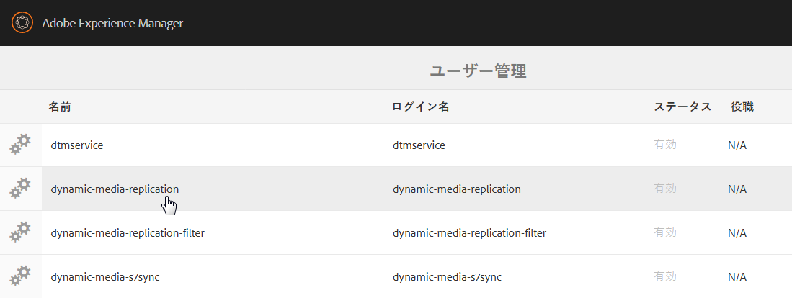

1. Edit User Settings For dynamic-media-replicationページで、「**[!UICONTROL キーストア]**」タブをタップし、「**[!UICONTROL キーストアを作成]**」をタップします。

   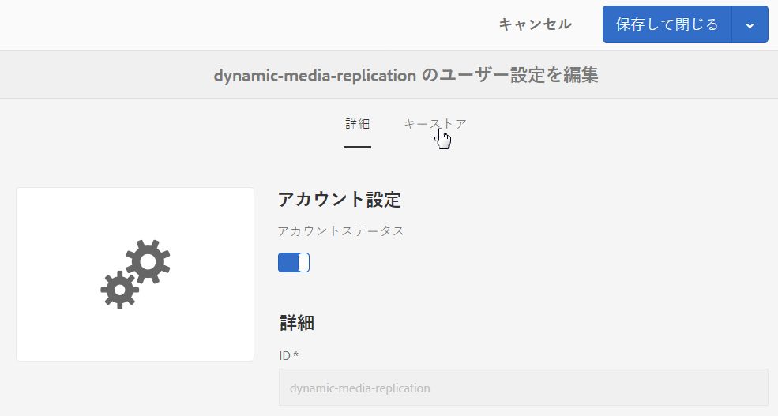

1. **[!UICONTROL キーストアアクセスパスワードを設定]**&#x200B;ダイアログボックスでパスワードを入力し、パスワードを確認します。

   >[!NOTE]
   入力したパスワードは覚えておいてください。**[!UICONTROL レプリケーションエージェント]**&#x200B;を後で構成する際に、もう一度入力する必要があります。

   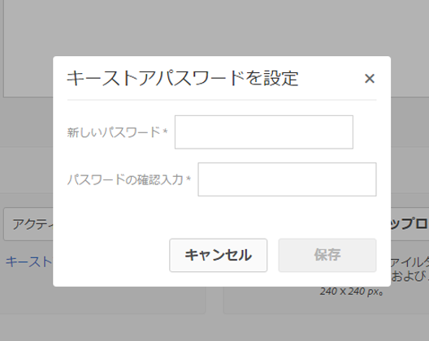

1. **[!UICONTROL dynamic-media-replication のユーザー設定を編集]**&#x200B;ページで「**[!UICONTROL 秘密鍵をキーストアファイルから追加]**」領域を展開し、以下の情報を追加します（下の画像を参照）。

   * [**[!UICONTROL 新しいエイリアス]**]フィールドに、後でレプリケーション構成で使用するエイリアスの名前を入力します。例えば、**replication**&#x200B;のように指定します。
   * 「**[!UICONTROL キーストアファイル]**」をタップします。アドビから提供されたキーストアファイルに移動して選択し、「**[!UICONTROL 開く]**」をタップします。
   * 「**[!UICONTROL KeyStore File Password]**」フィールドに、KeyStore Fileのパスワードを入力します。 これは、手順5で作成したKeyStoreパスワード&#x200B;_ではなく、プロビジョニング時に送信されるご案内の電子メールに記載されるKeyStore File PasswordAdobeです。_&#x200B;キーストアファイルパスワードを受け取っていない場合は、アドビのカスタマーケアに問い合わせてください。
   * 「**[!UICONTROL 秘密鍵のパスワード]**」フィールドで、秘密鍵のパスワードを入力します（以前の手順で指定した秘密鍵のパスワードと同じでも可）。秘密鍵のパスワードは、プロビジョニング中にアドビから送信されたようこそメールに記載されています。秘密鍵のパスワードを受け取っていない場合は、アドビのカスタマーケアに問い合わせてください。
   * 「**[!UICONTROL 秘密鍵のエイリアス]**」フィールドに、秘密鍵のエイリアスを入力します。例えば、`companyname-alias`です。 秘密鍵のエイリアスは、プロビジョニング中にアドビから送信されたようこそメールに記載されています。秘密鍵のエイリアスを受け取っていない場合は、アドビのカスタマーケアに問い合わせてください。

   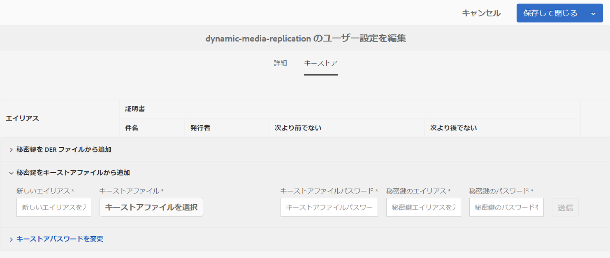

1. 「**[!UICONTROL 保存して閉じる]**」をタップして、このユーザーに対する変更を保存します。

   次に、[レプリケーションエージェントを設定します。](#configuring-the-replication-agent)

### レプリケーションエージェントの設定 {#configuring-the-replication-agent}

1. AEM で、AEM のロゴをタップしてグローバルナビゲーションコンソールにアクセスし、**[!UICONTROL ツール／デプロイ／レプリケーション／作成者のエージェント]**&#x200B;をタップします。
1. 作成者のエージェントページで、「**[!UICONTROL Dynamic Media ハイブリッド画像レプリケーション（s7delivery）]**」をタップします。
1. 「**[!UICONTROL 編集]**」をタップします。
1. 「**[!UICONTROL 設定]**」タブをタップし、次のように入力します。

   * **[!UICONTROL 有効]** - レプリケーションエージェントを有効にするには、このチェックボックスを選択します。
   * **[!UICONTROL 地域]**  — 適切な地域に設定します。北米、ヨーロッパ、アジア
   * **[!UICONTROL テナントID]** ：この値は、レプリケーションサービスに発行する会社またはテナントの名前です。この値は、プロビジョニング時にAdobeから送信されるお知らせメールに含まれるテナントIDです。 この情報を受け取っていない場合は、アドビのカスタマーケアに問い合わせてください。
   * **[!UICONTROL Key Store Alias]**  — この値は、「認証の [設定」でキーを生成する際に設定される「**新しいエイリアス**」の値と同じです](#setting-up-authentication)。例えば、 `replication`。（[認証の設定](#setting-up-authentication)の手順7を参照）。
   * **[!UICONTROL Key Store Password]**  — キーストアの **[!UICONTROL 作成をタップしたときに作成されたキーストアのパスワード]**。このパスワードはアドビが提供するものではありません。[認証の設定](#setting-up-authentication)の手順5を参照してください。

   次の画像はサンプルデータが入力されたレプリケーションエージェントを示します。

   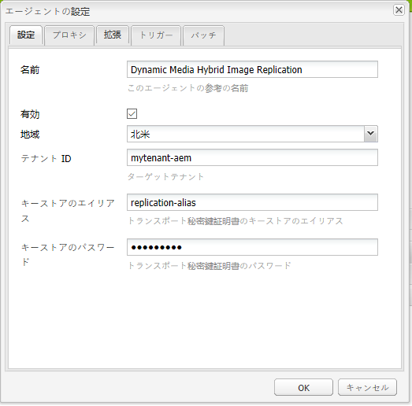

1. 「**[!UICONTROL OK]**」をタップします。

### Dynamic Media 用のレプリケーションエージェントの検証 {#validating-the-replication-agent-for-dynamic-media}

ダイナミックメディア用のレプリケーションエージェントを検証するには、次の手順を実行します。

「**[!UICONTROL 接続のテスト]**」をタップします。 次のように出力されます。

```shell
11.03.2016 10:57:55 - Transferring content for ReplicationAction{type=TEST, path[0]='/content/dam', time=1457722675402, userId='admin', revision='null'}
11.03.2016 10:57:55 - * Auth User: replication-receiver
11.03.2016 10:57:55 - * HTTP Version: 1.1
11.03.2016 10:57:55 - * Using OAuth 2.0 Authorization Grants
11.03.2016 10:57:55 - * OAuth 2.0 User: dynamic-media-replication
11.03.2016 10:57:55 - * OAuth 2.0 Token: '*****' initialized
11.03.2016 10:57:55 - Publishing: POST[https://replicate-na.assetsadobe.com:8580/is-publish/publish-receiver?Cmd=Test&RootId=xfpuu-6613]
11.03.2016 10:57:55 - Publish response: OK[]
11.03.2016 10:57:55 - Transfer succeeded in 141 ms for ReplicationAction{type=TEST, path[0]='/content/dam', time=1457722675402, userId='admin', revision='null'}
-------------------------------------------------------------------------------------------------------------------------------
Replication test succeeded
```

>[!NOTE]
次のいずれかを実行してチェックすることもできます。
* レプリケーションログをチェックしてアセットがレプリケートされていることを確認する。
* 画像を公開する。画像をタップし、ドロップダウンメニューで「**[!UICONTROL ビューア]**」を選択します。 ビューアプリセットを選択し、「**[!UICONTROL URL]**」をタップし、URLをコピーしてブラウザに貼り付け、画像が表示されることを確認します。


### 認証のトラブルシューティング {#troubleshooting-authentication}

認証の設定時に発生する可能性がある問題と、その解決策を紹介します。その前に、レプリケーションが設定済みであることを確認してください。

#### 問題：HTTP ステータスコード 401 メッセージ - 認証が必要  {#problem-http-status-code-with-message-authorization-required}

この問題は、`dynamic-media-replication` ユーザーのキーストアの設定に失敗したことによって発生する可能性があります。

```shell
Replication test to s7delivery:https://s7bern.macromedia.com:8580/is-publish/
17.06.2016 18:54:43 - Transferring content for ReplicationAction{type=TEST, path[0]='/content/dam', time=1466214883309, userId='admin', revision='null'}
17.06.2016 18:54:43 - * Auth User: replication-receiver
17.06.2016 18:54:43 - * HTTP Version: 1.1
17.06.2016 18:54:43 - * Using OAuth 2.0 Authorization Grants
17.06.2016 18:54:43 - * OAuth 2.0 User: dynamic-media-replication
17.06.2016 18:54:43 - No OAuth token available. OAuth not initialized
17.06.2016 18:54:43 - * Using Client Auth SSL alias - replication-alias *
17.06.2016 18:54:43 - Publishing: POST[https://<localhost>:8580/is-publish//publish-receiver?Cmd=Test&RootId=brough]
17.06.2016 18:54:43 - Transfer failed for ReplicationAction{type=TEST, path[0]='/content/dam', time=1466214883309, userId='admin', revision='null'}. java.io.IOException: Failed to execute request
'https://<localhost>:8580/is-publish//publish-receiver?Cmd=Test&RootId=brough':
 Server returned status code 401 with message: Authorization required.
17.06.2016 18:54:43 - Error while replicating: com.day.cq.replication.ReplicationException: Transfer failed for ReplicationAction{type=TEST, path[0]='/content/dam', time=1466214883309,
 userId='admin', revision='null'}. java.io.IOException: Failed to execute request
'https://<localhost>:8580/is-publish//publish-receiver?Cmd=Test&RootId=brough':
 Server returned status code 401 with message: Authorization required.
```

**解決方法**:が `KeyStore` dynamic-media- **** replicationuserに保存され、正しいパスワードが指定されていることを確認してください。

#### 問題：鍵を復号化できない - データを復号化できない {#problem-could-not-decrypt-key-could-not-decrypt-data}

```xml
Replication test to s7delivery:https://<localhost>:8580/is-publish/
17.06.2016 19:00:16 - Transferring content for ReplicationAction{type=TEST, path[0]='/content/dam', time=1466215216662, userId='admin', revision='null'}
17.06.2016 19:00:16 - * Auth User: replication-receiver
17.06.2016 19:00:16 - * HTTP Version: 1.1
17.06.2016 19:00:16 - * Using OAuth 2.0 Authorization Grants
17.06.2016 19:00:16 - * OAuth 2.0 User: dynamic-media-replication
17.06.2016 19:00:16 - No OAuth token available. OAuth not initialized
17.06.2016 19:00:16 - * Using Client Auth SSL alias - replication-alias *
17.06.2016 19:00:16 - Transfer failed for ReplicationAction{type=TEST, path[0]='/content/dam', time=1466215216662, userId='admin', revision='null'}. java.lang.SecurityException: java.security.UnrecoverableKeyException: Could not decrypt key: Could not decrypt data.
```

**解決策**：パスワードを確認します。レプリケーションエージェントに保存されたパスワードがキーストアの作成に使用されたパスワードと同じでありません。

#### 問題：InvalidAlgorithmParameterException  {#problem-invalidalgorithmparameterexception}

この問題は AEM オーサーインスタンスの設定エラーが原因です。Author の java プロセスが正しい `javax.net.ssl.trustStore` を取得していません。このエラーは次のレプリケーションログで確認できます。

```shell
14.04.2016 09:37:43 - Transfer failed for ReplicationAction{type=TEST, path[0]='/content/dam', time=1460651862089, userId='admin', revision='null'}. java.io.IOException: Failed to execute request 'https://<localhost>:8580/is-publish/publish-receiver?Cmd=Test&RootId=rbrough-osx2': java.lang.RuntimeException: Unexpected error: java.security.InvalidAlgorithmParameterException: the trustAnchors parameter must be non-empty
14.04.2016 09:37:43 - Error while replicating: com.day.cq.replication.ReplicationException: Transfer failed for ReplicationAction{type=TEST, path[0]='/content/dam', time=1460651862089, userId='admin', revision='null'}. java.io.IOException: Failed to execute request 'https://<localhost>:8580/is-publish/publish-receiver?Cmd=Test&RootId=rbrough-osx2': java.lang.RuntimeException: Unexpected error: java.security.InvalidAlgorithmParameterException: the trustAnchors parameter must be non-empty
```

または、次のエラーログで確認できます。

```shell
07.25.2019 12:00:59.893 *ERROR* [sling-threadpool-db2763bb-bc50-4bb5-bb64-10a09f432712-(apache-sling-job-thread-pool)-90-com_day_cq_replication_job_s7delivery(com/day/cq/replication/job/s7delivery)] com.day.cq.replication.Agent.s7delivery.queue Error during processing of replication.
 
java.io.IOException: Failed to execute request 'https://replicate-na.assetsadobe.com:8580/is-publish/publish-receiver?Cmd=Test&RootId=rbrough-osx': java.lang.RuntimeException: Unexpected error: java.security.InvalidAlgorithmParameterException: the trustAnchors parameter must be non-empty
        at com.scene7.is.catalog.service.publish.atomic.PublishingServiceHttp.executePost(PublishingServiceHttp.scala:195)
```

**解決方法**:AEM AuthorのJavaプロセスのシステムプロパティ-Djavax.net.ssl.trustStore= **が有効な信頼ストアに** 設定されていることを確認します。

#### 問題：キーストアが設定されていないか初期化されていない {#problem-keystore-is-either-not-set-up-or-it-is-not-initialized}

この問題は、ホットフィックスが原因で発生するか、機能パックが&#x200B;**[!UICONTROL dynamic-media-user]**&#x200B;または&#x200B;**[!UICONTROL keystore]**&#x200B;ノードを上書きしている可能性があります。

レプリケーションログの例は次のとおりです。

```shell
Replication test to s7delivery:https://replicate-na.assetsadobe.com/is-publish
02.08.2016 14:37:44 - Transferring content for ReplicationAction{type=TEST, path[0]='/content/dam', time=1470173864834, userId='admin', revision='null'}
02.08.2016 14:37:44 - * Auth User: replication-receiver
02.08.2016 14:37:44 - * HTTP Version: 1.1
02.08.2016 14:37:44 - * Using OAuth 2.0 Authorization Grants
02.08.2016 14:37:44 - * OAuth 2.0 User: dynamic-media-replication
02.08.2016 14:37:44 - Transfer failed for ReplicationAction{type=TEST, path[0]='/content/dam', time=1470173864834, userId='admin', revision='null'}. com.adobe.granite.keystore.KeyStoreNotInitialisedException: Uninitialised key store for user dynamic-media-replication
```

**解決策**:

1. **[!UICONTROL ユーザー管理]**&#x200B;ページに移動します。

   `localhost:4502/libs/granite/security/content/useradmin.html`
1. **[!UICONTROL ユーザー管理]**&#x200B;ページで、**[!UICONTROL dynamic-media-replication]**&#x200B;ユーザーに移動し、をタップして開きます。
1. 「**[!UICONTROL キーストア]**」タブをタップします。 「**[!UICONTROL キーストアを作成]**」ボタンが表示された場合は、前述の[認証の設定](#setting-up-authentication)の手順をやり直す必要があります。
1. **[!UICONTROL KeyStore]**&#x200B;の設定をやり直す必要がある場合は、[レプリケーションエージェント](config-dynamic.md#configuring-the-replication-agent)の設定を再度行う必要がある場合があります。

   s7delivery レプリケーションエージェントを再設定します。

   `localhost:4502/etc/replication/agents.author/s7delivery.html`

1. 「**[!UICONTROL 接続をテスト]**」をタップして設定が有効であることを確認します。

#### 問題：公開エージェントが OAuth ではなく SSL を使用している  {#problem-publish-agent-is-using-ssl-instead-of-oauth}

この問題は、ホットフィックスまたは機能パックが正しくインストールされなかったか設定を上書きしたことが原因で発生する可能性があります。

レプリケーションログの例は次のとおりです。

```shell
01.08.2016 18:42:59 - Transferring content for ReplicationAction{type=TEST, path[0]='/content/dam', time=1470073379634, userId='admin', revision='null'}
01.08.2016 18:42:59 - * Auth User: replication-receiver
01.08.2016 18:42:59 - * HTTP Version: 1.1
01.08.2016 18:42:59 - * Using Client Auth SSL alias - replication-receiver *
01.08.2016 18:42:59 - Publishing: POST[https://replicate-eu.assetsadobe2.com:443/is-publish/publish-receiver?Cmd=Test&RootId=altayerstaging]
01.08.2016 18:42:59 - Transfer failed for ReplicationAction{type=TEST, path[0]='/content/dam', time=1470073379634, userId='admin', revision='null'}. java.io.IOException: Failed to execute request 'https://replicate-eu.assetsadobe2.com:443/is-publish/publish-receiver?Cmd=Test&RootId=rbroughstaging': Server returned status code 401 with message: Authorization required.
01.08.2016 18:42:59 - Error while replicating: com.day.cq.replication.ReplicationException: Transfer failed for ReplicationAction{type=TEST, path[0]='/content/dam', time=1470073379634, userId='admin', revision='null'}. java.io.IOException: Failed to execute request 'https://replicate-eu.assetsadobe2.com:443/is-publish/publish-receiver?Cmd=Test&RootId=rbroughstaging': Server returned status code 401 with message: Authorization required.
```

**解決策:**

1. AEM で、**[!UICONTROL ツール／一般／CRXDE Lite]** をタップします。

   `localhost:4502/crx/de/index.jsp`

1. **[!UICONTROL s7配信レプリケーションエージェント]**&#x200B;ノードに移動します。

   `localhost:4502/crx/de/index.jsp#/etc/replication/agents.author/s7delivery/jcr:content`

1. この設定をレプリケーションエージェントに追加します（値が **[!UICONTROL True]** に設定されたブール値）。

   `enableOauth=true`

1. ページの左上隅付近にある「**[!UICONTROL すべて保存]**」をタップします。

### 構成のテスト{#testing-your-configuration}

設定にはエンドツーエンドのテストを実行することをお勧めします。

このテストを開始する前に、既に以下をおこなったことを確認してください。

* 画像プリセットを追加した。
* **[!UICONTROL Cloud Services]**&#x200B;の下に&#x200B;**Dynamic Media構成（6.3より前）**&#x200B;を構成します。 このテストでは画像サービスの URL が必要です。

設定をテストするには：

1. 画像アセットをアップロードします（アセットで、**[!UICONTROL 作成/ファイル]**&#x200B;をタップし、ファイルを選択します）。
1. ワークフローが完了するまで待ちます。
1. 画像アセットを公開します（アセットを選択し、「**[!UICONTROL クイック公開]**」をタップします。）
1. 画像を開き、**[!UICONTROL レンディション]**&#x200B;をタップして、その画像のレンディションに移動します。

   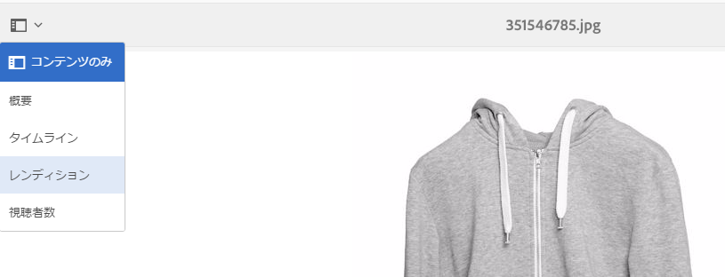

1. 任意の動的レンディションを選択します。
1. 「**[!UICONTROL URL]**」をタップして、このアセットのURLを取得します。
1. 選択した URL に移動して画像が期待どおりに動作するかどうかを確認します。

アセットが配信されたことをテストするもう 1 つの方法は、URL に req=exists を追加することです。

## Dynamic Media クラウドサービスの設定  {#configuring-dynamic-media-cloud-services}

Dynamic Media クラウドサービスは、画像とビデオのハイブリッド公開および配信、ビデオ分析、ビデオエンコーディングなどの様々なクラウドサービスをサポートします。

設定の一環として、登録 ID、ビデオサービス URL、画像サービス URL、レプリケーションサービス URL を入力し、認証を設定する必要があります。アカウントプロビジョニングプロセスの一環として、この情報をすべて受け取ったはずです。 この情報を受け取っていない場合は、Adobe Experience Managerの管理者またはAdobeテクニカルサポートに問い合わせてください。

>[!NOTE]
Dynamic MediaCloud Servicesを設定する前に、発行インスタンスを設定しておく必要があります。 また、Dynamic MediaCloud Servicesを構成する前に、レプリケーションを設定する必要があります。

**Dynamic Media Cloudサービスを設定するには**:

1. AEMで、AEMロゴをタップしてグローバルナビゲーションコンソールにアクセスし、**[!UICONTROL ツール/Cloud Services/Dynamic Media設定（6.3より前）]**&#x200B;をタップします。
1. **[!UICONTROL Dynamic Media設定ブラウザー]**&#x200B;ページの左側のウィンドウで、**[!UICONTROL グローバル]**&#x200B;を選択し、**[!UICONTROL 作成]**&#x200B;をタップします。
1. **[!UICONTROL Dynamic Media 設定を作成]**&#x200B;ダイアログボックスで、「タイトル」フィールドにタイトルを入力します。****
1. ビデオ用に Dynamic Media を設定する場合は、次の操作をおこないます。

   * 「**[!UICONTROL 登録 ID]**」フィールドに登録 ID を入力します。
   * 「**[!UICONTROL ビデオサービスの URL]**」フィールドに、Dynamic Media ゲートウェイのビデオサービス URL を入力します。

1. 画像用に Dynamic Media を設定する場合は、「**[!UICONTROL 画像サービスの URL]**」フィールドに Dynamic Media ゲートウェイの画像サービスの URL を入力します。
1. 「**[!UICONTROL 保存]**」をタップして Dynamic Media 設定ブラウザーページに戻ります。
1. AEM のロゴをタップしてグローバルナビゲーションコンソールにアクセスします。

## ビデオレポートの設定{#configuring-video-reporting}

Dynamic Media — ハイブリッドモードを使用すると、AEMの複数のインストールにわたってビデオのレポートを設定できます。

**使用するタイミング：** Dynamic Media設定（6.3より前）を設定する **[!UICONTROL と]**、ビデオレポートを含む多くの機能が開始されます。設定時には、地域の Analytics 企業内にレポートスイートが作成されます。複数のオーサーノードを設定すると、ノードごとに異なるレポートスイートが作成されます。このため、インストール間でレポートデータの整合性が取れなくなります。さらに、すべてのオーサーノードが同じハイブリッドパブリッシュサーバーを参照している場合、最後のオーサーノードでのインストール時に、すべてのビデオレポートの報告先となるレポートスイートが変更されてしまいます。この問題が発生すると、過剰な数のレポートスイートによって Analytics システムが過負荷状態に陥ります。

**手順概要：**&#x200B;ビデオレポートを設定するには、以下の 3 つのタスクを実行します。

1. 最初の作成者ノードで&#x200B;**[!UICONTROL Dynamic Media設定（6.3より前）]**&#x200B;を設定した後に、[!DNL Video Analytics]プリセットパッケージを作成します。 この最初のタスクは重要です。これにより、新しい設定でも引き続き同じレポートスイートを使用できるからです。
1. [!DNL Video Analytics]プリセットパッケージを、Dynamic Media設定（6.3より前）の&#x200B;***新しい***&#x200B;作成者ノード&#x200B;***にインストールします。***

1. パッケージインストールの確認やデバッグをおこないます。

### 最初のAuthorノード{#creating-a-video-analytics-preset-package-after-configuring-the-first-author-node}の設定後に[!DNL Video Analytics]プリセットパッケージを作成する

このタスクが完了すると、[!DNL Video Analytics]プリセットを含むパッケージファイルが作成されます。 これらのプリセットには、レポートスイート、トラッキングサーバー、トラッキング名前空間および Marketing Cloud 組織 ID（利用可能な場合）が含まれます。

1. まだ&#x200B;**[!UICONTROL Dynamic Mediaの設定（6.3より前）]**&#x200B;を設定していない場合は、設定します。
1. （オプション）表示を作成し、**[!UICONTROL レポートスイートID]**&#x200B;をコピーします（JCRにアクセスできる必要があります）。 **[!UICONTROL レポートスイートID]**&#x200B;は必須ではありませんが、検証が容易になります。
1. **[!UICONTROL Package Manager]**&#x200B;を使用してパッケージを作成します。
1. パッケージを編集してフィルターを含めます。

   AEM で: `/conf/global/settings/dam/dm/presets/analytics/jcr:content/userdata`

1. パッケージをビルドします。
1. プリセットパッケージをダウンロードまたは共有して、後続の新しい作成者ノードと共有できるようにします。[!DNL Video Analytics]

### 追加の作成者ノードを設定する前に[!DNL Video Analytics]プリセットパッケージをインストールする{#installing-the-video-analytics-preset-package-before-you-configure-additional-author-nodes}

_の前に_&#x200B;このタスクを完了してから&#x200B;**[!UICONTROL Dynamic Mediaの設定（6.3より前）]**&#x200B;を設定してください。 これに失敗すると、未使用のレポートスイートが別に作成されます。 また、ビデオレポートが引き続き正しく機能しますが、データ収集は最適化されません。

最初のAuthorノードの[!DNL Video Analytics]プリセットパッケージが、新しいAuthorノードでアクセス可能であることを確認します。

1. 以前に作成した[!DNL Video Analytics]プリセットパッケージを&#x200B;**[!UICONTROL Package Manager]**&#x200B;にアップロードします。
1. [!DNL Video Analytics]プリセットパッケージをインストールします。
1. **[!UICONTROL Dynamic Media構成（6.3より前）]**&#x200B;を構成します。

### パッケージインストールの確認やデバッグ {#verifying-and-debugging-the-package-installation}

1. 以下のいずれかをおこなってパッケージのインストールを確認し、必要に応じてそのデバッグをおこないます。

   * **JCRTを介して [!DNL Video Analytics] プリセットをチェックするか、JCRを介して**
プリセットをチェックします。 [!DNL Video Analytics] CRXDE Liteにアクセスできる必要があります ****。

      AEM - **[!UICONTROL CRXDE Lite]**&#x200B;で、`/conf/global/settings/dam/dm/presets/analytics/jcr:content/userdata  `に移動します。

      `http://localhost:4502/crx/de/index.jsp#/conf/global/settings/dam/dm/presets/analytics/jcr%3Acontent/userdata`

      作成者ノードの&#x200B;**[!UICONTROL CRXDE Lite]**&#x200B;へのアクセス権がない場合は、パブリッシュサーバを使用してプリセットを確認できます。

   * **Image Serverでの [!DNL Video Analytics] プリセットの確認**

      [!DNL Video Analytics]プリセットを直接検証するには、Image Server `req=userdata`リクエストを作成します。

      例えば、作成者ノードで[!DNL Video Analytics]プリセットを表示するには、次のように要求します。

      `http://localhost:4502/is/image/conf/global/settings/dam/dm/presets/analytics?req=userdata`

      公開サーバでプリセットを検証する場合は、公開サーバに対しても同様の直接要求を行うことができます。 応答はオーサーノードとパブリッシュノードで同じになります。応答は次のようになります。

      ```
      marketingCloudOrgId=0FC4E86B573F99CC7F000101
       reportSuite=aemaem6397618-2018-05-23
       trackingNamespace=aemvideodal
       trackingServer=aemvideodal.d2.sc.omtrdc.net
      ```

   * **AEMのビデオレポートツールで [!DNL Video Analytics] プリセットをチェックする**

      **[!UICONTROL ツール/アセット/ビデオレポート]** `http://localhost:4502/mnt/overlay/dam/gui/content/s7dam/videoreports/videoreport.html`をタップします。

      次のエラーメッセージが表示された場合は、レポートスイートは使用可能ですが、入力されていません。 新しいインストールでは、システムがデータの収集を開始するまでこのエラーは正しく、むしろ望ましいと言えます。

      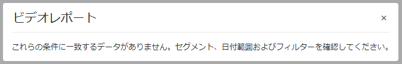
   レポートデータを生成するには、1 つのビデオをアップロードして公開します。「**[!UICONTROL URL をコピー]**」を使用し、ビデオを 1 回以上再生します。

   ビデオビューアの使用に基づいてレポートデータが格納されるまで、最大 12 時間かかる可能性があることに注意してください。

    エラーが発生し、レポートスイートの設定が正しくない場合は、次のアラートが表示されます。

   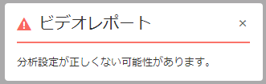

   このエラーは、**[!UICONTROL Dynamic Media設定（6.3より前）]**&#x200B;サービスを設定する前にビデオレポートを実行した場合にも表示されます。

### ビデオレポートの設定のトラブルシューティング {#troubleshooting-the-video-reporting-configuration}

* インストール中に Analytics API サーバーへの接続がタイムアウトすることがあります。インストール中に接続が 20 回再試行されますが、それでも失敗します。この状況が発生すると、ログファイルに複数のエラーが記録されます。`SiteCatalystReportService` を検索。
* [!DNL Video Analytics]プリセットパッケージを最初にインストールしないと、新しいレポートスイートが作成される可能性があります。
* AEM 6.3からAEM 6.4またはAEM 6.4.1にアップグレードし、**[!UICONTROL Dynamic Media設定(Pre 6.3)]**&#x200B;を設定した後も、レポートスイートは作成されます。 これは既知の問題であり、AEM 6.4.2 で修正される予定です。

### [!DNL Video Analytics]プリセット{#about-the-video-analytics-preset}について

[!DNL Video Analytics]プリセット（単に解析プリセットとも呼ばれます）は、Dynamic Mediaのビューアプリセットの横に保存されます。 これは基本的にはビューアプリセットと同じですが、AppMeasurement および Video Heartbeat レポートの設定に使用される情報が付加されています。

このプリセットのプロパティは次のとおりです。

* **[!UICONTROL reportSuite]**
* **[!UICONTROL trackingServer]**
* **[!UICONTROL trackingNamespace]**
* **[!UICONTROL marketingCloudOrgId]** (旧バージョンのAEMでは存在しません)

AEM 6.4以降のバージョンでは、このプリセットは`/conf/global/settings/dam/dm/presets/analytics/jcr:content/userdata`に保存されます。

## カタログ設定のレプリケート {#replicating-catalog-settings}

設定プロセスの一環として、独自のデフォルトのカタログ設定を JCR を通じて公開する必要があります。カタログ設定をレプリケートするには：

1. ターミナルウィンドウで以下を実行します。

   `curl -u admin:admin localhost:4502/libs/settings/dam/dm/presets/viewer.pushviewerpresets`

1. AEMで、**[!UICONTROL CRXDE Lite]**&#x200B;の次の場所に移動します（管理者権限が必要です）。

   `https://<server>:<port>/crx/de/index.jsp#/conf/global/settings/dam/dm/imageserver/`

1. 「**[!UICONTROL レプリケーション]**」タブをタップします。
1. 「**[!UICONTROL 複製]**」をタップします。

## ビューアプリセットのレプリケート  {#replicating-viewer-presets}

ビューアプリセットを使用してアセットを配信するには、ビューアプリセットを複製/公開する必要があります。 （アセットのURLまたは埋め込みコードを取得するには、すべてのビューアプリセットを&#x200B;_および_&#x200B;複製する必要があります）。 詳しくは、[ビューアプリセットの公開](managing-viewer-presets.md#publishing-viewer-presets)を参照してください。

>[!NOTE]
初期設定では、「**[!UICONTROL レンディション]**」を選択した場合は様々なレンディションが表示され、アセットの詳細表示で「**[!UICONTROL ビューア]**」を選択した場合は様々なビューアプリセットが表示されます。 表示される数を増減させることができます。詳しくは、[表示する画像プリセットの数の増加](/help/assets/managing-image-presets.md#increasing-or-decreasing-the-number-of-image-presets-that-display)または[表示するビューアプリセットの数の増加](/help/assets/managing-viewer-presets.md#increasing-the-number-of-viewer-presets-that-display)を参照してください。

## レプリケーション用のアセットのフィルタリング {#filtering-assets-for-replication}

Dynamic Media以外のデプロイメントでは、AEM作成者環境からAEM発行ノードに、_すべての_&#x200B;アセット（画像とビデオの両方）を複製します。 AEMパブリッシュサーバーもアセットを配信するので、このワークフローが必要です。

ただし、Dynamic Mediaのデプロイメントでは、アセットはクラウド経由で配信されるので、AEM発行ノードに同じアセットを複製する必要はありません。 このような「ハイブリッドパブリッシング」ワークフローは、アセットの複製に伴うストレージの余分なコストと処理時間を回避します。 Dynamic Media ビューア、サイトページ、静的コンテンツなどのその他のコンテンツは、引き続き AEM パブリッシュノードから配信されます。

アセットの複製の他に、次の非アセットも複製されます。

* Dynamic Media配信設定：`/conf/global/settings/dam/dm/imageserver/configuration/jcr:content/settings`
* 画像プリセット: `/conf/global/settings/dam/dm/presets/macros`
* ビューアプリセット: `/conf/global/settings/dam/dm/presets/viewer`

フィルターによって、アセットを AEM パブリッシュノードへのレプリケート対象から&#x200B;__&#x200B;除外することができます。

### レプリケーションにデフォルトのアセットフィルターを使用{#using-default-asset-filters-for-replication}

Dynamic Mediaを本番用&#x200B;_または_ 2)のイメージングとビデオで1)イメージングに使用している場合は、デフォルトのフィルターをそのまま使用できます。 次のフィルターがデフォルトでアクティブです。

<table> 
 <tbody> 
  <tr> 
   <td> </td> 
   <td><strong>フィルター</strong></td> 
   <td><strong>MIME タイプ</strong></td> 
   <td><strong>レンディション</strong></td> 
  </tr> 
  <tr> 
   <td>ダイナミックメディア画像配信</td> 
   <td><p>filter-images</p> <p>filter-sets</p> <p> </p> </td> 
   <td><p><strong>image/</strong> で始まる</p> <p><strong>application/</strong> を含み、<strong>set</strong> で終わる</p> </td> 
   <td>標準提供の「filter-images」（インタラクティブな画像などの単一の画像アセットに適用）および「filter-sets」（スピンセット、画像セット、混在メディアセットおよびカルーセルセット）では、次のようになります。 
    <ul> 
     <li>PTIFF 画像とメタデータ（<strong>cqdam</strong> で始まるすべてのレンディション）がレプリケーションに含まれます。</li> 
     <li>オリジナル画像と静的画像レンディションがレプリケーションから除外されます。</li> 
    </ul> </td> 
  </tr> 
  <tr> 
   <td>ダイナミックメディアビデオ配信</td> 
   <td>filter-video</td> 
   <td><strong>video/</strong> で始まる</td> 
   <td>標準提供の「filter-video」では、次のようになります。 
    <ul> 
     <li>レプリケーション用のプロキシビデオレンディション、ビデオサムネール/ポスター画像、メタデータ（親ビデオとビデオレンディションの両方）を含めます（<strong>cqdam</strong>で始まるレンディションを使用）。</li> 
     <li>元のビデオと静的なサムネールレンディションを複製から除外します。<br /> <br /> <strong>注意：プロキシビデオレンディション</strong> にはバイナリは含まれず、単なるノードプロパティです。このため、公開者のリポジトリサイズには影響しません。</li> 
    </ul> </td> 
  </tr> 
  <tr> 
   <td>Dynamic Mediaクラシック統合</td> 
   <td><p>filter-images</p> <p>filter-sets</p> <p>filter-video</p> </td> 
   <td><p><strong>image/</strong> で始まる</p> <p><strong>application/</strong> を含み、<strong>set</strong> で終わる</p> <p><strong>video/</strong> で始まる</p> </td> 
   <td><p>「トランスポート URI」を、アドビのダイナミックメディアクラウドレプリケーションサービス URL の代わりに AEM パブリッシュサーバーを参照するように設定します。このフィルターを設定すると、AEM パブリッシュインスタンスではなく、Dynamic Media Classic でアセットを配信できます。</p> <p>標準搭載の「filter-images」、「filter-sets」、「filter-video」は次のようになります。</p> 
    <ul> 
     <li>PTIFF 画像、プロキシビデオのレンディションおよびメタデータがレプリケーションに含まれます。ただし、AEM - Dynamic Media Classic 統合を実行するレプリケーション用の JCR にはこれらの画像やメタデータは存在しないので、実質的には何も起こりません。</li> 
     <li>オリジナル画像、静的画像レンディション、オリジナルビデオおよび静的サムネールレンディションがレプリケーションから除外されます。代わりに、Dynamic Media Classic が画像およびビデオアセットを配信します。</li> 
    </ul> </td> 
  </tr> 
 </tbody> 
</table>

>[!NOTE]
フィルターは、MIME タイプに適用され、パス用にはできません。

### ビデオのみの導入用のアセットフィルターの設定{#setting-up-asset-filters-for-video-only-deployments}

Dynamic Media をビデオのみに使用している場合は、次の手順に従ってレプリケーション用のアセットフィルターを設定します。

1. AEMで、AEMロゴをタップしてグローバルナビゲーションコンソールにアクセスし、**[!UICONTROL ツール/導入/レプリケーション/作成者]**&#x200B;のエージェントをタップします。
1. 作成者のエージェントページで、「**[!UICONTROL デフォルトエージェント（公開）]**」をタップします。
1. 「**[!UICONTROL 編集]**」をタップします。
1. **[!UICONTROL エージェント設定]**&#x200B;ダイアログボックスの「[!UICONTROL 設定]」タブで、「**[!UICONTROL 有効]**」をオンにしてエージェントを有効にします。
1. 「**[!UICONTROL OK]**」をタップします。
1. AEM で、**[!UICONTROL ツール／一般／CRXDE Lite]** をタップします。
1. 左のフォルダーツリーで、`/etc/replication/agents.author/dynamic_media_replication/jcr:content/damRenditionFilters`に移動します
1. [!UICONTROL filter-video] を探して右クリックし、「**[!UICONTROL コピー]**」を選択します。
1. 左のフォルダーツリーで、`/etc/replication/agents.author/publish`に移動します
1. [!UICONTROL filter-video] を探して右クリックし、「**[!UICONTROL 貼り付け]**」を選択します。

これにより AEM のパブリッシュインスタンスがビデオのポスター画像と再生に必要なビデオのメタデータを配信するように設定され、ビデオ自体は Dynamic Media メディアクラウドサービスによって配信されます。また、パブリッシュインスタンスに不要な元のビデオと静的なサムネールのレンディションがフィルターによってレプリケーションから除外されます。

### 非実稼働環境でのイメージ作成用のアセットフィルターの設定{#setting-up-asset-filters-for-imaging-in-non-production-deployments}

実稼動環境以外のデプロイメントで画像に Dynamic Media を使用している場合は、次の手順に従ってレプリケーション用のアセットフィルターを設定します。

1. AEMで、AEMロゴをタップしてグローバルナビゲーションコンソールにアクセスし、**[!UICONTROL ツール/導入/レプリケーション/作成者]**&#x200B;のエージェントをタップします。
1. 作成者のエージェントページで、「**[!UICONTROL デフォルトエージェント（公開）]**」をタップします。
1. 「**[!UICONTROL 編集]**」をタップします。
1. **[!UICONTROL エージェント設定]**&#x200B;ダイアログボックスの「**[!UICONTROL 設定]**」タブで、「**[!UICONTROL 有効]**」をオンにしてエージェントを有効にします。
1. 「**[!UICONTROL OK]**」をタップします。
1. AEM で、**[!UICONTROL ツール／一般／CRXDE Lite]** をタップします。
1. 左のフォルダーツリーで、`/etc/replication/agents.author/dynamic_media_replication/jcr:content/damRenditionFilters`に移動します

   

1. **[!UICONTROL filter-images]** を探して右クリックし、「**[!UICONTROL コピー]**」を選択します。
1. 左のフォルダーツリーで、`/etc/replication/agents.author/publish`に移動します
1. **[!UICONTROL jcr:content]**&#x200B;を探して右クリックし、**[!UICONTROL 作成/ノードを作成]**&#x200B;を選択します。 タイプ`nt:unstructured`の名前`damRenditionFilters`を入力します。
1. [!UICONTROL `damRenditionFilters`]を探し、右クリックして「**[!UICONTROL 貼り付け]**」を選択します。

これにより、AEM のパブリッシュインスタンスが画像を実稼動以外の環境に配信します。また、パブリッシュインスタンスに不要な元の画像と静的なレンディションがフィルターによってレプリケーションから除外されます。

>[!NOTE]
1 人の作成者に異なるフィルターが多数ある場合は、各エージェントに異なるユーザーを割り当てる必要があります。Granite コードでは、ユーザーごとに 1 つのフィルターというモデルが適用されます。フィルターを設定するたびに、必ず、異なるユーザーを使用してください。
サーバーで複数のフィルター(公開するレプリケーションのフィルターとs7配信の2つ目のフィルターなど)を使用する場合は、これらの2つのフィルターに異なる&#x200B;**userId**&#x200B;が&#x200B;**[!UICONTROL jcr:content]**&#x200B;ノードで割り当てられていることを確認する必要があります。 次の画像を参照してください。


### レプリケーション用のアセットフィルターのカスタマイズ{#customizing-asset-filters-for-replication}

（オプション）レプリケーション用のアセットフィルターをカスタマイズするには：

1. AEMで、AEMロゴをタップしてグローバルナビゲーションコンソールにアクセスし、**[!UICONTROL ツール/一般/CRXDE Lite]**&#x200B;をタップします。
1. 左のフォルダーツリーで、`/etc/replication/agents.author/dynamic_media_replication/jcr:content/damRenditionFilters`に移動してフィルターを確認します。

   

1. フィルターの MIME タイプを定義するために、次のように MIME タイプを特定することができます。

   左側のレールで、**[!UICONTROL コンテンツ/dam/&lt;`locate_your_asset`>/jcr:content/metadata]**&#x200B;を展開し、テーブルで`dc:format`を探します。

   次の図は、`dc:format`へのアセットのパスの例です。

   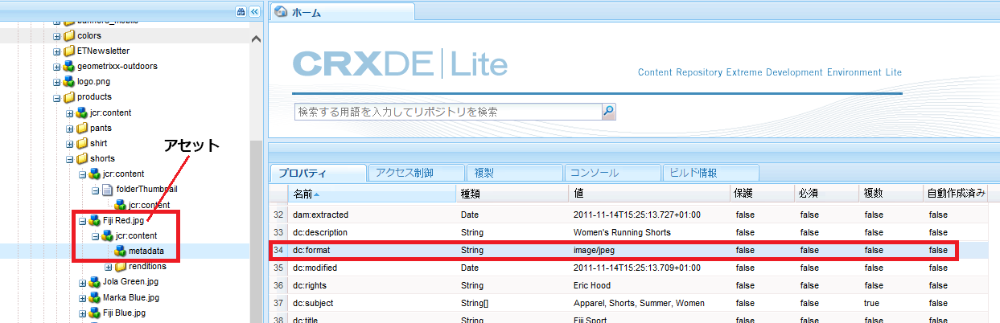

   アセット`Fiji Red.jpg`の`dc:format`は`image/jpeg`です。

   このフィルターをすべての画像に適用するには、その形式に関係なく、値を`image/*`に設定します。`*`は、任意の形式のすべての画像に適用される正規式です。

   JPEG形式の画像にのみフィルターを適用するには、`image/jpeg`の値を入力します。

1. レプリケーションに含めるレンディションまたは除外するレンディションを定義します。

   レプリケーション用のフィルターに使用できる文字は次のとおりです。

<table> 
 <tbody> 
  <tr> 
   <td><strong>使用する文字</strong></td> 
   <td><strong>レプリケーション用のアセットのフィルター方法</strong></td> 
  </tr> 
  <tr> 
   <td>*</td> 
   <td>ワイルドカード文字<br /> </td> 
  </tr> 
  <tr> 
   <td>+</td> 
   <td>レプリケーション用にアセットを含める</td> 
  </tr> 
  <tr> 
   <td>-</td> 
   <td>レプリケーションからアセットを除外する</td> 
  </tr> 
 </tbody> 
</table>

`content/dam/<locate_your_asset>/jcr:content/renditions` に移動します。

次の図は、あるアセットのレンディションの例を示しています。


上記の例を使用して、PTIFF（ピラミッドTIFF）を複製するだけの場合は、`+cqdam,*`と入力します。この中には、`cqdam`と開始するすべてのレンディションが含まれます。 例では、そのレンディションは`cqdam.pyramid.tiff`です。

オリジナルを複製したい場合は、`+original`と入力します。

## Dynamic Media 画像サーバーの設定 {#configuring-dynamic-media-image-server-settings}

Dynamic Media 画像サーバーの設定では、Adobe CQ Scene7 ImageServer バンドルと Adobe CQ Scene7 PlatformServer バンドルの編集をおこないます。

>[!NOTE]
Dynamic Mediaは、](#enabling-dynamic-media)を有効にした後、すぐに使える[で動く。 ただし、オプションで、Dynamic Media 画像サーバーを特定の仕様や要件に合うように設定することで、インストールを細かく調整することもできます。

**前提条件**: _Dynamic MediaImage Serverを設定する_ 前に、WindowsのVMにMicrosoft Visual C++ Librariesがインストールされていることを確認してください。Dynamic Media 画像サーバーを実行するには、このライブラリが必要です。[ここから Microsoft Visual C++ 2010 再頒布可能パッケージ（x64）をダウンロード](https://www.microsoft.com/ja-jp/download/details.aspx?id=14632)できます。

**Dynamic MediaImage Serverを設定するには**:

1. AEMの左上隅にある「**[!UICONTROL Adobe Experience Manager]**」をタップしてグローバルナビゲーションコンソールにアクセスし、**[!UICONTROL ツール/操作/Webコンソール]**&#x200B;をタップします。
1. **[!UICONTROL Adobe Experience ManagerWebコンソール設定]**&#x200B;ページで、**[!UICONTROL OSGi/設定]**&#x200B;をタップし、AEM内で現在実行中のすべてのバンドルをリストします。

   Dynamic Media配信サーバは、リスト内の次の名前で検出されます。

   * **[!UICONTROL Adobe CQ Scene7 ImageServer]**
   * **[!UICONTROL Adobe CQ Scene7 PlatformServer]**

1. バンドルのリストで、**[!UICONTROL Adobe CQScene7ImageServer]**&#x200B;の右側にある&#x200B;**[!UICONTROL 編集]**&#x200B;アイコンをタップします。
1. **[!UICONTROL Adobe CQScene7ImageServer]**&#x200B;ダイアログボックスで、次の設定値を設定します。

   >[!NOTE]
   ほとんどの場合、デフォルト値を変更する必要はありません。ただし、デフォルト値を変更した場合は、変更を有効にするために、バンドルを再起動する必要があります。

<table> 
 <tbody> 
  <tr> 
   <td><strong>Property</strong></td> 
   <td><strong>デフォルト値</strong></td> 
   <td><strong>説明</strong></td> 
  </tr> 
  <tr> 
   <td>TcpPort.name</td> 
   <td><code><em>empty</em></code></td> 
   <td>ImageServerプロセスとの通信に使用するポート番号。デフォルトでは、自動的に空きポートが検出されます。</td> 
  </tr> 
  <tr> 
   <td>AllowRemoteAccess.name</td> 
   <td><code><em>empty</em></code></td> 
   <td><p>ImageServerプロセスへのリモートアクセスを許可または禁止します。falseの場合、Image Serverはlocalhostのみをリッスンします。</p> <p>localhostを指す既定の外部化設定では、特定のVMインスタンスの実際のドメインまたはIPアドレスを指定する必要があります。この理由は、localhostがVMの親システムを指している可能性があるためです。</p> <p>VM のドメインまたは IP アドレスには、自身を解決できるようにホストファイルのエントリを含む必要がある場合があります。</p> </td> 
  </tr> 
  <tr> 
   <td>MaxRenderRgnPixels</td> 
   <td>16 MPixels</td> 
   <td>レンダリングされる最大サイズ（メガピクセル単位）。</td> 
  </tr> 
  <tr> 
   <td>MaxMessageSize</td> 
   <td>16 MBytes</td> 
   <td>配信されるメッセージの最大サイズ（メガピクセル単位）。</td> 
  </tr> 
  <tr> 
   <td>RandomAccessUrlTimeout</td> 
   <td>20</td> 
   <td>JCR がタイル範囲リクエストに応答するまで ImageServer が待つ時間（秒）を表すタイムアウト値。</td> 
  </tr> 
  <tr> 
   <td>WorkerThreads</td> 
   <td>10</td> 
   <td>ワーカースレッドの数。</td> 
  </tr> 
 </tbody> 
</table>

1. 「**[!UICONTROL 保存]**」をタップします。
1. バンドルのリストで、**[!UICONTROL Adobe CQScene7プラットフォームサーバー]**&#x200B;の右側にある&#x200B;**[!UICONTROL 編集]**&#x200B;アイコンをタップします。
1. **[!UICONTROL Adobe CQScene7プラットフォームサーバー]**&#x200B;ダイアログボックスで、次のデフォルト値オプションを設定します。

   >[!NOTE]
   Dynamic Media Image Server は、独自のディスクキャッシュを使用して応答をキャッシュします。AEM HTTP キャッシュと Dispacher を使用して Dynamic Media 画像サーバーからの応答をキャッシュすることはできません。

   | **プロパティ** | **デフォルト値** | **説明** |
   |---|---|---|
   | **[!UICONTROL Cache enabled]** | チェック | 応答キャッシュを有効にするかどうかを指定します。。 |
   | **[!UICONTROL Cache roots]** | cache | 応答キャッシュフォルダーへの 1 つ以上のパス。相対パスは、内部の s7imaging バンドルフォルダーを基準として解決されます。 |
   | **[!UICONTROL Cache Max Size]** | 200000000 | 応答キャッシュの最大サイズ（バイト単位）。 |
   | **[!UICONTROL Cache Max Entries]** | 100000 | キャッシュで許可される最大エントリ数。 |

### デフォルトのマニフェスト設定 {#default-manifest-settings}

デフォルトのマニフェストでは、Dynamic Media配信の応答の生成に使用するデフォルトを設定できます。画質（JPEGの画質、解像度、リサンプリングモード）、キャッシュ（有効期限）を微調整して、大きすぎる画像(defaultpix、defaultthumbpix、maxpix)のレンダリングを防ぐことができます。

デフォルトのマニフェスト設定の場所は、**[!UICONTROL Adobe CQ Scene7 PlatformServer]** バンドルの **[!UICONTROL Catalog root]** デフォルト値から取得されます。デフォルトでは、この値は&#x200B;**[!UICONTROL ツール/一般/CRXDE Lite]**&#x200B;内の次のパスにあります。

`/conf/global/settings/dam/dm/imageserver/`

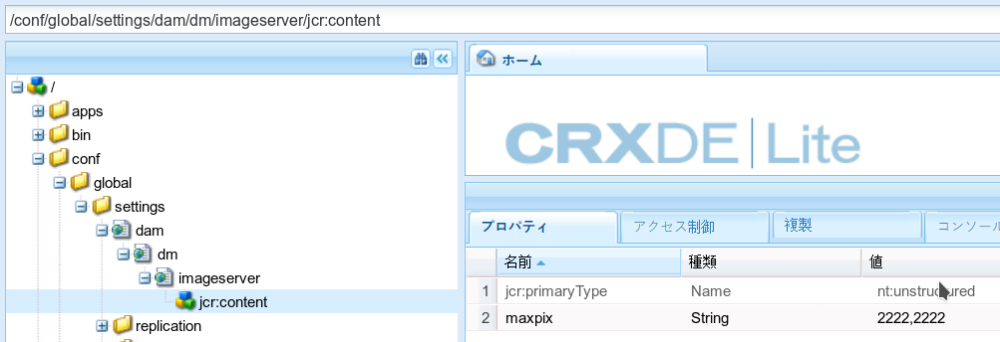

下の表に記載されているプロパティの値を変更するには、新しい値を入力します。

デフォルトのマニフェストの変更が完了したら、ページの左上隅にある「**[!UICONTROL すべて保存]**」をタップします。

必ず「**[!UICONTROL アクセス制御]**」タブ（**[!UICONTROL 「プロパティ]**」タブの右側）をタップし、全員およびDynamic Media Replicationユーザーのアクセス制御権限を`jcr:read`に設定してください。

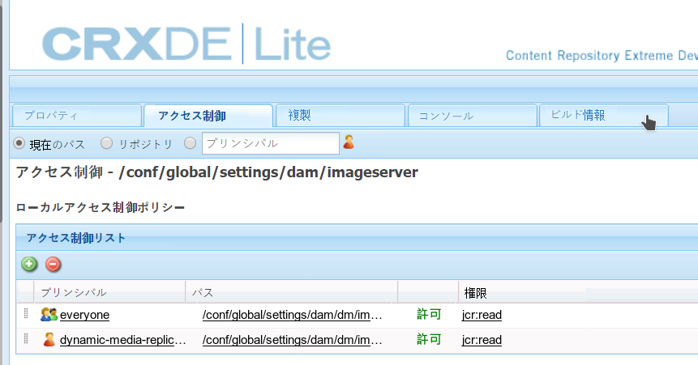

マニフェスト設定とそのデフォルト値の表：

<table> 
 <tbody> 
  <tr> 
   <td><strong>プロパティ</strong></td> 
   <td><strong>デフォルト値</strong></td> 
   <td><strong>説明</strong></td> 
  </tr> 
  <tr> 
   <td>bkgcolor</td> 
   <td>FFFFFF</td> 
   <td><p>デフォルトの背景色。実際の画像データが含まれない返信画像のすべての領域を埋めるために使用される RGB 値。</p> <p>画像サービング API の <a href="https://experienceleague.adobe.com/docs/dynamic-media-developer-resources/image-serving-api/image-serving-api/attributes/r-bkgcolor.html">BkgColor</a> も参照してください。</p> </td> 
  </tr> 
  <tr> 
   <td>defaultpix</td> 
   <td>300,300</td> 
   <td><p>デフォルトの表示サイズ。サーバーによって、返信画像がこの幅と高さ以内になるように制限されます（要求で wid=、hei= または scl= を使用して表示サイズが明示的に指定されていない場合）。</p> <p>2 つの整数値（0 以上）をコンマ区切りで指定します。幅と高さをピクセル単位で指定します。一方または両方の値を 0 に設定すると、制限なしのまま維持されます。ネストされた要求または埋め込まれた要求に対しては適用されません。</p> <p>画像サービング API の <a href="https://experienceleague.adobe.com/docs/dynamic-media-developer-resources/image-serving-api/image-serving-api/attributes/r-defaultpix.html">DefaultPix</a> も参照してください。</p> <p>ただし、通常はビューアプリセットまたは画像プリセットを使用してアセットを配信します。DefaultPix はビューアプリセットや画像プリセットを使用していないアセットに適用されます。</p> </td> 
  </tr> 
  <tr> 
   <td>defaultthumbpix</td> 
   <td>100,100</td> 
   <td><p>デフォルトのサムネールのサイズ。サムネール要求（req=tmb）の attribute::DefaultPix の代わりに使用されます。</p> <p>サーバーによって、返信画像がこの幅と高さ以内になるように制限されます（サムネール要求（req=tmb）で wid=、hei= または scl= を使用して表示サイズが明示的に指定されていない場合）。</p> <p>2 つの整数値（0 以上）をコンマ区切りで指定します。幅と高さをピクセル単位で指定します。一方または両方の値を 0 に設定すると、制限なしのまま維持されます。 </p> <p>ネストされた要求または埋め込まれた要求に対しては適用されません。</p> <p>画像サービング API の <a href="https://experienceleague.adobe.com/docs/dynamic-media-developer-resources/image-serving-api/image-serving-api/attributes/r-defaultthumbpix.html">DefaultThumbPix</a> も参照してください。 </p> </td> 
  </tr> 
  <tr> 
   <td>expiration</td> 
   <td>36000000</td> 
   <td><p>デフォルトのクライアントキャッシュの存続時間。特定のカタログレコードに有効な catalog::Expiration 値が含まれていない場合のデフォルトの有効期限間隔を指定します。</p> <p>0 以上の実数。返信データが生成されてから有効期限が切れるまでの時間数（ミリ秒単位）。0 に設定すると、常に返信画像が即座に有効期限切れになります。実質的に、クライアントキャッシュが無効になります。デフォルトでは、この時間は 10 時間に設定されています。つまり、新しい画像が公開される場合に、古い画像がユーザーのキャッシュから削除されるまで 10 時間かかります。より早くキャッシュをクリアする必要がある場合は、カスタマーケアに問い合わせてください。</p> <p>画像サービング API の<a href="https://experienceleague.adobe.com/docs/dynamic-media-developer-resources/image-serving-api/image-serving-api/attributes/r-expiration.html">有効期限</a>も参照してください。</p> </td> 
  </tr> 
  <tr> 
   <td>jpegquality</td> 
   <td>80</td> 
   <td><p>デフォルトの JPEG エンコード属性。JPEG 返信画像のデフォルト属性を指定します。</p> <p>整数とフラグをコンマ区切りで指定します。1 つ目の値には 1～100 の範囲で画質を定義します。2 つ目の値は、通常動作の場合は 0 を指定し、JPEG エンコーダーによって通常導入される RGB 色度ダウンサンプリングを無効にするには 1 を指定します。</p> <p>画像サービング API の <a href="https://experienceleague.adobe.com/docs/dynamic-media-developer-resources/image-serving-api/image-serving-api/attributes/r-jpegquality.html">JpegQuality</a> も参照してください。</p> </td> 
  </tr> 
  <tr> 
   <td>maxpix</td> 
   <td>2000,2000</td> 
   <td><p>返信画像のサイズ制限。クライアントに返される返信画像の最大の幅と高さ。</p> <p>リクエストが原因で、幅または高さがattribute::MaxPixより大きい応答イメージを返す場合、サーバはエラーを返します。</p> <p>画像サービング API の <a href="https://experienceleague.adobe.com/docs/dynamic-media-developer-resources/image-serving-api/image-serving-api/attributes/r-maxpix.html">MaxPix</a> も参照してください。</p> </td> 
  </tr> 
  <tr> 
   <td>resmode</td> 
   <td>SHARP2</td> 
   <td><p>デフォルトの再サンプリングモード。画像データの拡大縮小に使用するデフォルトの再サンプリングおよび補間属性を指定します。</p> <p>resMode= が要求内で指定されていない場合に使用されます。</p> <p>指定できる値は、BILIN、BICUB、またはSHARP2です。</p> <p>列挙。bilinの場合は2、bicubの場合は3、sharp2補間モードの場合は4に設定します。最良の結果を得るにはsharp2を使用します。</p> <p>画像サービング API の <a href="https://experienceleague.adobe.com/docs/dynamic-media-developer-resources/image-serving-api/image-serving-api/attributes/r-is-cat-resmode.html">ResMode</a> も参照してください。</p> </td> 
  </tr> 
  <tr> 
   <td>resolution</td> 
   <td>72</td> 
   <td><p>デフォルトのオブジェクト解像度。特定のカタログレコードに有効な catalog::Resolution 値が含まれていない場合のデフォルトのオブジェクト解像度を指定します。</p> <p>0 以上の実数。通常は ppi（インチあたりピクセル数）で表しますが、ppm（メートルあたりピクセル数）などの他の単位の場合もあります。</p> <p>画像サービング API の<a href="https://experienceleague.adobe.com/docs/dynamic-media-developer-resources/image-serving-api/image-serving-api/attributes/r-resolution.html">解像度</a>も参照してください。</p> </td> 
  </tr> 
  <tr> 
   <td>thumbnailtime</td> 
   <td>1%,11%,21%,31%,41%,51%,61%,71%,81%,91%</td> 
   <td>これらの値は、ビデオ再生時間のスナップショットを表し、<a href="https://encoding.com/">encoding.com</a>に渡されます。 詳しくは、<a href="/help/assets/video.md#about-video-thumbnails">ビデオサムネールについて</a>を参照してください。</td> 
  </tr> 
 </tbody> 
</table>

## Dynamic Media カラーマネジメントの設定  {#configuring-dynamic-media-color-management}

Dynamic Media カラーマネジメントを使用すると、プレビュー用にアセットをカラー補正できます。

カラー補正により、取り込まれたアセットは、生成された Pyramid TIFF レンディションにカラースペース（RGB、CMYK、グレー）および埋め込みカラープロファイルを維持します。動的レンディションを要求した場合、画像の色は、ターゲットのカラースペースに補正されます。JCR の Dynamic Media 公開設定に出力カラープロファイルを設定します。

Adobe カラーマネジメントは ICC プロファイルを使用しています。このプロファイルの形式は、International Color Consortium（ICC）によって定義されています。

Dynamic Media カラーマネジメントを設定して、CMYK、RGB またはグレー出力を使用する画像プリセットを設定できます。[画像プリセットの設定](managing-image-presets.md)を参照してください。

高度な事例では、手動設定の **[!UICONTROL icc=]** 修飾子を使用して出力カラープロファイルを明示的に選択することもあります。

* **[!UICONTROL icc]**  - [カラープロファイルを出力します。](https://experienceleague.adobe.com/docs/dynamic-media-developer-resources/image-serving-api/image-serving-api/http-protocol-reference/command-reference/r-icc.html)

* **[!UICONTROL iccEmbed]**  - [埋め込みカラープロファイル](https://experienceleague.adobe.com/docs/dynamic-media-developer-resources/image-serving-api/image-serving-api/http-protocol-reference/command-reference/r-iccembed.html)

>[!NOTE]
標準のAdobeカラープロファイルセットは、Software Distribution](https://experience.adobe.com/#/downloads/content/software-distribution/en/aem.html?package=/content/software-distribution/en/details.html/content/dam/aem/public/adobe/packages/cq630/featurepack/cq-6.3.0-featurepack-12445)の[Feature Pack 12445がインストールされている場合にのみ使用できます。 すべての機能パックとサービスパックは、[ソフトウェア配布](https://experience.adobe.com/#/downloads/content/software-distribution/en/aem.html)で入手できます。 機能パック 12445 は、Adobe カラープロファイルを提供します。

### 機能パック12445 {#installing-feature-pack}をインストールしています

Dynamic Media のカラーマネジメント機能を使用するには、機能パック 12445 をインストールする必要があります。

**機能パック12445をインストールするには**:

1. [ソフトウェア配布](https://experience.adobe.com/#/downloads/content/software-distribution/en/aem.html)に移動し、`cq-6.3.0-featurepack-12445`をダウンロードします。

   [!DNL Adobe Experience Manager]でのパッケージの使い方の詳細は、[パッケージの使い方](/help/sites-administering/package-manager.md)を参照してください。

1. 機能パックをインストールします。

### デフォルトカラープロファイルの設定 {#configuring-the-default-color-profiles}

機能パックをインストールしたら、適切なデフォルトカラープロファイルを設定して、RGB または CMYK 画像データを要求する際のカラー補正を有効にする必要があります。

**デフォルトの色プロファイルを設定するには**:

1. **[!UICONTROL ツール/一般/CRXDE Lite]**&#x200B;で、デフォルトのAdobe Colorプロファイルが含まれる`/conf/global/settings/dam/dm/imageserver/configuration/settings`に移動します。

   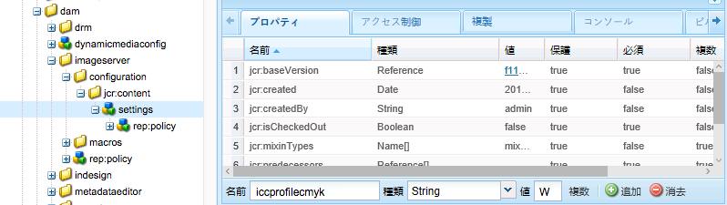

1. 「**[!UICONTROL 追加プロパティ]**」タブの下部にスクロールし、プロパティ名、タイプ、値を手動で入力することによる色修正プロパティ。次の表で説明します。 値を入力したら、**[!UICONTROL 追加]**&#x200B;をタップし、次に&#x200B;**[!UICONTROL すべて保存]**&#x200B;をタップして値を保存します。

   カラー補正プロパティは、**[!UICONTROL カラー補正プロパティ]**&#x200B;の表に記載しています。カラー補正プロパティに割り当てることができる値は、**[!UICONTROL カラープロファイル]**&#x200B;の表に記載しています。

   例えば、**[!UICONTROL 名前]**&#x200B;に`iccprofilecmyk`を追加し、**[!UICONTROL タイプ]** `String`を選択して、`WebCoated`を&#x200B;**[!UICONTROL 値]**&#x200B;として追加します。 **[!UICONTROL 追加]**&#x200B;をタップし、次に&#x200B;**[!UICONTROL 「すべて保存」]**&#x200B;をタップして値を保存します。

   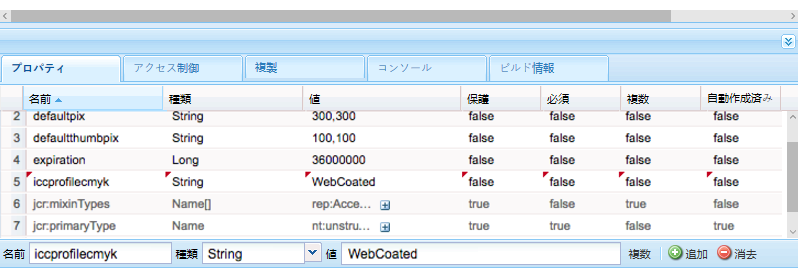

   **カラー補正プロパティの表**

   <table> 
    <tbody> 
      <tr> 
      <td><strong>プロパティ</strong></td> 
      <td><strong>型</strong></td> 
      <td><strong>デフォルト</strong></td> 
      <td><strong>説明</strong></td> 
      </tr> 
      <tr> 
      <td><a href="https://experienceleague.adobe.com/docs/dynamic-media-developer-resources/image-serving-api/image-serving-api/attributes/r-iccprofilergb.html">icprofilergb</a></td> 
      <td>String</td> 
      <td>&lt;空白&gt;</td> 
      <td>初期設定の RGB カラープロファイルの名前。</td> 
      </tr> 
      <tr> 
      <td><a href="https://experienceleague.adobe.com/docs/dynamic-media-developer-resources/image-serving-api/image-serving-api/attributes/r-iccprofilecmyk.html">icprofilecmyk</a></td> 
      <td>文字列</td> 
      <td>&lt;空白&gt;</td> 
      <td>初期設定の CMYK カラープロファイルの名前。</td> 
      </tr> 
      <tr> 
      <td><a href="https://experienceleague.adobe.com/docs/dynamic-media-developer-resources/image-serving-api/image-serving-api/attributes/r-iccprofilegray.html">icprofilegray</a></td> 
      <td>文字列</td> 
      <td>&lt;空白&gt;</td> 
      <td>初期設定のグレーカラープロファイルの名前。</td> 
      </tr> 
      <tr> 
      <td><a href="https://experienceleague.adobe.com/docs/dynamic-media-developer-resources/image-serving-api/image-serving-api/attributes/r-iccprofilesrcrgb.html">icprofilesrcrgb</a></td> 
      <td>文字列</td> 
      <td>&lt;空白&gt;</td> 
      <td>カラープロファイルが埋め込まれていないRGBプロファイルに使用される初期設定のRGBカラー画像の名前</td> 
      </tr> 
      <tr> 
      <td><a href="https://experienceleague.adobe.com/docs/dynamic-media-developer-resources/image-serving-api/image-serving-api/attributes/r-iccprofilesrccmyk.html">iccprofilesrccmyk</a></td> 
      <td>文字列</td> 
      <td>&lt;空白&gt;</td> 
      <td>カラープロファイルが埋め込まれていないCMYKプロファイルに使用される初期設定のCMYKカラー画像の名前です。</td> 
      </tr> 
      <tr> 
      <td><a href="https://experienceleague.adobe.com/docs/dynamic-media-developer-resources/image-serving-api/image-serving-api/attributes/r-iccprofilesrcgray.html">iccprofilesrcgray</a></td> 
      <td>文字列</td> 
      <td>&lt;空白&gt;</td> 
      <td>カラープロファイルが埋め込まれていないCMYKプロファイルに使用される初期設定のグレー画像の名前です。</td> 
      </tr> 
      <tr> 
      <td><a href="https://experienceleague.adobe.com/docs/dynamic-media-developer-resources/image-serving-api/image-serving-api/attributes/r-iccblackpointcompensation.html">iccblackpointcompension</a></td> 
      <td>ブール型</td> 
      <td>True</td> 
      <td>カラー補正中に黒点の補正を行うかどうかを指定します。 アドビでは、これをオンにすることをお勧めします。</td> 
      </tr> 
      <tr> 
      <td><a href="https://experienceleague.adobe.com/docs/dynamic-media-developer-resources/image-serving-api/image-serving-api/attributes/r-iccdither.html">icdither</a></td> 
      <td>ブール型</td> 
      <td>False</td> 
      <td>カラー補正中にディザリングを行うかどうかを指定します。</td> 
      </tr> 
      <tr> 
      <td><a href="https://experienceleague.adobe.com/docs/dynamic-media-developer-resources/image-serving-api/image-serving-api/attributes/r-iccrenderintent.html">icrenderintent</a></td> 
      <td>文字列</td> 
      <td>relative</td> 
      <td><p>レンダリングインテントを指定します。指定できる値は次のとおりです。<strong>知覚的、相対的、飽和、絶対的。 </strong><i></i>アドビでは、デフォルトとして<strong>相対</strong><i></i>をお勧めします。</p> </td> 
      </tr> 
    </tbody> 
    </table>

   >[!NOTE]
   プロパティ名は、大文字と小文字が区別され、すべて小文字にする必要があります。

   **カラープロファイルの表**

   次のカラープロファイルがインストールされます。

   <table> 
    <tbody> 
      <tr> 
      <th><p>名前</p> </th> 
      <th><p>カラースペース</p> </th> 
      <th><p>説明</p> </th> 
      </tr> 
      <tr> 
      <td>AdobeRGB</td> 
      <td>RGB</td> 
      <td>Adobe RGB(1998)</td> 
      </tr> 
      <tr> 
      <td>AppleRGB</td> 
      <td>RGB</td> 
      <td>Apple RGB</td> 
      </tr> 
      <tr> 
      <td>CIERGB</td> 
      <td>RGB</td> 
      <td>CIE RGB</td> 
      </tr> 
      <tr> 
      <td>CoatedFogra27</td> 
      <td>CMYK</td> 
      <td>Coated FOGRA27 (ISO 12647-2:2004)</td> 
      </tr> 
      <tr> 
      <td>CoatedFogra39</td> 
      <td>CMYK</td> 
      <td>Coated FOGRA39 (ISO 12647-2:2004)</td> 
      </tr> 
      <tr> 
      <td>CoatedGraCol</td> 
      <td>CMYK</td> 
      <td>Coated GRACoL 2006 (ISO 12647-2:2004)</td> 
      </tr> 
      <tr> 
      <td>ColorMatchRGB</td> 
      <td>RGB</td> 
      <td>ColorMatch RGB</td> 
      </tr> 
      <tr> 
      <td>EuropeISOCoated</td> 
      <td>CMYK</td> 
      <td>Europe ISO Coated FOGRA27</td> 
      </tr> 
      <tr> 
      <td>EuroscaleCoated</td> 
      <td>CMYK</td> 
      <td>Euroscale Coated v2</td> 
      </tr> 
      <tr> 
      <td>EuroscaleUncoated</td> 
      <td>CMYK</td> 
      <td>Euroscale Uncoated v2</td> 
      </tr> 
      <tr> 
      <td>JapanColorCoated</td> 
      <td>CMYK</td> 
      <td>Japan Color 2001 Coated</td> 
      </tr> 
      <tr> 
      <td>JapanColorNewspaper</td> 
      <td>CMYK</td> 
      <td>Japan Color 2002新聞</td> 
      </tr> 
      <tr> 
      <td>JapanColorUncoated</td> 
      <td>CMYK</td> 
      <td>Japan Color 2001 Uncoated</td> 
      </tr> 
      <tr> 
      <td>JapanColorWebCoated</td> 
      <td>CMYK</td> 
      <td>Japan Color 2003 Web Coated</td> 
      </tr> 
      <tr> 
      <td>JapanWebCoated</td> 
      <td>CMYK</td> 
      <td>Japan Web Coated (Ad)</td> 
      </tr> 
      <tr> 
      <td>新聞印刷SNAP2007</td> 
      <td>CMYK</td> 
      <td>US Newsprint(SNAP 2007)</td> 
      </tr> 
      <tr> 
      <td>NTSC</td> 
      <td>RGB</td> 
      <td>NTSC(1953)</td> 
      </tr> 
      <tr> 
      <td>PAL</td> 
      <td>RGB</td> 
      <td>PAL/SECAM</td> 
      </tr> 
      <tr> 
      <td>ProPhoto</td> 
      <td>RGB</td> 
      <td>ProPhoto RGB</td> 
      </tr> 
      <tr> 
      <td>PS4Default</td> 
      <td>CMYK</td> 
      <td>Photoshop4のデフォルトCMYK</td> 
      </tr> 
      <tr> 
      <td>PS5Default</td> 
      <td>CMYK</td> 
      <td>Photoshop5のデフォルトCMYK</td> 
      </tr> 
      <tr> 
      <td>SheetfedCoated</td> 
      <td>CMYK</td> 
      <td>U.S. Sheetfed Coated v2</td> 
      </tr> 
      <tr> 
      <td>SheetfedUncoated</td> 
      <td>CMYK</td> 
      <td>U.S. Sheetfed Uncoated v2</td> 
      </tr> 
      <tr> 
      <td>SMPTE</td> 
      <td>RGB</td> 
      <td>SMPTE-C</td> 
      </tr> 
      <tr> 
      <td>sRGB</td> 
      <td>RGB</td> 
      <td>sRGB IEC61966-2.1</td> 
      </tr> 
      <tr> 
      <td>UncoatedFogra29</td> 
      <td>CMYK</td> 
      <td>Uncoated FOGRA29 (ISO 12647-2:2004)</td> 
      </tr> 
      <tr> 
      <td>WebCoated</td> 
      <td>CMYK</td> 
      <td>U.S. Web Coated (SWOP) v2</td> 
      </tr> 
      <tr> 
      <td>WebCoatedFogra28</td> 
      <td>CMYK</td> 
      <td>Web Coated FOGRA28 (ISO 12647-2:2004)</td> 
      </tr> 
      <tr> 
      <td>WebCoatedGrade3</td> 
      <td>CMYK</td> 
      <td>Web Coated SWOP 2006 Grade 3 Paper</td> 
      </tr> 
      <tr> 
      <td>WebCoatedGrade5</td> 
      <td>CMYK</td> 
      <td>Web Coated SWOP 2006 Grade 5 Paper</td> 
      </tr> 
      <tr> 
      <td>WebUncoated</td> 
      <td>CMYK</td> 
      <td>U.S. Web Uncoated v2</td> 
      </tr> 
      <tr> 
      <td>WideGamotRGB</td> 
      <td>RGB</td> 
      <td>広域RGB</td> 
      </tr> 
    </tbody> 
    </table>

1. 「**[!UICONTROL すべて保存]**」をタップします。

例えば、**[!UICONTROL iccprofilergb]**&#x200B;を`sRGB`に、**[!UICONTROL iccprofilecmyk]**&#x200B;を`WebCoated`に設定できます。 それには、次のようにします。

* RGB および CMYK 画像のカラー補正を有効にします。
* カラープロファイルのないRGB画像は、`sRGB`カラースペースにあると見なされます。
* カラープロファイルのないCMYK画像は、`WebCoated`カラースペースにあると見なされます。
* RGB出力を返すダイナミックレンディション、`sRGB`カラースペースに返すレンディション。
* CMYK出力を返すダイナミックレンディション、`WebCoated`カラースペースに戻すレンディション。

## Delivering Assets {#delivering-assets}

上記のすべてのタスクを完了すると、アクティブ化されたDynamic Mediaアセットは画像またはビデオサービスから提供されます。 AEMでは、この機能は、「画像URLをコピー&#x200B;]**」、「**[!UICONTROL &#x200B;ビューアURLをコピー&#x200B;]**」、「**[!UICONTROL &#x200B;埋め込みビューアコード&#x200B;]**」、およびWCMに表示されます。**[!UICONTROL 

[Dynamic Media アセットの配信](delivering-dynamic-media-assets.md)を参照してください。

<table> 
 <tbody> 
  <tr> 
   <td><strong>実行する操作...</strong></td> 
   <td><strong>結果</strong></td> 
  </tr> 
  <tr> 
   <td>画像 URL のコピー</td> 
   <td><p>URLをコピーダイアログボックスには、次のようなURLが表示されます（URLはデモ目的のみです）。</p> <p><code>https://IMAGESERVICEPUBLISHNODE/is/image/content/dam/path/to/Image.jpg?$preset$</code></p> <p><code>IMAGESERVICEPUBLISHNODE</code> は画像サービスの URL を表します。</p> <p><a href="/help/assets/delivering-dynamic-media-assets.md">Dynamic Media アセットの配信</a>も参照してください。</p> </td> 
  </tr> 
  <tr> 
   <td>ビューア URL のコピー</td> 
   <td><p>URLをコピーダイアログボックスには、次のようなURLが表示されます（URLはデモ目的のみです）。</p> <p><code>https://PUBLISHNODE/etc/dam/viewers/s7viewers/html5/BasicZoomViewer.html?asset=/content/dam/path/to/Image.jpg&amp;config=/conf/global/settings/dam/dm/presets/viewer/Zoom_dark&amp;serverUrl=https://IMAGESERVICEPUBLISHNODE/is/image/&amp;contentRoot=%2F</code></p> <p><code>PUBLISHNODE</code> は通常の AEM パブリッシュノードを表し、<code>IMAGESERVICEPUBLISHNODE</code> は画像サービスの URL を表します。</p> <p><a href="/help/assets/delivering-dynamic-media-assets.md">Dynamic Media アセットの配信</a>も参照してください。</p> </td> 
  </tr> 
  <tr> 
   <td>ビューアの埋め込みコードのコピー</td> 
   <td><p>埋め込みコードをコピーダイアログボックスには、次のようなコードスニペットが表示されます（コードサンプルはデモ用です）。</p> <p><code class="code">&lt;style type="text/css"&gt;
       #s7basiczoom_div.s7basiczoomviewer{
       width:100%;
       height:auto;
       }
       &lt;/style&gt;
       &lt;script
       type="text/javascript" src="https://PUBLISHNODE/etc/dam/viewers/s7viewers/html5/js/BasicZoomViewer.js"&gt;&lt;/script&gt;
       &lt;div id="s7basiczoom_div"&gt;&lt;/div&gt;
       &lt;script type="text/javascript"&gt;
       var s7basiczoomviewer = new s7viewers.BasicZoomViewer({
       "containerId" : "s7basiczoom_div",
       "params" : {
       "serverurl" : "https://IMAGESERVICEPUBLISHNODE/is/image/",
       "contenturl" : "https://PUBLISHNODE/",
       "config" : "/conf/global/settings/dam/dm/presets/viewer/Zoom_dark",
       "asset" : "/content/dam/path/to/Image.jpg" }
       }).init();
       &lt;/script&gt;</code></p> <p><code>PUBLISHNODE</code> は通常の AEM パブリッシュノードを表し、<code>IMAGESERVICEPUBLISHNODE</code> は画像サービスの URL を表します。</p> <p><a href="/help/assets/delivering-dynamic-media-assets.md">Dynamic Media アセットの配信</a>も参照してください。</p> </td> 
  </tr> 
 </tbody> 
</table>

### WCM の Dynamic Media コンポーネントとインタラクティブメディアコンポーネント  {#wcm-dynamic-media-and-interactive-media-components}

Dynamic Media コンポーネントとインタラクティブメディアコンポーネントを参照する WCM ページは、配信サービスを参照します。
