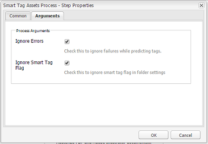

# Configure asset tagging using the Smart Content Service {#configure-asset-tagging-using-the-smart-content-service}

スマートコンテンツサービスを使用して、AEM でスマートタグと拡張スマートタグを設定する方法について説明します。

Adobe Experience Manager(AEM)をSmart Content Serviceと統合できます。 この設定を使用して、AEM内からSmart Content Serviceにアクセスし、画像に自動的にタグを付けます。

この記事では、スマートコンテンツサービスの設定に必要となる以下の主要なタスクについて詳しく説明します。バックエンドでは、スマートコンテンツサービスに要求を転送する前に、AEM サーバーが Adobe IO ゲートウェイでサービスの資格情報を認証します。

1. AEM でスマートコンテンツサービス設定を作成して、公開鍵を生成します。OAuth 統合用の公開証明書を取得します。
1. Adobe I/O で統合を作成し、生成した公開鍵をアップロードします。
1. API キーやその他の Adobe I/O の資格情報を使用して AEM インスタンスを設定します。
1. （オプション）アセットアップロード時の自動タグ付けを有効化します。

## 前提条件 {#prerequisites}

Adobe I/O で統合を作成してスマートコンテンツサービスを使用する前に、以下の事項を確認します。

* 組織の管理者権限を持つ Adobe ID アカウントがあること。
* 組織でスマートコンテンツサービスが有効化されていること。

To enable Enhanced Smart Tags, in addition to the above, also install the latest [AEM service pack](https://helpx.adobe.com/experience-manager/aem-releases-updates.html).

## 公開証明書の取得 {#obtain-public-certificate}

公開証明書により、Adobe I/O でプロファイルを認証できます。

1. AEM ユーザーインターフェイスで、AEM のロゴをタップし、**[!UICONTROL ツール]**／**[!UICONTROL クラウドサービス]**／**[!UICONTROL 従来のクラウドサービス]**&#x200B;に移動します。

1. Cloud Services ページで、「**[!UICONTROL アセットのスマートタグ]**」の「**[!UICONTROL 今すぐ設定]**」をタップまたはクリックします。
1. **[!UICONTROL 設定を作成]**&#x200B;ダイアログで、スマートタグ設定のタイトルと名前を指定します。「**[!UICONTROL 作成]**」をタップまたはクリックします。
1. **[!UICONTROL AEM スマートコンテンツサービス]**&#x200B;ダイアログで、以下の値を使用します。

   **[!UICONTROL サービス URL]**: `https://mc.adobe.io/marketingcloud/smartcontent`

   **[!UICONTROL 認証サーバー]**: `https://ims-na1.adobelogin.com`

   その他のフィールドは現時点では空白のままにします（後で指定します）。「**[!UICONTROL OK]**」をタップまたはクリックします。

   

   >[!NOTE]
   >
   >The URL provided as [!UICONTROL Service URL] is not accessible via browser and generates a 404 error. この設定は、 [!UICONTROL Service URLパラメーターと同じ値で正常に機能します] 。 Adobe I/O サービスの全体的なステータスとメンテナンススケジュールについては、[https://status.adobe.com](https://status.adobe.com) を参照してください。

1. 「**[!UICONTROL OAuth 統合用の公開証明書をダウンロード]**」をタップまたはクリックし、公開証明書ファイル `AEM-SmartTags.crt` をダウンロードします。

   

## Adobe I/O 統合の作成 {#create-adobe-i-o-integration}

スマートコンテンツサービス API を使用するには、Adobe I/O で統合を作成して、API キー、テクニカルアカウント ID、組織 ID およびクライアントの秘密鍵を生成します。

1. [https://console.adobe.io](https://console.adobe.io/) にアクセスします。
1. **[!UICONTROL Integrations]** ページで組織を選択します。
1. 「**[!UICONTROL New Integration]**」をタップまたはクリックします。
1. **[!UICONTROL Create a new integration]** ページで、「**[!UICONTROL Access an API]**」を選択します。「**[!UICONTROL 続行]**」をタップまたはクリックします。
1. 「**[!UICONTROL Experience Cloud]**」で「**[!UICONTROL スマートコンテンツ]**」を選択します。「**[!UICONTROL 続行]**」をタップまたはクリックします。

   

1. 次のページで、「**[!UICONTROL New integration]**」を選択します。「**[!UICONTROL 続行]**」をタップまたはクリックします。
1. **[!UICONTROL Integration Details]** ページで、統合ゲートウェイの名前を指定し、説明を追加します。
1. 「**[!UICONTROL Public keys certificates]**」で、上記でダウンロードした `AEM-SmartTags.crt` ファイルをアップロードします。
1. 「**[!UICONTROL Create Integration]**」をタップまたはクリックします。
1. 統合の情報を表示するには、「**[!UICONTROL Continue to integration details]**」をタップまたはクリックします。

   

## スマートコンテンツサービスの設定 {#configure-smart-content-service}

統合を設定するには、Adobe I/O 統合のテクニカルアカウント ID、組織 ID、クライアントの秘密鍵、認証サーバーおよび API キーのフィールドの値を使用します。スマートタグクラウド設定を作成すると、AEM インスタンスからの API 要求を認証できるようになります。

1. AEM ユーザーインターフェイスで、AEM のロゴをタップまたはクリックします。**[!UICONTROL ツール／クラウドサービス／従来のクラウドサービス]**&#x200B;に移動して、クラウドサービスコンソールを開きます。
1. 「**[!UICONTROL アセットのスマートタグ]**」で、上記で作成した設定を開きます。サービスの設定ページで、「**[!UICONTROL 編集]**」をクリックします。
1. **[!UICONTROL AEM スマートコンテンツサービス]**&#x200B;ダイアログで、「**[!UICONTROL サービス URL]**」および「**[!UICONTROL 認証サーバー]**」フィールドに事前入力された値を使用します。
1. 「API キー」、「テクニカルアカウント ID」、「組織 ID」、「クライアントの秘密鍵」の各フィールドでは、上記で生成された値を使用します。

## 設定の検証 {#validate-the-configuration}

設定を完了したら、JMX MBean を使用して設定を検証できます。検証するには、次の手順に従います。

1. AEMでOSGiコンソールを開くには、ツール/操作/Web **[!UICONTROL コンソールをクリックします]**。 **[!UICONTROL メイン／JMX]** を選択します。
1. 「**[!UICONTROL com.day.cq.dam.similaritysearch.internal.impl]**」をクリックします。**[!UICONTROL SimilaritySearch Miscellaneous Tasks]** が開きます。
1. 「**[!UICONTROL validateConfigs()]**」をクリックします。In the **[!UICONTROL Validate Configurations]** dialog, click **[!UICONTROL Invoke]**.

   同じダイアログに検証結果が表示されます。

## Enable smart tagging in the DAM Update Asset workflow (Optional) {#enable-smart-tagging-in-the-update-asset-workflow-optional}

1. AEM ユーザーインターフェイスで、AEM のロゴをタップまたはクリックし、**[!UICONTROL ツール／ワークフロー／モデル]**&#x200B;に移動します。
1. **[!UICONTROL ワークフローモデル]**&#x200B;ページで、「**[!UICONTROL DAM アセットの更新]**」ワークフローモデルを選択します。
1. ツールバーの「**[!UICONTROL 編集]**」をタップまたはクリックします。
1. サイドパネルを展開して、ステップを表示します。「DAM ワークフロー」セクションの「**[!UICONTROL スマートタグアセット]**」ステップをドラッグして、「**[!UICONTROL サムネールを処理]**」ステップの後に配置します。

   

1. そのステップを編集モードで開きます。「**[!UICONTROL 詳細設定]**」で、「**[!UICONTROL ハンドラー処理の設定]**」オプションが選択されていることを確認します。

   

1. 自動タグ付けのステップに失敗してもワークフローを完了させたい場合は、「**[!UICONTROL 引数]**」タブで「**[!UICONTROL エラーを無視]**」を選択します。

   

   フォルダーでスマートタグが有効になっているかに関わらずアップロード時にアセットをタグ付けするには、「**[!UICONTROL スマートタグフラグを無視]**」を選択します。

   

1. 「**[!UICONTROL OK]**」をタップまたはクリックして、プロセスステップを閉じ、ワークフローを保存します。

>[!MORELIKETHIS]
>
>* [AEM Assetsのスマートタグについて](https://helpx.adobe.com/experience-manager/kt/assets/using/smart-tags-feature-video-understand.html)
>* [AEM Assetsでのスマートタグの使用](https://helpx.adobe.com/experience-manager/kt/assets/using/smart-tags-feature-video-use.html)
>* [AEM Assetsでの拡張スマートタグの使用](https://helpx.adobe.com/experience-manager/kt/assets/using/enhanced-smart-tags-feature-video-use.html)
>* [AEM Assetsでの拡張スマートタグの設定](https://helpx.adobe.com/experience-manager/kt/assets/using/enhanced-smart-tags-technical-video-setup.html)

