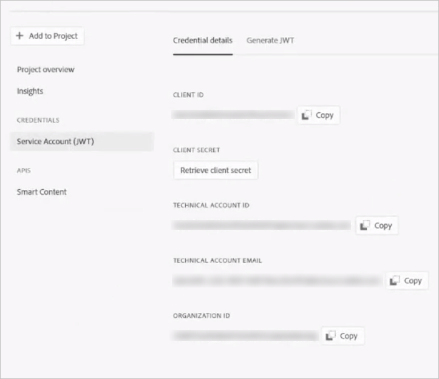

# スマートコンテンツサービス{#configure-asset-tagging-using-the-smart-content-service}を使用したアセットタグ付けの設定

[!DNL Adobe Developer Console]を使用して、[!DNL Adobe Experience Manager]をスマートコンテンツサービスと統合できます。 この設定を使用して、[!DNL Experience Manager]内からスマートコンテンツサービスにアクセスします。

この記事では、スマートコンテンツサービスの設定に必要となる以下の主要なタスクについて詳しく説明します。バックエンドでは、[!DNL Experience Manager]サーバーがスマートコンテンツサービスに要求を転送する前に、[!DNL Adobe Developer Console]ゲートウェイでサービスの資格情報を認証します。

1. [ でスマートコンテンツサービス設定を作成して、公開鍵を生成します。](#obtain-public-certificate)[!DNL Experience Manager]OAuth 統合用の[公開証明書を取得します](#obtain-public-certificate)。

1. [Adobe 開発者コンソールで統合を作成](#create-adobe-i-o-integration)し、生成した公開鍵をアップロードします。

1. [のAPIキーやその](#configure-smart-content-service) 他の資格情報を使用して、デプロイメントを設定 [!DNL Adobe Developer Console]します。

1. [設定をテストします](#validate-the-configuration)。

1. オプションで、[アセットのアップロード時の自動タグ付けを有効にします](#enable-smart-tagging-in-the-update-asset-workflow-optional)。

## 前提条件 {#prerequisites}

スマートコンテンツサービスを使用する前に、次の手順を実行して[!DNL Adobe Developer Console]に統合を作成します。

* 組織の管理者権限を持つ Adobe ID アカウントがあること。

* お客様の組織でスマートコンテンツサービスが有効になっている。

上記に加えて、拡張スマートタグを有効にするには、最新の[Experience Managerサービスパック](https://experienceleague.adobe.com/docs/experience-manager-release-information/aem-release-updates/aem-releases-updates.html?lang=ja)もインストールします。

## スマートコンテンツサービス設定を作成して公開証明書を取得する{#obtain-public-certificate}

公開証明書を使用すると、[!DNL Adobe Developer Console]でプロファイルを認証できます。

1. [!DNL Experience Manager]ユーザーインターフェイスで、**[!UICONTROL ツール]** / **[!UICONTROL Cloud Services]** / **[!UICONTROL 従来のCloud Services]**&#x200B;にアクセスします。

1. Cloud Servicesページで、「**[!UICONTROL アセットのスマートタグ]**」の下の「**[!UICONTROL 今すぐ設定]**」をクリックします。

1. **[!UICONTROL 設定を作成]**&#x200B;ダイアログで、スマートタグ設定のタイトルと名前を指定します。「**[!UICONTROL 作成]**」をクリックします。

1. **[!UICONTROL AEM スマートコンテンツサービス]**&#x200B;ダイアログで、以下の値を使用します。

   **[!UICONTROL サービス URL]**: `https://mc.adobe.io/marketingcloud/smartcontent`

   **[!UICONTROL 認証サーバー]**: `https://ims-na1.adobelogin.com`

   その他のフィールドは現時点では空白のままにします（後で指定します）。「**[!UICONTROL OK]**」をクリックします。

   

   *図：コンテンツサービスURLを提供するスマートコンテンツサービスダイアログ*

   >[!NOTE]
   >
   >[!UICONTROL サービスURL]として提供されたURLは、ブラウザーからアクセスできず、404エラーが発生します。 この設定は、[!UICONTROL Service URL]パラメーターと同じ値で正常に動作します。 サービスの全体的なステータスとメンテナンススケジュールについては、[https://status.adobe.com](https://status.adobe.com)を参照してください。

1. 「**[!UICONTROL OAuth統合用の公開証明書をダウンロード]**」をクリックし、公開証明書ファイル`AEM-SmartTags.crt`をダウンロードします。

   

   *図：スマートタグサービスの設定*

### 証明書の有効期限が切れた場合の再設定 {#certrenew}

証明書の有効期限が切れると、証明書は信頼されなくなります。 期限切れの証明書は更新できません。新しい証明書を追加するには、以下の手順に従います。

1. [!DNL Experience Manager] デプロイメントに管理者としてログインします。**[!UICONTROL ツール]**／**[!UICONTROL セキュリティ]**／**[!UICONTROL ユーザー]**&#x200B;をクリックします。

1. **[!UICONTROL dam-update-service]** ユーザーを見つけてクリックします。「**[!UICONTROL キーストア]**」タブをクリックします。

1. 証明書の有効期限が切れた既存の **[!UICONTROL similaritysearch]** キーストアを削除します。「**[!UICONTROL 保存して閉じる]**」をクリックします。

   

   *図：キーストアの既存の `similaritysearch` エントリを削除して新しいセキュリティ証明書を追加.*

1. **[!UICONTROL ツール]**／**[!UICONTROL クラウドサービス]**／**[!UICONTROL 従来のクラウドサービス]**&#x200B;に移動します。**[!UICONTROL アセットのスマートタグ]**／**[!UICONTROL 設定を表示]**／**[!UICONTROL 利用可能な設定]**&#x200B;をクリックします。必要な設定をクリックします。

1. 公開証明書をダウンロードするには、「**[!UICONTROL OAuth 統合用の公開証明書をダウンロード]**」をクリックします。

1. [https://console.adobe.io](https://console.adobe.io) にアクセスし、**[!UICONTROL 統合]**&#x200B;ページで既存のスマートコンテンツサービスに移動します。新しい証明書をアップロードします。詳しくは、[Adobe開発者コンソール統合の作成](#create-adobe-i-o-integration)の手順を参照してください。

## Adobe開発者コンソール統合の作成{#create-adobe-i-o-integration}

スマートコンテンツサービスAPIを使用するには、Adobe開発者コンソールで統合を作成し、[!UICONTROL APIキー](Adobe開発者コンソール統合の[!UICONTROL CLIENT ID]フィールドで生成)、[!UICONTROL テクニカルアカウントID]、[!UICONTROL 組織を取得します[!UICONTROL アセットのスマートタグサービス設定]のID]および[!UICONTROL クライアントの秘密鍵]（[!DNL Experience Manager]のクラウド設定）。

1. ブラウザーで [https://console.adobe.io](https://console.adobe.io/) にアクセスします。適切なアカウントを選択し、関連付けられた組織の役割がシステム管理者であることを確認します。

1. 任意の名前でプロジェクトを作成します。「**[!UICONTROL API を追加]**」をクリックします。

1. **[!UICONTROL API を追加]**&#x200B;ページで、「**[!UICONTROL Experience Cloud]**」、「**[!UICONTROL スマートコンテンツ]**」の順に選択します。「**[!UICONTROL 次へ]**」をクリックします。

1. 「**[!UICONTROL 公開鍵をアップロード]**」を選択します。[!DNL Experience Manager]からダウンロードした証明書ファイルを指定します。[!UICONTROL 公開鍵が正常にアップロード]されたというメッセージが表示されます。「**[!UICONTROL 次へ]**」をクリックします。

   [!UICONTROL 新しいサービスアカウント（JWT）秘密鍵証明書を作成]ページには、設定したサービスアカウントの公開鍵が表示されます。

1. 「**[!UICONTROL 次へ]**」をクリックします。

1. **[!UICONTROL 製品プロファイルを選択]**&#x200B;ページで、「**[!UICONTROL スマートコンテンツサービス]**」を選択します。「**[!UICONTROL 設定済み API を保存]**」をクリックします。

   設定に関する詳細情報がページに表示されます。このページを開いたままにして、スマートタグを設定するには、[!DNL Experience Manager]のクラウド設定の[!UICONTROL アセットのスマートタグサービス設定]にこれらの値をコピーして追加します。

   

   *図：統合開発者コンソールでのAdobeの詳細*

## スマートコンテンツサービスの設定 {#configure-smart-content-service}

統合を設定するには、Adobe開発者コンソール統合の[!UICONTROL TECHNICAL ACCOUNT ID]、[!UICONTROL ORGANIZATION ID]、[!UICONTROL CLIENT SECRET]、[!UICONTROL CLIENT ID]の値を使用します。 スマートタグクラウド設定を作成すると、[!DNL Experience Manager]デプロイメントからAPIリクエストを認証できます。

1. [!DNL Experience Manager]で、**[!UICONTROL ツール/Cloud Service/従来のCloud Services]**&#x200B;に移動し、[!UICONTROL Cloud Services]コンソールを開きます。

1. 「**[!UICONTROL アセットのスマートタグ]**」で、上記で作成した設定を開きます。サービスの設定ページで、「**[!UICONTROL 編集]**」をクリックします。

1. **[!UICONTROL AEM スマートコンテンツサービス]**&#x200B;ダイアログで、「**[!UICONTROL サービス URL]**」および「**[!UICONTROL 認証サーバー]**」フィールドに事前入力された値を使用します。

1. [!UICONTROL Apiキー]、[!UICONTROL テクニカルアカウントID]、[!UICONTROL 組織ID]、[!UICONTROL クライアントの秘密鍵]の各フィールドに対して、[Adobe開発者コンソール統合](#create-adobe-i-o-integration)で生成された次の値をコピーして使用します。

   | [!UICONTROL アセットのスマートタグサービス設定] | [!DNL Adobe Developer Console] 統合フィールド |
   |--- |--- |
   | [!UICONTROL API キー] | [!UICONTROL クライアントID] |
   | [!UICONTROL テクニカルアカウント ID] | [!UICONTROL テクニカルアカウントID] |
   | [!UICONTROL 組織 ID] | [!UICONTROL 組織ID] |
   | [!UICONTROL クライアントの秘密鍵] | [!UICONTROL クライアント秘密鍵] |

## 設定の検証 {#validate-the-configuration}

設定が完了したら、JMX MBeanを使用して設定を検証します。 検証するには、次の手順に従います。

1. `https://[aem_server]:[port]`にある[!DNL Experience Manager]サーバーにアクセスします。

1. **[!UICONTROL ツール／操作／Web コンソール]**&#x200B;に移動して、OSGi コンソールを開きます。**[!UICONTROL メイン／JMX]** を選択します。

1. 「**[!UICONTROL com.day.cq.dam.similaritysearch.internal.impl]**」をクリックします。**[!UICONTROL SimilaritySearch Miscellaneous Tasks]**&#x200B;が開きます。

1. 「**[!UICONTROL validateConfigs()]**」をクリックします。**[!UICONTROL 設定を検証]**&#x200B;ダイアログで、「****&#x200B;を呼び出す」をクリックします。

   検証結果は同じダイアログに表示されます。

## DAMアセットの更新ワークフローでスマートタグを有効にする（オプション） {#enable-smart-tagging-in-the-update-asset-workflow-optional}

1. [!DNL Experience Manager]で、**[!UICONTROL ツール]** > **[!UICONTROL ワークフロー]** > **[!UICONTROL モデル]**&#x200B;に移動します。

1. **[!UICONTROL ワークフローモデル]**&#x200B;ページで、「**[!UICONTROL DAM アセットの更新]**」ワークフローモデルを選択します。

1. ツールバーの「**[!UICONTROL 編集]**」をクリックします。

1. サイドパネルを展開して、ステップを表示します。「DAM ワークフロー」セクションの「**[!UICONTROL スマートタグアセット]**」ステップをドラッグして、「**[!UICONTROL サムネールを処理]**」ステップの後に配置します。

   

   *図：「DAM アセットの更新」ワークフローで「サムネールを処理」ステップの後に「スマートタグアセット」ステップを追加。*

1. そのステップを編集モードで開きます。「**[!UICONTROL 詳細設定]**」で、「**[!UICONTROL ハンドラー処理の設定]**」オプションが選択されていることを確認します。

   

   *図：DAMアセットの更新ワークフローの設定とスマートタグステップの追加*

1. 自動タグ付けのステップに失敗してもワークフローを完了させたい場合は、「**[!UICONTROL 引数]**」タブで「**[!UICONTROL エラーを無視]**」を選択します。

   

   *図：スマートタグステップを追加するDAMアセットの更新ワークフローを設定し、ハンドラー処理の設定を選択します。*

   フォルダーでスマートタグが有効になっているかに関わらずアップロード時にアセットをタグ付けするには、「**[!UICONTROL スマートタグフラグを無視]**」を選択します。

   

   *図：スマートタグステップを追加するためのDAMアセットの更新ワークフローを設定し、「スマートタグフラグを無視」を選択します。*

1. 「**[!UICONTROL OK]**」をクリックして、プロセスステップを閉じ、ワークフローを保存します。

>[!MORELIKETHIS]
>
>* [スマートタグの管理](managing-smart-tags.md)
* [スマートタグの概要とスマートタグのトレーニング方法](enhanced-smart-tags.md)
* [スマートコンテンツサービスをトレーニングするためのガイドラインとルール](smart-tags-training-guidelines.md)

