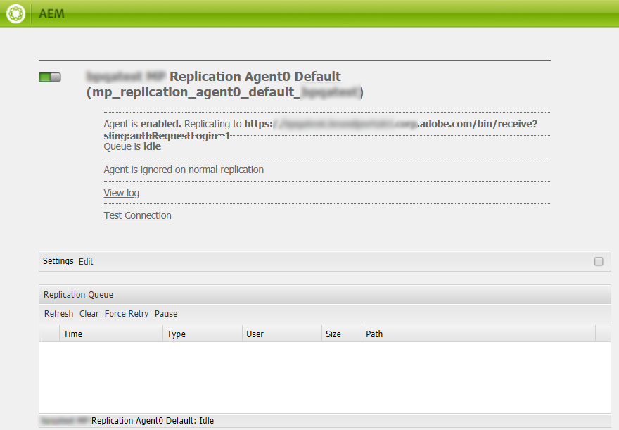

# AEM Assets と Brand Portal の連携の設定 {#configure-integration-64}

Adobe Experience Manager Assets とBrand Portalの連携は、 [!DNL Adobe I/O]:Brand Portalテナントの認証用の IMS トークンを取得します。

>[!NOTE]
>
>を介したBrand PortalとのAEM Assetsの設定 [!DNL Adobe I/O] は、AEM 6.4.8.0 以降でサポートされています。
>
>これまで、Brand Portal は、旧来の OAuth ゲートウェイを通じてクラシック UI で設定されていました。このゲートウェイは、JWT トークン交換を使用して認証用の IMS アクセストークンを取得します。

>[!TIP]
>
>***既存のお客様のみ***
>
>既存のレガシー OAuth Gateway 設定を引き続き使用することをお勧めします。レガシー OAuth Gateway 設定に問題が発生した場合は、既存の設定を削除し、 [!DNL Adobe I/O].

このヘルプでは、次の 2 つのユースケースについて説明します。

* [新しい設定](#configure-new-integration-64):新しいBrand Portalユーザーで、Brand Portalを使用してAEM Assetsオーサーインスタンスを設定する場合は、で新しい設定を作成できます。 [!DNL Adobe I/O].
* [設定をアップグレード](#upgrade-integration-64):旧来の OAuth Gateway でBrand Portalを使用してAEM Assetsオーサーインスタンスを設定している既存のBrand Portalユーザーの場合は、既存の設定を削除し、で新しい設定を作成することをお勧めします。 [!DNL Adobe I/O].

具体的には、以下の操作に関する十分な知識があるユーザーを対象としています。

* Adobe Experience ManagerおよびAEMパッケージのインストール、設定、管理

* Linux およびMicrosoft Windows オペレーティングシステムの使用

## 前提条件 {#prerequisites}

AEM Assets と Brand Portal の連携を設定するには以下が必要です。

* 最新のサービスパックを適用した実行中の AEM Assets オーサーインスタンス
* Brand Portal テナント URL
* Brand Portal テナントの IMS 組織に対するシステム管理者権限を持つユーザー

[AEM 6.4 のダウンロードとインストール](#aemquickstart)

[最新の AEM サービスパックをダウンロードしてインストールする](#servicepack)

### AEM 6.4 のダウンロードとインストール {#aemquickstart}

AEMオーサーインスタンスを設定するには、AEM 6.4 を使用することをお勧めします。AEM が稼働していない場合は、以下の場所から AEM をダウンロードしてください。

* 既に AEM を使用している場合は、[アドビライセンス Web サイト](http://licensing.adobe.com)から AEM 6.4 をダウンロードしてください。

* アドビパートナーの場合は、[アドビパートナートレーニングプログラム](https://adobe.allegiancetech.com/cgi-bin/qwebcorporate.dll?idx=82357Q)から AEM 6.4 をリクエストしてください。

AEM をダウンロードしたら、[デプロイメントと保守](https://helpx.adobe.com/jp/experience-manager/6-4/sites/deploying/using/deploy.html#defaultlocalinstall)の説明に従い、AEM オーサーインスタンスの設定を行ってください。

### 最新の AEM サービスパックをダウンロードしてインストールする {#servicepack}

説明については、次を参照してください。

* [AEM 6.4 サービスパックリリースノート](https://helpx.adobe.com/jp/experience-manager/6-4/release-notes/sp-release-notes.html)

**カスタマーサポートに連絡** 最新のAEMパッケージまたは Service Pack が見つからない場合。

## 設定の作成 {#configure-new-integration-64}

AEM AssetsとBrand Portalを初めて設定する場合は、以下の手順を上記の順序で実行します。

1. [公開証明書の取得](#public-certificate)
1. [作成 [!DNL Adobe I/O] 統合](#createnewintegration)
1. [IMS アカウント設定の作成](#create-ims-account-configuration)
1. [Cloud Service の設定](#configure-the-cloud-service)
1. [設定のテスト](#test-integration)

>[!NOTE]
>
>AEM Assets オーサーインスタンスは、1 つの Brand Portal テナントとの連携のみ設定する必要があります。

### IMS 設定の作成 {#create-ims-configuration}

IMS 設定は、AEM Assets オーサーインスタンスを使用して Brand Portal テナントを認証します。

IMS 設定には、次の 2 つの手順が含まれます。

* [公開証明書の取得](#public-certificate)
* [IMS アカウント設定の作成](#create-ims-account-configuration)

### 公開証明書の取得 {#public-certificate}

公開証明書により、でプロファイルを認証できます。 [!DNL Adobe I/O].

1. AEM Assetsオーサーインスタンス（デフォルト URL）にログインします。http:// localhost:4502/aem/start.html
1. 送信者 **ツール**  パネル、に移動します。 **[!UICONTROL セキュリティ]** >> **[!UICONTROL Adobe IMS設定]**.

   

1. Adobe IMS 設定ページが開きます。

   「**[!UICONTROL 作成]**」をクリックします。

   これにより、 **[!UICONTROL Adobe IMSテクニカルアカウント設定]** ページ。

1. デフォルトでは、「**証明書**」タブが開きます。

   **クラウドソリューション**&#x200B;で「**[!UICONTROL Adobe Brand Portal]**」を選択します。

1. チェックボックスをオンにします。 **[!UICONTROL 新しい証明書を作成]** をクリックし、 **エイリアス** 証明書用。 ここで入力したエイリアスが、ダイアログ名として表示されます。

1. 「**[!UICONTROL 証明書を作成]**」をクリックします。ダイアログが表示されます。「**[!UICONTROL OK]**」をクリックして公開証明書を生成します。

   

1. 「**[!UICONTROL 公開鍵をダウンロード]**」をクリックし、*AEM-Adobe-IMS.crt* 証明書ファイルをローカルマシンに保存します。証明書ファイルは、 [作成 [!DNL Adobe I/O] 統合](#createnewintegration).

   

1. 「**[!UICONTROL 次へ]**」をクリックします。

   「**アカウント**」タブで、Adobe IMS アカウントを作成するには、統合環境の詳細が必要です。このページは開いたままにしておきます。

   新しいタブを開き、 [作成 [!DNL Adobe I/O] 統合](#createnewintegration) をクリックして、IMS アカウント設定の統合の詳細を取得します。

### 作成 [!DNL Adobe I/O] 統合 {#createnewintegration}

[!DNL Adobe I/O] 統合環境により、API キー、クライアント秘密鍵、および IMS アカウント設定の設定で必要なペイロード（JWT）が生成されます。

1. ログイン先 [!DNL Adobe I/O] Brand Portalテナントの IMS 組織に対するシステム管理者権限を持つコンソール。

   デフォルト URL：[https://console.adobe.io/](https://console.adobe.io/)

1. 「**[!UICONTROL 統合を作成]**」をクリックします。

1. 「**[!UICONTROL API にアクセス]**」を選択し、「**[!UICONTROL 続行]**」をクリックします。

   

1. 新しい統合を作成ページを開きます。

   ドロップダウンリストからご自身の組織を選択します。

   **[!UICONTROL Experience Cloud]** で「**[!UICONTROL AEM Brand Portal]**」を選択し、「**[!UICONTROL 続行]**」をクリックします。

   「Brand Portal」オプションが無効になっている場合は、「**[!UICONTROL アドビのサービス]**」オプションの上にあるドロップダウンボックスで正しい組織が選択されているかどうかを確認してください。自分がどの組織に属しているかわからない場合は、管理者に問い合わせてください。

   

1. 新しい統合環境の名前と説明を入力します。「**[!UICONTROL お使いのコンピューターからファイルを選択]**」をクリックし、「[公開証明書を取得する](#public-certificate)」セクションでダウンロードした `AEM-Adobe-IMS.crt` ファイルをアップロードします。

1. 組織のプロファイルを選択します。

   または、デフォルトのプロファイル **[!UICONTROL Assets Brand Portal]** を選択し、「**[!UICONTROL 統合を作成]**」をクリックします。統合環境が作成されます。

1. 「**[!UICONTROL 統合の詳細情報に進む]**」をクリックして、統合環境の詳細情報を表示します。

   **[!UICONTROL API キーのコピー]**

   「**[!UICONTROL クライアント秘密鍵を取得]**」をクリックし、クライアント秘密鍵をコピーします。

   

1. 「**[!UICONTROL JWT]**」タブに移動し、**[!UICONTROL JWT ペイロード]**&#x200B;をコピーします。

   API キー、クライアント秘密鍵、JWT ペイロード情報は、IMS アカウント設定の作成に使用されます。

### IMS アカウント設定の作成 {#create-ims-account-configuration}

次の手順を実行したことを確認します。

* [公開証明書の取得](#public-certificate)
* [作成 [!DNL Adobe I/O] 統合](#createnewintegration)

**IMS アカウント設定の作成手順：**

1. IMS 設定ページの「**[!UICONTROL アカウント]**」タブを開きます。（このページは、「[公開証明書を取得する](#public-certificate)」セクションの最後で開いたままにしておいたページです）。

1. IMS アカウントの&#x200B;**[!UICONTROL タイトル]**&#x200B;を指定します。

   「**[!UICONTROL 認証サーバー]**」に次の URL を入力します。[https://ims-na1.adobelogin.com/](https://ims-na1.adobelogin.com/)

   コピーした API キー、クライアント秘密鍵、JWT ペイロードをの最後に貼り付けます。 [作成 [!DNL Adobe I/O] 統合](#createnewintegration).

   「**[!UICONTROL 作成]**」をクリックします。

   統合環境が作成されます。

   

1. 作成した IMS 設定を選択して「**[!UICONTROL ヘルスチェック]**」をクリックします。ダイアログボックスが表示されます。

   「**[!UICONTROL チェック]**」をクリック。接続が成功すると、*トークンが正常に取得された*&#x200B;ことを示すメッセージが表示されます。

   

>[!CAUTION]
>
>IMS 設定は 1 つだけにする必要があります。複数の IMS 設定を作成しないでください。
>
>IMS 設定がヘルスチェックに合格していることを確認します。設定がヘルスチェックに合格しない場合は無効です。削除して、新しい有効な設定を作成する必要があります。

### Cloud Service の設定 {#configure-the-cloud-service}

Brand Portal クラウドサービス設定を作成するには、以下の手順を実行します。

1. AEM Assetsオーサーインスタンスにログインします。

   デフォルト URL は http://localhost:4502/aem/start.html です。
1. 送信者 **ツール**  パネル、に移動します。 **[!UICONTROL Cloud Services/AEM Brand Portal]**.

   Brand Portal 設定ページが開きます。

1. 「**[!UICONTROL 作成]**」をクリックします。

1. 設定の&#x200B;**[!UICONTROL タイトル]**&#x200B;を入力します。

   [IMS アカウント設定の作成](#create-ims-account-configuration)手順で作成した IMS 設定を選択します。

   「**[!UICONTROL サービス URL]**」に、Brand Portal テナント URL を入力します。

   

1. 「**[!UICONTROL 保存して閉じる]**」をクリックします。クラウド設定が作成されます。これで、AEM AssetsオーサーインスタンスがBrand Portalテナントと統合されました。

### 設定のテスト {#test-integration}

1. AEM Assetsオーサーインスタンスにログインします。

   デフォルト URL は http://localhost:4502/aem/start.html です。

1. 送信者 **ツール**  パネル、に移動します。 **[!UICONTROL 導入 >> レプリケーション]**.

   

1. レプリケーションページが開きます。

   クリック **[!UICONTROL 作成者のエージェント]**.

   

1. 各テナントに対して 4 つのレプリケーションエージェントが作成されます。

   Brand Portal テナントのレプリケーションエージェントを見つけます。

   レプリケーションエージェントの URL をクリックします。

   

   >[!NOTE]
   >
   >レプリケーションエージェントは並行して動作し、ジョブを均等に分配するので、公開の速度が元の速度の 4 倍に向上します。Cloud Service を設定した後、レプリケーションエージェントを有効にするために追加の設定は必要ありません。レプリケーションエージェントはデフォルトでアクティベートされ、複数のアセットを並行して公開できるようになります。

1. AEM AssetsオーサーとBrand Portalの間の接続を確認するには、 **[!UICONTROL 接続をテスト]**.

   

1. テスト結果の一番下を見て、レプリケーションが成功したことを確認します。

   

1. 4 つのレプリケーションエージェントすべてで 1 つずつテスト結果を確認します。

   >[!NOTE]
   >
   >どのレプリケーションエージェントも無効にしないでください。一部のアセットのレプリケーションが失敗する可能性があります。
   >
   >タイムアウトエラーを避けるために、4 つのレプリケーションエージェントすべてが設定されていることを確認します。[Brand Portal への並列公開における問題のトラブルシューティング](https://experienceleague.adobe.com/docs/experience-manager-brand-portal/using/publish/troubleshoot-parallel-publishing.html?lang=ja#connection-timeout)を参照してください。

Brand PortalがAEM Assetsオーサーインスタンスで正常に設定されました。 次の操作が可能になっています。

* [AEM Assets から Brand Portal へのアセットの公開](../assets/brand-portal-publish-assets.md)
* [AEM Assets から Brand Portal へのフォルダーの公開](../assets/brand-portal-publish-folder.md)
* [AEM Assets から Brand Portal へのコレクションの公開](../assets/brand-portal-publish-collection.md)
* [アセットソーシングの設定](https://experienceleague.adobe.com/docs/experience-manager-brand-portal/using/asset-sourcing-in-brand-portal/brand-portal-asset-sourcing.html?lang=ja) Brand PortalユーザーがアセットをAEM Assetsに投稿および公開できるようにする。

## 設定のアップグレード {#upgrade-integration-64}

既存の設定をアップグレードするには、以下の手順を上記の順序で実行します。

1. [実行中のジョブの検証](#verify-jobs)
1. [既存の設定を削除](#delete-existing-configuration)
1. [設定の作成](#configure-new-integration-64)

### 実行中のジョブの検証 {#verify-jobs}

変更を加える前に、AEM Assets オーサーインスタンスで公開ジョブが実行されていないことを確認してください。そのためには、4 つのレプリケーションエージェントをすべて検証し、キューが理想的/空であることを確認できます。

1. AEM Assetsオーサーインスタンスにログインします。

   デフォルト URL は http://localhost:4502/aem/start.html です。

1. 送信者 **ツール**  パネル、に移動します。 **[!UICONTROL 導入 >> レプリケーション]**.

1. レプリケーションページが開きます。

   クリック **[!UICONTROL 作成者のエージェント]**.

   

1. Brand Portal テナントのレプリケーションエージェントを見つけます。

   すべてのレプリケーションエージェントに対して **キューが待機中**&#x200B;で、アクティブな公開ジョブがないことを確認します。

   

### 既存の設定を削除 {#delete-existing-configuration}

既存の設定を削除する際は、次のチェックリストを実行する必要があります。

* 4 つのレプリケーションエージェントをすべて削除
* クラウドサービスを削除
* MAC ユーザーを削除

既存の設定を削除するには、次の手順を実行します。

1. AEM Assetsオーサーインスタンスにログインし、管理者として CRX Lite を開きます。

   デフォルトの URL:http:// localhost:4502/crx/de/index.jsp

1. `/etc/replications/agents.author` に移動して、Brand Portal テナントの 4 つのレプリケーションエージェントをすべて削除します。

   

1. に移動します。 `/etc/cloudservices/mediaportal` をクリックし、 **Cloud Service設定**.

   

1. `/home/users/mac` に移動して、Brand Portalテナントの **Macユーザー**&#x200B;を削除します。

   

次の操作を実行できます。 [設定を作成](#configure-new-integration-64) (AEM 6.4 オーサーインスタンスの [!DNL Adobe I/O].

<!--
   Comment Type: draft

   <li> </li>
   -->

<!--
   Comment Type: draft

   <li>Step text</li>
   -->

レプリケーションが正常に終了したら、アセット、フォルダー、コレクションを Brand Portal に公開することができます。詳しくは、次を参照してください。

* [Brand Portal へのアセットの公開](brand-portal-publish-assets.md)
* [アセットおよびフォルダーの Brand Portal への公開](brand-portal-publish-folder.md)
* [Brand Portal へのコレクションの公開](brand-portal-publish-collection.md)
