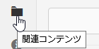

# 関連コンテンツ {#associated-content}

>[!CAUTION]
>
>一部のコンテンツフラグメント機能には、[AEM 6.4 Service Pack 2(6.4.2.0)以降のアプリケーション](/help/release-notes/sp-release-notes.md)が必要です。

関連コンテンツによって関連性がわかり、フラグメントをページに追加するときに、（オプションで）アセットをフラグメントと一緒に使用できるようになります。これにより、[ページでコンテンツフラグメントを使用するときに利用できるアセットが広範になることで](/help/sites-authoring/content-fragments.md#using-associated-content)柔軟性が生まれると同時に、適切なアセットを検索するのに要する時間の削減にもつながります。

## 関連コンテンツの追加 {#adding-associated-content}

>[!NOTE]
>
>[ビジュアルアセット（画像など）](content-fragments.md#fragments-with-visual-assets)をフラグメントやページに追加するには、様々な方法があります。

関連付けを作成するには、最初に[メディアアセットをコレクションに追加](managing-collections-touch-ui.md#adding-assets-to-a-collection)する必要があります。その後で、次の手順を実行できます。

1. フラグメントを開き、サイドパネルから「**[!UICONTROL 関連コンテンツ]**」を選択します。

   

1. 「**[!UICONTROL コンテンツを関連付け]**」または「**[!UICONTROL コレクションを関連付け]**」（コレクションが既に関連付けられているかどうかに応じて）を選択します。
1. 必要なコレクションを選択します。

   選択したコレクションにフラグメント自体をオプションで追加できます。これにより追跡が可能になります。

   

1. 確認します（チェックマーク）。コレクションが関連付けられて表示されます。

   

## 関連コンテンツの編集 {#editing-associated-content}

コレクションを関連付けたら、次の操作を実行できます。

* 関連付けを&#x200B;**削除**&#x200B;する。
* コレクションに&#x200B;**アセットを追加**&#x200B;する。
* 追加のアクションに対しアセットを選択する。
* アセットを編集する。
