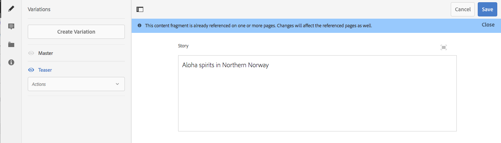

# バリエーション - フラグメントコンテンツのオーサリング {#variations-authoring-fragment-content}

>[!CAUTION]
>
>AEM 6.4 の拡張サポートは終了し、このドキュメントは更新されなくなりました。 詳細は、 [技術サポート期間](https://helpx.adobe.com/jp/support/programs/eol-matrix.html). サポートされているバージョンを見つける [ここ](https://experienceleague.adobe.com/docs/?lang=ja).

>[!CAUTION]
>
>一部のコンテンツフラグメント機能には、 [AEM 6.4 Service Pack 2(6.4.2.0) 以降](../release-notes/sp-release-notes.md).

[バリエーション](content-fragments.md#constituent-parts-of-a-content-fragment)は、特定のチャネルやシナリオで使用するためにプライマリコンテンツのコピーを作成して編集できる、コンテンツフラグメントの重要な機能です。

「**バリエーション**」タブから、次の操作を実行できます。

* [コンテンツを入力](#authoring-your-content) （フラグメント用）
* [マスター](#managing-variations)コンテンツの&#x200B;**バリエーションの作成および管理**

編集するデータタイプに応じて、その他の様々なアクションを実行します。例：

* [フラグメントへのビジュアルアセットの挿入](#inserting-assets-into-your-fragment)（画像）
* 次の中から選択 [リッチテキスト](#rich-text), [プレーンテキスト](#plain-text) および [Markdown](#markdown) （編集用）

* [コンテンツのアップロード](#uploading-content)

* [重要な統計の表示](#viewing-key-statistics)（複数行テキストについて）
* [テキストの要約](#summarizing-text)

* [バリエーションとプライマリコンテンツの同期](#synchronizing-with-master)

>[!CAUTION]
>
>フラグメントが公開または参照（あるいは両方）された後に、作成者がフラグメントを開いて編集しようとすると警告が表示され、フラグメントを変更すると、参照されているページにも影響が及ぶことが警告されます。

## コンテンツのオーサリング {#authoring-your-content}

コンテンツフラグメントを編集用に開くと、 **バリエーション** タブはデフォルトで開きます。 このタブで、プライマリまたはバリエーション（ある場合）のコンテンツをオーサリングできます。以下の操作を実行できます。

* 「**バリエーション**」タブで直接編集できます。
* [全画面表示エディター](#full-screen-editor)を開いて次のことをおこないます。

   * [形式](#formats)の選択
   * その他の編集オプションの表示（[リッチテキスト](#rich-text)形式の場合）
   * 様々な[アクション](#actions)へのアクセス

次に例を示します。

* 単純なフラグメントの編集

   単純なフラグメントは 1 つの複数行テキストフィールドで構成されます（全画面表示エディターからビジュアルアセットを追加できます）。

   

* 構造化コンテンツを含むフラグメントの編集

   構造化フラグメントには、コンテンツモデルで定義された様々なデータタイプの様々なフィールドが含まれています。 複数行フィールドについては、[全画面表示エディター](#full-screen-editor)を使用できます。

   

### 全画面表示エディター {#full-screen-editor}

複数行テキストフィールドの編集時に、全画面表示エディターを開くことができます。

全画面表示エディターでは次の情報が表示されます。

* 様々な [アクション](#actions)
* に応じて [形式](#formats)、その他のフォーマットオプション ([リッチテキスト](#rich-text))

### アクション {#actions}

全画面表示エディター（複数行テキスト）を開いている場合は、次のアクションも（すべての[形式](#formats)で）使用できます。

* を選択します。 [形式](#formats) ([リッチテキスト](#rich-text), [プレーンテキスト](#plain-text), [Markdown](#markdown))
* [テキスト統計の表示](#viewing-key-statistics)
* [コンテンツのアップロード](#uploading-content)
* [プライマリとの同期](#synchronizing-with-master)（バリエーションの編集時）
* [テキストの要約](#summarizing-text)
* テキストへの[注釈](content-fragments-variations.md#annotating-a-content-fragment)の追加

* [フラグメントへのビジュアルアセットの挿入](#inserting-assets-into-your-fragment)（画像）

### 形式 {#formats}

複数行テキストを編集するためのオプションは、選択した形式によって異なります。

* [リッチテキスト](#rich-text)
* [プレーンテキスト](#plain-text)
* [Markdown](#markdown)

全画面表示エディターでの作業時に形式を選択できます。

### リッチテキスト {#rich-text}

リッチテキストの編集では、次の書式を設定できます。

* 太字
* 斜体
* 下線
* 整列：左、中央、右
* 箇条書きリスト
* 番号付きリスト
* インデント：増減する
* ハイパーリンクの作成/解除
* 全画面表示エディターを開く。次の書式設定オプションを使用できます。

   * Word からテキストを貼り付け
   * テーブルを挿入
   * 段落スタイル：段落、見出し 1/2/3
   * [ビジュアルアセットの挿入](#inserting-assets-into-your-fragment)
   * 検索
   * 検索 / 置換
   * スペルチェッカー
   * [注釈](content-fragments-variations.md#annotating-a-content-fragment)

[アクション](#actions)は、全画面表示エディターからアクセスすることもできます。

### プレーンテキスト {#plain-text}

プレーンテキストを使用すると、書式設定または Markdown 情報なしでコンテンツをすばやく入力できます。全画面表示エディターを開いて追加の[アクション](#actions)を使用することもできます。

>[!CAUTION]
>
>「**プレーンテキスト**」を選択すると、**リッチテキスト**&#x200B;または **Markdown** に追加した書式、Markdown やアセットは失われます。

### Markdown {#markdown}

>[!NOTE]
>
>詳しくは、 [Markdown](content-fragments-markdown.md) ドキュメント。

これにより、Markdown を使用してテキストの書式を設定できます。 以下を定義できます。

* 見出し
* 段落と改行
* リンク
* 画像
* ブロック引用
* リスト
* 強調
* コードブロック
* バックスラッシュエスケープ

全画面表示エディターを開いて追加の[アクション](#actions)を使用することもできます。

>[!CAUTION]
>
>**リッチテキスト**&#x200B;と **Markdown** を切り替えると、ブロック引用やコードブロックに予期しない影響が出ることがあります。ブロック引用とコードブロックの 2 つの形式は処理方法が異なる場合があるからです。

### 重要な統計の表示 {#viewing-key-statistics}

全画面表示エディターを開くと、「**テキスト統計**」アクションには、テキストに関する様々な情報が表示されます。次に例を示します。

### コンテンツのアップロード {#uploading-content}

コンテンツフラグメントのオーサリングのプロセスを簡易化するため、外部エディターで用意したテキストをアップロードしてフラグメントに直接追加できます。

### テキストの要約 {#summarizing-text}

テキストの要約を使用すると、重要ポイントと全体の意味を保ちながら、テキストの長さを規定の単語数に短縮できます。

>[!NOTE]
>
>より技術的に説明すると、特定のアルゴリズムに従って&#x200B;*情報の密度と独自性が最適な比率*&#x200B;であると評価した文章をシステムが保持します。

>[!CAUTION]
>
>コンテンツフラグメントには、上位フォルダーとして有効な言語フォルダーが必要です。これは、使用される言語モデルを決定するために使用されます。
>
>例えば、次のパスの `en/` です。
>
>`/content/dam/my-brand/en/path-down/my-content-fragment`

>[!CAUTION]
>
>英語版は標準で提供されています。
>
>他の言語は、ソフトウェア配布の言語モデルパッケージとして使用できます。
>
>* [フランス語 (fr)、ソフトウェア配布から](https://experience.adobe.com/#/downloads/content/software-distribution/en/aem.html?lang=ja?package=/content/software-distribution/en/details.html/content/dam/aem/public/adobe/packages/cq630/product/smartcontent-model-fr)
>* [ドイツ語 (de)、ソフトウェア配布から](https://experience.adobe.com/#/downloads/content/software-distribution/en/aem.html?lang=ja?package=/content/software-distribution/en/details.html/content/dam/aem/public/adobe/packages/cq630/product/smartcontent-model-de)
>* [イタリア語 (it)（ソフトウェア配布から）](https://experience.adobe.com/#/downloads/content/software-distribution/en/aem.html?lang=ja?package=/content/software-distribution/en/details.html/content/dam/aem/public/adobe/packages/cq630/product/smartcontent-model-it)
>* [スペイン語 (es)（ソフトウェア配布版）](https://experience.adobe.com/#/downloads/content/software-distribution/en/aem.html?lang=ja?package=/content/software-distribution/en/details.html/content/dam/aem/public/adobe/packages/cq630/product/smartcontent-model-es)
>

1. 「**[!UICONTROL プライマリ]**」または必要なバリエーションを選択します。
1. 全画面表示エディターを開きます。

1. ツールバーの「**[!UICONTROL テキストを要約]**」を選択します。

   

1. ターゲットの単語数を指定し、「 」を選択します。 **[!UICONTROL 開始]**:
1. 元のテキストが、提案された要約と並べて表示されます。

   * 削除する文は赤でハイライト表示され、取り消し線が付きます。
   * 強調表示された文をクリックして、要約されたコンテンツに保持します。
   * 強調表示されていない文をクリックすると、削除されます。

   

1. 変更を確定するには、「**[!UICONTROL 要約]**」を選択します。

### コンテンツフラグメントへの注釈の追加 {#annotating-a-content-fragment}

フラグメントに注釈を付けるには：

1. 「**[!UICONTROL プライマリ]**」または必要なバリエーションを選択します。
1. 全画面表示エディターを開きます。
1. テキストを選択します。 「**[!UICONTROL 注釈]**」アイコンが利用可能になります。

   

1. ダイアログが開きます。ここで注釈を入力できます。

1. 全画面表示エディターを閉じ、フラグメントを&#x200B;**[!UICONTROL 保存]**&#x200B;します。

### 注釈の表示、編集、削除 {#viewing-editing-deleting-annotations}

注釈：

* エディターの全画面表示モードと通常モードのどちらの場合も、注釈はテキストのハイライトとして示されます。ハイライト表示されたテキストをクリックすると、注釈の詳細が表示、編集または削除され、ダイアログが再度開きます。

   >[!NOTE]
   >
   >1 つのテキストに複数の注釈が適用されている場合は、ドロップダウンセレクターが表示されます。

* 注釈が適用されたテキスト全体を削除すると、注釈も削除されます。

* 注釈の一覧表示や削除を行うには、フラグメントエディターで「**[!UICONTROL 注釈]**」タブを選択します。

   

* 選択されたフラグメントの[タイムライン](https://helpx.adobe.com/experience-manager/6-3/assets/using/content-fragments-managing.html#timeline-for-content-fragments)で、注釈の表示や削除を行えます。

### フラグメントへのアセットの挿入 {#inserting-assets-into-your-fragment}

コンテンツフラグメントのオーサリングプロセスを容易にするには、[アセット](managing-assets-touch-ui.md)（画像）をフラグメントに直接追加します。

書式設定なしでフラグメントの段落シーケンスに追加されます。フォーマットは、 [フラグメントはページで使用または参照されます](/help/sites-authoring/content-fragments.md).

>[!CAUTION]
>
>参照ページではこれらのアセットの移動や削除はできません。移動や削除にはフラグメントエディターを使用する必要があります。
>
>ただし、アセットの書式設定（サイズなど）は、[ページエディター](/help/sites-authoring/content-fragments.md)で行う必要があります。フラグメントエディターでのアセットの表示は、純粋にコンテンツフローのオーサリング用です。

>[!NOTE]
>
>[画像](content-fragments.md#fragments-with-visual-assets)は様々な方法でフラグメントやページに追加できます。

1. 画像を追加したい位置にカーソルを置きます。
1. **[!UICONTROL アセットを挿入]** アイコンを使用して、検索ダイアログを開きます。

   

1. ダイアログでは以下が可能です。

   * DAM 内の必要なアセットに移動します。
   * DAM 内のアセットを検索します。

   見つかったら、サムネールをクリックして、必要なアセットを選択します。

1. 「**[!UICONTROL 選択]**」を使用して、コンテンツフラグメント段落システムの現在の位置にアセットを追加します。

   >[!CAUTION]
   >
   >アセットを追加後に形式を変更すると次のようになります。
   >
   >* **プレーンテキスト**：アセットはフラグメントから完全に失われます。
   >* **Markdown**：アセットは表示されなくなりますが、**リッチテキスト**&#x200B;に戻すとアセットがまた表示されます。

## バリエーションの管理 {#managing-variations}

### バリエーションの作成 {#creating-a-variation}

バリエーションでは、**プライマリ**&#x200B;コンテンツをコピーし、目的に応じて変更を加えることができます（必要な場合）。

新しいバリエーションを作成するには：

1. フラグメントを開き、サイドパネルが表示されていることを確認します。
1. サイドパネルのアイコンバーから「**[!UICONTROL バリエーション]**」を選択します。
1. 選択 **[!UICONTROL バリエーションを作成]**.
1. ダイアログが開きます。新しいバリエーションの **[!UICONTROL タイトル]** と **[!UICONTROL 説明]** を指定します。
1. 「**[!UICONTROL 追加]**」を選択します。フラグメントの **[!UICONTROL プライマリ]** が新しいバリエーションにコピーされ、 [編集](#editing-a-variation) 用に開かれます。

   >[!NOTE]
   >
   >新しいバリエーションを作成すると、常に&#x200B;**プライマリ**&#x200B;がコピーされます（現在開いているバリエーションではありません）。

### バリエーションの編集 {#editing-a-variation}

次のいずれかの操作を行った後に、バリエーションのコンテンツを変更できます。

* [バリエーションの作成](#creating-a-variation).
* 既存のフラグメントを開き、サイドパネルから必要なバリエーションを選択します。

### バリエーションの名前変更 {#renaming-a-variation}

既存のバリエーションの名前を変更するには：

1. フラグメントを開き、サイドパネルから「**[!UICONTROL バリエーション]**」を選択します。
1. 必要なバリエーションを選択します。
1. 「**[!UICONTROL アクション]**」ドロップダウンから「**[!UICONTROL 名前を変更]**」を選択します。

1. 表示されたダイアログボックスで新しい「**[!UICONTROL タイトル]**」や「**[!UICONTROL 説明]**」を入力します。

1. を確認します。 **[!UICONTROL 名前を変更]** アクション。

>[!NOTE]
>
>これはバリエーションにのみ影響します **タイトル**.

### バリエーションの削除 {#deleting-a-variation}

既存のバリエーションを削除するには：

1. フラグメントを開き、サイドパネルから「**[!UICONTROL バリエーション]**」を選択します。
1. 必要なバリエーションを選択します。
1. 「**[!UICONTROL アクション]**」ドロップダウンから「**[!UICONTROL 削除]**」を選択します。

1. ダイアログで「**[!UICONTROL 削除]**」アクションを確認します。

>[!NOTE]
>
>**プライマリ**&#x200B;は削除できません。

### プライマリとの同期 {#synchronizing-with-master}

**プライマリ**&#x200B;はコンテンツフラグメントの必須の部分であり、定義に従ってコンテンツのプライマリコピーを保持します。一方、バリエーションはそのコンテンツの更新および適合された個別のバージョンを保持します。プライマリを更新した場合、これらの変更はバリエーションにも関連するので、バリエーションに送信する必要があります。

バリエーションの編集時には、バリエーションの現在の要素をプライマリと同期させるアクションにアクセスできます。これにより、プライマリに行われた変更内容を必要なバリエーションに自動的にコピーできます。

>[!CAUTION]
>
>同期を使用できるのは、変更内容&#x200B;*を&#x200B;**プライマリ**からバリエーションに*&#x200B;コピーする場合のみです。
>
>バリエーションの現在の要素のみが同期されます。
>
>同期は、**複数行テキスト**&#x200B;データタイプに対してのみ機能します。
>
>*バリエーションから&#x200B;**プライマリ***へ変更内容を転送することはできません。

1. フラグメントエディターでコンテンツフラグメントを開きます。**プライマリ**&#x200B;が編集されていることを確認します。
2. 特定のバリエーションを選択し、次のいずれかから適切な同期アクションを選択します。

   * 「**アクション**」ドロップダウンセレクター - **現在の要素をプライマリと同期**
   * 全画面表示エディターのツールバー - **マスターと同期**

3. プライマリとバリエーションが横並びに表示されます。

   * 緑は（バリエーションに）追加されたコンテンツを示します
   * 赤は削除されたコンテンツを示します（バリエーションからの削除）

   

4. 「**[!UICONTROL 同期]**」を選択すると、バリエーションが更新され、表示されます。
