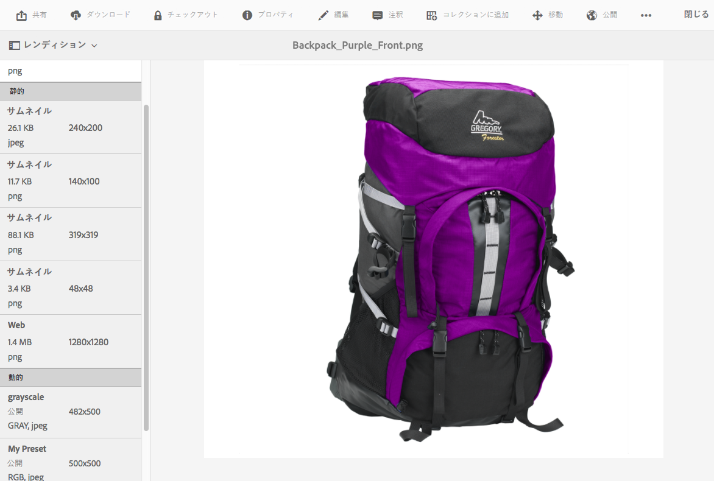
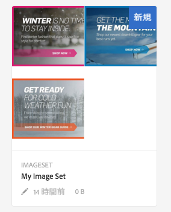

# Dynamic Media の操作 {#working-with-dynamic-media}

>[!CAUTION]
>
>AEM 6.4 の拡張サポートは終了し、このドキュメントは更新されなくなりました。 詳細は、 [技術サポート期間](https://helpx.adobe.com/jp/support/programs/eol-matrix.html). サポートされているバージョンを見つける [ここ](https://experienceleague.adobe.com/docs/?lang=ja).

[Dynamic Media](https://www.adobe.com/solutions/web-experience-management/dynamic-media.html) は、マーチャンダイジングおよびマーケティング用のリッチなビジュアルアセットをオンデマンドで配信するもので、これらのアセットは、Web、モバイルおよびソーシャルサイトでの利用に合わせて自動的に拡大縮小されます。Dynamic Mediaでは、一連のマスターアセットを使用して、グローバルで拡張性に優れ、パフォーマンスが最適化されたネットワークを通じて、リッチコンテンツの複数のバリエーションをリアルタイムで生成し、配信します。

Dynamic Media は、ズーム、360 度スピン、ビデオなど、インタラクティブな表示エクスペリエンスを提供します。Dynamic Media はAdobe Experience Managerのデジタルアセット管理 (Assets) ソリューションのワークフローを独自に組み込むことで、デジタルキャンペーン管理プロセスを簡素化し、合理化します。

<!-- DEAD ARTICLE >[!NOTE]
>
>A Community article is available on [Working with Adobe Experience Manager and Dynamic Media](https://helpx.adobe.com/experience-manager/using/aem_dynamic_media.html). -->

## Dynamic Media の機能 {#what-you-can-do-with-dynamic-media}

Dynamic Mediaを使用すると、アセットを公開する前に管理できます。 アセットの一般的な使用方法について詳しくは、 [デジタルアセットの操作](managing-assets-touch-ui.md). 一般的なトピックには、アセットのアップロード、ダウンロード、編集、公開と、プロパティの表示、編集、アセットの検索が含まれます。

Dynamic Media のみの機能には次のものが含まれます。

* [カルーセルバナー](carousel-banners.md)
* [画像セット](image-sets.md)
* [インタラクティブ画像](interactive-images.md)
* [インタラクティブビデオ](interactive-videos.md)
* [混在メディアセット](mixed-media-sets.md)
* [パノラマ画像](panoramic-images.md)

* [スピンセット](spin-sets.md)
* [ビデオ](video.md)
* [Dynamic Media アセットの配信](delivering-dynamic-media-assets.md)
* [アセットの管理](managing-assets.md)
* [クイックビューを使用したカスタムポップアップの作成](custom-pop-ups.md)

[Dynamic Media の設定](administering-dynamic-media.md)も参照してください。

>[!NOTE]
>
>Dynamic Mediaの使用とAEMとのDynamic Media Classicの統合の違いについては、 [Dynamic Media Classic統合とDynamic Media](/help/sites-administering/scene7.md#aem-scene-integration-versus-dynamic-media).

## Dynamic Media が有効な場合と無効な場合の比較 {#dynamic-media-on-versus-dynamic-media-off}

Dynamic Media が有効（オン）になっているかどうかは、次の特徴から判断できます。

* アセットのダウンロードやプレビューで動的レンディションを使用できる。
* 画像セット、スピンセット、混在メディアセットを使用できる。
* PTIFF レンディションが作成されている。

画像アセットをクリックした場合、Dynamic Mediaとはアセットの表示が異なります [有効](config-dynamic.md#enabling-dynamic-media). Dynamic Media では、オンデマンドの HTML5 ビューアが使用されます。

### 動的レンディション {#dynamic-renditions}

「**[!UICONTROL 動的]**」の下にある画像プリセットやビューアプリセットなどの動的レンディションは、Dynamic Media が有効な場合に使用できます。

### 画像セット、スピンセット、混在メディアセット {#image-sets-spins-sets-mixed-media-sets}

画像セット、スピンセットおよび混在メディアセットは、Dynamic Media が有効な場合に使用できます。

### PTIFF レンディション {#ptiff-renditions}

Dynamic Media 対応のアセットには `pyramid.tiffs` が含まれています。

### アセットのビューの変化 {#asset-views-change}

Dynamic Media を有効にすると、「`+`」ボタンをクリックしてズームインし、「`-`」ボタンをクリックしてズームアウトすることができます。クリックまたはタップして、特定の領域にズームインすることもできます。元に戻すアイコンをクリックすると元のバージョンに戻ります。また、斜めの矢印をクリックすると、画像を全画面表示にすることができます。Dynamic Media を有効にした場合の画面は次のようになります。

Dynamic Media を無効にした場合は、次のようにズームイン、ズームアウトおよび元のサイズに戻す操作が可能です。

