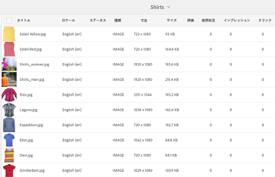
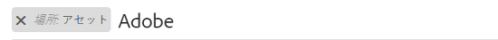
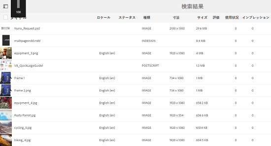
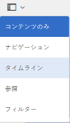
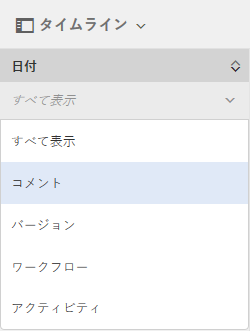
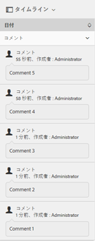

#  におけるアセットの並べ替えの強化[!DNL Experience Manager] {#enhanced-sorting-of-assets-in-aem}

方法 [!DNL Experience Manager] Assets：サーバー側の並べ替えがデプロイされ、クライアント側でバッチで並べ替えるのではなく、1 回でフォルダーアセットや検索クエリを並べ替えることができます。

Adobe Experience Manager Assets の検索機能が強化され、フォルダーのリスト表示と検索結果ページで大量のアセットを効率的に並べ替えることができるようになりました。 タイムラインのエントリも並べ替えることができます。

[!DNL Experience Manager] Assets にサーバー側の並べ替え機能が導入され、フォルダー内または検索クエリ内の全アセットを（サイズの大きさを問わず）一度に並べ替えることが可能になり、クライアント側でバッチで並べ替える必要はなくなりました。これにより、事前に取得された結果をユーザーインターフェイスに迅速に表示でき、並べ替え操作がより迅速になります。

## リスト表示でのアセットの並べ替え {#sorting-assets-in-list-view}

[!DNL Experience Manager] Assets では、以下のフィールドに基づいてフォルダーアセットを並べ替えることができます。

* ロケール
* ステータス
* タイプ
* サイズ
* 評価
* 修正日
* 公開日
* 使用方法
* クリック
* インプレッション数
* チェックアウト済み

1. 対象のアセットが含まれるフォルダーに移動します。
1. レイアウトアイコンをクリックまたはタップして、リスト表示を切り替えます。

   

1. アセットリストの任意の列ヘッダーの横にある並べ替えアイコンをクリックまたはタップします。

   

   アセットリストがフィールドの値に基づいて並べ替えられます。

   

>[!NOTE]
>
>の値を並べ替えるには `Name` または `Title`列、オーバーレイ `/libs/dam/gui/content/commons/availablecolumns` をクリックし、 `sortable` から `True`.

## 検索結果でのアセットの並べ替え {#sorting-assets-in-search-results}

以下のフィールドに基づいて検索結果を並べ替えることができます。

* タイトル
* ステータス
* タイプ
* サイズ
* 修正日
* 公開日

1. オムニサーチボックスから、必要な条件に基づいてアセットを検索します。

   

1. レイアウトアイコンをクリックまたはタップして、リスト表示を切り替えます。検索結果がリスト表示に既に表示されている場合、この手順をスキップします。
1. アセットリストの任意の列ヘッダーの横にある並べ替えアイコンをクリックまたはタップします。アセットリストがフィールドの値に基づいて並べ替えられます。

   

## タイムラインでのアセットの並べ替え {#sorting-assets-in-timeline}

[!DNL Assets] では、注釈、バージョン、ワークフロー、アクティビティなどのタイムラインエントリを時系列で並べ替えることができます。

1. Assets UI から、タイムラインを表示したいアセットを選択します。
1. グローバルナビゲーションアイコンをクリックまたはタップし、「**[!UICONTROL タイムライン]**」を選択します。

   

1. タイムラインで、リストからエントリを選択します。例えば、「 **[!UICONTROL コメント]** ：アセットに関連付けられている注釈のリストを表示します。

   

1. 「**[!UICONTROL 日付]**」ラベルの横の&#x200B;**[!UICONTROL 並べ替え]**&#x200B;アイコンをクリックまたはタップします。選択に基づき、注釈はアセットへの追加日に基づいてリストに時系列／逆時系列順で表示されます。

   
