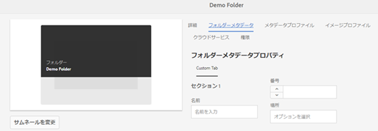

# フォルダーメタデータスキーマ {#folder-metadata-schema}

この記事では、AEM Assets でアセットフォルダーのメタデータスキーマを作成する方法を説明します。

Adobe Experience Manager（AEM）Assets では、フォルダープロパティページに表示されるレイアウトとメタデータを定義する、アセットフォルダーのメタデータスキーマを作成できます。

>[!NOTE]
>
>この機能を使用するには、AEM 6.4 Service Pack 2 以降がデプロイされている必要があります。AEM 6.4 サービスパックについて詳しくは、[リリースノート](/help/release-notes/sp-release-notes.md)を参照してください。

## フォルダーメタデータスキーマフォームの追加 {#add-a-folder-metadata-schema-form}

フォルダーメタデータスキーマフォームエディターを使用して、フォルダーのメタデータスキーマを作成および編集します。

1. AEM のロゴをタップまたはクリックし、**[!UICONTROL ツール]**／**[!UICONTROL アセット]**／**[!UICONTROL フォルダーメタデータスキーマ]**&#x200B;に移動します。
1. In the Folder Metadata Schema Forms page, tap/click **[!UICONTROL Create]**.
1. フォームの名前を指定し、「**[!UICONTROL 作成]**」をタップまたはクリックします。新しいスキーマフォームがスキーマフォームページにリストされます。

## フォルダーメタデータスキーマフォームの編集 {#edit-folder-metadata-schema-forms}

以下を含む、新しく追加された、または既存のメタデータスキーマフォームを編集できます。

* タブ
* タブ内のフォーム項目

これらのフォーム項目を CRX リポジトリのメタデータノード内のフィールドにマップしたり、フォーム項目を設定したりできます。新しいタブまたはフォーム項目をメタデータスキーマフォームに追加できます。

1. In the Schema Forms page, select the form you created, and then tap/click the **[!UICONTROL Edit]** icon from the toolbar.
1. In the Folder Metadata Schema Editor page, tap/click the **[!UICONTROL +]** icon to add a tab to the form. タブの名前を変更するには、デフォルト名をタップまたはクリックし、「**[!UICONTROL 設定]**」に新しい名前を指定します。

   

   タブを追加するには、**[!UICONTROL +]** アイコンをタップまたはクリックします。Tap/click **[!UICONTROL X]** to delete a tab.

1. In the active tab, add one or more components from the **[!UICONTROL Build Form]** tab.

   

   複数のタブを作成する場合は、コンポーネントを追加する特定のタブをタップまたはクリックします。

1. コンポーネントを設定するには、コンポーネントを選択して、「**[!UICONTROL 設定]**」タブでそのプロパティを変更します。

   必要に応じて、「**[!UICONTROL 設定]**」タブからコンポーネントを削除します。

   

1. ツールバーの「**[!UICONTROL 保存]**」をタップまたはクリックして変更内容を保存します。

### フォームを作成するコンポーネント {#components-to-build-forms}

The **[!UICONTROL Build Form]** tab lists form items that you use in your folder metadata schema form. The **[!UICONTROL Settings]** tab displays the attributes for each item that you select in the **[!UICONTROL Build Form]** tab. Here is a list the form items available in the **[!UICONTROL Build Form]** tab:

| コンポーネント名 | 説明 |
|---|---|
| [!UICONTROL セクションヘッダー] | 共通コンポーネントのリストに対してセクションヘッダーを追加します。 |
| [!UICONTROL 1 行のテキスト] | 1行テキストプロパティを追加します。 これは文字列として保存されます。 |
| [!UICONTROL 複数値テキスト] | 複数値テキストプロパティを追加します。これは文字列の配列として保存されます。 |
| [!UICONTROL 番号] | 数値コンポーネントを追加します。 |
| [!UICONTROL 日付] | 日付コンポーネントを追加します。 |
| [!UICONTROL ドロップダウン] | コンボボックスを追加します。 |
| [!UICONTROL 標準タグ] | タグを追加します。 |
| [!UICONTROL 非表示のフィールド] | 非表示のフィールドを追加します。このフィールドは、アセットの保存時に POST パラメーターとして送信されます。 |

### フォーム項目の編集 {#editing-form-items}

To edit the properties of form items, tap/click the component and edit all or a subset of the following properties in the **[!UICONTROL Settings]** tab.

**[!UICONTROL フィールドラベル]**:フォルダーのプロパティページに表示されるメタデータプロパティの名前。

**[!UICONTROL プロパティにマッピング]**：このプロパティは、フォルダーノードが保存されている CRX リポジトリ内でのフォルダーノードの相対パスを指定します。この値は、パスがフォルダーのノードの下にあることを示す「**./**」で始まります。

このプロパティの有効な値は次のとおりです。

* `./jcr:content/metadata/dc:title`:フォルダーのメタデータノードにプロパティとして値を格納しま `dc:title`す。

* `./jcr:created`：フォルダーのノードにある JCR プロパティを表示します。CRXDEでこれらのプロパティを設定する場合、アドビでは、プロパティが保護されているので、プロパティを「編集を無効にする」とマークすることをお勧めします。 それ以外の場合は、アセ `Asset(s) failed to modify`ットのプロパティを保存するとエラー「」が発生します。

プロパティパスにスペースを含めないでください。コンポーネントがメタデータスキーマフォームに適切に表示されなくなります。

**[!UICONTROL JSON Path]**:これを使用して、オプションのキーと値のペアを指定するJSONファイルのパスを指定します。

**[!UICONTROL プレースホルダー]**：このプロパティを使用して、メタデータプロパティに関連するプレースホルダーテキストを指定します。

**[!UICONTROL 選択肢]**：リストの選択肢を指定するには、このプロパティを使用します。

**[!UICONTROL 説明]**：メタデータコンポーネントの短い説明を追加するには、このプロパティを使用します。

**[!UICONTROL クラス]**：プロパティに関連付けられているオブジェクトクラス。

## フォルダーメタデータスキーマフォームの削除 {#delete-folder-metadata-schema-forms}

フォルダメタデータスキーマフォームは、フォルダメタデータスキーマフォームページから削除できます。 フォームを削除するには、フォームを選択し、ツールバーの「削除」アイコンをタップまたはクリックします。

## フォルダーメタデータスキーマの割り当て {#assign-a-folder-metadata-schema}

フォルダメタデータスキーマをフォルダに割り当てるには、フォルダメタデータスキーマフォームページを使用するか、フォルダを作成する際に使用します。

フォルダーのメタデータスキーマを設定すると、スキーマフォームのパスは、フォルダーノードの `folderMetadataSchema` プロパティ（.*/jcr:content* 下）に保存されます。

### フォルダーメタデータスキーマページからのスキーマへの割り当て {#assign-to-a-schema-from-the-folder-metadata-schema-page}

1. AEM のロゴをタップまたはクリックし、**[!UICONTROL ツール]**／**[!UICONTROL アセット]**／**[!UICONTROL フォルダーメタデータスキーマ]**&#x200B;に移動します。
1. フォルダメタデータスキーマフォームページで、フォルダに適用するスキーマフォームを選択します。
1. From the toolbar, tap/click **[!UICONTROL Apply to Folder(s)]**.

1. Select the folder on which to apply the schema and then click/tap **[!UICONTROL Apply]**. メタデータスキーマが既にフォルダに適用されている場合は、既存のメタデータスキーマを上書きしようとしていることを示す警告メッセージが表示されます。 Tap/click **[!UICONTROL Overwrite]**.
1. メタデータスキーマを適用したフォルダーのメタデータプロパティを開きます。

   

   フォルダーメタデータフィールドを表示するには、「**[!UICONTROL フォルダーメタデータ]**」タブをタップまたはクリックします。

   

### フォルダー作成時のスキーマの割り当て {#assign-a-schema-when-creating-a-folder}

フォルダーを作成するときに、フォルダーメタデータスキーマを割り当てることができます。システムに 1 つ以上のフォルダーメタデータスキーマが存在する場合は、**[!UICONTROL フォルダーを作成]**&#x200B;ダイアログに追加リストが表示されます。希望のスキーマを選択できます。デフォルトではスキーマは選択されていません。

1. AEM Assets ユーザーインターフェイスで、ツールバーの「**[!UICONTROL 作成]**」をタップまたはクリックします。
1. フォルダーのタイトルと名前を指定します。
1. フォルダーメタデータスキーマリストから希望のスキーマを選択します。次に、「**[!UICONTROL 作成]**」をタップまたはクリックします。

   

1. メタデータスキーマを適用したフォルダーのメタデータプロパティを開きます。
1. フォルダーメタデータフィールドを表示するには、「**[!UICONTROL フォルダーメタデータ]**」タブをタップまたはクリックします。

## フォルダーメタデータスキーマの使用 {#use-the-folder-metadata-schema}

フォルダーメタデータスキーマが設定されたフォルダーのプロパティを開きます。フォルダープロパティページに「**[!UICONTROL フォルダーメタデータ]**」タブが表示されます。フォルダーメタデータスキーマフォームを表示するには、このタブを選択します。

各種フィールドにメタデータ値を入力し、「**[!UICONTROL 保存]**」をタップまたはクリックして値を保存します。指定した値は、CRX リポジトリ内のフォルダーノードに保存されます。

