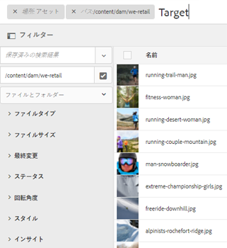
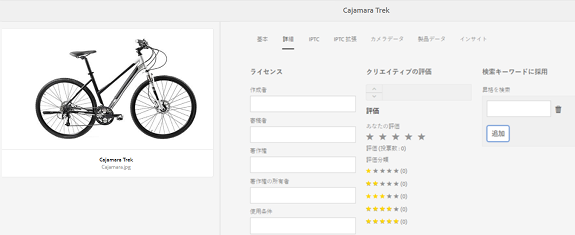
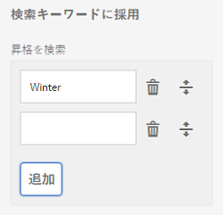

# GQL 全文検索 {#gql-full-text-search}

[!DNL Experience Manager] AssetsのGQL全文検索機能を参照します。 GQL 全文検索機能を使用して、タイトル、説明、作成者名などの特定のメタデータに基づいてアセットを検索できます。

GQL 全文検索機能を使用すると、タイトル、説明、作成者などの特定のメタデータに基づいてアセットを検索できます。

メタデータ（タイトルなど）に基づいてアセットを検索するには、検索パネルで、メタデータキーワードの後に値を指定します。GQL全文検索機能は、メタデータが入力した対応する値と完全に一致するアセットのみを取得します。

例えば、「Target」というタイトルのアセットを検索するには、次の手順を実行します。

## アセットの検索 {#searching-assets}

1. Assetsユーザーインターフェイスのツールバーで、**[!UICONTROL 検索]**&#x200B;アイコンをクリックまたはタップしてオムニサーチボックスを表示します。

   

1. オムニサーチボックスにカーソルを合わせて、Enter キーを押します。
1. グローバルナビゲーションアイコンをクリックまたはタップして、**[!UICONTROL フィルター]**&#x200B;パネルを表示します。
1. オムニサーチボックスで、「Target」という値を指定します。検索範囲を特定のフォルダーに制限するには、フィルターパネルの参照アイコンをクリックまたはタップし、フォルダーを選択します。この場合は、そのフォルダーとその下のサブフォルダー内のみで、一致するものを検索します。

   >[!NOTE]
   >
   >フォルダーに対して全文検索を実行することもできます。この場合は、空でない全文検索語句を指定する必要があります。

   

1. **[!UICONTROL Enter]** を押します。[!DNL Assets]ユーザーインターフェイスには、タイトルが「Target」と完全に一致するアセットのみが表示されます。

GQL全文検索機能を使用すると、次に基づいてアセットを検索できます。

* 複数のメタデータフィールド（プロパティ）に指定した値が AND 演算子によって結合された複雑なクエリ
* 1 つのメタデータフィールドの複数値
* 文字列の部分一致

GQL全文検索機能では、次のメタデータプロパティに基づいてアセットを検索できます。プロパティの名前（author、titleなど）と値は、大文字と小文字が区別されます。

>[!NOTE]
>
>GQL 全文検索は、全文の述語に対してのみ使用できます。

| プロパティ | 検索形式（ファセット値） |
|---|---|
| [!UICONTROL タイトル] | title:John |
| [!UICONTROL 作成者] | creator:John |
| [!UICONTROL 投稿者] | contributor:John |
| [!UICONTROL 場所] | location:India |
| [!UICONTROL 説明] | description:&quot;Sample Image&quot; |
| [!UICONTROL 作成ツール] | creatortool:&quot;Adobe Photoshop 7.0&quot; |
| [!UICONTROL 著作権の所有者] | copyrightowner:&quot;Adobe Systems&quot; |
| [!UICONTROL 投稿者] | contributor:John |
| [!UICONTROL 使用条件] | usageterms:&quot;CopyRights Reserved&quot; |
| [!UICONTROL 作成日] | created:YYYY-MM-DDTHH:MM:SS.000+05:30...YYYY-MM-DDTHH:MM:SS.000+05:30 |
| [!UICONTROL 有効期限] | 有効期限:YYYY-MM-DDTHH:MM:SS.000+05:30...YYYY-MM-DDTHH:MM:SS.000+05:30 |
| [!UICONTROL オンタイム] | ontime:YYYY-MM-DDTHH:MM:SS.000+05:30...YYYY-MM-DDTHH:MM:SS.000+05:30 |
| [!UICONTROL オフタイム] | offtime:YYYY-MM-DDTHH:MM:SS.000+05:30...YYYY-MM-DDTHH:MM:SS.000+05:30 |
| [!UICONTROL 時間の範囲] （有効期限、日時、オフタイム） | facet field : lowerbound..upperbound |
| [!UICONTROL パス] | /content/dam/&lt;folder name> |
| [!UICONTROL PDF タイトル] | pdftitle:&quot;Adobe Document&quot; |
| [!UICONTROL 件名] | subject:&quot;Training&quot; |
| [!UICONTROL タグ] | tags:&quot;Location And Travel&quot; |
| [!UICONTROL 型] | type:&quot;image\png&quot; |
| [!UICONTROL 画像の幅] | width:lowerbound..upperbound |
| [!UICONTROL 画像の高さ] | height:lowerbound..upperbound |
| [!UICONTROL Person] | person:John |

複雑なクエリの検索形式の例：

* 複数のファセットフィールドを持つアセットをすべて表示する（例：title=John Doe および creatortool=Adobe Photoshop）：

tiltle:&quot;John Doe&quot; creatortool :Adobe&amp;アンプ；ast;

* ファセット値が 1 語でなく文になっているアセットをすべて表示する（例：タイトル = Scott Reynolds）

title:&quot;Scott Reynolds&quot;

* 1 つのプロパティに複数の値が指定されているアセットを表示する（例：タイトル = Scott Reynolds または John Doe）

title:&quot;Scott Reynolds&quot; OR &quot;John Doe&quot;

* プロパティ値が特定の文字列で始まるアセットを表示する（例：タイトルが Scott Reynolds）

title:&quot;Scott&quot;

* プロパティ値が特定の文字列で終わるアセットを表示する（例：タイトルが Scott Reynolds）

title:&quot;Reynolds&quot;

* プロパティ値に特定の文字列が含まれるアセットを表示する（例：タイトルが Basel Meeting Room）

title:&quot;Meeting&quot;;

* 特定の文字列が含まれ、特定のプロパティ値を持つアセットを表示する（例：タイトル = John Doe のアセットで文字列「Adobe」を検索する）

&amp;ast;Adobe&amp;ast;title:&quot;John Doe &quot;OR title:&quot;John Doe&quot; &amp;ast;Adobe&amp;ast;

>[!NOTE]
>
>path、limit、size および orderby の各プロパティを他のプロパティと OR で結合することはできません。
>
>ユーザー生成プロパティのキーワードは、プロパティエディターにおけるフィールドラベルからスペースを削除して小文字で表記したものです。

>[!NOTE]
>
>JCR クエリを記述してサブアセットのみを検索した場合、一致する参照されているアセットも、一致するサブアセットと共に表示されます。

全文検索では、 — や^などの演算子もサポートされています。 これらの文字を文字列リテラルとして検索するには、検索式を二重引用符で囲みます。例えば、「Notebook - Beauty」ではなく、「&quot;Notebook - Beauty&quot;」と指定します。

## 検索の強化 {#boosting-search}

特定のアセットに対するキーワードの有効性を高めることで、キーワードに基づいた検索を強化できます。つまり、特定のキーワードを昇格させた場合、それらのキーワードに基づいて検索すると、それらのキーワードの対象となる画像が検索結果の最上部に表示されます。

1. Assets の UI で、キーサードの昇格の対象となるアセットのプロパティページを開きます。
1. 「**[!UICONTROL 詳細]**」タブに切り替え、「**[!UICONTROL 検索キーワードに採用]**」の下の「**[!UICONTROL 追加]**」をクリックまたはタップします。

   

1. 「**[!UICONTROL 昇格を検索]**」ボックスで、画像検索時の強化の対象となるキーワードを指定し、「**[!UICONTROL 追加]**」をクリックまたはタップします。必要に応じて、同じ方法で複数のキーワードを指定します。

   

1. 「**[!UICONTROL 保存して閉じる]**」をクリックまたはタップします。
1. オムニサーチボックスを使用して、キーワード検索をします。昇格したこのキーワードの対象となるアセットが、検索結果の上位に表示されます。
