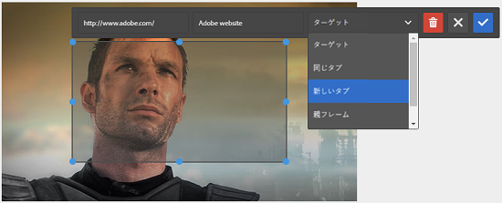

# 画像マップを追加 {#adding-image-maps}

>[!CAUTION]
>
>AEM 6.4 の拡張サポートは終了し、このドキュメントは更新されなくなりました。 詳細は、 [技術サポート期間](https://helpx.adobe.com/jp/support/programs/eol-matrix.html). サポートされているバージョンを見つける [ここ](https://experienceleague.adobe.com/docs/?lang=ja).

画像アセットにハイパーリンクされた画像マップを追加する方法を説明します。

画像マップを使用すると、ハイパーリンクが指定された 1 つ以上の領域を追加できます。この領域は、他のハイパーリンクと同様に機能します。

1. 次のいずれかの操作をおこなって、**[!UICONTROL インプレース画像エディター]**&#x200B;を開きます。

   * クイックアクションを使用して、 **[!UICONTROL 編集]** アイコン **[!UICONTROL カード]** 表示 リスト表示で、アセットを選択し、 **編集** アイコンをクリックします。

      >[!NOTE]
      >
      >注意：**[!UICONTROL リスト]**&#x200B;表示ではクイックアクションを使用できません。

   * 内 **[!UICONTROL カード]** または **[!UICONTROL リスト]** を表示し、アセットを選択して、 **[!UICONTROL 編集]** アイコンをクリックします。
   * 次をタップします。 **[!UICONTROL 編集]** アセットページのアイコン

      

1. 画像マップを挿入するには、 **[!UICONTROL 起動マップ]** アイコンをクリックします。

   

1. 画像マップの形状を選択します。 選択したシェイプのホットスポットが画像上に配置されます。

   

1. ホットスポットをタップし、「 URL 」と「 Alt 」のテキストを入力します。 「**[!UICONTROL ターゲット]**」リストから、画像マップを表示する場所（例：同じタブ、新しいタブ、iFrame など）を指定します。例えば、画像マップを新しいタブで開くには、URLとして「`https://www.adobe.com`」と入力し、代替テキストとして「`Adobe website`」と入力し、「**[!UICONTROL ターゲット]**」リストで「**[!UICONTROL 新しいタブ]**」を指定します。

   

1. 次をタップします。 **[!UICONTROL 確認]** アイコンをクリックし、 **[!UICONTROL 完了]** アイコンをクリックして、変更を保存します。

   

   画像マップを削除するには、ホットスポットをタップし、 **[!UICONTROL 削除]** アイコン

   

1. 画像マップを表示するには、アセットの詳細ページに移動し、画像の上にカーソルを置きます。

   

   「 Dynamic Media 」オプションが有効な場合は、アセットエディターに移動し、 **[!UICONTROL マップ]** アイコンをクリックし、適用されたすべての画像マップを表示します。
