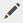

# 画像マップ{#adding-image-maps}を追加します。

ハイパーリンクが指定された画像マップを画像アセットに追加する方法を学習します。

画像マップを使用すると、ハイパーリンクが指定された 1 つ以上の領域を追加できます。この領域は、他のハイパーリンクと同様に機能します。

1. 次のいずれかの操作を行って、**[!UICONTROL インプレース画像エディター]**&#x200B;を開きます。

   * クイックアクションを使用して、**[!UICONTROL カード]**&#x200B;表示で、アセットに表示される&#x200B;**[!UICONTROL 編集]**&#x200B;アイコンをタップします。 リスト表示で、アセットを選択し、ツールバーの&#x200B;**編集**&#x200B;アイコンをタップします。

      >[!NOTE]
      >
      >**[!UICONTROL リスト]**&#x200B;ビューではクイックアクションは使用できません。

   * **[!UICONTROL カード]**&#x200B;または&#x200B;**[!UICONTROL リスト]**&#x200B;表示で、アセットを選択し、ツールバーの&#x200B;**[!UICONTROL 編集]**&#x200B;アイコンをタップします。
   * アセットページの「**[!UICONTROL 編集]**」アイコンをタップします。

      

1. 画像マップを挿入するには、ツールバーの&#x200B;**[!UICONTROL マップを起動]**&#x200B;アイコンをタップします。

   

1. 画像マップの図形を選択します。選択した図形のホットスポットが画像上に置かれます。

   

1. ホットスポットをタップし、URLとAltテキストを入力します。 **[!UICONTROL Target]**&#x200B;リストから、同じタブ、新しいタブ、iFrameなど、画像マップを表示する場所を指定します。 例えば、URLに`https://www.adobe.com`、代替テキストに`Adobe website`と入力し、**[!UICONTROL Target]**&#x200B;リストから&#x200B;**[!UICONTROL 新しいタブ]**&#x200B;を指定して、新しいタブで開く画像マップを指定します。

   

1. **[!UICONTROL 確認]**&#x200B;アイコンをタップし、ツールバーの&#x200B;**[!UICONTROL 完了]**&#x200B;アイコンをタップして変更を保存します。

   

   画像マップを削除するには、ホットスポットをタップし、**[!UICONTROL 削除]**&#x200B;アイコンをタップします。

   

1. 画像マップを表示するには、アセットの詳細ページに移動し、画像の上にカーソルを置きます。

   

   Dynamic Mediaオプションが有効な場合は、アセットエディターに移動し、**[!UICONTROL マップ]**&#x200B;アイコンをタップして、適用されているすべての画像マップを表示します。
