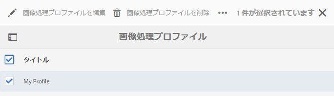
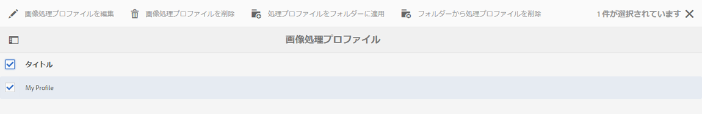
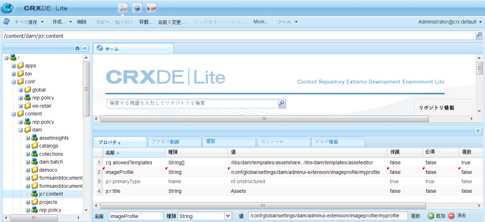

# Dynamic Media 画像プロファイル {#image-profiles}

画像をアップロードするときに、フォルダーにイメージプロファイルを適用することで、アップロード時に自動的に画像を切り抜くことができます。

>[!NOTE]
>
>スマート切り抜きは、Dynamic Media - Scene7 モードでのみ使用できます。

>[!IMPORTANT]
>
>画像プロファイルは、PDF ファイル、アニメーション GIF ファイル、INDD（Adobe InDesign）ファイルには適用されません。

## 切り抜きツールオプション {#crop-options}

画像にスマート切り抜きを実装する場合、アドビでは次のベストプラクティスを推奨し、次の制限を適用します。

| 制限タイプ | ベストプラクティス | 適用される制限 |
| --- | --- | --- |
| 画像あたりのスマート切り抜き数 | 5 | 100 |

[Dynamic Media の制限](/help/assets/limitations.md)も参照してください。

<!-- CQDOC-16069 for paragraph directly below -->

スマート切り抜きの座標は、縦横比に応じて異なります。つまり、イメージプロファイルの各スマート切り抜き設定で、イメージプロファイルに追加されたサイズの縦横比が同じ場合、同じ縦横比がDynamic Mediaに送信されます。 そのため、Adobeでは同じ切り抜き領域を使用することをお勧めします。 そうすれば、イメージプロファイルで使用される様々なサイズに影響を与えません。

スマート切り抜きの生成のたびに、追加の処理が必要になることに注意してください。例えば、スマート切り抜きの縦横比を 5 つ以上追加すると、アセット取り込み速度が遅くなる可能性があります。また、システムの負荷が増大するおそれもあります。スマート切り抜きはフォルダーレベルで適用できるので、必要な場所で&#x200B;*のみ*&#x200B;フォルダーに使用することをお勧めします。

**イメージプロファイルでのスマート切り抜きの定義に関するガイドライン**
スマート切り抜きの使用状況を制御し、切り抜きの処理時間や保存に最適化するには、次のガイドラインおよびヒントをAdobeが推奨します。

* 幅と高さの値が同じスマート切り抜きプロファイルを重複して作成しないでください。
* 最終的な用途ではなく、切り抜き寸法に基づいてスマート切り抜きに名前を付けます。 これにより、単一の寸法が複数のページで使用される重複を最適化できます。
* すべてのフォルダーまたはすべてのアセットに適用される共通のスマート切り抜きプロファイルの代わりに、特定のフォルダーおよびサブフォルダーに対して、ページごと／アセットタイプの画像プロファイルを作成します。
* サブフォルダーに適用する画像プロファイルは、フォルダーに適用される画像プロファイルよりも優先されます。
* すべてのフォルダーまたはすべてのアセットに適用される共通のスマート切り抜きプロファイルの代わりに、特定のフォルダーおよびサブフォルダーに対して、ページごと/アセットタイプごとのイメージプロファイルを作成します。
* サブフォルダーに適用するイメージプロファイルは、フォルダーに適用されるイメージプロファイルよりも優先されます。
* 画像あたり 10～15 のスマート切り抜きを行い、画面の比率と処理時間に合わせて最適化するのが理想的です。

<!--
* Image assets that are going to have a smart crop applied to them must be a minimum of 50 x 50 pixels or larger. CQDOC-20087
* An Image Profile that contains duplicate smart crop dimensions is not permitted. CQDOC-20087
* Duplicate named Image Profiles that have smart crop options set are not permitted. CQDOC-20087
* Create page-wise/asset type-wise Image Profiles for specific folders and subfolders instead of a common smart crop profile that is applied to all folders or all assets.
* An Image Profile that you apply to subfolders overrides an Image Profile that is applied to the folder.
* Ideally, have 10-15 smart crops per image to optimize for screen ratios and processing time. -->
<!-- * Avoid creating duplicate smart crop profiles that have the same width and height values. 
* Name smart crops based on crop dimensions, not on end usage. Doing so helps to optimize for duplicates where a single dimension is used on multiple pages. -->

2 つの画像切り抜きオプションから選択できます。また、カラーおよび画像スウォッチの作成を自動化するか、ターゲットの解像度をまたいで切り抜きコンテンツを保持するかを選択することもできます。

>[!IMPORTANT]
>
>• アドビでは、生成される切り抜きやスウォッチをレビューして、それらが適切であり、ブランドや価値との関連性が高いことを確認することをお勧めします。• スマート切り抜きでは、CMYK 画像形式はサポートされていません。

<table> 
 <tbody> 
  <tr> 
   <td><strong>オプション</strong></td> 
   <td><strong>用途</strong></td> 
   <td><strong>説明</strong></td> 
  </tr> 
  <tr> 
   <td>ピクセル切り抜き</td> 
   <td>画像サイズにのみ基づいて画像を一括で切り抜きます。</td> 
   <td>
このオプションを使用するには、 <strong>ピクセル切り抜き</strong> を選択します。
 
画像の各辺から切り抜くには、画像の任意の辺または四辺からの切り抜きのサイズ（ピクセル数）を入力します。画像がどれだけ切り抜かれるかは、画像ファイル内の ppi（1 インチあたりのピクセル数）の設定によって変わります。
 
イメージプロファイルのピクセル切り抜きは以下の方法で実行されます。  
 
    <ul> 
     <li>値は「上」、「下」、「左」、「右」です。</li> 
     <li>左上隅が 0,0 と見なされ、ここからピクセル切り抜きが計算されます。</li> 
     <li>切り抜きの開始点：「左」が X、「上」が Y です。</li> 
     <li>水平方向の計算：元の画像の水平方向のピクセル寸法 — 左から右を引いたもの。</li> 
     <li>垂直計算：垂直ピクセルの高さ — 上、下</li> 
    </ul> 
例えば、4000 x 3000 ピクセルの画像があるとします。値として「上」= 250、「下」= 500、「左」= 300、「右」= 700 を使用します。
 
左上 (300,250) から、(4000-300-700, 3000-250-500) つまり (3000,2250) のフィルスペースを使って切り抜きます。
 </td> 
  </tr> 
  <tr> 
   <td>スマート切り抜き</td> 
   <td>視覚的な焦点に基づいて画像を一括切り抜きます。</td> 
   <td>
スマート切り抜きは、Adobe Senseiの人工知能を活用して、画像の一括切り抜きをすばやく自動化します。 スマート切り抜きは、画面のサイズに関係なく、画像内の焦点を自動的に検出して切り抜き、目的の点を取り込みます。
 
スマート切り抜きを使用するには、「切り抜きオプション」ドロップダウンリストで「<strong>スマート切り抜き</strong>」を選択し、「レスポンシブ画像の切り抜き」の右側で、この機能を有効（オン）にします。
 
通常、大、中、小のデフォルトのブレークポイントサイズは、モバイルデバイス、タブレットデバイス、デスクトップ、バナーで使用されるほとんどの画像のサイズ全体に対応しています。 大、中および小のデフォルト名は、必要に応じて編集できます。
 
ブレークポイントを追加するには、 <strong>切り抜きを追加</strong>;切り抜きを削除するには、ごみ箱アイコンをクリックします。
 </td> 
  </tr> 
  <tr> 
   <td>カラーおよび画像スウォッチ</td> 
   <td>各画像の画像スウォッチを一括生成します。</td> 
   <td>
<strong>注意</strong>：Dynamic Media Classic ではスマートスウォッチはサポートされません。
 
商品画像から色やテクスチャを示す高品質のスウォッチを自動的に検出して生成します。
 
カラーおよび画像スウォッチを使用するには、「切り抜きオプション」ドロップダウンリストで「<strong>スマート切り抜き</strong>」を選択し、「カラーおよび画像スウォッチ」の右側で、この機能を有効（オン）にします。「幅」と「高さ」テキストフィールドにピクセル値を入力します。
 
画像の切り抜きはすべてレンディションパネルから使用できますが、スウォッチを使用するには URL のコピー機能を利用しなければなりません。サイト上でスウォッチをレンダリングするには、独自の表示コンポーネントを使用する必要があります。 （カルーセルバナーはこのルールの例外です。カルーセルバナーで使用されるスウォッチについては、Dynamic Media が表示コンポーネントを提供します）。
 
<strong>画像スウォッチの使用</strong>
 
画像スウォッチの URL は簡単です:
 
<code>/is/image/company/&lt;asset_name&gt;:Swatch</code>
 
ここでは、<code>:Swatch</code> がアセット要求に追加されています。
 
<strong>カラースウォッチの使用</strong>
 
カラースウォッチを使用するには、次のように <code>req=userdata</code> 要求を作成します。
 
<code>/is/image/&lt;company_name&gt;/&lt;swatch_asset_name&gt;:Swatch?req=userdata</code>
 
例えば、Dynamic Media Classic のスウォッチアセットは次のとおりです。
 
<code>https://my.company.com:8080/is/image/DemoCo/Sleek:Swatch</code>
 
スウォッチアセットの対応する <code>req=userdata</code> URL は次のとおりです。
 
<code>https://my.company.com:8080/is/image/DemoCo/Sleek:Swatch?req=userdata</code>
 
<code>req=userdata</code> 応答は次のとおりです。
 
<code class="code">SmartCropDef=Swatch
       SmartCropHeight=200.0
       SmartCropRect=0.421671,0.389815,0.0848564,0.0592593,200,200
       SmartCropType=Swatch
       SmartCropWidth=200.0
       SmartSwatchColor=0xA56DB2</code>
 
次の URL の例のように、XML 形式または JSON 形式の <code>req=userdata</code> 応答を要求することもできます。
 
<code>https://my.company.com:8080/is/image/DemoCo/Sleek:Swatch?req=userdata,xml</code>

<code>SmartSwatchColor</code>

</td></tr></tbody></table>

## アンシャープマスク {#unsharp-mask}

次を使用する： **アンシャープマスク** ダウンサンプリングされた最終的な画像に対するシャープフィルター効果を微調整する。 効果の強さ、効果の半径（ピクセル単位）、無視されるコントラストのしきい値を調整できます。この効果では、Adobe Photoshopの「アンシャープマスク」フィルターと同じオプションが使用されます。

>[!NOTE]
アンシャープマスクは、PTIFF（Pyramid TIFF）内のダウンスケールされたレンディション（50％以上ダウンサンプルされたもの）にのみ適用されます。つまり、PTIFF 内の最大サイズのレンディションはアンシャープマスクの影響を受けませんが、サムネールなどの小さいサイズのレンディションは変更されます（そしてアンシャープマスクを表示します）。

「**アンシャープマスク**」には次のフィルタリングオプションがあります。

<table> 
 <tbody> 
  <tr> 
   <td><strong>オプション</strong></td> 
   <td><strong>説明</strong></td> 
  </tr> 
  <tr> 
   <td>量</td> 
   <td>端のピクセルに適用されるコントラストを制御します。 初期設定は 1.75 です。高解像度の画像の場合は、画像を最大 5 まで増やすことができます。 「量」は、フィルターの強さの尺度と考えてください。 範囲は 0 ～ 5 です。</td> 
  </tr> 
  <tr> 
   <td>半径</td> 
   <td>シャープに作用する端のピクセル周辺のピクセル数を決定します。高解像度の画像の場合は、1-2 を入力します。小さい値は端のピクセルのみをシャープにし、大きい値は広範囲のピクセルをシャープにします。適切な値は画像のサイズによって異なります。デフォルト値は 0.2 です。範囲は 0 ～ 250 です。</td> 
  </tr> 
  <tr> 
   <td>しきい値</td> 
   <td>
アンシャープマスクフィルターが適用される場合のコントラストの範囲を指定します。つまり、このオプションは、シャープにされるピクセルが周囲の領域とどの程度違えば、そのピクセルをエッジのピクセルと見なしてシャープにするかを決定するものです。ノイズが入らないように、0 ～ 255 の値を試してください。
 </td> 
  </tr> 
 </tbody> 
</table>

シャープニングについては、[画像のシャープニング](/help/assets/assets/sharpening_images.pdf)を参照してください。

## Dynamic Media イメージプロファイルの作成 {#creating-image-profiles}

他のアセットタイプへの高度な処理パラメーターの定義については、[アセット処理の設定](config-dms7.md#configuring-asset-processing)を参照してください。

**Dynamic Mediaイメージプロファイルを作成するには**:

1. AEM のロゴをタップし、**[!UICONTROL ツール／Assets／イメージプロファイル]**&#x200B;に移動します。
1. タップ **[!UICONTROL 作成]** をクリックしてイメージプロファイルを追加します。
1. プロファイル名を入力し、アンシャープマスクのほか、切り抜きとスウォッチのいずれかまたは両方の値を入力します。

   目的に合ったプロファイル名を使用すると便利です。 例えば、スウォッチのみを生成するプロファイル（スマート切り抜きが無効で、カラーと画像スウォッチが有効な場合）を作成する場合は、「Smart Swatches」というプロファイル名を使用できます。

   [スマート切り抜きとスマートスウォッチオプション](#crop-options) および [アンシャープマスク](#unsharp-mask) も参照してください。

   

1. 「**[!UICONTROL 保存]**」をタップします。新しく作成されたプロファイルが、使用可能なプロファイルのリストに表示されます。

## Dynamic Media イメージプロファイルの編集または削除 {#editing-or-deleting-image-profiles}

1. AEM のロゴをタップし、**[!UICONTROL ツール／Assets／イメージプロファイル]**&#x200B;に移動します。
1. 編集または削除する画像プロファイルを選択します。編集するには、「**[!UICONTROL 画像処理プロファイルを編集]**」を選択します。削除するには、「**[!UICONTROL 画像処理プロファイルを削除]**」を選択します。

   

1. 編集する場合は、変更を保存します。 削除する場合は、プロファイルを削除することを確認します。

## Dynamic Media イメージプロファイルのフォルダーへの適用 {#applying-an-image-profile-to-folders}

フォルダーに画像プロファイルを割り当てると、サブフォルダーは自動的に親フォルダーのプロファイルを継承します。つまり、1 つのフォルダーに割り当てられるイメージプロファイルは 1 つだけです。 そのため、アセットをアップロード、保存、使用およびアーカイブする場所のフォルダー構造については入念に検討してください。

フォルダーに異なるイメージプロファイルを割り当てた場合、新しいプロファイルが以前のプロファイルよりも優先されます。以前に存在していたフォルダーのアセットは変更されずに維持されます。新しいプロファイルは、その後にフォルダーに追加されるアセットに対して適用されます。

プロファイルが割り当てられているフォルダーには、ユーザーインターフェイス上でカードに表示されるプロファイルの名前が示されます。

スマート切り抜きを既存のイメージプロファイルに追加する場合は、 [DAM アセットの更新ワークフロー](assets-workflow.md) アセットリポジトリ内の既存のアセットの切り抜きを生成する場合。

イメージプロファイルは、特定のフォルダーに適用することも、全アセットにグローバルに適用することもできます。

### 特定フォルダーへの Dynamic Media イメージプロファイルの適用 {#applying-image-profiles-to-specific-folders}

**[!UICONTROL ツール]**&#x200B;メニュー内から、またはフォルダー内にいる場合は「**[!UICONTROL プロパティ]**」から、特定のフォルダーにイメージプロファイルを適用できます。この節では、イメージプロファイルをフォルダーに適用するための方法を両方とも説明します。

既にプロファイルが割り当てられているフォルダーには、フォルダー名のすぐ下にプロファイルの名前が表示されます。

#### プロファイルユーザーインターフェイスを使用したフォルダーへの Dynamic Media イメージプロファイルの適用 {#applying-image-profiles-to-folders-from-profiles-user-interface}

1. AEM のロゴをタップし、**[!UICONTROL ツール／Assets／イメージプロファイル]**&#x200B;に移動します。
1. 1 つ以上のフォルダーに適用するイメージプロファイルを選択します。

   

1. 「**[!UICONTROL 処理プロファイルをフォルダーに適用]**」をタップし、新規にアップロードするアセットを置くために使用するフォルダーを 1 つ以上選択し、「**[!UICONTROL 適用]**」をタップまたはクリックします。既にプロファイルが割り当てられているフォルダーには、フォルダー名のすぐ下にプロファイルの名前が表示されます。

#### プロパティを使用したフォルダーへの Dynamic Media イメージプロファイルの適用 {#applying-image-profiles-to-folders-from-properties}

1. AEMロゴをタップし、に移動します。 **[!UICONTROL Assets]**. 次に、イメージプロファイルを適用するフォルダーの親フォルダーに移動します。
1. チェックマークをタップして対象のフォルダーを選択し、「**[!UICONTROL プロパティ]**」をタップします。
1. 「**[!UICONTROL イメージプロファイル]**」タブをタップします。「**[!UICONTROL プロファイル名]**」ドロップダウンリストからプロファイルを選択し、「**[!UICONTROL 保存して閉じる]**」をタップします。既にプロファイルが割り当てられているフォルダーには、フォルダー名のすぐ下にプロファイルの名前が表示されます。

   

### Dynamic Media イメージプロファイルのフォルダーへのグローバルな適用 {#applying-an-image-profile-globally}

フォルダーにプロファイルを適用する以外に、フォルダー内のAEM Assetsにアップロードされるコンテンツに選択したプロファイルが適用されるように、グローバルに適用することもできます。

**Dynamic Media イメージプロファイルをグローバルに適用するには**：

1. 次のいずれかの操作を行います。

   * に移動します。 **https://&lt;aem server=&quot;&quot;>/mnt/overlay/dam/gui/content/assets/foldersharewizard.html/content/dam** をクリックし、適切なプロファイルを適用してをタップします。 **保存**.

      

   * CRXDE Lite で、`/content/dam/jcr:content` ノードに移動します。

      プロパティ `imageProfile:/conf/global/settings/dam/adminui-extension/imageprofile/<name of image profile>` を追加し、「**[!UICONTROL すべて保存]**」をタップします。

      

## 単一の画像のスマート切り抜きまたはスマートスウォッチの編集 {#editing-the-smart-crop-or-smart-swatch-of-a-single-image}

>[!NOTE]
スマート切り抜きは、Dynamic Media - Scene7 モードでのみ使用できます。

画像のスマート切り抜きウィンドウの位置の再調整またはサイズの変更を手動で行って、焦点位置を細かく調整することができます。

スマート切り抜きを編集して保存すると、その画像の切り抜きを使用しているすべての場所で変更が反映されます。

必要に応じてスマート切り抜きを再実行して、追加の切り抜きを再度生成することができます。

[複数の画像のスマート切り抜きまたはスマートスウォッチの編集](#editing-the-smart-crop-or-smart-swatch-of-multiple-images)も参照してください。

**単一画像のスマート切り抜きまたはスマートスウォッチを編集するには**：

1. AEM ロゴをタップし、**[!UICONTROL アセット]**&#x200B;に移動した後、スマート切り抜きまたはスマートスウォッチのイメージプロファイルが適用されているフォルダーに移動します。
1. フォルダーをタップして、内容を開きます。
1. 調整するスマート切り抜きまたはスマートスウォッチが含まれる画像をタップします。
1. ツールバーで、「**[!UICONTROL スマート切り抜き]**」をタップします。

1. 次のいずれかの操作をおこないます。

   * ページの右上隅付近にあるスライダーバーを左右にドラッグして、それぞれ画像表示を増減します。
   * 画像上で、コーナーハンドルをドラッグして、切り抜きまたはスウォッチの表示可能領域のサイズを調整します。
   * 画像上で、ボックスまたはスウォッチを新しい場所にドラッグします。 編集できるのは、画像スウォッチのみです。カラースウォッチは静的です。
   * 画像の上部にある「**[!UICONTROL 元に戻す]**」をタップして、すべての編集作業を取り消し、元の切り抜きまたはスウォッチを復元します。

1. ページの右上にある「**[!UICONTROL 保存]**」をタップし、「**[!UICONTROL 閉じる]**」をタップして、アセットのフォルダーに戻ります。

## 複数の画像のスマート切り抜きまたはスマートスウォッチの編集 {#editing-the-smart-crop-or-smart-swatch-of-multiple-images}

スマート切り抜きを含んだイメージプロファイルをフォルダーに適用すると、そのフォルダー内のすべての画像に切り抜きが適用されます。必要に応じて、複数の画像のスマート切り抜きウィンドウの位置の再調整またはサイズの変更を&#x200B;*手動*&#x200B;で行って、その焦点位置を細かく調整することができます。

スマート切り抜きを編集して保存すると、その画像の切り抜きを使用しているすべての場所で変更が反映されます。

必要に応じてスマート切り抜きを再実行して、追加の切り抜きを再度生成することができます。

**複数画像のスマート切り抜きまたはスマートスウォッチを編集するには**：

1. AEM ロゴをタップし、**[!UICONTROL アセット]**&#x200B;に移動した後、スマート切り抜きまたはスマートスウォッチのイメージプロファイルが適用されているフォルダーに移動します。
1. フォルダーで、**[!UICONTROL その他のアクション]**（...）アイコンをタップし、「**[!UICONTROL スマート切り抜き]**」をタップします。

1. **[!UICONTROL スマート切り抜きを編集]**&#x200B;ページで、次のいずれかの操作をおこないます。

   * 画像の表示サイズを調整します。

       ブレークポイント名のドロップダウンリストの右側にあるスライダーバーを左右にドラッグして表示可能な画像表示のサイズを変更します。

      

   * ブレークポイント名に基づいて表示可能な画像のリストをフィルタリングします。 次の例では、「Medium」というブレークポイント名で画像がフィルタリングされます。

       ページの右上隅にあるドロップダウンリストから、ブレークポイント名を選択して、表示する画像を絞り込みます（上記の画像を参照してください）。

      

   * スマート切り抜きボックスのサイズを変更します。 次のいずれかの操作を行います。

      * 画像にスマート切り抜きまたはスマートスウォッチのみが含まれている場合は、画像上で切り抜きボックスの隅のハンドルをドラッグして、切り抜きの表示可能領域のサイズを調整します。
      * 画像にスマート切り抜きとスマートスウォッチの両方がある場合は、画像上で切り抜きボックスの隅のハンドルをドラッグして、切り抜きの表示可能領域のサイズを調整します。 または、画像の下のスマートスウォッチをタップまたはクリックし（カラースウォッチは静的です）、切り抜きボックスの隅のハンドルをドラッグして、スウォッチの表示可能領域のサイズを調整します。

      

   * スマート切り抜きボックスを移動します。 次のいずれかの操作を行います。

      * 画像にスマート切り抜きまたはスマートスウォッチのみが含まれている場合は、画像上で切り抜きボックスを新しい場所にドラッグします。
      * 画像にスマート切り抜きとスマートスウォッチの両方が含まれている場合は、画像上でスマート切り抜きボックスを新しい場所にドラッグします。 または、画像の下のスマートスウォッチをタップし（カラースウォッチは静的です）、スマートスウォッチの切り抜きボックスを新しい場所にドラッグします。

      

   * すべての編集作業を取り消し、元のスマート切り抜きまたはスマートスウォッチを復元します（現在の編集セッションにのみ適用されます）。

      画像の上にある「**[!UICONTROL 元に戻す]**」をタップします。

      

1. ページの右上隅にある「**[!UICONTROL 保存]**」をタップします。「**[!UICONTROL 閉じる]**」をタップして、アセットのフォルダーに戻ります。

## フォルダーからのイメージプロファイルの削除 {#removing-an-image-profile-from-folders}

フォルダーからイメージプロファイルを削除すると、サブフォルダーは自動的に親フォルダーのプロファイルの削除状態を継承します。ただし、フォルダー内で実行されたファイルの処理はそのまま維持されます。

**[!UICONTROL ツール]**&#x200B;メニュー内から、またはフォルダー内にいる場合は「**[!UICONTROL プロパティ]**」で、特定のフォルダーからイメージプロファイルを削除できます。この節では、イメージプロファイルをフォルダーから削除するための方法を両方とも説明します。

### プロファイルユーザーインターフェイスを使用したフォルダーからの Dynamic Media イメージプロファイルの削除 {#removing-image-profiles-from-folders-via-profiles-user-interface}

1. AEM のロゴをタップし、**[!UICONTROL ツール／Assets／イメージプロファイル]**&#x200B;に移動します。
1. 1 つ以上のフォルダーから削除するイメージプロファイルを選択します。
1. 「**[!UICONTROL フォルダーから処理プロファイルを削除]**」をタップし、プロファイルを削除するフォルダーを 1 つ以上選択して、「**[!UICONTROL 削除]**」をタップします。

   名前がフォルダー名の下に表示されなくなっていることで、イメージプロファイルがフォルダーに適用されていないことを確認できます。

### プロパティを使用したフォルダーからの Dynamic Media イメージプロファイルの削除 {#removing-image-profiles-from-folders-via-properties}

1. AEM のロゴをタップして「**[!UICONTROL Assets]**」に移動した後、イメージプロファイルを削除するフォルダーに移動します。
1. チェックマークをタップして対象のフォルダーを選択し、「**[!UICONTROL プロパティ]**」をタップします。
1. 「**[!UICONTROL イメージプロファイル]**」タブを選択します。
1. 「**[!UICONTROL プロファイル名]**」ドロップダウンリストから「**[!UICONTROL なし]**」を選択し、「**[!UICONTROL 保存して閉じる]**」をタップします。

   既にプロファイルが割り当てられているフォルダーには、フォルダー名のすぐ下にプロファイルの名前が表示されます。
