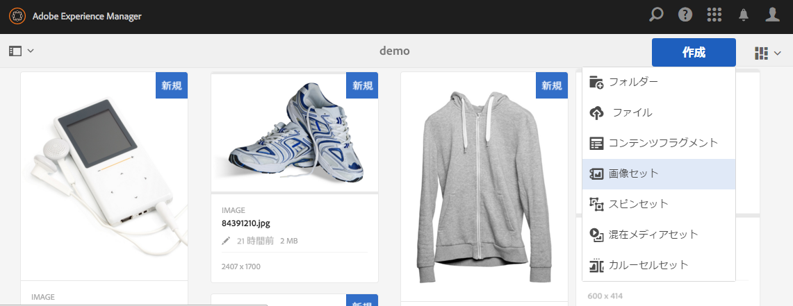

# 画像セット {#image-sets}

>[!CAUTION]
>
>AEM 6.4 の拡張サポートは終了し、このドキュメントは更新されなくなりました。 詳細は、 [技術サポート期間](https://helpx.adobe.com/jp/support/programs/eol-matrix.html). サポートされているバージョンを見つける [ここ](https://experienceleague.adobe.com/docs/?lang=ja).

画像セットは、ユーザーがサムネール画像をクリックしてアイテムの様々なビューを表示できる、統合された表示エクスペリエンスを提供します。 画像セットによって、アイテムの代替的なビューを表示でき、ビューアでは画像をより近くで確認するためのズームツールを利用できます。

画像セットのバナーには、「 **[!UICONTROL IMAGESET]**. また、画像セットが公開されている場合、公開日が&#x200B;**[!UICONTROL 地球]**&#x200B;アイコン付きでバナーに表示され、最終変更日も&#x200B;**[!UICONTROL 鉛筆]**&#x200B;アイコン付きで表示されます。

画像セット内では、画像セットを作成してサムネールを追加することで、スウォッチを作成することもできます。

このアプリケーションは、アイテムを異なる色、パターン、または仕上げで表示する場合に特に便利です。 カラースウォッチを含む画像セットを作成するには、ユーザーに提示する色、パターンまたは仕上げごとに 1 つの画像が必要です。 また、カラー、パターン、仕上げごとに 1 つのカラー、パターン、または仕上げスウォッチが必要です。

例えば、キャップの画像を異なる色の紙幣で表示するとします。請求書は赤、緑、青です。 この場合、同じキャップの 3 つのショットが必要です。 1 枚は赤、1 枚は緑、もう 1 枚は青の札が必要です。 また、赤、緑、青のカラースウォッチも必要です。 カラースウォッチは、スウォッチセットビューアでクリックして、赤い、緑の、または青い、札の付いたキャップを表示するサムネールとして機能します。

>[!NOTE]
>
>アセットユーザーインターフェイスについて詳しくは、[タッチ UI を使用したアセットの管理](managing-assets-touch-ui.md)を参照してください。

画像セットを作成する際、アドビでは次のベストプラクティスを推奨し、次の制限を適用します。

| 制限タイプ | ベストプラクティス | 適用される制限 |
| --- | --- | --- |
| 1 セットあたりの重複アセット数 | 重複なし | 20 |
| 1 セットあたりの最大画像数 | 1 セットあたり 5～10 個の画像 | 1000 |

[Dynamic Media の制限](/help/assets/limitations.md)も参照してください。

## クイックスタート：画像セット {#quick-start-image-sets}

すぐに使い始めるには：

1. [複数ビュー用のプライマリ画像をアップロードします。](#uploading-assets-in-image-sets)

   まずは画像セット用の画像をアップロードします。ユーザーは画像セットビューアで画像をズームできるので、画像を選択する際にはズームを考慮します。最適なズーム詳細には、最大サイズで 2,000 ピクセル以上の画像を使用してください。Dynamic Media では、各画像を最大 25 メガピクセルまでレンダリングできます。例えば、5,000 x 5,000 メガピクセルの画像や、その他のサイズの組み合わせを 25 メガピクセルまで使用できます。

   AEM Assetsでは多くの画像ファイル形式がサポートされますが、可逆TIFF、PNG、EPS画像の使用が推奨されます。

1. [画像セットの作成.](#creating-image-sets)

   画像セットで、画像セットビューア内のサムネール画像をクリックします。

   Assets で画像セットを作成するには、 **[!UICONTROL 作成/画像セット]**. 次に、画像を追加して、 **[!UICONTROL 保存]**.

   [バッチセットプリセット](/help/assets/config-dms7.md#creating-batch-set-presets-to-auto-generate-image-sets-and-spin-sets)を使用して画像セットを自動的に作成することもできます。

   **重要**  — バッチセットは、アセットの取り込みの一環として IPS(Image Production System) で作成され、Dynamic Media - Scene7モードでのみ使用できます。

   詳しくは、[アップロード用の画像セットアセットの準備およびファイルのアップロード](#uploading-assets-in-image-sets)を参照してください。

   [セレクターの操作](working-with-selectors.md)を参照してください。

1. 必要に応じて[画像セットビューアプリセット](managing-viewer-presets.md)を追加します。

   管理者は画像を作成または変更できます **[!UICONTROL ビューアプリセットを設定]**. 画像セットを特定のビューアプリセットで表示するには、画像セットを選択し、左側のレールのドロップダウンメニューで「**[!UICONTROL ビューア]**」を選択します。

   **[!UICONTROL ツール／アセット／ビューアプリセット]**&#x200B;を選択して、ビューアプリセットを作成または編集します。

1. （オプション）バッチセットプリセットを使用して作成した[画像セットの表示](image-sets.md#viewing-image-sets)
1. [画像セットのプレビュー.](previewing-assets.md)

   画像セットを選択すると、プレビューできます。サムネールアイコンをタップして、選択したビューアでの画像セットの表示を確認します。 **[!UICONTROL ビューア]**&#x200B;メニューから様々なビューアを選択できます。このメニューは左パネルのドロップダウンメニューにあります。

1. [画像セットの公開.](publishing-dynamicmedia-assets.md)

   画像セットを公開すると、URL と埋め込み文字列がアクティベートされます。さらに、作成した[カスタムビューアプリセットを公開する](managing-viewer-presets.md)必要があります。既製のビューアプリセットが既に公開されています。

1. [URL を Web アプリケーションにリンクする](linking-urls-to-yourwebapplication.md)か、[ビデオビューアまたは画像ビューアを埋め込みます](embed-code.md)。

   AEM Assetsは画像セットの URL 呼び出しを作成し、画像セットを公開した後にそれらをアクティベートします。 アセットをプレビューする際に、これらの URL をコピーできます。または、Web サイトに埋め込むこともできます。

   画像セットを選択し、左パネルのドロップダウンメニューで「**[!UICONTROL ビューア]**」を選択します。

   詳しくは、[Web ページへの画像セットのリンク](linking-urls-to-yourwebapplication.md)および[ビデオビューアまたは画像ビューアの埋め込み](embed-code.md)を参照してください。

画像セットを編集するには、[画像セットの編集](#editing-image-sets)を参照してください。また、[画像セットのプロパティ](managing-assets-touch-ui.md#editing-properties)を表示および編集することができます。

セットの作成で問題が発生した場合は、[Dynamic Media - Scene7 モードのトラブルシューティング](troubleshoot-dms7.md#images-and-sets)の「画像とセット」を参照してください。

## 画像セット内のアセットのアップロード {#uploading-assets-in-image-sets}

まずは画像セット用の画像をアップロードします。ユーザーは画像セットビューアで画像をズームできるので、画像を選択する際にはズームを考慮します。最大サイズで 2,000 ピクセル以上の画像を使用してください。画像セットでは多くの画像ファイル形式がサポートされますが、可逆圧縮 TIFF、PNG および EPS 画像の使用が推奨されます。

画像セット用の画像のアップロードは、[AEM Assets での他のアセットのアップロード](managing-assets-touch-ui.md#uploading-assets)と同様に実行できます。

### アップロード用の画像セットアセットの準備 {#preparing-image-set-assets-for-upload}

画像セットを作成する前に、画像のサイズと形式が正しいことを確認してください。

複数ビューの画像セットを作成するには、異なる視点から項目を表示する画像、または同じ項目の異なる側面を表示する画像が必要です。 目標は、アイテムの重要な機能を強調し、ビューアがアイテムの外観や動作を完全に把握できるようにすることです。

ユーザーは画像セットで画像をズームできるので、最大サイズで 2,000 ピクセル以上の画像を使用してください。 AEM Assets では多くの画像ファイル形式がサポートされますが、可逆圧縮 TIFF、PNG および EPS 画像の使用が推奨されます。

>[!NOTE]
>
>また、製品スウォッチを示すサムネールを使用する場合は、次の操作を行う必要があります。
>
>同じ画像のビネットや異なるショットが、異なる色、パターン、または仕上がりで表示されている必要があります。 また、異なる色、パターン、仕上げに対応するサムネールファイルも必要です。 例えば、同じジャケットを黒、茶色、緑で表示する画像セットを持つサムネールを表示するには、次が必要です。
>
>* 同じジャケットの黒、茶、緑のショット。
>* 黒、茶、緑のカラーのサムネール。
>

## 画像セットの作成 {#creating-image-sets}

画像セットは、ユーザーインターフェイスまたは API 経由で作成できます。この節では、ユーザインターフェイスで画像セットを作成する方法について説明します。

>[!NOTE]
>
>[バッチセットプリセット](/help/assets/config-dms7.md#creating-batch-set-presets-to-auto-generate-image-sets-and-spin-sets)を使用して画像セットを自動的に作成することもできます。

**重要：**&#x200B;バッチセットは IPS（Image Production System）によってアセット取り込みの一環として作成され、Dynamic Media - Scene7 モードでのみ使用できます。

画像セットに追加したアセットは、自動的に英数字順で追加されます。追加後に、手動でアセットの並べ替えや並べ替えをおこなうことができます。

>[!NOTE]
>
>画像セットは、 `,` （コンマ）を使用して、ファイル名に含めることができます。

画像セットを作成する際、アドビでは次のベストプラクティスを推奨し、次の制限を適用します。

| 制限タイプ | ベストプラクティス | 適用される制限 |
| --- | --- | --- |
| 1 セットあたりの重複アセット数 | 重複なし | 20 |
| 1 セットあたりの最大画像数 | 1 セットあたり 5～10 個の画像 | 1000 |

[Dynamic Media の制限](/help/assets/limitations.md)も参照してください。

**画像セットを作成するには**:

1. In **Assets**&#x200B;画像セットを作成する場所に移動して、をタップします。 **[!UICONTROL 作成]**&#x200B;を選択し、 **[!UICONTROL 画像セット]**. アセットを格納しているフォルダー内からセットを作成することもできます。

   

1. 画像セットエディターページの **[!UICONTROL タイトル]** フィールドに、画像セットの名前を入力します。 画像セットの横のバナーに名前が表示されます。 必要に応じて、摘要を入力します。

   

   >[!NOTE]
   >
   >画像セットを作成するときに、画像セットのサムネールを変更したり、画像セット内のアセットに基づいて AEM がサムネールを自動的に選択するように設定したりできます。サムネールを選択するには、 **[!UICONTROL サムネールを変更]** をクリックし、任意の画像を選択します（他のフォルダーに移動して画像を探すこともできます）。 サムネールを選択した状態で、画像セットからサムネールを自動的に生成することにした場合は、「**[!UICONTROL 自動サムネールに 切り替え]**」を選択します。

1. 次のいずれかの操作をおこないます。

   * の左上隅付近 **[!UICONTROL 画像セットエディター]** ページ、タップ **[!UICONTROL アセットを追加]**.
   * の中央付近 **[!UICONTROL 画像セットエディター]** ページ、タップ **[!UICONTROL タップしてアセットセレクターを開く]**.

   画像セットに含めるアセットをタップして選択します。 選択済みのアセットにはチェックマークアイコンが付いています。作業が完了したら、ページの右上隅付近にあるをタップします。 **[!UICONTROL 選択]**.

   アセットセレクターでは、キーワードを入力して **[!UICONTROL Enter]** キーをタップすることで、アセットを検索することができます。フィルターを適用して、検索結果を絞り込むこともできます。パス、コレクション、ファイルタイプおよびタグでフィルタリングできます。フィルターを選択してから、ツールバーの&#x200B;**[!UICONTROL フィルター]**&#x200B;アイコンをタップします。次をタップしてビューを変更 **[!UICONTROL 表示]** アイコンと選択 **[!UICONTROL 列表示]**, **[!UICONTROL カード表示]**&#x200B;または **[!UICONTROL リスト表示]**.

   [セレクターの操作](working-with-selectors.md)を参照してください。

   

1. 画像セットに追加したアセットは、自動的に英数字順で追加されます。アセットを追加した後で、手動でアセットの並べ替えや並べ替えをおこなうことができます。

   必要に応じて、アセットの **[!UICONTROL 並べ替え]** アセットのファイル名の右側にあるアイコンを使用して、設定リスト内で画像の順序を上下に変更できます。

   

   サムネールまたはスウォッチを変更する場合は、 **[!UICONTROL サムネール]** アイコンをクリックし、必要なサムネールまたはスウォッチに移動します。 すべての画像の選択が完了したら、をタップします。 **[!UICONTROL 保存]**.

1. （オプション）次のいずれかの操作を行います。

   * 画像を削除するには、画像を選択し、 **[!UICONTROL アセットを削除]**.
   * ページの右上隅付近にプリセットを適用するには、「**[!UICONTROL プリセット]**」をタップした後、すべてのアセットに一度に適用するプリセットを選択します。

1. 「**[!UICONTROL 保存]**」をタップします。新しく作成した画像セットが、作成先のフォルダーに表示されます。

## 画像セットの表示 {#viewing-image-sets}

画像セットは、ユーザーインターフェイスで作成することも、[バッチセットプリセット](/help/assets/config-dms7.md#creating-batch-set-presets-to-auto-generate-image-sets-and-spin-sets)を使用して自動的に作成することもできます。

**重要**  — バッチセットは IPS によって作成されます [画像制作システム] アセットの取り込みの一環として使用でき、Dynamic Media - Scene7モードでのみ使用できます。)

ただし、バッチセットプリセットを使用して作成したセットは、ユーザーインターフェイスに表示&#x200B;*されません*。これらのセットは 3 つの異なる方法で表示できます（これらの方法は、画像セットをユーザーインターフェイスで作成した場合も使用できます）。

* 個々のアセットのプロパティを開く場合。 プロパティは、選択したアセットがメンバーとして含まれるセット ( **[!UICONTROL セットのメンバー]**) をクリックします。 セットの名前をタップすると、セット全体が表示されます。

   

* 任意のセットのメンバー画像で、**[!UICONTROL セット]**&#x200B;メニューを選択して、アセットがメンバーとして含まれているセットを表示します。

   

* 検索で、 **[!UICONTROL フィルター]**&#x200B;を展開し、 **[!UICONTROL Dynamic Media]** を選択し、 **[!UICONTROL セット]**.

   検索結果として、UI で手動で作成した一致するセットか、バッチセットプリセットを使用して自動的に作成した一致するセットが返されます。自動セットの場合、検索クエリは、「次を含む」検索条件に基づくAEM検索とは異なる「次の語句で始まる」検索条件を使用して実行されます。 フィルターを「**[!UICONTROL セット]**」に設定するのが、自動セットを検索する唯一の方法です。

   

>[!NOTE]
>
>[画像セットの編集](#editing-image-sets)の説明に従って、ユーザーインターフェイスを通じて画像セットを表示できます。

## 画像セットの編集 {#editing-image-sets}

画像セットでは、次のような様々な編集タスクを実行できます。

* 画像セットへの画像の追加
* 画像セット内の画像を並べ替えます。
* 画像セットのアセットの削除
* ビューアプリセットを適用します。
* 画像セットを削除します。

**画像セットを編集するには**:

1. 次のいずれかの操作を行います。

   * 画像セットアセット上にマウスポインターを置き、**[!UICONTROL 編集]**（鉛筆アイコン）をタップします。
   * 画像セットアセットの上にマウスポインターを置いて、をタップします。 **[!UICONTROL 選択]** （チェックマークアイコン）をタップし、 **[!UICONTROL 編集]** をクリックします。
   * 画像セットアセットをタップしてから、ツールバーの&#x200B;**[!UICONTROL 編集]**（鉛筆アイコン）をタップします。

1. 画像セット内の画像を編集するには、次のいずれかの操作を行います。

   * アセットを並べ替えるには、画像を新しい場所にドラッグします（並べ替えアイコンを選択して項目を移動します）。
   * 項目を昇順または降順に並べ替えるには、列見出しをタップします。
   * アセットを追加するか既存のアセットを更新するには、 **[!UICONTROL アセットを追加]**. アセットに移動して選択し、ページの右上隅にある「**[!UICONTROL 選択]**」をタップしますページ。

   >[!NOTE]
   >AEM でサムネール用に使用されている画像を別の画像に置き換えて削除しても、元のアセットは表示されたままになります。

   * アセットを削除するには、アセットを選択して、 **[!UICONTROL アセットを削除]**.
   * プリセットを適用するには、ページの右上隅付近にある「**[!UICONTROL プリセット]**」をタップし、ビューアプリセットを選択します。
   * サムネールを追加または変更するには、該当するアセットの右横にあるサムネールアイコンを選択します。新しいサムネールまたはスウォッチアセットに移動して選択し、をタップします。 **[!UICONTROL 選択]**.
   * 画像セット全体を削除するには、画像セットの場所に移動して画像セットを選択し、「**[!UICONTROL 削除]**」をタップします。

   >[!NOTE]
   >
   >画像セットの画像を編集するには画像セットに移動し、左側のレールの「**[!UICONTROL メンバーを設定]**」をタップしてから、個々のアセットの鉛筆アイコンをタップして編集ウィンドウを開きます。****

1. 編集が完了したら、「**[!UICONTROL 保存]**」をタップします。

## 画像セットのプレビュー {#previewing-image-sets}

詳しくは、[アセットのプレビュー](previewing-assets.md)を参照してください。

## 画像セットの公開 {#publishing-image-sets}

[アセットの公開](publishing-dynamicmedia-assets.md)を参照してください。
