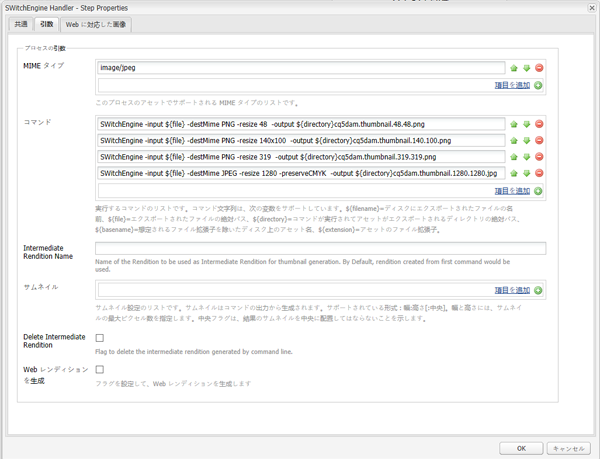
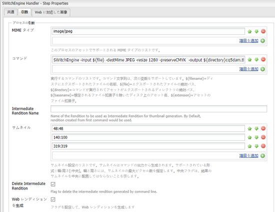

# 画像トランスコーディングライブラリ {#imaging-transcoding-library}

アドビの画像トランスコーディングライブラリは独自の画像処理ソリューションであり、以下のような中心的な画像処理機能を実行できます。

* エンコード
* トランスコーディング（サポートされる形式間での変換）
* PS およびインテル IPP アルゴリズムを使用する画像リサンプリング
* ビット深度およびカラープロファイルの保持
* JPEG画質圧縮
* 画像のサイズ変更

画像トランスコーディングライブラリは、CMYKのサポートと完全なアルファ（CMYK -Alphaを除く）を提供します。

画像トランスコーディングライブラリは、様々なファイル形式とプロファイルをサポートするだけでなく、パフォーマンス、拡張性、品質に関して他のサードパーティソリューションよりも大きなメリットを提供します。 画像トランスコーディングライブラリを使用する主なメリットの一部を次に示します。

* **ファイルサイズまたは解像度を増やして拡大**：拡大・縮小は、主にファイルのデコード中のサイズ変更によって実現します。これは画像トランスコーディングライブラリに搭載された特許取得済みの機能です。この機能により、ランタイム中のメモリ使用状況が常に最適化され、ファイルサイズの増加やメガピクセル解像度の二次関数ではなくなります。画像トランスコーディングライブラリは、より大容量の高解像度（メガピクセル値がより高い）ファイルを処理できます。ImageMagick などのサードパーティツールの場合、大容量のファイルを処理できず、ファイルの処理中にクラッシュします。
* **Photoshop 品質の圧縮およびサイズ変更アルゴリズム**：ダウンサンプリングの品質（スムーズ、シャープ、自動バイキュービック）および圧縮品質に関する業界標準に準拠しています。画像トランスコーディングライブラリは、入力画像の品質係数をさらに評価し、出力画像に最適なテーブルと画質設定をインテリジェントに使用します。 この機能により、画質を損なうことなく最適なサイズのファイルが作成されます。
* **高スループット：** 応答時間は短く、スループットは常にImageMagickより高くなります。したがって、画像トランスコーディングライブラリを使用すると、ユーザーの待ち時間が短縮され、ホスティングのコストが削減されます。
* **同時読み込みによる拡張性の向上：** 画像トランスコーディングライブラリは、同時読み込み条件下で最適に動作します。CPU パフォーマンスとメモリ使用状況を最適化し、応答時間を短縮しながら、高スループットを実現するため、ホスティングコストを抑えることができます。

## サポートされているプラットフォーム {#supported-platforms}

画像トランスコーディングライブラリは、RHEL 7およびCentOS 7ディストリビューションでのみ使用できます。

>[!NOTE]
>
>Mac OS やその他の *nix 系ディストリビューション（Debian、Ubuntu など）はサポートされていません。

## 使用方法 {#usage}

画像トランスコーディングライブラリ用のコマンドライン引数には、以下を使用できます。

```shell
 -destMime PNG/JPEG: Mime type of output rendition
 -BitDepth 8/16: Preserves Bit Depth. Bitdepth ‘4’ is automatically converted to ‘8’
 -preserveBitDepth: Downscales Bit Depth (No upscaling)
 -preserveCMYK: Preserves CMYK color space
 -jpegQuality: Provides jpeg quality parameter (0-12 , corresponding to Photoshop qualities)
 -ResamplingMethod BiCubic/Lanczos/PSBicubic: Provides resampling methods. PSBicubic is a Photoshop quality resampling method.
 -resize
```

`-resize`パラメーターには、次のオプションを設定できます。

* `X`: `Works similar to AEM. For example -resize 319.`

* `WxH`:  `Aspect Ratio will not be maintained, For example -resize 319X319.`

* `Wx`:  `Fixes the width and calculates the height maintaining the aspect ratio. For example -resize 319x.`

* `xH`:  `Fixes the height and calculates the width maintaining the aspect ratio. For example -resize x319.`

```shell
 -AllowUpsampling (Resizes smaller images)
 -input <fileName>
 -output <fileName>
```

## 画像トランスコーディングライブラリの設定 {#configuring-imaging-transcoding-library}

ITL処理を設定するには、設定ファイルを作成し、ワークフローを更新して実行します。

### 抽出されたバンドルの設定ファイル{#create-conf-file}を作成します

ライブラリを設定するには、次の手順を使用して、ライブラリを示す.confファイルを作成します。 管理者権限またはルート権限が必要です。

1. [イメージトランスコーディングライブラリパッケージをソフトウェア配布](https://experience.adobe.com/#/downloads/content/software-distribution/en/aem.html?package=/content/software-distribution/en/details.html/content/dam/aem/public/adobe/packages/aem630/product/assets/aem-assets-imaging-transcoding-library-pkg)からダウンロードし、パッケージマネージャーを使用してインストールします。 パッケージはAEM 6.5と互換性があります。

1. `com.day.cq.dam.cq-dam-switchengine`のバンドルIDを確認するには、Webコンソールにログインして&#x200B;**[!UICONTROL OSGi/Bundles]**&#x200B;をタップします。 または、バンドルコンソールを開くには、`https://[aem_server:[port]/system/console/bundles/` URLにアクセスします。 `com.day.cq.dam.cq-dam-switchengine`バンドルとそのIDを探します。

1. コマンド`ls -la /aem64/author/crx-quickstart/launchpad/felix/bundle<id>/data/binaries/`を使用してフォルダーをチェックし、必要なライブラリがすべて抽出されていることを確認します。ここで、フォルダー名はバンドルIDを使用して構築されます。 例えば、バンドルIDが`588`の場合、コマンドは`ls -la /aem64/author/crx-quickstart/launchpad/felix/bundle588/data/binaries/`です。

1. ライブラリにリンクする`SWitchEngineLibs.conf`ファイルを作成します。

   ```shell
   cd `/etc/ld.so.conf.d`
   touch SWitchEngineLibs.conf
   vi SWitchEngineLibs.conf
   ```

1. `cat SWitchEngineLibs.conf`コマンドを使用して、`/aem64/author/crx-quickstart/launchpad/felix/bundle<id>/data/binaries/`パスをconfファイルに追加します。

1. `ldconfig`コマンドを実行して、必要なリンクとキャッシュを作成します。

1. AEMの起動に使用するアカウントで、`.bash_profile`ファイルを編集します。 `LD_LIBRARY_PATH`を追加します。

   ```shell
   LD_LIBRARY_PATH=.
   export LD_LIBRARY_PATH
   ```

1. パスの値が`.`に設定されるようにするには、`echo $LD_LIBRARY_PATH`コマンドを使用します。 出力は`.`にする必要があります。 値が`.`に設定されていない場合は、セッションを再開します。

### DAMアセットの更新ワークフローの設定{#configure-dam-asset-update-workflow}

画像の処理にライブラリを使用するように、[!UICONTROL DAMアセットの更新]ワークフローを更新します。

1. AEM のロゴをタップまたはクリックし、**[!UICONTROL ツール／ワークフロー／モデル]**&#x200B;に移動します。

1. **[!UICONTROL ワークフローモデル]**&#x200B;ページで、**[!UICONTROL DAMアセットの更新]**&#x200B;ワークフローモデルを編集モードで開きます。

1. **[!UICONTROL サムネールを処理]**&#x200B;ワークフロープロセスステップを開きます。 「**[!UICONTROL サムネール]**」タブで、デフォルトのサムネール生成プロセスをスキップするMIMEタイプを「**[!UICONTROL MIMEタイプをスキップ]**」リストに追加します。
例えば、画像トランスコーディングライブラリを使用してTIFF画像のサムネールを作成する場合は、「 **[!UICONTROL MIMEタイプをスキップ]** 」フィールドに`image/tiff`と指定します。

1. 「**[!UICONTROL Web に対応した画像]**」タブで、デフォルトの Web レンディション生成プロセスをスキップする MIME タイプを「**[!UICONTROL リストをスキップ]**」に追加します。例えば、上記の手順でMIMEタイプ`image/tiff`をスキップした場合は、スキップリストに`image/tiff`を追加します。

1. **[!UICONTROL EPSサムネール（ImageMagickを利用）]**&#x200B;ステップを開き、「**[!UICONTROL 引数]**」タブに移動します。 **[!UICONTROL MIMEタイプ]**&#x200B;リストで、画像トランスコーディングライブラリで処理するMIMEタイプを追加します。 例えば、上記の手順でMIMEタイプ`image/tiff`をスキップした場合、**[!UICONTROL Mimeタイプ]**&#x200B;リストに`image/jpeg`を追加します。

1. 既定のコマンドが存在する場合は、そのコマンドを削除します。

1. サイドパネルを切り替えて、ステップのリストから&#x200B;**[!UICONTROL SWitchEngine ハンドラー]**&#x200B;を追加します。

1. カスタム要件に基づいて、[!UICONTROL SwitchEngine Handler]にコマンドを追加します。 必要に応じて、指定したコマンドのパラメータを調整します。 例えば、JPEG 画像のカラープロファイルを保持したい場合、「**[!UICONTROL コマンド]**」リストに以下のコマンドを追加します。

   * `SWitchEngine -input ${file} -destMime PNG -resize 48 -output ${directory}cq5dam.thumbnail.48.48.png`
   * `SWitchEngine -input ${file} -destMime PNG -resize 140x100 -output ${directory}cq5dam.thumbnail.140.100.png`
   * `SWitchEngine -input ${file} -destMime PNG -resize 319 -output ${directory}cq5dam.thumbnail.319.319.png`
   * `SWitchEngine -input ${file} -destMime JPEG -resize 1280 -preserveCMYK -output ${directory}cq5dam.web.1280.1280.jpeg`

   

1. （オプション）1つのコマンドを使用して、中間レンディションからサムネールを生成します。 中間レンディションは静的レンディションと Web レンディションを生成するソースとなります。この方法は最初の方法より処理が高速です。ただし、この方法ではサムネールにカスタムパラメーターを適用できません。

   

1. Webレンディションを生成するには、「**[!UICONTROL Web対応の画像]**」タブでパラメーターを設定します。

1. 更新された[!UICONTROL DAMアセットの更新]ワークフローモデルを同期します。 ワークフローを保存します。

設定を確認し、TIFF画像をアップロードして、error.logファイルを監視します。 `SwitchEngineHandlingProcess execute: executing command line`というメンションを含む`INFO`メッセージが表示されます。 ログには、生成されたレンディションが記述されます。 ワークフローが完了したら、AEMで新しいレンディションを表示できます。

>[!MORELIKETHIS]
>
>* [サポートされるMIMEタイプに関する記事](assets-formats.md#supported-image-transcoding-library)

