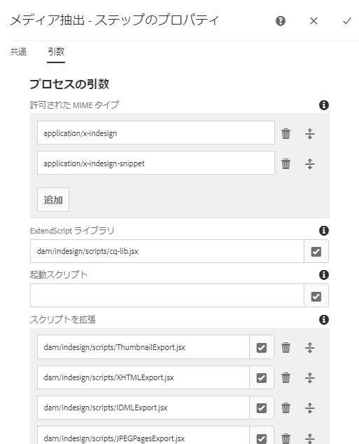
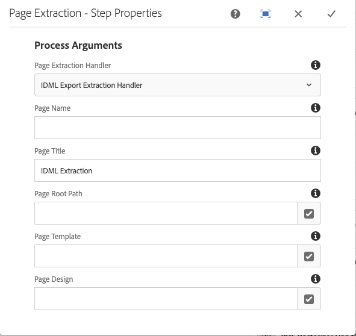
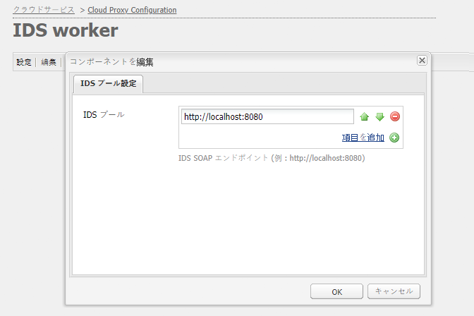

# Assets とAdobe InDesign Serverの統合 {#integrating-aem-assets-with-indesign-server}

>[!CAUTION]
>
>AEM 6.4 の拡張サポートは終了し、このドキュメントは更新されなくなりました。 詳細は、 [技術サポート期間](https://helpx.adobe.com/jp/support/programs/eol-matrix.html). サポートされているバージョンを見つける [ここ](https://experienceleague.adobe.com/docs/?lang=ja).

Adobe Experience Manager Assets では、次のものを使用します。

* プロキシ：特定の処理タスクのロードを分配するために使用します。プロキシとは、プロキシワーカーと通信して特定のタスクを実行し、他の [!DNL Experience Manager] インスタンスと通信して結果を送信する [!DNL Experience Manager] インスタンスです。
* プロキシワーカー：特定のタスクを定義し管理するために使用します。

これらは様々な作業をカバーできます。例えば、Adobe InDesign Serverを使用してファイルを処理する場合です。

ファイルをに完全にアップロードするには [!DNL Experience Manager] プロキシとしてAdobe InDesignで作成したアセットが使用されます。 プロキシワーカーを使用してAdobe InDesign Server( ここでは [スクリプト](https://www.adobe.com/devnet/indesign/documentation.html#idscripting) を実行してメタデータを抽出し、 [!DNL Experience Manager] アセット。 プロキシワーカーは、InDesign Serverと [!DNL Experience Manager] インスタンスがクラウド設定に含まれています。

>[!NOTE]
>
>Adobe InDesignは 2 つの製品として提供されます。
>
>* [InDesign](https://www.adobe.com/jp/products/indesign.html)\
   >  印刷やデジタル配信のためのページレイアウトをデザインできます。
>
>* [InDesign Server](https://www.adobe.com/jp/products/indesignserver.html)\
   >  このエンジンを使用すれば、InDesign での作成物に基づいてドキュメントをプログラムによって自動生成できます。このエンジンは、[ExtendScript](https://www.adobe.com/jp/devnet/scripting.html) エンジンへのインターフェイスを提供するサービスとして動作します。\
   >  スクリプトは、JavaScript に似たExtendScriptで記述されます。 Adobe InDesignスクリプトについて詳しくは、 [https://www.adobe.com/devnet/indesign/documentation.html#idscripting](https://www.adobe.com/jp/devnet/indesign/documentation.html#idscripting).
>

## 抽出の仕組み {#how-the-extraction-works}

InDesign Serverは、 [!DNL Experience Manager] アセットをInDesign( `.indd`) をアップロードし、レンディションを生成して、 *すべて* 抽出されてアセットとして保存されたメディア（例：ビデオ）:

>[!NOTE]
>
>以前のバージョンの [!DNL Experience Manager] では XMP とサムネールを抽出できましたが、現在はすべてのメディアを抽出できるようになりました。

1. 次をアップロード： `.indd` ～に提出する [!DNL Experience Manager] アセット。
1. フレームワークにより、コマンドスクリプトが SOAP（Simple Object Access Protocol）経由で InDesign Server に送信されます。

   このコマンドスクリプトは、次のことを実行します。

   * の取得 `.indd` ファイル。
   * InDesign Serverコマンドを実行：

      * 構造、テキストおよびメディアファイルが抽出されます。
      * PDFとJPGのレンディションが生成される。
      * HTMLと IDML レンディションが生成されます。
   * 結果のファイルをに投稿します。 [!DNL Experience Manager] アセット。

   >[!NOTE]
   >
   >IDML は、InDesign ファイル内のすべての要素をレンダリングする XML ベースの形式です。**[Zip](https://www.techterms.com/definition/zip) 圧縮を使用した圧縮パッケージとして保存されます。
   >
   >詳しくは、 [Adobe InDesign INX および IDML 形式](https://www.peachpit.com/articles/article.aspx?p=1381880&amp;seqNum=8) を参照してください。

   >[!CAUTION]
   >
   >InDesign Serverがインストールされていない場合や設定されていない場合でも、 `.indd` ～に押し込む [!DNL Experience Manager]. ただし、生成されるレンディションは次の条件に制限されます。 `png` および `jpeg`を生成できない場合、 `html`, `idml` またはページのレンディション。

1. 抽出およびレンダリング生成後：

   * 構造が `cq:Page`（レンディションタイプ）に複製されます。
   * 抽出したテキストとファイルは、 [!DNL Experience Manager] アセット。
   * すべてのレンディションは、 [!DNL Experience Manager] アセット内のアセット。

## とのInDesign Server [!DNL Experience Manager] {#integrating-the-indesign-server-with-aem}

で使用するInDesign Serverを統合するには [!DNL Experience Manager] Assets と、プロキシを設定した後は、次の操作が必要です。

1. [InDesign Server をインストールします](#installing-the-indesign-server)。
1. 必要に応じて、 [設定 [!DNL Experience Manager] Assets ワークフロー](#configuring-the-aem-assets-workflow).

   これは、デフォルト値がインスタンスに適さない場合にのみ必要です。

1. [InDesign Server のプロキシワーカー](#configuring-the-proxy-worker-for-indesign-server)を設定します。

### InDesign Server {#installing-the-indesign-server}

で使用するInDesign Serverをインストールして開始するには [!DNL Experience Manager]:

1. Adobe InDesign Serverをダウンロードしてインストールします。

   >[!NOTE]
   >
   >InDesign Server（CS6 以降）。

1. 必要に応じて、InDesign Serverインスタンスの設定をカスタマイズできます。

1. コマンドラインから、サーバーを起動します。

   `<*ids-installation-dir*>/InDesignServer.com -port 8080`

   これにより、SOAP プラグインでポート 8080 をリッスンしてサーバーが起動します。 すべてのログメッセージと出力は、コマンドウィンドウに直接書き込まれます。

   >[!NOTE]
   >
   >出力メッセージをファイルに保存する場合は、リダイレクトを使用します。例えば、Windows の場合、次のようになります。
   >
   >`<ids-installation-dir>/InDesignServer.com -port 8080 > ~/temp/INDD-logfile.txt 2>&1`

### の設定 [!DNL Experience Manager] Assets ワークフロー {#configuring-the-aem-assets-workflow}

[!DNL Experience Manager] Assets には事前設定済みのワークフローがあります **DAM アセットの更新**( 特にInDesign用の複数のプロセスステップを持つ )

* [メディア抽出](#media-extraction)
* [ページ抽出](#page-extraction)

このワークフローには、様々な作成者インスタンス上の設定に合わせて変更できるデフォルト値が設定されています（これは標準ワークフローであり、詳しい情報は[ワークフローの編集](/help/sites-developing/workflows-models.md#configuring-a-workflow-step)に記載されています）。デフォルト値（SOAP ポートを含む）を使用する場合は、設定は不要です。

設定後、にInDesignファイルをアップロード [!DNL Experience Manager] アセットは（通常の方法のいずれかによって）アセットを処理し、様々なレンディションを準備するために必要なワークフローをトリガーします。 `.indd`[!DNL Experience Manager] ファイルを Assets にアップロードし、IDS で作成された各種レンディションが  の下にあることを確認して、設定をテストしてください。`<*your_asset*>.indd/Renditions`

#### メディア抽出 {#media-extraction}

この手順では、 `.indd` ファイル。

カスタマイズするには、**[!UICONTROL メディア抽出]**&#x200B;ステップの「**[!UICONTROL 引数]**」タブを編集します。

メディア抽出の引数とスクリプトパス

* **ExtendScript ライブラリ**：他のスクリプトに必要とされる単純な http get/post メソッドライブラリです。

* **スクリプトを拡張**：ここで複数のスクリプトの組み合わせを指定できます。InDesign サーバーで独自のスクリプトを実行する場合は、`/apps/settings/dam/indesign/scripts` にスクリプトを保存します。

   InDesign・スクリプトの詳細は、 [https://www.adobe.com/devnet/indesign/documentation.html#idscripting](https://www.adobe.com/devnet/indesign/documentation.html#idscripting).

>[!CAUTION]
>
>ExtendScript ライブラリは変更しないでください。ライブラリは、Sling との通信に必要な HTTP 機能を提供します。 この設定では、Adobe InDesign Serverに送信してそこで使用するライブラリを指定します。

メディア抽出ワークフロー手順で実行される `ThumbnailExport.jsx` スクリプトにより、サムネールのレンディションを JPG 形式で生成します。このレンディションはサムネール処理ワークフロー手順で使用され、[!DNL Experience Manager] で要求される静的レンディションを生成します。

サムネールを処理ワークフローステップは、異なるサイズの静的レンディションを生成するように設定できます。デフォルト値は、 [!DNL Experience Manager] Assets UI 最後に、画像プレビューレンディションを削除ワークフローステップで、.jpg サムネールレンディションが不要になったので削除されます。

#### ページ抽出 {#page-extraction}

抽出された要素から [!DNL Experience Manager] ページを作成します。抽出ハンドラーは、レンディション ( 現在のHTMLまたは IDML) からデータを抽出するために使用されます。 このデータは、その後、PageBuilder を使用してページを作成するために使用されます。

カスタマイズするには、**ページ抽出**&#x200B;ステップの「**[!UICONTROL 引数]**」タブを編集します。

* **ページ抽出ハンドラー**:ドロップダウンリストから、使用するハンドラーを選択します。 抽出ハンドラーは、関連する `RenditionPicker`（`ExtractionHandler` API を参照）によって選択された特定のレンディションに対して動作します。デフォルトでは、IDML 書き出し抽出ハンドラーを使用できます。 これは、 `IDML` レンディションを MediaExtract ステップで生成しました。

* **ページ名**：生成されるページに割り当てる名前を指定します。空白にした場合、名前は「page」（「page」が既に存在する場合は、その派生形）になります。

* **ページタイトル**：生成されるページに割り当てるタイトルを指定します。

* **ページルートパス**:結果ページのルート位置へのパス。 空白のままにした場合、アセットのレンディションを保持しているノードが使用されます。

* **ページテンプレート**：ページの生成時に使用するテンプレート。

* **ページデザイン**：ページの生成時に使用するページデザイン。

### InDesign Server のプロキシワーカーの設定 {#configuring-the-proxy-worker-for-indesign-server}

>[!NOTE]
>
>ワーカーはプロキシインスタンス上に存在します。

1. ツールコンソールで、を展開します。 **[!UICONTROL Cloud Services設定]** をクリックします。 次に、 **[!UICONTROL クラウドプロキシ設定]**.

1. 「**[!UICONTROL IDS ワーカー]**」をダブルクリックし、開いて設定します。

1. クリック **[!UICONTROL 編集]** 設定ダイアログを開き、必要な設定を定義するには、次の手順を実行します。

   

   * **IDS プール**:InDesign Serverとの通信に使用する SOAP エンドポイント。必要に応じて、項目の追加、削除および並べ替えをおこなうことができます。

1. 「**[!UICONTROL OK]**」をクリックして保存します。

### Day CQ Link Externalizer の設定  {#configuring-day-cq-link-externalizer}

InDesign Serverと [!DNL Experience Manager] は別のホスト上にあるか、これらのアプリケーションの一方または両方がデフォルトポートで動作していません。を構成してください。 **Day CQ Link Externalizer** をクリックして、InDesign Serverのホスト名、ポート、およびコンテンツパスを設定します。

1. `https://[AEM_server]:[port]/system/console/configMgr` の URL で Configuration Manager にアクセスします。
1. **[!UICONTROL Day CQ Link Externalizer]** の設定を探します。「**[!UICONTROL 編集]**」をクリックして開きます。
1. Link Externalizer の設定は、 [!DNL Experience Manager] デプロイメントと [!DNL InDesign Server]. 用途 **[!UICONTROL ドメイン]** ホスト名と [!DNL Adobe InDesign Server]. 画面に表示される指示に従います。 「**[!UICONTROL 保存]**」をクリックします。

   

### InDesign Serverの並列ジョブ処理の有効化 {#enabling-parallel-job-processing-for-indesign-server}

IDS の並列ジョブ処理を有効にすることができます。

まず、InDesign Server が処理できる並列ジョブの最大数（`x`）を決定する必要があります。

* 1 台のマルチプロセッサマシンで、InDesign Serverが処理できる並列ジョブの最大数 (x) は、IDS を実行するプロセッサの数より 1 少ない。
* 複数のマシンで IDS を実行する場合は、使用可能なプロセッサの総数（つまりすべてのマシン）をカウントし、マシンの総数を減算する必要があります。

並列 IDS ジョブ数を設定するには：

1. を開きます。 **[!UICONTROL 設定]** Felix コンソールのタブ例：

   `http://localhost:4502/system/console/configMgr`

1. 次の場所で IDS 処理キューを選択します。

   `Apache Sling Job Queue Configuration`

1. 次のように設定します。

   * **[!UICONTROL Type]** - `Parallel`
   * **[!UICONTROL Maximum Parallel Jobs]** - `<*x*>`（上で計算した値）

1. これらの変更を保存します。
1. AdobeCS6 以降のマルチセッションサポートを有効にするには、 `enable.multisession.name` 下のチェックボックス `com.day.cq.dam.ids.impl.IDSJobProcessor.name configuration`.
1. の作成 [プール &lt; `*x*>` IDS ワーカー設定に SOAP エンドポイントを追加することによる IDS ワーカー](#configuring-the-proxy-worker-for-indesign-server).

   複数のマシンがInDesign Serverを実行している場合は、各マシンに SOAP エンドポイント（マシンごとのプロセッサ数 —1）を追加します。

   >[!NOTE]
   >
   >ワーカーのプールを使用する場合、IDS ワーカーのブロックリストを有効にできます。
   >
   >それには、`com.day.cq.dam.ids.impl.IDSJobProcessor.name` 設定の下にある「enable.retry.name」チェックボックスをオンにします。これにより、IDS ジョブ再試行が有効になります。
   >
   >また、`com.day.cq.dam.ids.impl.IDSPoolImpl.name``max.errors.to.blacklist` 設定の下のパラメーターに正の値を設定します。このパラメーターは、IDS をジョブハンドラーリストから除外するまでのジョブ再試行回数を指定します。
   >
   >デフォルトでは、設定可能な（`retry.interval.to.whitelist.name`）時間（分単位）が経過した後で、IDS ワーカーが再検証されます。ワーカーがオンラインである場合は、ブロックリストから削除されます。

<!-- TBD: Make updates to configurations for allow and block list after product updates are done. See CQ-4298427.
-->

## Adobe InDesign Server 10.0 以降のサポートを有効にする {#enabling-support-for-indesign-server-or-higher}

InDesign Server 10.0 以降では、次の手順を実行してマルチセッションサポートを有効化します。

1. 次の場所から Configuration Manager を開きます。 [!DNL Assets] インスタンス `https://[aem_server]:[port]/system/console/configMgr`.
1. 設定 `com.day.cq.dam.ids.impl.IDSJobProcessor.name` を編集します。
1. 選択 **[!UICONTROL ids.cc.enable]** オプションを選択し、をクリックします。 **[!UICONTROL 保存]**.

>[!NOTE]
>
>[!DNL Assets] に [!DNL InDesign Server] を統合する場合、統合に必要なセッションサポート機能はシングルコアのシステムではサポートされていないので、マルチコアのプロセッサーを使用してください。

## Experience Manager資格情報の設定 {#configure-aem-credentials}

デフォルトの管理者資格情報（ユーザー名とパスワード）を変更して、 [!DNL Experience Manager] Adobe InDesignサーバーとの統合に支障をきたさずにインスタンスを作成できます。

1. `/etc/cloudservices/proxy.html` にアクセスします。
1. ダイアログで、新しいユーザー名とパスワードを指定します。
1. 資格情報を保存します。
