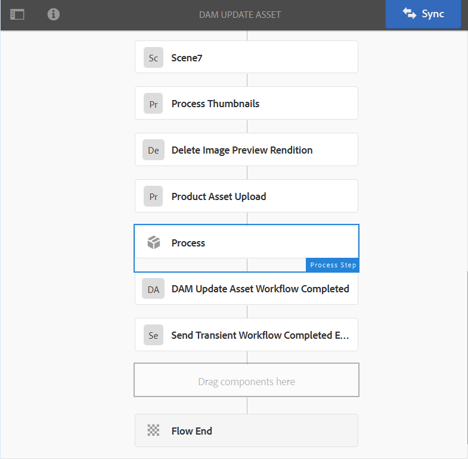
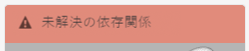
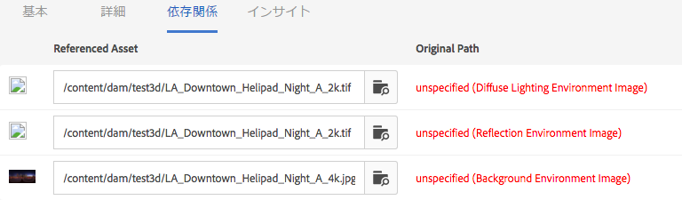
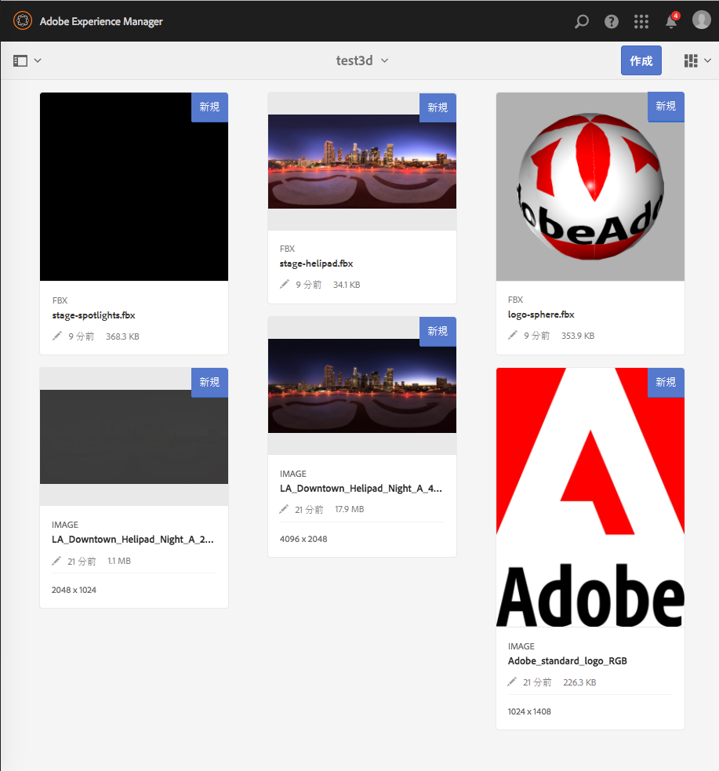
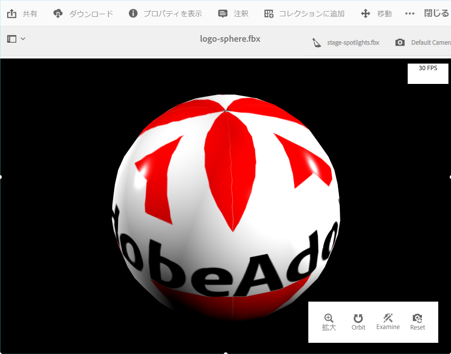
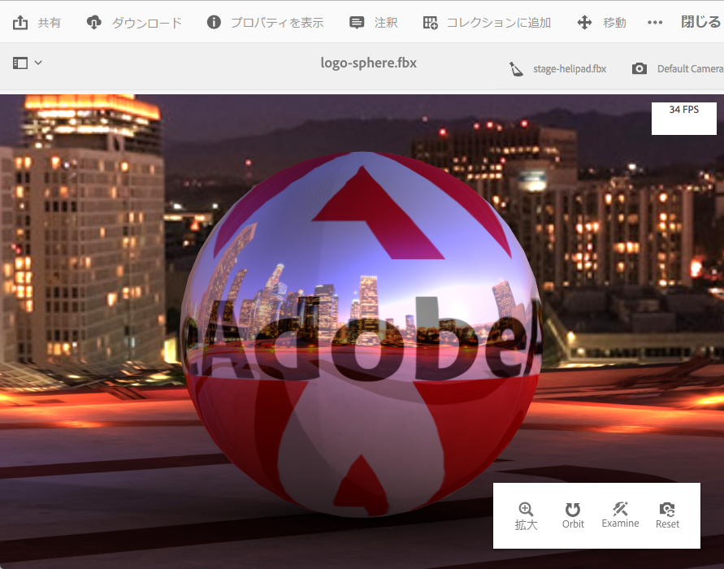

# AEM 3D のインストールと設定{#installing-and-configuring-aem-d}

>[!IMPORTANT]
>
>AEM 6.4でのAEM 3Dのサポートは終了しました。 Adobeでは、[AEMの3Dアセット機能をCloud Service](https://experienceleague.adobe.com/docs/experience-manager-cloud-service/assets/dynamicmedia/assets-3d.html#dynamicmedia)または[AEM 6.5.3以上として使用することをお勧めします。](https://experienceleague.adobe.com/docs/experience-manager-65/assets/dynamic/assets-3d.html#dynamic)

AEM 3D（バージョン3.0）のインストールと設定には、次が含まれます。

1. Autodesk® FBX® SDKライブラリをインストールする。
1. ネイティブ 3D コードパッケージをダウンロード、インストールします。
1. 3D アセット取り込みワークフローを設定して、AEM を再起動します。
1. AEM 3D の設定を確認します。

[3D アセットの使用](assets-3d.md)も参照してください。

前提条件、サポートするブラウザー、その他重要なリリース情報については、[AEM 3D Assets リリースノート](/help/release-notes/aem3d-release-notes.md)も参照してください。

[3D サイトのコンポーネントの使用](using-the-3d-sites-component.md)も参照してください。

>[!NOTE]
>
>3Dパッケージをダウンロードしてインストールする前に、必要なAEMパッケージがすべて正常にインストールされていることを確認してください。 [AEM 3D リリースノート](install-config-3d.md)を参照してください。

## Autodesk FBX SDK ライブラリのインストール {#installing-the-autodesk-fbx-sdk-library}

ネイティブ AEM 3D コードには、FBX ファイル形式をサポートする Autodesk FBX ライブラリが必要です。（アドビは、現在このライブラリを再配布できません。）

[詳細設定](advanced-config-3d.md)を参照してください。

1. AEM がインストールされたホストにログオンします。

   * Windows Server 導入の場合は、管理者としてサーバーにログオンします。
   * Mac または Windows デスクトップの場合は、管理者権限があることを確認します。

1. オペレーティングシステムに応じた適切なリンクを使用して **FBX SDK バージョン 2016.1.2** をダウンロードします。

   * **Windows**

      [https://download.autodesk.com/us/fbx_release_older/2016.1.2/fbx20161_2_fbxsdk_vs2010_win.exe](https://download.autodesk.com/us/fbx_release_older/2016.1.2/fbx20161_2_fbxsdk_vs2010_win.exe)

   * **OS X**

      [https://download.autodesk.com/us/fbx_release_older/2016.1.2/fbx20161_2_fbxsdk_clang_mac.pkg.tgz](https://download.autodesk.com/us/fbx_release_older/2016.1.2/fbx20161_2_fbxsdk_clang_mac.pkg.tgz)

   * **Linux**

      [https://download.autodesk.com/us/fbx_release_older/2016.1.2/fbx20161_2_fbxsdk_linux.tar.gz](https://download.autodesk.com/us/fbx_release_older/2016.1.2/fbx20161_2_fbxsdk_linux.tar.gz)

1. FBX SDK をインストールします。

   * Windows. AEMがあるドライブと同じドライブにインストールします。
   * Mac：AEM が配置されているのと同じパーティションにインストールします。
   * Linux. ダウンロードしたパッケージを展開し、`<yourFBXSDKpath>/Install_FbxFileSdk.txt`の指示に従います。 `/usr`にSDKをインストールします。

## ネイティブ 3D コードパッケージのダウンロードとインストール {#downloading-and-installing-the-native-d-code-package}

>[!NOTE]
>
>AEM 3D のインストールおよび設定に進む前に、該当するサービスパックおよび他の関連する機能パックをすべて導入することをお勧めします。[AEM 3D リリースノート](/help/release-notes/aem3d-release-notes.md)を参照してください。

[詳細設定](advanced-config-3d.md)を参照してください。

**ネイティブ3Dコードパッケージをインストールするには**:

1. 次のいずれかの操作をおこないます。

   * Windows Server の導入の場合は、管理者としてサーバーにログオンします。
   * MacまたはWindowsデスクトップの場合は、管理者権限を持っていることを確認します。

1. AEM へのアクセスに利用できる、サポートされているブラウザーがあることを確認します。

   [システム要件](/help/release-notes/aem3d-release-notes.md#system-requirements)を参照してください。

1. [ソフトウェア配布ポータル](https://experience.adobe.com/#/downloads/content/software-distribution/en/aem.html)にアクセスします。 `AEM-6.4-DynamicMedia-3D`機能パックのバージョン3.0.1を探し、ダウンロードします。

1. AEM で、**[!UICONTROL ツール／管理／導入／パッケージマネージャー]**&#x200B;をクリックします。

1. ダウンロードした機能パックをAEMにアップロードします。 このファイルを探し、**[!UICONTROL 「]**&#x200B;をインストール」をクリックします。

1. **[!UICONTROL パッケージをインストール]**&#x200B;ダイアログボックスで、**詳細設定**&#x200B;を展開し、**[!UICONTROL アクセス制御処理]**&#x200B;を&#x200B;**マージ**&#x200B;に設定します。
1. 「**[!UICONTROL インストール]**」をクリックしてパッケージのインストールを開始します。

   ファイル`sample-3D-content.zip`は、**[!UICONTROL Assets]**&#x200B;のルートフォルダーに配置されます。 詳細は[AEM 3D の設定の確認](#validating-the-setup-of-aem-d)を参照してください。

## 3D アセット取り込みワークフローの設定と AEM の再起動  {#configuring-the-d-asset-ingestion-workflow-and-restarting-aem}

**3Dアセット取り込みワークフローを設定するには**:

1. AEMで、AEMロゴをクリックしてグローバルナビゲーションコンソールにアクセスし、**[!UICONTROL ツール]**&#x200B;アイコンをクリックして、**[!UICONTROL ワークフロー/モデル]**&#x200B;に移動します。
1. **[!UICONTROL ワークフローモデル]**&#x200B;ページで、**[!UICONTROL DAM更新アセット]**&#x200B;ワークフローの上にマウスポインターを置き、チェックマークが表示されたら選択します。

1. ツールバーで、「**[!UICONTROL 編集]**」をクリックします。
1. **[!UICONTROL DAM Update Asset]**&#x200B;画面のAEMフローティングパネルで、「Workflow」の右にある&#x200B;**[!UICONTROL Plus]**&#x200B;アイコンをクリックして、リストを展開します。 リストで、「**[!UICONTROL プロセスステップ]**」を選択します。
1. **[!UICONTROL 処理手順]**&#x200B;をドラッグし、ワークフローの最後近く、**[!UICONTROL DAM Update Asset Workflow Completed]**&#x200B;コンポーネントの直前にドロップします。

   

1. 新たに追加されたプロセスステップをダブルクリックします。
1. **[!UICONTROL ステップのプロパティ]**&#x200B;ダイアログボックスの「**[!UICONTROL 共通]**」タブの下の&#x200B;**[!UICONTROL タイトル]**&#x200B;フィールドに、`Process 3D content`など、プロセスに適した説明を入力します。
1. 「**[!UICONTROL プロセス]**」タブをクリックします。

1. 「**[!UICONTROL プロセス]**」ドロップダウンメニューで、「**[!UICONTROL 幾何学的3Dオブジェクトサービス]**」を選択し、「**[!UICONTROL ハンドラー処理の詳細設定]**」チェックボックスを選択します。

   

1. ダイアログボックスの右上隅近くにあるチェックマークアイコンをクリックして、DAMのアセットを更新ページに戻ります。
1. **[!UICONTROL DAM更新アセット]**&#x200B;ページの右上隅近くにある「**[!UICONTROL 同期]**」をクリックし、編集したワークフローモデルを保存します。
1. AEM を再起動します。

   再起動後は、3Dコンテンツをアップロードし、AEMで処理する準備が整いました。

   [AEM 3D の設定の確認](#validating-the-setup-of-aem-d)に進みます。

## AEM 3D の設定の確認  {#validating-the-setup-of-aem-d}

1. AEM で、**[!UICONTROL ツール／アセット]**&#x200B;をクリックし、`sample-3D-content.zip` をダウンロードして、ダウンロードしたファイルを展開します。(AEMで`sample-3D-content.zip`を削除できるようになりました)。

   残りの手順でアップロードおよび処理のフィードバックを表示できるように、**[!UICONTROL カード表示]**&#x200B;になっていることを確認します。

1. `test3d`という名前のフォルダーを作成し、テストコンテンツを受け取ります。
1. すべてのファイルを`sample-3D-content/images`から`test3d`フォルダーにアップロードします。
1. アップロードと処理が完了するのを待機します。ブラウザーの更新が必要な場合があります。

   3つの`.fbx`ファイルを`sample-3D-content/`から`test3d`フォルダーにアップロードします。

   .ma モデルファイルはまだアップロードしないでください。 

1. カード表示で、3D アセットカードに表示されるメッセージバナーを観察します。

   各アセットでは、複数の処理ステップがおこなわれます。**[!UICONTROL プレビューの作成中…]**&#x200B;処理ステップが完了すると、カードがサムネール画像で更新されます。 最後の処理が完了すると、バナーが「**[!UICONTROL 新規]**」というインジケーターに置き換えられます。

   >[!NOTE]
   >
   >3D 処理中は、CPU 使用率が非常に高くなります。使用可能な CPU の処理能力によっては、すべての処理を完了するまでに相当の時間を要することがあります。

   

1. 次に、ファイルの依存関係の解決方法について説明します。

   `stage-helipad.fbx`カードの&#x200B;**[!UICONTROL 未解決の依存関係]**&#x200B;バナーで、**[!UICONTROL 感嘆符]**&#x200B;アイコンをクリックしてアセットのプロパティに移動し、「**依存関係**」タブを開きます。

   

1. ファイル名の右側の&#x200B;**[!UICONTROL フォルダー/虫眼鏡]**&#x200B;アイコンをクリックして、アセットブラウザを開き、次のように依存関係を解決します。

   

1. 「**[!UICONTROL 保存]**」と「**[!UICONTROL 閉じる]**」をクリックしてアセットの処理を終了し、それぞれ&#x200B;**[!UICONTROL カード表示]**&#x200B;に戻ります。
1. 処理が完了すると、**[!UICONTROL カード表示]**&#x200B;に次の内容が表示されます。

   

1. test3dページで、`logo-sphere.fbx`カードをクリックして、**[!UICONTROL 詳細表示]**&#x200B;でモデルを開きます。

   logo-sphere.fbx ページの右上隅にあるステージスポットライトアイコンをクリックしてドロップダウンメニューを開き、`stage-spotlights.fbx` を選択します。

   

1. **[!UICONTROL ステージスポットライト]**&#x200B;ドロップダウンリストから、`stage-helipad.fbx`を選択します。

   左マウスボタンを使用して、表示を調整します。背景およびモデルのライティングが変更され、新しいステージ選択が反映されます。

   

## Adobe Dimension資産のサポートの設定{#configuring-support-for-adobe-dimension-assets}

>[!NOTE]
>
>この設定タスクはオプションです。

必要に応じて、AEM 3DでのAdobe Dimensionアセットのサポートを設定できます。

AEM内のAdobe Dimension3Dアセットの取り込み、プレビュー、および公開を許可するには、外部変換サービスを設定する必要があります。 このサービスは、独自仕様のAdobe Dimension(`.dn`)形式から、glTF（`.glb`ファイル形式）のバリアントに変換し、Dnアセットと共にレンディションとして保存します。 `.glb`レンディションは、AEM Assets、サイト、画面での3DアセットのWebベースの表示に使用され、サードパーティアプリケーションで使用する場合にもダウンロードできます。

>[!NOTE]
>
>コンバージョンサービスは、AmazonAWSのAdobeによってホストされています。 サービスを適切に設定した後、AEMにアップロードされた`.dn`ファイルは、AmazonS3で一時ストレージを介して安全に変換サービスにコピーされます。 変換結果は、一時的なS3ストレージを介してAEMに転送される。 すべての転送とストレージが保護されます。 また、コンテンツはS3でのみ保持され、コンバージョンサービスは短時間（通常、数分以内）です。

**Adobe Dimensionアセットのサポートを設定するには**:

1. **AEM3Dサービス**&#x200B;の資格情報を要求するには、AdobeのAEMアカウントマネージャー、プロビジョニングのエキスパート、またはサポート担当者にお問い合わせください。

   >[!NOTE]
   >
   >各組織に必要な資格情報のセットは1つだけです。資格情報がインストールされているAEMインスタンスの数に関係ありません。

1. 次の情報を受け取ったことを確認します。

   * accountId
   * customerId
   * password
   * identityPoolId
   * userPoolId
   * clientId

1. 管理者として、資格情報をインストールするAEM作成者インスタンスにログインし、**[!UICONTROL CRXDE Lite]**&#x200B;を開きます。
1. CRXDE Liteで次の手順を実行して、新しい秘密鍵証明書の情報を設定します。

   1. `/libs/settings/dam/v3D/services/dncr`に移動し、`clientId`プロパティを新しい値に設定します。
   1. `/libs/settings/dam/v3D/services/aws`に移動し、`accountId`、`customerId`、`identityPoolId`、`userPoolId`の各プロパティを新しい値に設定します。
   1. 新しいパスワード値を`encryptedPassword`プロパティに読み込みます。 この値は、「**[!UICONTROL すべて保存]**」をタップすると自動的に暗号化されます。
   1. 「**[!UICONTROL すべて保存]**」をタップし、ページを再読み込みしてから、`encryptedPassword`プロパティに別の文字列が波括弧で囲まれて表示されていることを確認します。 この表示は、パスワードが正しく暗号化され、セキュリティで保護されていることを示します。

1. **[!UICONTROL CRXDE Lite]**&#x200B;で次の操作を行って、`.glb`変換レンディションの形式を指定します。

   1. **[!UICONTROL CRXDE Lite]**&#x200B;の`/libs/settings/dam/v3D/services/dncr`に移動します。
   1. `outputFormat`プロパティを`Dn`または`generic`に設定します。

      `Dn`に設定した場合、AEMでDnアセットを表示する際の画質を最適にするため、`.glb`変換には、IBL照明などのAdobe固有の拡張が含まれます。 ただし、変換された.glbレンディションは、サードパーティのアプリケーションでは正しくレンダリングされない場合があります。

      `generic`に設定した場合、`.glb`レンディションは汎用で、Adobe固有の拡張子はありません。 この設定を使用すると、AEM 3D Viewerでの表示が最適でない場合に、サードパーティアプリケーションでの使用が可能になります。

1. **[!UICONTROL CRXDE Lite]**&#x200B;で次の操作を行って、Dnファイル形式を有効にします。

   1. `/libs/settings/dam/v3D/assetTypes/Dn` に移動します。
   1. `Enabled`プロパティをtrueに設定します。

1. 次の手順を実行して、設定を検証します。

   1. AEM Assetsを開けて。
   1. `logo_sphere.dn`を`test3d`フォルダーにアップロードします。 ファイルは`sample-3D-content/models`にあります。

      `sample-3D-content.zip` は、基本の 3D 機能を検証するため、以前にダウンロード済みです。 
   1. **[!UICONTROL カード表示]**&#x200B;に戻り、アップロードされたアセットに表示されるメッセージバナーを確認します。 **[!UICONTROL 変換形式…]**&#x200B;バナーは、変換処理の進行中に表示されます。
   1. すべての処理が完了したら、**[!UICONTROL 詳細表示]**&#x200B;でアセットを開き、変換されたアセットが正しく表示され、ビューアのナビゲーションコントロールが使用できることを確認します。

   

   10 ～ 15分後に&#x200B;**[!UICONTROL カード表示]**&#x200B;のDnアセットに「処理エラー」と表示された場合、変換に失敗しました。

   その場合は、次の手順を実行して、変換のトラブルシューティングを行うことができます。

   * アセットを削除してから、もう一度アップロードします。
   * **[!UICONTROL CRXDE Lite]**&#x200B;にすべての設定パラメーターが正しく設定されていることを確認します。
   * 変換サービスとAWSエンドポイントへのアクセスをブロックしているファイアウォールがないことを確認します。
