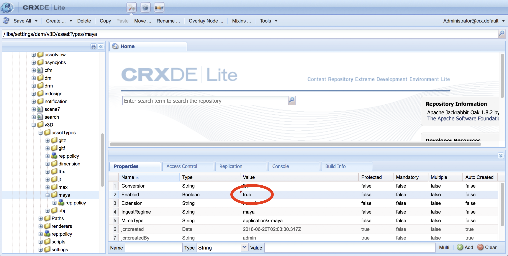

# AEM 3D と Autodesk Maya の統合 {#integrating-aem-d-with-autodesk-maya}

>[!NOTE]
>
>この作業はオプションで、Windows にのみ関連します。

You can optionally integrate AEM 3D with Autodesk® Maya® software to enable support for native Maya files (`.MA` and `.MB`) and to let you render 3D assets in AEM with any available Maya renderer.

*この統合はWindows専用です*。

Autodesk Maya と統合する場合は、Autodesk Maya をインストールして設定し、Maya の実行可能フォルダーへのパスを追加し、取り込みとレンダリングに対して Maya を有効にし、統合をテストする必要があります。

See [Advanced configuration settings](advanced-config-3d.md).

AEM 3DとAutoDesk 3ds Max [との統合も参照してください](integrating-aem-3d-with-autodesk-3ds-max.md)。

**AEM 3DをAutodesk Mayaと統合するには**:

1. AEMがホストされているサーバと同じサーバにAutodesk Maya 2016ソフトウェアをインストールします。

   インストール後、Maya を開いて使用できること、および Maya のライセンスの問題がないことを確認します。

   >[!NOTE]
   >
   >AEM は、Maya のコマンドラインレンダリングツール（`render.exe`）だけを使用します。1 つの Maya ネットワークライセンスで、5 台までのサーバーで同時に Maya コンテンツを処理およびレンダリングできます。

1. Mayaで、Autodesk FBX® Plug-Inを有効にします。
1. MentalRay レンダリングプラグインまたは他の希望のレンダラーをインストールします。

   インストール後、MentalRay が Maya で利用できることを確認します。

1. Maya の実行可能ファイルのフォルダーへのパスを、Windows の PATH 環境変数に追加します。

   For example, on Windows Server 2012, tap **[!UICONTROL Start > Control Panel > System and Security > System > Advanced System Settings > Environment Variables**. Append the full path to the `Maya2016\bin` folder to the `Path`system variable.

   

1. 取り込みとレンダリングを可能にするには、 **[!UICONTROL CRXDE Lite]** を開き、 `/libs/settings/dam/v3D/assetTypes/maya` Enabled **[!UICONTROL プロパティをに設定]**`true`します。

   

1. To enable the JT (Siemens PLM Open CAD) file format, navigate to `/libs/settings/dam/v3D/assetTypes/jt` and set the **[!UICONTROL Enabled]** property to `true`.
1. AEM で、Maya をレンダラーとして有効化します。まず、**[!UICONTROL ツール／一般／CRXDE Lite]** に移動します。
1. **[!UICONTROL CRXDE Lite]** ページの左パネルで、次のページに移動します。

   `/libs/settings/dam/v3D/renderers/maya`

   

1. **[!UICONTROL Enabled]** プロパティを `true` に設定します。

1. **[!UICONTROL CRXDE Lite]** ページの左上隅近くにある「すべて **[!UICONTROL 保存]**」をタップします。

   これで、Maya がレンダラーとして有効化されました。

## AEM 3D と Autodesk Maya の統合のテスト {#testing-the-integration-of-aem-d-with-autodesk-maya}

1. Open AEM Assets, then upload the `.MA` files located in `sample-3D-content/models` to the `test3d` folder.

   `sample-3D-content.zip` は、基本の 3D 機能を検証するため、以前にダウンロード済みです。 

1. Return to the **[!UICONTROL Card** view and observe the message banners shown on the uploaded assets.

   The Converting Format banner is displayed while Maya is converting the native `.MA` format to `.FBX`.

1. After all processing is finished, open the `logo-sphere.ma` asset and select the `stage-helipad.ma` stage.

   プレビューエクスペリエンスは、 `logo_sphere.fbx` およびと同じで `stage-helipad.fbx`す。

1. Near the upper-left corner of the page, tap or click the drop-down list and then select **[!UICONTROL CRender]**.

   

1. In the **[!UICONTROL Renderer]** drop-down list, select **[!UICONTROL Autodesk Maya]**, then tap **[!UICONTROL Start Render]**.
1. Near the upper-right corner of the page, tap or click **[!UICONTROL Close]** to return to the **[!UICONTROL Card]** view.

   レンダリングする画像アセットのメッセージバナーを確認します(別の画像名が指定されていない`logo-sphere`場合)。 バナーのプログレスバーに、レンダリングの進行状況が表示されます。

   >[!NOTE]
   >
   >レンダリングはCPU使用率が非常に高く、完了まで数分かかる場合があります。

1. レンダリングが完了したら、レンダリングされた画像アセットを開きます。

   Check that the rendered image reasonably matches the image that you were viewing at the time you clicked **[!UICONTROL Render Now]**.

## Enabling Additional Formats Supported By Maya {#enabling-additional-formats-supported-by-maya}

（オプション）Mayaは多数の3D入力フォーマットをサポートしており、どれもAEMがファイルタイプを認識できるように有効にできます。 有効にすると、AEMはファイルをMayaに送信し、AEMが直接取り込むことのできる中間フォーマットに変換します。

形式によっては、フィーチャのサポートが制限され（たとえば、マテリアルが通過しない場合）、品質/忠実度が制限される場合があります（たとえば、反転した面）。 アドビでは、一般的なメカニズムのみをサポートしていますが、特定の形式変換はサポートしていません。

See [Supported Data Import Formats | Maya](https://knowledge.autodesk.com/support/maya/learn-explore/caas/CloudHelp/cloudhelp/2016/ENU/Maya/files/GUID-69BC066D-D4D8-4B12-900C-CF42E798A5D6-htm.html) for information about the formats supported by Maya.

**AEMでサポートされる追加の形式を有効にするには**:

1. **[!UICONTROL CRXDE Liteを使用して]**、に移動し `/libs/settings/dam/v3D/assetTypes`ます。
1. Make a copy of the **[!UICONTROL jt]** node. Right-click on the **[!UICONTROL jt]** node and select **[!UICONTROL Copy]**, then right-click the **[!UICONTROL assetTypes]** folder and select **[!UICONTROL Paste]**. これにより、新しいノードが生成され `/apps/cq-scene7-v3D/config/assetTypes/Copy of jt`ます。
1. 新しいノードの名前を変更して、追加するファイルタイプを表す一意の名前を付けます。ファイルのサフィックスを使用することや、その他の一意の識別子を使用することができます。

1. Set the **[!UICONTROL Enabled]** property of the new node to `true`.

1. Set the **[!UICONTROL Extension]** property of the new note to the file suffix/extension of the format being added.
1. Set the **[!UICONTROL MimeType]** property to an appropriate value. `application/x-` ほとんどのファイルタイプでは、 **[!UICONTROL Extension]** プロパティの値が使用されます。
1. Make certain that the **[!UICONTROL Conversion]** property is set to `fbx` and **[!UICONTROL IngestRegime]** to `Maya`.
1. Click **[!UICONTROL Save All]** near the top left of the page.

次のスクリーンショットは、COLLADA DAEを例として使用した、追加されたファイル形式を示しています。

