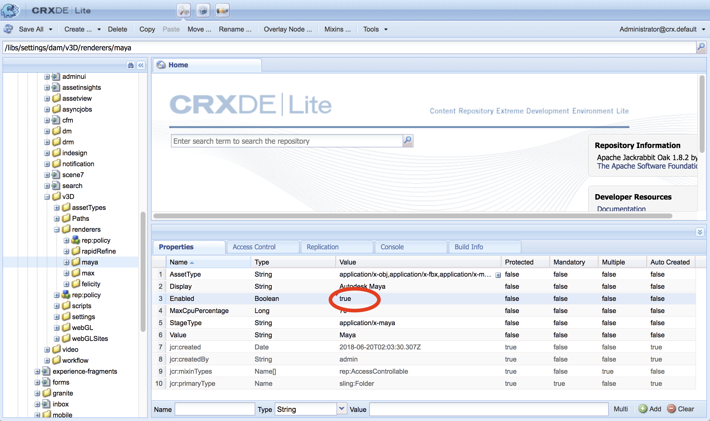

# AEM 3D と Autodesk Maya の統合 {#integrating-aem-d-with-autodesk-maya}

>[!NOTE]
>
>この作業はオプションで、Windows にのみ関連します。

AEM 3DをAutodesk® Maya®ソフトウェアと統合して、ネイティブのMayaファイル（`.MA`と`.MB`）をサポートし、AEM内の3Dアセットを任意のMayaレンダラでレンダリングすることもできます。

*この統合はWindows専用です*。

Autodesk Maya と統合する場合は、Autodesk Maya をインストールして設定し、Maya の実行可能フォルダーへのパスを追加し、取り込みとレンダリングに対して Maya を有効にし、統合をテストする必要があります。

[詳細な構成設定](advanced-config-3d.md)を参照してください。

[AEM 3DとAutoDesk 3ds Max](integrating-aem-3d-with-autodesk-3ds-max.md)の統合も参照してください。

**AEM 3DをAutodesk Mayaと統合するには**:

1. AEMがホストされているサーバと同じサーバにAutodesk Maya 2016ソフトウェアをインストールします。

   インストール後、Maya を開いて使用できること、および Maya のライセンスの問題がないことを確認します。

   >[!NOTE]
   >
   >AEM は、Maya のコマンドラインレンダリングツール（`render.exe`）だけを使用します。1 つの Maya ネットワークライセンスで、5 台までのサーバーで同時に Maya コンテンツを処理およびレンダリングできます。

1. Mayaで、Autodesk FBX® Plug-Inを有効にします。
1. MentalRay レンダリングプラグインまたは他の希望のレンダラーをインストールします。

   インストール後、MentalRay が Maya で利用できることを確認します。

1. Maya の実行可能ファイルのフォルダーへのパスを、Windows の PATH 環境変数に追加します。

   例えば、Windows Server 2012では、**[!UICONTROL 開始] > [!UICONTROL Campaign コントロールパネル] > [!UICONTROL システムとセキュリティ] > [!UICONTROL システム] > [!UICONTROL 詳細なシステム設定] > [!UICONTROL 環境をタップします変数]**。 `Maya2016\bin`フォルダーのフルパスを`Path`システム変数に追加します。

   

1. 取り込みとレンダリングを可能にするには、**[!UICONTROL CRXDE Lite]**&#x200B;を開き、`/libs/settings/dam/v3D/assetTypes/maya`に移動して&#x200B;**[!UICONTROL 有効]**&#x200B;プロパティを`true`に設定します。

   

1. JT (Siemens PLM Open CAD)ファイル形式を有効にするには、`/libs/settings/dam/v3D/assetTypes/jt`に移動し、**[!UICONTROL Enabled]**&#x200B;プロパティを`true`に設定します。
1. AEM で、Maya をレンダラーとして有効化します。まず、**[!UICONTROL ツール／一般／CRXDE Lite]** に移動します。
1. **[!UICONTROL CRXDE Lite]**&#x200B;ページの左側のパネルで、次の場所に移動します。

   `/libs/settings/dam/v3D/renderers/maya`

   

1. **[!UICONTROL Enabled]** プロパティを `true` に設定します。

1. **[!UICONTROL CRXDE Lite]**&#x200B;ページの左上隅近くにある「**[!UICONTROL すべて保存]**」をタップします。

   これで、Maya がレンダラーとして有効化されました。

## AEM 3D と Autodesk Maya の統合のテスト  {#testing-the-integration-of-aem-d-with-autodesk-maya}

1. AEM Assetsを開き、`sample-3D-content/models`にある`.MA`ファイルを`test3d`フォルダーにアップロードします。

   `sample-3D-content.zip` は、基本の 3D 機能を検証するため、以前にダウンロード済みです。 

1. **[!UICONTROL Card]**&#x200B;表示に戻り、アップロードしたアセットに表示されるメッセージバナーを確認します。

   Converting Formatバナーは、Mayaがネイティブの`.MA`フォーマットを`.FBX`に変換中に表示されます。

1. すべての処理が完了したら、`logo-sphere.ma`アセットを開き、`stage-helipad.ma`ステージを選択します。

   プレビューエクスペリエンスは、`logo_sphere.fbx`と`stage-helipad.fbx`の場合と同じです。

1. ページの左上隅近くにあるドロップダウンリストをタップまたはクリックし、「**[!UICONTROL CRender]**」を選択します。

   

1. **[!UICONTROL レンダラ]**&#x200B;ドロップダウンリストで&#x200B;**[!UICONTROL Autodesk Maya]**&#x200B;を選択し、**[!UICONTROL 開始レンダリング]**&#x200B;をタップします。
1. ページの右上隅近くにある「**[!UICONTROL 閉じる]**」をタップまたはクリックして、**[!UICONTROL カード]**&#x200B;表示に戻ります。

   レンダリングする画像アセットのメッセージバナーを確認します（別の画像名が指定されていない場合は`logo-sphere`）。 バナーのプログレスバーに、レンダリングの進行状況が表示されます。

   >[!NOTE]
   >
   >レンダリングはCPU使用率が非常に高く、完了まで数分かかる場合があります。

1. レンダリングが完了したら、レンダリングされた画像アセットを開きます。

   **[!UICONTROL 今すぐレンダリング]**&#x200B;をクリックしたときに表示していたイメージと、レンダリングされたイメージが適切に一致することを確認します。

## Maya {#enabling-additional-formats-supported-by-maya}がサポートする追加フォーマットを有効にする

（オプション）Mayaは多数の3D入力フォーマットをサポートしており、どれもAEMがファイルタイプを認識できるように有効にできます。 有効にすると、AEMはファイルをMayaに送信し、AEMが直接取り込むことのできる中間フォーマットに変換します。

形式によっては、フィーチャのサポートが制限され（たとえば、マテリアルが通過しない場合）、品質/忠実度が制限される場合があります（たとえば、反転した面）。 アドビでは、一般的なメカニズムのみをサポートしていますが、特定の形式変換はサポートしていません。

[サポートされているデータの読み込み形式を参照 | Maya](https://knowledge.autodesk.com/support/maya/learn-explore/caas/CloudHelp/cloudhelp/2016/ENU/Maya/files/GUID-69BC066D-D4D8-4B12-900C-CF42E798A5D6-htm.html)を参照してください。

**AEMでサポートされる追加の形式を有効にするには**:

1. **[!UICONTROL CRXDE Lite]**&#x200B;を使用して`/libs/settings/dam/v3D/assetTypes`に移動します。
1. **[!UICONTROL jt]**&#x200B;ノードのコピーを作成します。 **[!UICONTROL jt]**&#x200B;ノードを右クリックし、「**[!UICONTROL コピー]**」を選択します。次に、**[!UICONTROL assetTypes]**&#x200B;フォルダーを右クリックし、「**[!UICONTROL 貼り付け]**」を選択します。 新しいノード`/apps/cq-scene7-v3D/config/assetTypes/Copy of jt`が生成されます。
1. 新しいノードの名前を変更して、追加するファイルタイプを表す一意の名前を付けます。ファイルのサフィックスを使用することや、その他の一意の識別子を使用することができます。

1. 新しいノードの&#x200B;**[!UICONTROL Enabled]**&#x200B;プロパティを`true`に設定します。

1. 新しいメモの&#x200B;**[!UICONTROL 拡張子]**&#x200B;プロパティを、追加する形式のファイルのサフィックス/拡張子に設定します。
1. **[!UICONTROL MimeType]**&#x200B;プロパティを適切な値に設定します。 `application/x-` ほとんどのファイルの種類では、 **** Extensionプロパティの値が後に続いて機能します。
1. **[!UICONTROL Conversion]**&#x200B;プロパティが`fbx`に、**[!UICONTROL IngestRegim]**&#x200B;が`Maya`に設定されていることを確認します。
1. ページの左上部にある「すべて保存&#x200B;****」をクリックします。

次のスクリーンショットは、COLLADA DAEを例として使用した、追加されたファイル形式を示しています。

