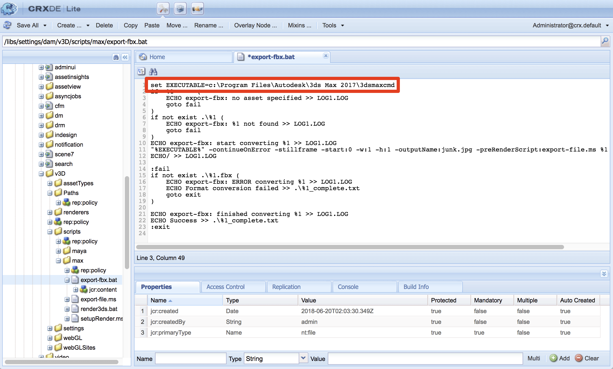

# AEM 3DとAutodesk 3ds Max {#integrating-aem-d-with-autodesk-ds-max}の統合

>[!NOTE]
>
>この作業はオプションで、Windows にのみ関連します。

AEM 3DをAutodesk 3ds Maxソフトウェアと統合し、ネイティブ3ds Maxファイル(.MAX)をサポートすることもできます。 現在、3ds Maxによるレンダリングはサポートされていません。

[詳細な構成設定](advanced-config-3d.md)を参照してください。

[AEM 3DとAutoDesk Mayaの統合](integrate-maya-with-3d.md)も参照してください。

**AEM 3DをAutodesk 3ds Max**：と統合するには

1. AEM Authorノードがインストールされているサーバと同じサーバにAutodesk 3ds Maxソフトウェアをインストールします。

   インストール後、Maya を開いて使用できること、および Maya のライセンスの問題がないことを確認します。

   >[!NOTE]
   >
   >アクセス拒否の問題を回避するには、AEMと同じ管理者ユーザーアカウントを使用して3ds Maxをインストールします。

1. 3ds Maxで、**[!UICONTROL カスタマイズ/プラグインマネージャ]**&#x200B;をクリックします。

   `FBXMAX.DLU`を探し、**[!UICONTROL ステータス]**&#x200B;が&#x200B;**[!UICONTROL loaded]**&#x200B;であることを確認します。

   [**[!UICONTROL プラグインマネージャ]**]ダイアログボックスを閉じ、3ds Maxを閉じます。

1. 変換スクリプトを更新します。

   AEMは、コマンドラインスクリプトを使用して3ds Maxコマンドラインユーティリティ`3dsmaxcmd.exe`を呼び出します。 3ds Max 2016以外のバージョンをインストールした場合、または3ds Maxを非標準の場所にインストールした場合、またはAEMを別のパーティションまたはドライブにインストールした場合は、このスクリプトを編集する必要があります。

   1. CRXDE Liteを開き、`/libs/settings/dam/v3D/scripts/max`に移動します。
   1. `export-fbx.bat`を重複クリックして開きます。
   1. 必要に応じて、スクリプトの最初の行を編集し、`3dsmaxcmd.exe`ユーティリティの場所を反映します。 例えば、3ds Max 2017を使用し、AEMが別のディスクドライブにインストールされている場合は、次のようになります。

   

1. CRXDE Liteページの左上隅近くにある「**[!UICONTROL すべて保存]**」をタップします。

   CRXDE Liteページの左上隅近くにある「**[!UICONTROL すべて保存]**」をタップします。

1. 作業フォルダを削除します（.MAXファイルを取り込もうとした場合にのみ必要）。

   1. CRXDE Lite で、`/libs/settings/dam/v3D/Paths/maxWorkPath` に移動します。デフォルトでは、この設定の値は`./MaxWork`で、AEMインストールのルートフォルダーに対する相対値です。
   1. サーバー自体にログオンし、エクスプローラーを使用してAEM installのルートフォルダーに移動します。
   1. **[!UICONTROL MaxWork]**&#x200B;フォルダー（内容全体を含む）が存在する場合は削除します。

      次回.MAXファイルを取り込むと、フォルダは自動的に再作成されます。

1. 次の操作を行って、 3ds Maxの取り込みを有効にします。

   1. CRXDE Liteで、`/libs/settings/dam/v3D/assetTypes/max`に移動し、**[!UICONTROL Enabled]**&#x200B;プロパティをtrueに設定します。

   

1. CRXDE Liteページの左上隅近くにある「**[!UICONTROL すべて保存]**」をタップします。

## AEM 3DとAutodesk 3ds Max {#testing-the-integration-of-aem-d-with-autodesk-ds-max}の統合のテスト

1. AEM Assetsを開き、`sample-3D-content/models`にある`.max`ファイルを&#x200B;**[!UICONTROL test3d]**&#x200B;フォルダーにアップロードします。

   sample-3D-content.zip は、基本の 3D 機能を検証するため、以前にダウンロード済みです。 

1. **[!UICONTROL Card]**&#x200B;表示に戻り、アップロードしたアセットに表示されるメッセージバナーを確認します。

   [変換形式]バナーは、3ds Maxがネイティブの3ds Max形式を.FBXに変換する際に表示されます。

1. 処理が完了したら、**[!UICONTROL 詳細]**&#x200B;表示ーの`logo-sphere.max`を開きます。

   プレビューエクスペリエンスは、`logo_sphere.fbx`と同じです。
