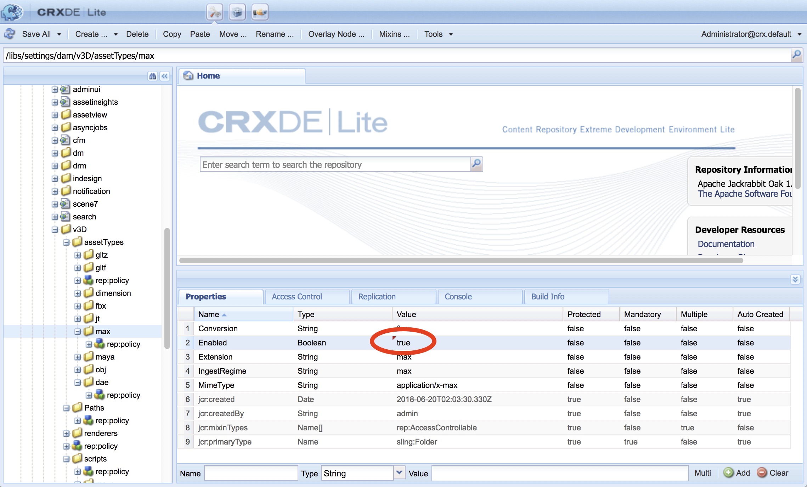

# AEM 3DとAutodesk 3ds maxの統合 {#integrating-aem-d-with-autodesk-ds-max}

>[!NOTE]
>
>この作業はオプションで、Windows にのみ関連します。

オプションでAEM 3DをAutodesk 3ds maxソフトウェアと統合し、ネイティブ3ds maxファイル(.MAX)のサポートを有効にすることができます。 3ds maxを使用したレンダリングは現時点ではサポートされていません。

See [Advanced configuration settings](advanced-config-3d.md).

AEM 3DとAutoDesk mayaの連 [携も参照してください](integrate-maya-with-3d.md)。

**AEM 3DをAutodesk 3ds maxと統合するには**:

1. AEM authorノードがインストールされているサーバと同じサーバにAutodesk 3ds maxソフトウェアをインストールします。

   インストール後、Maya を開いて使用できること、および Maya のライセンスの問題がないことを確認します。

   >[!NOTE]
   >
   >アクセス拒否の問題を回避するには、AEMと同じ管理者ユーザーアカウントを使用して3ds maxをインストールします。

1. 3ds maxで、カスタマイズ/プ **[!UICONTROL ラグインマネージャをクリックします]**。

   ステータス `FBXMAX.DLU` が[!UICONTROLが読み込まれ **[!UICONTROL た]****[!UICONTROLが読み込まれたことを確認します**。

   [プラグイ **[!UICONTROL ンマネージャ]** ]ダイアログボックスを閉じ、3ds Maxを閉じます。

1. 変換スクリプトを更新します。

   AEMは、コマンドラインスクリプトを使用して3ds maxコマンドラインユーティリティを呼び出しま `3dsmaxcmd.exe`す。 3ds Max 2016以外のバージョンをインストールした場合、または3ds maxを標準以外の場所にインストールした場合、または別のパーティションまたはドライブにAEMをインストールした場合は、このスクリプトを編集する必要があります。

   1. CRXDE Liteを開き、に移動します `/libs/settings/dam/v3D/scripts/max`。
   1. ダブルクリック `export-fbx.bat` して開きます。
   1. 必要に応じてスクリプトの最初の行を編集し、ユーティリティの場所を反映 `3dsmaxcmd.exe` します。 例えば、3ds Max 2017を使用し、AEMが別のディスクドライブにインストールされている場合：
   

1. Near the upper-left corner of the CRXDE Lite page, tap **[!UICONTROL Save All]**.

   Near the upper-left corner of the CRXDE Lite page, tap **[!UICONTROL Save All]**.

1. 作業フォルダを削除します（.MAXファイルの取り込みを以前試行した場合にのみ必要）。

   1. In CRXDE Lite, navigate to `/libs/settings/dam/v3D/Paths/maxWorkPath`. デフォルトでは、この設定の値は、AEMインスト `./MaxWork`ールのルートフォルダーに対する相対パスです。
   1. サーバーにログオンし、エクスプローラーを使用してAEMインストールのルートフォルダーに移動します。
   1. MaxWorkフォル **[!UICONTROL ダ(内容全体を含む]** )が存在する場合は削除します。

      次回.MAXファイルをインジェストすると、フォルダが自動的に再作成されます。

1. 次の手順を実行して、 3ds maxの取り込みを有効にします。

   1. CRXDE Liteで、Enabledプロパティに移 `/libs/settings/dam/v3D/assetTypes/max` 動し、 **[!UICONTROL Enabled]** プロパティをtrueに設定します。
   

1. Near the upper-left corner of the CRXDE Lite page, tap **[!UICONTROL Save All]**.

## Testing the integration of AEM 3D with Autodesk 3ds Max {#testing-the-integration-of-aem-d-with-autodesk-ds-max}

1. Open AEM Assets, then upload the `.max` file located in `sample-3D-content/models` to the **[!UICONTROL test3d]** folder.

   sample-3D-content.zip は、基本の 3D 機能を検証するため、以前にダウンロード済みです。 

1. Return to the **[!UICONTROL Card]** view and observe the message banners shown on the uploaded assets.

   3ds maxがネイティブ3ds max形式を.FBXに変換中は、[変換形式]バナーが表示されます。

1. 処理が完了したら、詳細ビ `logo-sphere.max` ューで **[!UICONTROL 開きます]** 。

   プレビューエクスペリエンスは、と同じで `logo_sphere.fbx`す。

