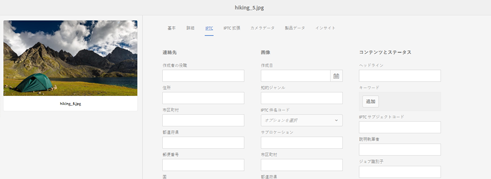
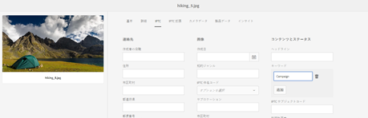

# IPTC メタデータのサポート {#support-for-iptc-metadata}

>[!CAUTION]
>
>AEM 6.4 の拡張サポートは終了し、このドキュメントは更新されなくなりました。 詳細は、 [技術サポート期間](https://helpx.adobe.com/jp/support/programs/eol-matrix.html). サポートされているバージョンを見つける [ここ](https://experienceleague.adobe.com/docs/?lang=ja).

Adobe Experience Manager Assets が、Adobe Bridgeやその他のクリエイティブアプリを通じてアセットに追加された IPTC メタデータ、クリエイティブの評価、キーワードをサポートする方法について説明します。

Adobe Experience Manager Assets は、アセットの記述に広く使用されている IPTC メタデータ標準をサポートしています。 このように [!DNL Experience Manager Assets] では、フォトグラファー、クリエイティブエージェンシー、ライブラリ、ミュージアムなど、様々な関係者間で画像を受け入れる仕組みを強化しています。

アセットのデフォルトのメタデータスキーマに IPTC Core と IPTC 拡張のメタデータスキーマが組み込まれ、画像に表示される人、場所、製品に関する正確で信頼性の高いデータを追加できる、包括的なメタデータプロパティを定義できるようになりました。 また、画像の作成に関する日付、名前、識別子、および権限情報を柔軟に表す方法もサポートしています。

アセットのプロパティページに、 IPTC コアおよび IPTC 拡張メタデータを編集可能フィールドに表示するための個別のタブが含まれるようになりました。

1. Assets ユーザーインターフェイスで、画像を選択します。
1. クリックまたはタップ **[!UICONTROL プロパティ]** アイコンをクリックします。
1. プロパティページで、「**[!UICONTROL IPTC]**」タブをクリックまたはタップして、アセットの IPTC メタデータを表示します。
1. 必要に応じて、IPTC メタデータのプロパティを編集します。

   

1. 「**[!UICONTROL IPTC 拡張]**」タブをクリックまたはタップして、アセットの IPTC 拡張メタデータを表示します。
1. 必要に応じて、IPTC 拡張メタデータのプロパティを編集します。
1. 「**[!UICONTROL 保存して閉じる]**」をタップまたはクリックして、変更内容を保存します。

## クリエイティブの評価のサポート {#creative-rating-support}

プロパティページには、個々のユーザーの評価と総評価が表示されるほか、Adobe Bridge およびその他のクリエイティブアプリを通じてアセットに割り当てられた評価も表示されるようになりました。

これらの評価は、「**[!UICONTROL 詳細]**」タブ内の「**[!UICONTROL クリエイティブの評価]**」セクションの下に表示されます。

この評価は読み取り専用のプロパティで、1 ～ 5 の範囲です。 検索パネルで、クリエイティブの評価に基づいてアセットを検索できます。

ただし、ユーザーが行ったカスタムの変更との競合を避けるために、現在、このプロパティのインデックスは作成されていません。

## キーワードのサポート {#keyword-support}

この **[!UICONTROL IPTC]** また、プロパティページの「 」タブには、Adobe Bridgeやその他のクリエイティブアプリを通じてアセットに追加されたキーワードが表示されます。 これらのキーワードの編集や、キーワードの追加も「**[!UICONTROL IPTC]**」タブでおこなえます。

